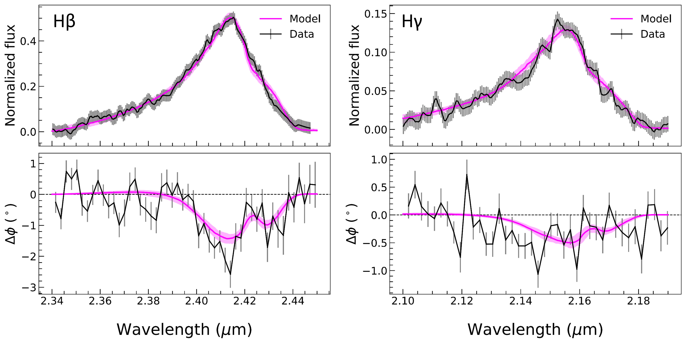
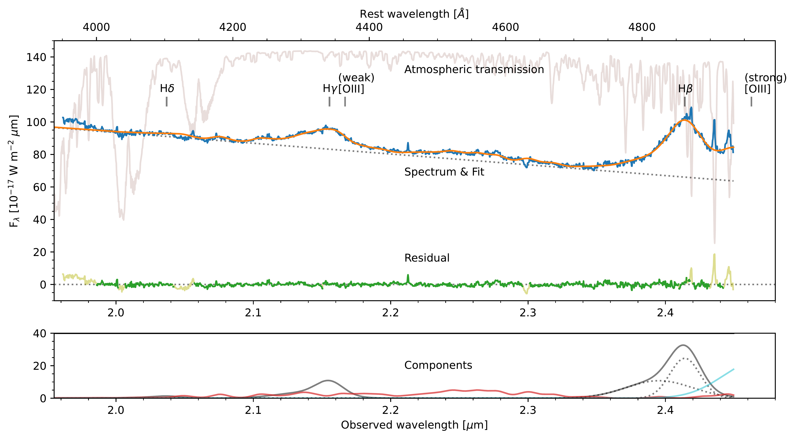
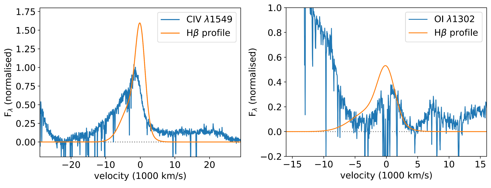

$\newcommand{\ensuremath}{}$
$\newcommand{\xspace}{}$
$\newcommand{\object}[1]{\texttt{#1}}$
$\newcommand{\farcs}{{.}''}$
$\newcommand{\farcm}{{.}'}$
$\newcommand{\arcsec}{''}$
$\newcommand{\arcmin}{'}$
$\newcommand{\ion}[2]{#1#2}$
$\newcommand{\textsc}[1]{\textrm{#1}}$
$\newcommand{\hl}[1]{\textrm{#1}}$
$\newcommand{\footnote}[1]{}$
$\newcommand{\civ}{C{ \tiny IV}}$
$\newcommand{\mgii}{Mg{ \tiny II}}$
$\newcommand{\oi}{O{ \tiny I}}$
$\newcommand{\oiii}{[O{ \tiny III}]}$
$\newcommand{\feii}{Fe{ \tiny II}}$
$\newcommand{\hi}{H{ \tiny I}}$
$\newcommand{\hb}{H\beta}$
$\newcommand{\hg}{H\gamma}$
$\newcommand{\rfe}{\mathcal{R}_\mathrm{Fe}}$

# Spatially resolved broad line region in a quasar at z=4: Dynamical black hole mass and prominent outflow

<mark>Appeared on: 2025-09-18</mark> -  _submitted to A&A (15 pages, 10 figures)_

G. Collaboration, et al. -- incl., <mark>W. Brandner</mark>, <mark>P. Garcia</mark>, <mark>S. Joharle</mark>, <mark>L. Kreidberg</mark>, <mark>J. Sauter</mark>

**Abstract:** We present the first near-infrared interferometric data of a QSO at z=4. The K-band observations were performed with GRAVITY+ on the VLTI using all 4 UTs, detecting a differential phase signal that traces the spatially resolved kinematics for both the $\hb$ and $\hg$ lines in the broad line region. We fit the two lines simultaneously with an updated model that includes distinct rotating and conical outflowing components. We find that more than 80 \% of the $\hi$ line emission from the BLR originates in an outflow with a velocity up to $10^4$ km s $^{-1}$ . This is oriented so that our line of sight is along an edge of the conical structure, which produces the prominent blue wing on the line profile. A combination of anisotropic line emission and mid-plane opacity lead to the single-sided phase signal. The model is able to qualitatively match both the outflowing $\civ$ line profile and the systemic $\oi$ fluorescent emission. The derived black hole mass of $8\times10^8$ M $_\odot$ is the highest redshift black hole mass measurement to date obtained directly from BLR dynamics. It is an order of magnitude lower than that inferred from various single epoch scaling relations, and implies that the accretion is highly super-Eddington. With reference to recent simulations, the data suggest that this QSO is emitting close to its radiative limit in a regime where strong outflows are expected around a polar conical region.

**Figure 6. -** Flux spectrum, averaged differential phase spectra, and line decomposition.
The top row shows the continuum subtracted spectrum of the two emission lines, and the best fit model.
For each of the $\hb$(left) and $\hg$(right) lines, the middle row shows the average phase spectra  which are created from the three baselines with the strongest signal (this is for visualisation purposes only; phase spectra for the individual baselines are shown in Fig. \ref{fig:allphases}).
The bottom row shows the decomposition of the fitted line profile (red) into the outflow (green) and disky (blue) components. The outflow dominates the total line flux, including much of the apparent core of the line profile. (*fig:avgphase*)

**Figure 4. -** K-band spectrum of J0529 from ERIS. The upper panel shows the data (blue; the narrow features at the long end of the band are due to imperfect atmospheric correction) and the fit (orange), with the $\hi$ lines marked (the location of the $\oi$ii lines are also marked; the 4363 Å line is expected to be 10-100 times weaker than those at 4959 Å and 5007 Å, the peaks of which are out of the spectral range). Also shown is the relative atmospheric transmission and the residual, indicating which regions have been excluded from the fit.
The lower panel shows the components of the fit: the $\hi$ lines (black) and $\feii$ complex (red), as well as a component that represents either poor slope correction at the band edge (as is seen also at the short end of the band) or a possible blue wing on the $\oi$ii line. (*fig:erisspec*)

**Figure 5. -** Comparison of $\hi$ profile to $\civ$$\lambda$1549 Å (left) and $\oi$$\lambda$1302 Å (right) in the Xshooter spectrum \citep{wol24}. The normalisations are independent, and the velocity zero point here is defined by the $\hi$ line peak rather than the true systemic velocity.
$\civ$ is associated only with the BLR outflow, and extends to higher velocities.
$\oi$ is more associated with the static rotating part of the BLR (the source of the deep absorption at multiple velocities across the line peak is unclear). (*fig:linecomp*)

