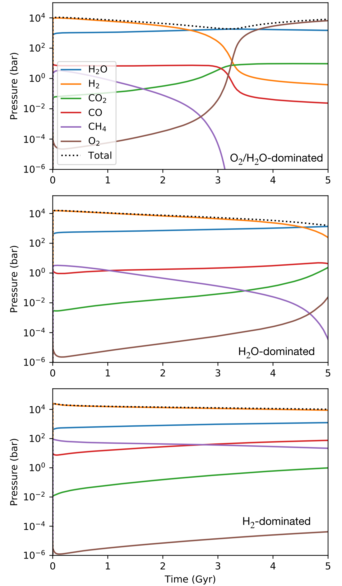
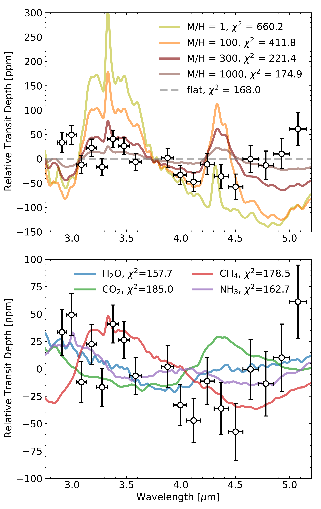
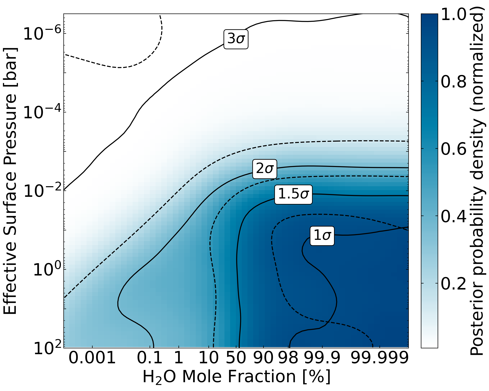
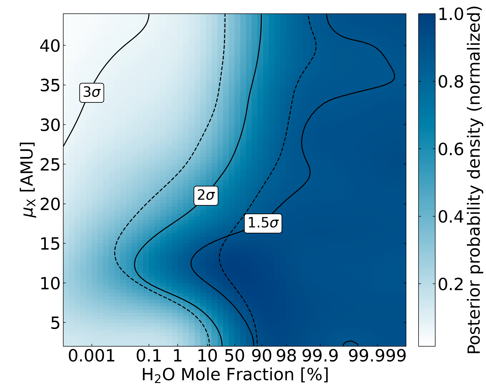
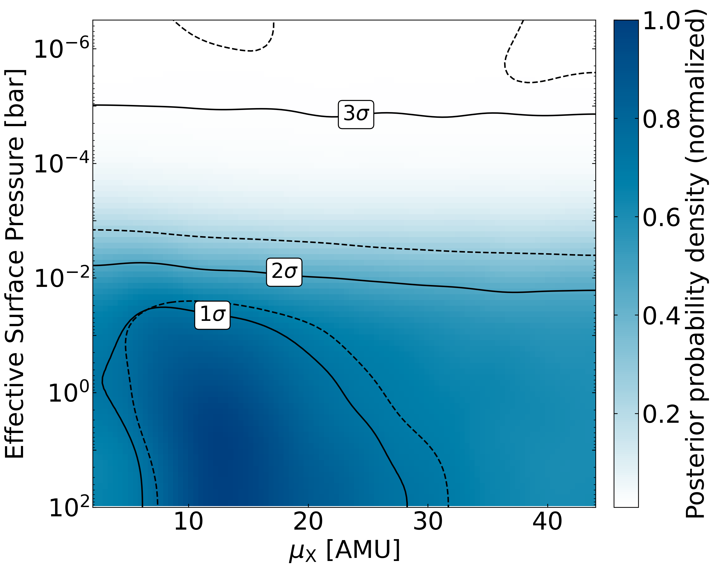

$\newcommand{\ensuremath}{}$
$\newcommand{\xspace}{}$
$\newcommand{\object}[1]{\texttt{#1}}$
$\newcommand{\farcs}{{.}''}$
$\newcommand{\farcm}{{.}'}$
$\newcommand{\arcsec}{''}$
$\newcommand{\arcmin}{'}$
$\newcommand{\ion}[2]{#1#2}$
$\newcommand{\textsc}[1]{\textrm{#1}}$
$\newcommand{\hl}[1]{\textrm{#1}}$
$\newcommand{\footnote}[1]{}$
$\newcommand{\icarus}{Icarus}$
$\newcommand{\mnras}{MNRAS}$
$\newcommand{\pasp}{PASP}$
$\newcommand{\jqsrt}{JQSRT}$
$\newcommand{\aj}{AJ}$
$\newcommand{\apj}{ApJ}$
$\newcommand{\apjl}{ApJL}$
$\newcommand{\apjs}{ApJS}$
$\newcommand{\aap}{A\&Aj}$
$\newcommand{\araa}{ARAA}$
$\newcommand{\nat}{Nature}$
$\newcommand{\vdag}{(v)^\dagger}$
$\newcommand$
$\newcommand$
$\newcommand{\vect}[1]{\mathbf{#1}}$
$\newcommand{\mt}[1]{\mathrm{#1}}$
$\newcommand{\Msun}{\ensuremath{ M_{\odot}}}$
$\newcommand{\Mearth}{\ensuremath{ M_{\oplus}}}$
$\newcommand{\Mmoon}{\ensuremath{ M_{\mathrm{Moon}}}}$
$\newcommand{\Mjup}{\ensuremath{ M_{\mathrm{Jup}}}}$
$\newcommand{\Rjup}{\ensuremath{ R_{\mathrm{Jup}}}}$
$\newcommand{\mum}{\ensuremath{\mathrm{ \mu m}}}$
$\newcommand{\AMMF}{\ensuremath{\mathrm{AMMF}}}$
$\newcommand{\Zatm}{\ensuremath{Z_{\mathrm{atm}}}}$
$\newcommand{\Zenv}{\ensuremath{Z_{\mathrm{env}}}}$
$\newcommand{\farcmin}{\mbox{\ensuremath{.\mkern-4mu^\prime}}}$
$\newcommand{\farcsec}{\mbox{\ensuremath{ .\!\!^{\prime\prime}}}}$
$\newcommand{\water}{H_{2}O}$
$\newcommand{\logX}[1]{\ensuremath{\log(\mathrm{X_{\ce{#1}}})}}$
$\newcommand{\logXratio}[2]{\ensuremath{\log(\mathrm{X_{\ce{#1}} / X_{\ce{#2}} })}}$
$\newcommand{\rstar}{R_*}$
$\newcommand{\re}{ R_\oplus}$
$\newcommand{\me}{ M_\oplus}$
$\newcommand{\rsun}{ R_\odot}$
$\newcommand{\project}[1]{\textsl{#1}}$
$\newcommand{\JWST}{\project{JWST}}$
$\newcommand{\HST}{\project{HST}}$
$\newcommand{\Hubble}{\project{Hubble}}$
$\newcommand{\Spitzer}{\project{Spitzer}}$
$\newcommand{\Kepler}{\project{Kepler}}$
$\newcommand{\Ktwo}{\project{K2}}$
$\newcommand{\TESS}{\project{TESS}}$
$\newcommand{\CHEOPS}{\project{CHEOPS}}$
$\newcommand$
$\newcommand$
$\newcommand{\umontreal}{Department of Physics and Trottier Institute for Research on Exoplanets, Université de Montréal, Montreal, QC, Canada}$
$\newcommand{\ucla}{Department of Earth, Planetary, and Space Sciences, University of California, Los Angeles, Los Angeles, CA, USA}$
$\newcommand{\uwashington}{Department of Earth and Space Sciences/Astrobiology Program, University of Washington, Seattle, WA, USA}$
$\newcommand{\uchicago}{Department of Astronomy \& Astrophysics, University of Chicago, Chicago, IL, USA}$
$\newcommand{\mpia}{Max-Planck-Institut für Astronomie, Königstuhl 17, D-69117 Heidelberg, Germany}$
$\newcommand{\sron}{SRON Netherlands Institute for Space Research, Niels Bohrweg 4, 2333 CA Leiden, The Netherlands}$
$\newcommand{\leiden}{Leiden Observatory, Leiden University, Einsteinweg 55, 2333 CC Leiden, The Netherlands}$
$\newcommand{\cab}{Centro de Astrobiología (CAB), CSIC-INTA, ESAC campus, Camino Bajo del Castillo s/n, 28692, Villanueva de la Cañada (Madrid), Spain}$
$\newcommand{\porto}{Instituto de Astrofísica e Ciências do Espaço, Universidade do Porto, CAUP, Rua das Estrelas, 4150-762 Porto, Portugal}$
$\newcommand{\uclaAstro}{Department of Physics \& Astronomy, University of California Los Angeles, Los Angeles, CA 90095, USA}$
$\newcommand{\uwisconsin}{Department of Astronomy, University of Wisconsin--Madison, Madison, WI 53706, USA}$
$\newcommand{\mcmaster}{Department of Physics \& Astronomy, McMaster University, Hamilton, ON, Canada}$
$\newcommand{\oxford}{Department of Physics, University of Oxford, Parks Rd, Oxford, OX1 3PU, UK}$
$\newcommand{\heidelberg}{Department of Physics and Astronomy, Heidelberg University, Im Neuenheimer Feld 226, D-69120 Heidelberg, Germany}$
$\newcommand{\riogrande}{Departamento de Física Teórica e Experimental, Universidade Federal do Rio Grande do Norte, Campus Universitário, Natal, RN, 59072-970, Brazil}$
$\newcommand{\geneve}{Observatoire de Genève, Département d’Astronomie, Université de Genève, Chemin Pegasi 51, 1290 Versoix, Switzerland}$
$\newcommand{\newcastle}{School of Information and Physical Sciences, University of Newcastle, Callaghan, NSW, Australia}$
$\newcommand{\grenoble}{Univ. Grenoble Alpes, CNRS, IPAG, 38000 Grenoble, France}$
$\newcommand{\iac}{Instituto de Astrofísica de Canarias, c/ Vía Láctea s/n, 38205$
$La Laguna, Tenerife, Spain\label{iac}$
$Departamento de Astrofísica, Universidad de La Laguna, 38206 La Laguna, Tenerife, Spain}$

# $\large{Possible Evidence for the Presence of Volatiles on the Warm Super-Earth TOI-270 b}$

<mark>Appeared on: 2025-09-18</mark> -  _Published in The Astronomical Journal_

L.-P. Coulombe, et al. -- incl., <mark>E.-M. Ahrer</mark>, <mark>C. Gapp</mark>

**Abstract:** The search for atmospheres on rocky exoplanets is a crucial step in understanding the processes driving atmosphere formation, retention, and loss.Past studies have revealed the existence of planets interior to the radius valley with densities lower than would be expected for pure-rock compositions, indicative of the presence of large volatile inventories which could facilitate atmosphere retention.Here we present an analysis of the JWST NIRSpec/G395H transmission spectrum of the warm ( $T_\mathrm{eq,A_B=0} = 569$ K) super-Earth TOI-270 b ( $R_\mathrm{p}$ = 1.306 $R_\oplus$ ), captured alongside the transit of TOI-270 d. The JWST white light-curve transit depth updates TOI-270 b's density to $\rho_\mathrm{p}$ = $3.7\pm0.5$ g/cm $^3$ , inconsistent at 4.4 $\sigma$ with an Earth-like composition. Instead, the planet is best explained by a non-zero, percent-level water mass fraction, possibly residing on the surface or stored within the interior.The JWST transmission spectrum shows possible spectroscopic evidence for the presence of this water as part of an atmosphere on TOI-270 b, favoring a $H_2$ O-rich steam atmosphere model over a flat spectrum ( $\ln\mathcal{B}=0.3-3.2$ , inconclusive to moderate), with the exact significance depending on whether an offset parameter between the NIRSpec detectors is included. We leverage the transit of the twice-larger TOI-270 d crossing the stellar disk almost simultaneously to rule out the alternative hypothesis that the transit-light-source effect could have caused the water feature in TOI-270 b's observed transmission spectrum. Planetary evolution modeling furthermore shows that TOI-270 b could sustain a significant atmosphere on Gyr timescales, despite its high stellar irradiation, if it formed with a large initial volatile inventory.

**Figure 7. -** Coupled atmosphere-interior evolution modelling shows that a diversity of atmospheric outcomes are consistent with observational constraints. The PACMAN-P geochemical evolution model  (krissansen2024erosion)  was used to explore plausible evolutionary scenarios for TOI-270 b. This model explicitly couples magma ocean solidification, speciation of C, H, O, and Fe-bearing species, stellar evolution, thermal escape, and radiative-convective climate. Subpanels represent scenarios whereby hydrogen escape causes a transition to an $O_2$-$H_2$O atmosphere (top), an $H_2$O-dominated atmosphere (middle), and a case where an $H_2$-dominated atmosphere is retained (bottom). The internal volatile reservoirs of the planet are not shown. (*fig:Three_Scenarios_TOI_270b*)

**Figure 3. -** **Top:** Comparison of our measured transmission spectrum, binned at a fixed resolving power of R = 35 for visual clarity, to cloudless self-consistent models produced using SCARLET and assuming a solar carbon-to-oxygen ratio \citep[C/O = 0.55,][]{Asplund2009} and atmosphere metallicities of 1 (yellow), 100 (orange), 300 (maroon), and 1,000 times solar (brown).
The relatively small amplitude of the spectrum of TOI-270 b is inconsistent with any clear $H_2$/He-rich atmosphere with atmosphere metallicities below 300 times solar. Chi-square $\chi^2$ values between the models and the full-resolution ($R=200$, $N=113$ data points)
spectrum are shown for comparison. **Bottom:** Comparison of TOI-270 b with 100 bar pure $H_2$O (blue), $CH_4$(red), $CO_2$(green), and $NH_3$(purple) atmospheres. The rise in transit depth at the shorter wavelengths of NIRSpec/G395H is best reproduced by the absorption features of water. (*fig:spec_vs_mods*)

**Figure 10. -** Constraints from the atmospheric retrieval considering the fictitious species X as the background gas. **Left:** Joint constraints on the water mole fraction and effective surface pressure, where color represents the normalized probability density. The 1, 1.5, 2, and 3$\sigma$ probability contours are indicated by the full and dashed black lines for the retrievals assuming no TLS and with constrained TLS, respectively. **Middle:** Joint constraints on the water mole fraction and background gas MMW ($\mu_\mathrm{X}$). The 1.5, 2, and 3$\sigma$ probability contours are indicated by the full and dashed black lines for the retrievals assuming no TLS and with constrained TLS, respectively. Beyond water mole fractions of 90\%, the background MMW is unconstrained as the global MMW is dominated by that of $H_2$O. Below that, the 1.5 and 2$\sigma$ confidence regions are confined to a given range of MMW values, as global MMW that are too high/low would result in water absorption features that are too large/small compared to the tentative feature. **Right:** Joint constraints on the background gas MMW and effective surface pressure. (*fig:h2o_vs_pcloud_muX*)

