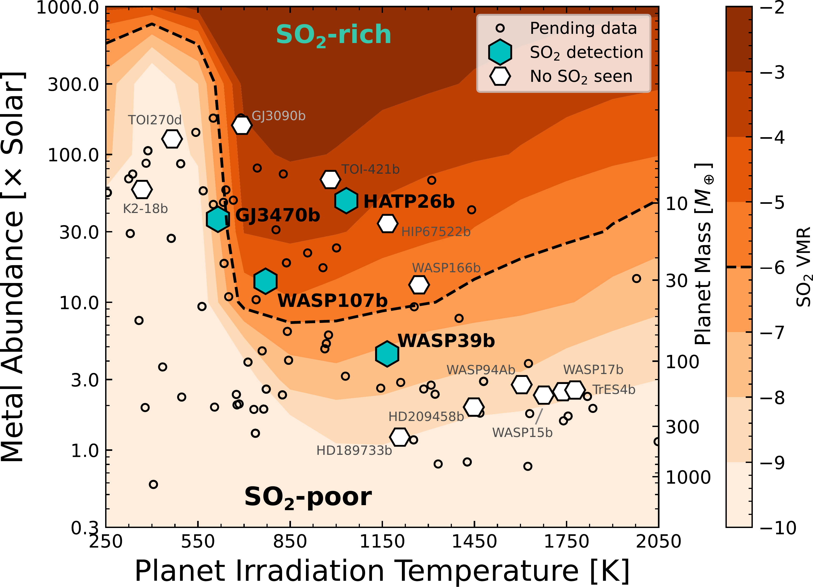

$\newcommand{\ensuremath}{}$
$\newcommand{\xspace}{}$
$\newcommand{\object}[1]{\texttt{#1}}$
$\newcommand{\farcs}{{.}''}$
$\newcommand{\farcm}{{.}'}$
$\newcommand{\arcsec}{''}$
$\newcommand{\arcmin}{'}$
$\newcommand{\ion}[2]{#1#2}$
$\newcommand{\textsc}[1]{\textrm{#1}}$
$\newcommand{\hl}[1]{\textrm{#1}}$
$\newcommand{\footnote}[1]{}$
$\newcommand{\vdag}{(v)^\dagger}$
$\newcommand$
$\newcommand$
$\newcommand{\ntarg}{26\xspace}$
$\newcommand{\ntoi}{30\xspace}$
$\newcommand{\vsini}{\ensuremath{v \sin i}\xspace}$
$\newcommand{\teff}{\ensuremath{T_\mathrm{eff}}\xspace}$
$\newcommand{\teq}{\ensuremath{T_\mathrm{eq}}\xspace}$
$\newcommand{\tint}{\ensuremath{T_\mathrm{int}}\xspace}$
$\newcommand{\kms}{km~s\ensuremath{^{-1}}\xspace}$
$\newcommand{\kzz}{\ensuremath{K_{zz}}}$
$\newcommand{\soo}{SO_2\xspace}$
$\newcommand{\coo}{CO_2\xspace}$
$\newcommand{\water}{H_2O\xspace}$
$\newcommand{\hhs}{H_2S\xspace}$
$\newcommand{\methane}{CH_4\xspace}$
$\newcommand{\co}[2]{\ensuremath{^{#1}\textrm{C}^{#2}\textrm{O}}\xspace}$
$\newcommand{\car}[1]{\ensuremath{^{#1}\textrm{C}}\xspace}$
$\newcommand{\ox}[1]{\ensuremath{^{#1}\textrm{O}}\xspace}$
$\newcommand{\update}$
$\newcommand{\tirr}{\ensuremath{T_\mathrm{irr}}}$
$\newcommand{\TESS}{{\em TESS}}$
$\newcommand{\tess}{{\em TESS}}$
$\newcommand{\spitzer}{{\em Spitzer}}$
$\newcommand{\gj}{GJ~1252}$
$\newcommand{\gjb}{GJ~1252b}$
$\newcommand{\rp}{1.180}$
$\newcommand{\urp}{\pm0.078}$
$\newcommand{\vesc}{5.4}$
$\newcommand{\uvesc}{\pm0.8}$
$\newcommand{\tday}{1410}$
$\newcommand{\utday}{^{+91}_{-125}}$
$\newcommand{\depth}{149}$
$\newcommand{\udepth}{^{+25}_{-32}}$
$\newcommand{\te}{2458668.3575}$
$\newcommand{\ute}{^{+0.0019}_{-0.0007}}$
$\newcommand{\dt}{+1.4}$
$\newcommand{\udt}{^{+2.8}_{-1.0}}$
$\newcommand{\abUL}{0.41}$
$\newcommand{\fLL}{0.40}$
$\newcommand{\fabLL}{0.37}$
$\newcommand{\ecoswnosign}{0.0025}$
$\newcommand{\ecosw}{+0.0025}$
$\newcommand{\uecosw}{^{+0.0049}_{-0.0018}}$
$\newcommand{\psurfUL}{8.9}$
$\newcommand{\age}{3.9}$
$\newcommand{\uage}{0.4}$
$\newcommand{\referee}$
$\newcommand{\vdag}{(v)^\dagger}$
$\newcommand$
$\newcommand$
$\newcommand{\ntarg}{26\xspace}$
$\newcommand{\ntoi}{30\xspace}$
$\newcommand{\vsini}{\ensuremath{v \sin i}\xspace}$
$\newcommand{\teff}{\ensuremath{T_\mathrm{eff}}\xspace}$
$\newcommand{\teq}{\ensuremath{T_\mathrm{eq}}\xspace}$
$\newcommand{\tint}{\ensuremath{T_\mathrm{int}}\xspace}$
$\newcommand{\kms}{km~s\ensuremath{^{-1}}\xspace}$
$\newcommand{\kzz}{\ensuremath{K_{zz}}}$
$\newcommand{\soo}{SO_2\xspace}$
$\newcommand{\coo}{CO_2\xspace}$
$\newcommand{\water}{H_2O\xspace}$
$\newcommand{\hhs}{H_2S\xspace}$
$\newcommand{\methane}{CH_4\xspace}$
$\newcommand{\co}[2]{\ensuremath{^{#1}\textrm{C}^{#2}\textrm{O}}\xspace}$
$\newcommand{\car}[1]{\ensuremath{^{#1}\textrm{C}}\xspace}$
$\newcommand{\ox}[1]{\ensuremath{^{#1}\textrm{O}}\xspace}$
$\newcommand{\update}$
$\newcommand{\tirr}{\ensuremath{T_\mathrm{irr}}}$
$\newcommand{\TESS}{{\em TESS}}$
$\newcommand{\tess}{{\em TESS}}$
$\newcommand{\spitzer}{{\em Spitzer}}$
$\newcommand{\gj}{GJ~1252}$
$\newcommand{\gjb}{GJ~1252b}$
$\newcommand{\rp}{1.180}$
$\newcommand{\urp}{\pm0.078}$
$\newcommand{\vesc}{5.4}$
$\newcommand{\uvesc}{\pm0.8}$
$\newcommand{\tday}{1410}$
$\newcommand{\utday}{^{+91}_{-125}}$
$\newcommand{\depth}{149}$
$\newcommand{\udepth}{^{+25}_{-32}}$
$\newcommand{\te}{2458668.3575}$
$\newcommand{\ute}{^{+0.0019}_{-0.0007}}$
$\newcommand{\dt}{+1.4}$
$\newcommand{\udt}{^{+2.8}_{-1.0}}$
$\newcommand{\abUL}{0.41}$
$\newcommand{\fLL}{0.40}$
$\newcommand{\fabLL}{0.37}$
$\newcommand{\ecoswnosign}{0.0025}$
$\newcommand{\ecosw}{+0.0025}$
$\newcommand{\uecosw}{^{+0.0049}_{-0.0018}}$
$\newcommand{\psurfUL}{8.9}$
$\newcommand{\age}{3.9}$
$\newcommand{\uage}{0.4}$
$\newcommand{\referee}$

# Mapping the $\soo$ shoreline in gas giant exoplanets

<mark>Appeared on: 2025-09-19</mark> -  _16 pages, 7 figures, >900 models and spectra at this https URL . Resubmitted to ApJ (on 29 Aug) after referee review_

<mark>I. J. M. Crossfield</mark>, et al. -- incl., <mark>E.-M. Ahrer</mark>, <mark>L. Kreidberg</mark>

**Abstract:** JWST has revealed sulfur chemistry in giant exoplanet atmospheres, where molecules such as SO2 trace photochemistry, metallicity, and formation and migration. To ascertain the conditions that determine whether (or how much) $\soo$ , $\hhs$ , and other sulfur-bearing species are present in exoplanet atmospheres, we present a grid of planetary atmospheres covering metallicities from 0.3--1000 $\times$ Solar and temperatures from 250--2050 K. These models map out the ` $\soo$ shoreline,' the region of metallicity and irradiation for which $\soo$ may be sufficiently abundant to be detectable. $\soo$ is a sensitive indicator of metallicity; expected $\soo$ abundances also depend strongly on overall temperature and C/O ratio; the $\soo$ abundance depends surprisingly weakly on XUV irradiation, also weakly on $\kzz$ (for $T_\mathrm{eq} \gtrsim 600$ K), and is essentially independent of internal temperature. Despite its detection in a growing number of giant planets, $\soo$ is never the dominant sulfur-bearing molecule: depending on temperature and metallicity, $H_2$ S, $S_2$ , NS, SO, SH, and even $S_8$ or atomic S are frequently as common (or more so) as $\soo$ . Nonetheless $\soo$ remains the most easily detectable sulfur-bearing species, followed by $\hhs$ , though perhaps SO and SH could be detectable in some gas giants. Aside from a pressing need for additional observational constraints on sulfur, we also identify the need for future work to account for the effects of clouds and hazes, fully self-consistent atmospheric models, 2D and 3D models, a wider range of planetary masses and radii, and studies to measure and refine reaction rates and molecular opacities of sulfur-bearing species.

**Figure 3. -** $\soo$ abundance averaged from 1--100 $\mu$bar for our
  nominal model grid (color map), with the 1 ppm volume mixing ratio
  indicated by the dashed line.  We term this the "$\soo$ shoreline,"
  below which $\soo$ is unlikely to be detectable.  Markers show the
  shoreline in the context of exoplanets observed by JWST in transit
  with $R_P\ge 1.8 R_\oplus$.  Empty symbols indicate unpublished
  observations; white hexagons show $\soo$ nondetections while blue
  hexagons show $\soo$ detections. {$\referee$ All four non-detections within the $\soo$-rich region still allow for the presence of significant levels  of $\soo$.} (*fig:shorelinemap*)

**Figure 9. -** $\soo$ abundance averaged from 1--100 $\mu$bar for our
  nominal model grid (color map), with the 1 ppm volume mixing ratio
  indicated by the dashed line.  We term this the "$\soo$ shoreline,"
  below which $\soo$ is unlikely to be detectable.  Markers show the
  shoreline in the context of exoplanets observed by JWST in transit
  with $R_P\ge 1.8 R_\oplus$.  Empty symbols indicate unpublished
  observations; white hexagons show $\soo$ nondetections while blue
  hexagons show $\soo$ detections. {$\referee$ All four non-detections within the $\soo$-rich region still allow for the presence of significant levels  of $\soo$.} (*fig:shorelinemap*)

**Figure 1. -** Representative temperature profiles of our models, showing
  two metallicities and two $T_\mathrm{int}$ for equilibrium
  temperatures of 250, 700, 1150, 1600, and 2050 K. Changing
  $T_\mathrm{int}$ affects the temperature profile at
  $P\gtrsim1$ mbar, at altitudes below where transmission spectra
  probe and where $\soo$ is produced. (*fig:tps*)

