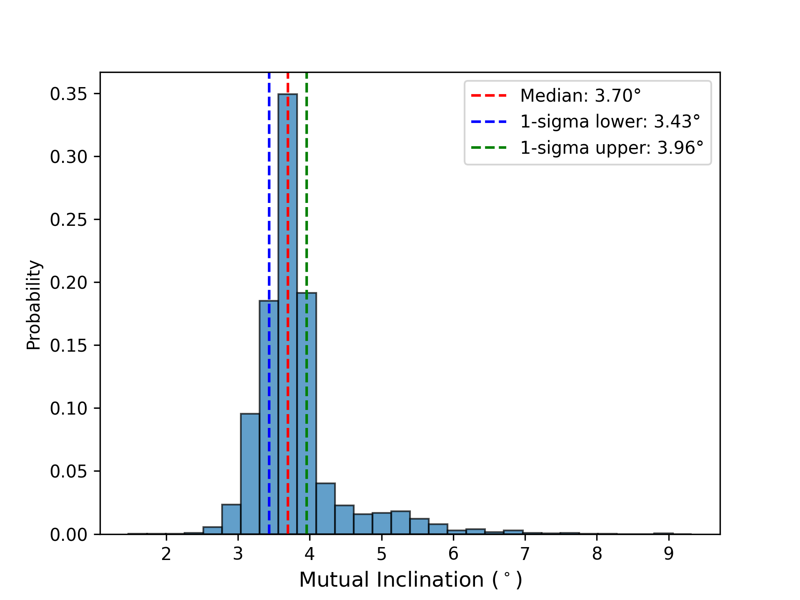
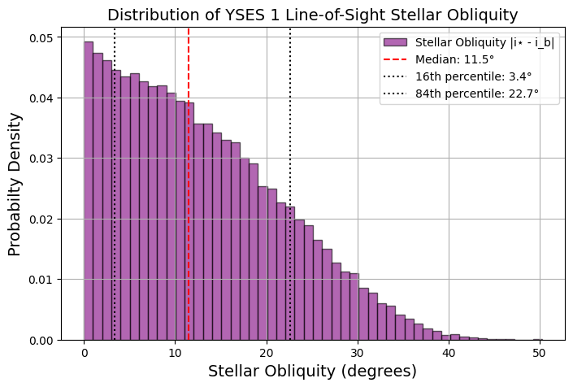
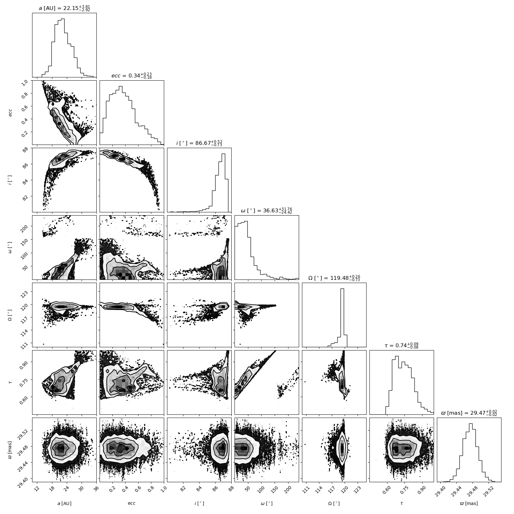

$\newcommand{\ensuremath}{}$
$\newcommand{\xspace}{}$
$\newcommand{\object}[1]{\texttt{#1}}$
$\newcommand{\farcs}{{.}''}$
$\newcommand{\farcm}{{.}'}$
$\newcommand{\arcsec}{''}$
$\newcommand{\arcmin}{'}$
$\newcommand{\ion}[2]{#1#2}$
$\newcommand{\textsc}[1]{\textrm{#1}}$
$\newcommand{\hl}[1]{\textrm{#1}}$
$\newcommand{\footnote}[1]{}$
$\newcommand{\mstar}{\ensuremath{M_\star}}$
$\newcommand{\msun}{\ensuremath{M_\odot}}$
$\newcommand{\mjup}{\ensuremath{M_J}}$
$\newcommand{\rjup}{\ensuremath{R_J}}$
$\newcommand{\ms}{\ensuremath{\mathrm{km s^{-1}}}}$
$\newcommand{\kms}{\ensuremath{\mathrm{km s^{-1}}}}$
$\newcommand{\red}[1]{\textcolor{red}{#1}}$
$\newcommand{\blue}[1]{\textcolor{blue}{#1}}$
$\newcommand{\highlight}[1]{\textbf{#1}}$

# New Orbital Constraints for YSES 1 b and HR 2562 B from High-Precision Astrometry and Planetary Radial Velocities$\footnote{Based on observations collected at the European Southern Observatory under ESO programmes 109.238N.002, 110.23U4.001, 109.238N.004, 113.26QU.001, 1104.C-0651(B), 109.238N.002, 109.238N.004, 60.A-9102(J), and 114.27UV.001}$

<mark>Appeared on: 2025-09-19</mark> - 

J. Roberts, et al. -- incl., <mark>G. Chauvin</mark>, <mark>T. K. Henning</mark>

**Abstract:** We present new VLTI/GRAVITY astrometry and updated orbit fits for the directly imaged companions YSES 1 b and HR 2562 B, substellar objects straddling the planet-brown dwarf boundary. Using high-precision astrometry, radial velocity (RV) data, and proper motions, we derive revised orbital parameters with \texttt{orbitize!} \citep{Blunt_2020} . For YSES 1 b, the inclusion of GRAVITY astrometry and a relative radial velocity measurement from \citet{zhang2024} overcomes the traditional challenge of constraining eccentricities for distant companions, enabling the first orbit fit and yielding a constrained eccentricity of $0.44\pm0.20$ . This represents the first full orbit fit for the system. Additionally, we calculate a median line-of-sight stellar obliquity of $12^{+11}_{-8}$ deg, providing further insight into the system's dynamical architecture. For HR 2562 B, our analysis agrees with \citet{Zhang_2023} , confirming a low-eccentricity orbit ( $0.34\pm0.20$ ) and an inclination of $87\pm 1$ deg. We find HR 2562 B's orbit to be nearly coplanar with the debris disk, with a mutual inclination of $3.7\pm 0.3$ deg. For both YSES 1 b and HR 2562 B the lower eccentricities favor an ${in situ}$ formation scenario over extreme scattering or cloud fragmentation.

**Figure 1. -** Histogram of the mutual inclination between the orbit of HR 2562 B and its disk. The distribution peaks median value of $3.70^\circ$, indicating that HR 2562 B's orbit is nearly coplanar with the disk. (*fig:mutual_inc*)

**Figure 2. -** Probability density distribution of the Line-of-Sight stellar obliquity for YSES 1. The median obliquity is 11.5° (red dashed line), with the 16th and 84th percentiles at 3.4° and 22.7° (black dotted lines), respectively.
 (*fig:yses_3*)

**Figure 3. -** Full Corner plot of HR 2562 B. The estimated posteriors are on the diagonals. The cross-sections represent the covariance with the 1, 2, and 3-$\sigma$ errors.
 (*fig:HR2562_large*)

