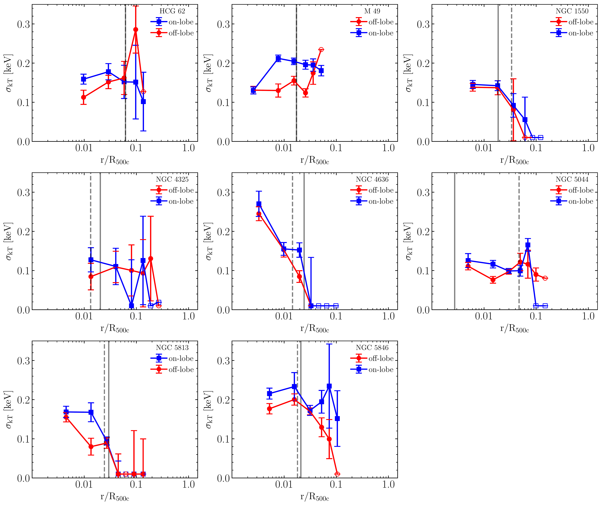
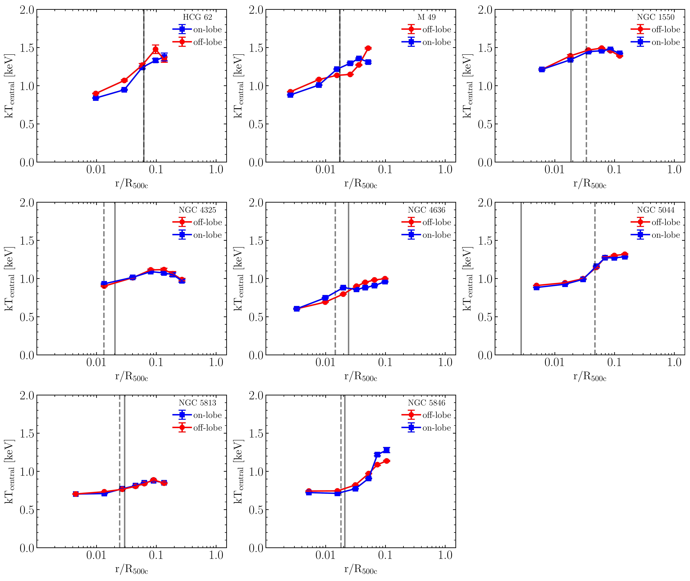
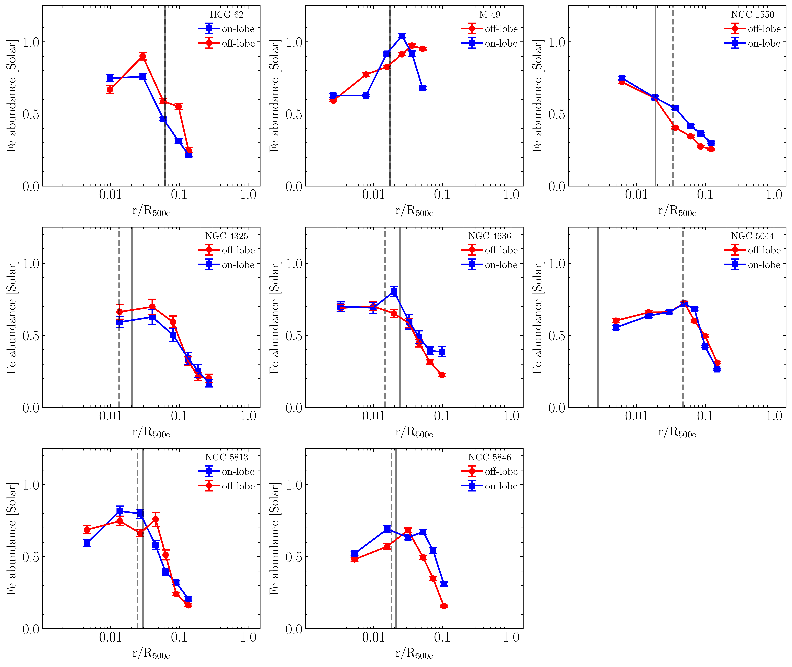

$\newcommand{\ensuremath}{}$
$\newcommand{\xspace}{}$
$\newcommand{\object}[1]{\texttt{#1}}$
$\newcommand{\farcs}{{.}''}$
$\newcommand{\farcm}{{.}'}$
$\newcommand{\arcsec}{''}$
$\newcommand{\arcmin}{'}$
$\newcommand{\ion}[2]{#1#2}$
$\newcommand{\textsc}[1]{\textrm{#1}}$
$\newcommand{\hl}[1]{\textrm{#1}}$
$\newcommand{\footnote}[1]{}$
$\newcommand{\orcid}[1]{\href{https://orcid.org/#1}{\includegraphics[scale=0.08]{Figures/ORCID-iD_icon-128x128.png}}}$
$\newcommand{\thebibliography}{\DeclareRobustCommand{\VAN}[3]{##3}\VANthebibliography}$

# Distribution of Metals and Multi-Temperature Gas in the Cores of Nearby Galaxy Groups

<mark>Appeared on: 2025-09-24</mark> -  _Accepted for publication in MNRAS_

<mark>D. Chatzigiannakis</mark>, A. Simionescu, F. Mernier

**Abstract:** Previous studies of galaxy clusters have focused extensively on the effects of active galactic nuclei (AGN) feedback on the chemical evolution of the intra-cluster medium (ICM). However, similar studies on the atmospheres of lower mass systems, such as galaxy groups and giant ellipticals, remain limited. In this work, we present a systematic analysis of the chemical and multi-temperature structure of the intra-group medium (IGrM), using a subsample of nearby galaxy groups and ellipticals from the CHEERS catalogue. By comparing areas with and without AGN feedback related features, such as cavities or extended radio lobes, we find clear evidence of an excess of multi-phase gas along the path of recent AGN feedback. However, its distribution exceeds the length of the radio lobes, since we recover a non-negligible amount of multi-phase gas at larger radii. In contrast to the clear asymmetry in the thermal structure, we find no directional enhancement in the distribution of Fe, with little to no differences in the Fe abundances of the on- and off-lobe directions. Our analysis suggests that the metals in the IGrM of our targets are well-mixed and decoupled from the effects of recent AGN feedback, as indicated by radio-lobes and cavities.

**Figure 5. -** Average radial $\sigma_{\text{kt}}$ profiles. Data points represent the weighted averages of the thermal distribution's width in the on- and off-lobe directions, according to their relative contribution on the spectrum. Open symbols indicate error bars much larger than the axis limit. The vertical solid and dashed lines indicate the greatest extent of the radio lobes, or X-ray detected cavities if not available. Our results indicate systematically broader thermal distributions for the on-lobe directions, downstream (inside) of the radio lobes and cavities. For larger radii the width of the thermal distribution tends to vary from target to target. (*fig:sigma_weight*)

**Figure 10. -** Weighted average radial profiles of the thermal distribution's centre for the on- and off-lobe directions. The vertical solid and dashed lines indicate the greatest extent of the radio lobes, or X-ray detected cavities if not available. There are effectively no differenced in the central temperature between the two directions suggesting that it does not play a role in the different thermal widths. (*fig:kT_weight*)

**Figure 11. -** Weighted averaged Fe abundance profiles for the on- and off-lobe directions, assuming a single temperature model throughout. The vertical solid and dashed lines indicate the greatest extent of the radio lobes, or X-ray detected cavities if not available. Our results suggest that ignoring the multi-phase nature of the IGrM can lead to cases where the Fe abundance of the on-lobe directions is depressed to the extent of an off-lobe enhancement. However, the rest maintain an azimuthally symmetric chemical structure despite the reduced inferred Fe abundance. (*fig:Fe_1T*)

