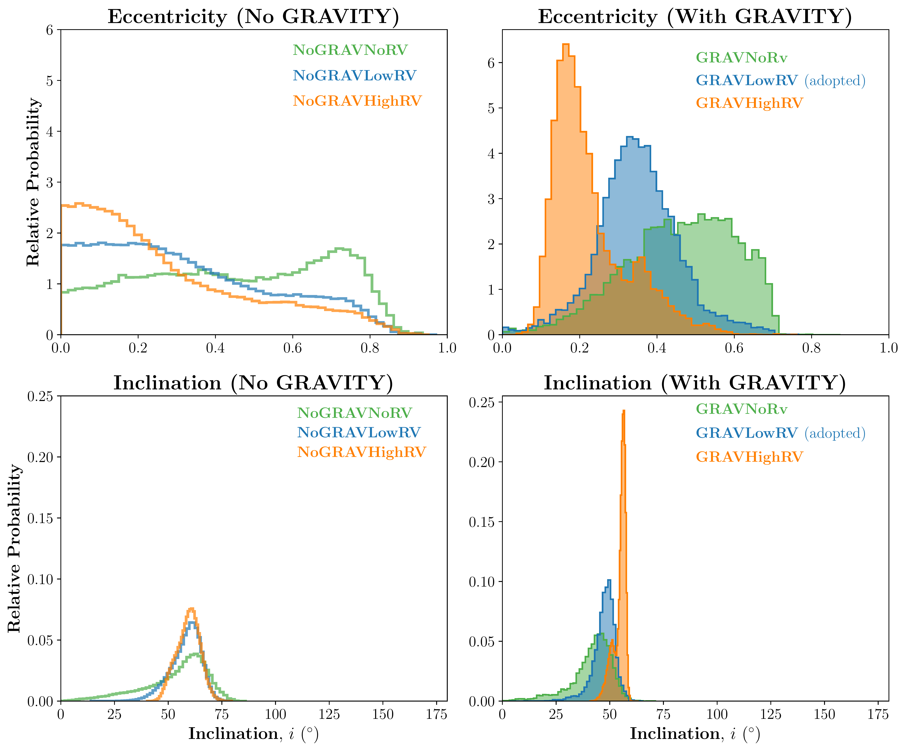
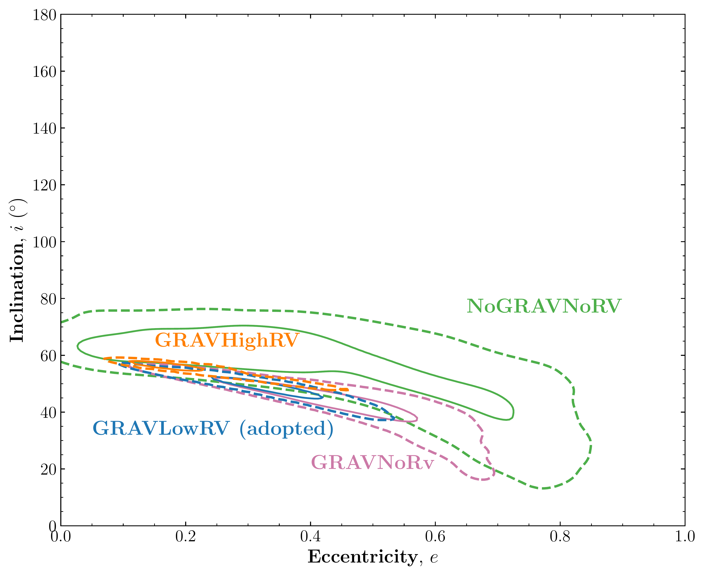
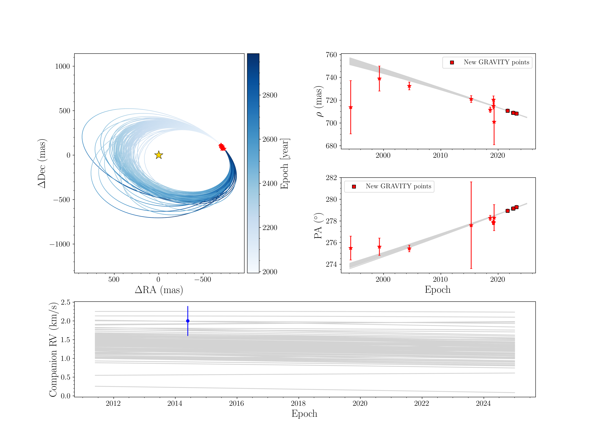

$\newcommand{\ensuremath}{}$
$\newcommand{\xspace}{}$
$\newcommand{\object}[1]{\texttt{#1}}$
$\newcommand{\farcs}{{.}''}$
$\newcommand{\farcm}{{.}'}$
$\newcommand{\arcsec}{''}$
$\newcommand{\arcmin}{'}$
$\newcommand{\ion}[2]{#1#2}$
$\newcommand{\textsc}[1]{\textrm{#1}}$
$\newcommand{\hl}[1]{\textrm{#1}}$
$\newcommand{\footnote}[1]{}$

# Constraints on the Orbit of the Young Substellar Companion GQ Lup B from High-Resolution Spectroscopy and VLTI/GRAVITY Astrometry $\footnote{Based on observations collected at the European Southern Observatory under ESO programmes 1104.C-0651 and 109.238N.001.}$

<mark>Appeared on: 2025-09-26</mark> -  _15 pages, 5 figures, Accepted to ApJ_

V. Venkatesan, et al. -- incl., <mark>W. Brandner</mark>, <mark>G. Chauvin</mark>, <mark>P. Garcia</mark>, <mark>T. Henning</mark>, <mark>L. Kreidberg</mark>

**Abstract:** Understanding the orbits of giant planets is critical for testing planet formation models, particularly at wide separations ( $>$ 10 au) where traditional core accretion becomes inefficient. However, constraining orbits at these separations has historically been challenging due to sparse orbital coverage and related degeneracies in the orbital parameters. In this work, we use existing high-resolution ( $R \sim 100{,}000$ ) spectroscopic measurements from CRIRES+, astrometric data from SPHERE, NACO, and ALMA, and combine it with new high-precision GRAVITY astrometry data to refine the orbit of GQ Lup B, a $\sim$ 30 $M_{\mathrm{J}}$ companion at $\sim$ 100 au, in a system that also hosts a circumstellar disk and a wide companion, GQ Lup C. Including RV data significantly improves orbital constraints by breaking the degeneracy between inclination and eccentricity that plagues astrometry-only fits for long-period companions. Our work is one of the first to combine high-precision astrometry with the companion’s relative radial velocity measurements to achieve significantly improved orbital constraint. The eccentricity is refined from $e = 0.47^{+0.14}_{-0.16}$ (GRAVITY only) to $e = 0.35^{+0.10}_{-0.09}$ when RVs and GRAVITY data are combined. We also compute the mutual inclinations between the orbit of GQ Lup B, the circumstellar disk, the stellar spin axis, and the disk of GQ Lup C. The orbit is misaligned by $63^{+6}_{-14}^\circ$ relative to the circumstellar disk, $52^{+19}_{-24}^\circ$ with the host star's spin axis, but appears more consistent ( $34^{+6}_{-13}^\circ$ ) with the inclination of the wide tertiary companion GQ Lup C's disk. These results support a formation scenario for GQ Lup B consistent with cloud fragmentation. They highlight the power of combining companion RV constraints with interferometric astrometry to probe the dynamics and formation of wide-orbit substellar companions.

**Figure 4. -** Posterior eccentricity and inclination distributions for GQ Lup B based on six orbital fits (see Table \ref{tab:fit_cases}), grouped by inclusion of GRAVITY astrometry. The histograms show the relative probability of eccentricity and inclination values. Inclusion of GRAVITY and relative RV measurements substantially tightens the constraints. While the high-precision RV case (orange) provides the narrowest distribution, it may be biased due to stellar variability or unresolved companions. The adopted blue case ({\texttt{GRAVLowRV}}) incorporates GRAVITY astrometry and low-precision RV, offering a robust and physically plausible solution consistent with a moderately eccentric and inclined orbit. (*fig:ecc*)

**Figure 1. -** 1$\sigma$ and 2$\sigma$ joint posterior distributions of eccentricity and inclination for GQ Lup B under four cases (see Table \ref{tab:fit_cases}) are shown by lines and dashed lines, respectively. The inclusion of GRAVITY astrometry significantly narrows the orbital parameter space, particularly by reducing the volume of the joint eccentricity-inclination posterior. Adding radial velocity measurements—especially in the {{\texttt{GRAVLowRV}}} and {{\texttt{GRAVHighRV}}} cases—further sharpens the constraints by reducing the eccentricity-inclination degeneracy, yielding a well-localized solution consistent with a moderately eccentric orbit. (*fig:contours*)

**Figure 2. -** Orbit fit for Case \texttt{GRAVLowRV}(see Table \ref{tab:fit_cases}), using astrometry including GRAVITY data and low-precision radial velocity measurement. The plot shows posterior samples from the orbit fit for GQ Lup B, generated using \texttt{orbitize!}. Blue ellipses represent 100 orbits randomly drawn from the posterior, and red points indicate the relative astrometric data. In the right panels, red points correspond to astrometric measurements from both the literature and new GRAVITY data included in the fit; gray lines trace the same 100 posterior orbits in separation and position angle. The results illustrate the power of GRAVITY data in improving the orbit solution for GQ Lup B. (*fig:orbit*)

