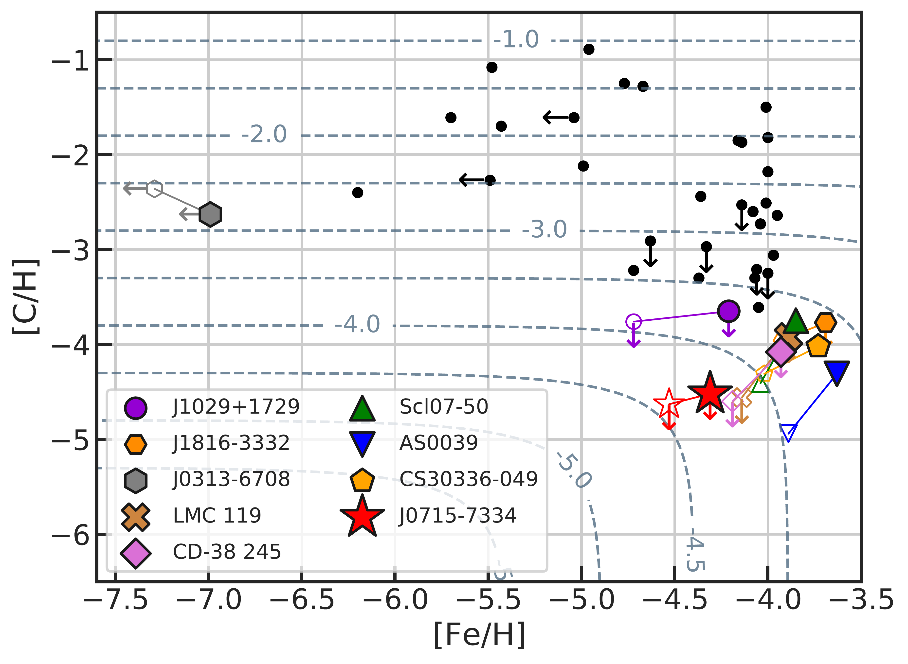
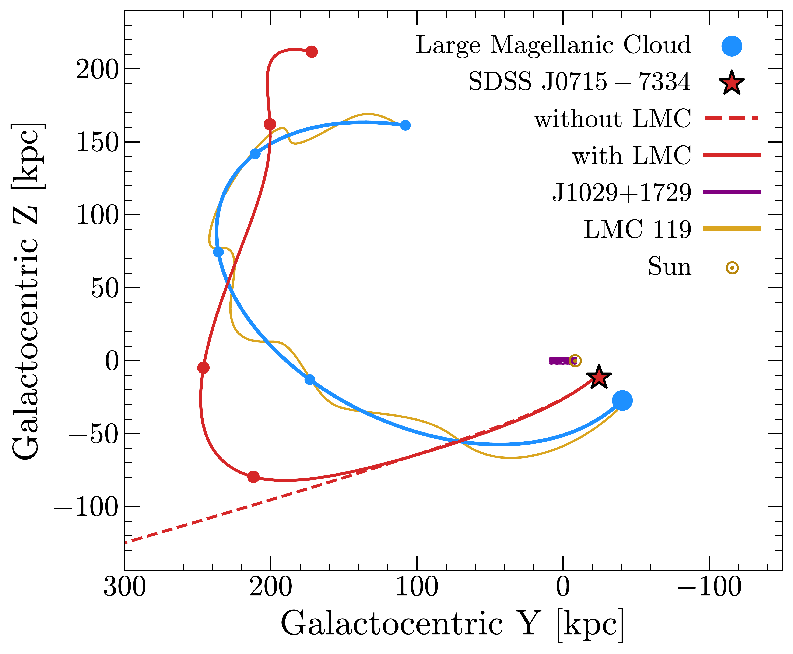
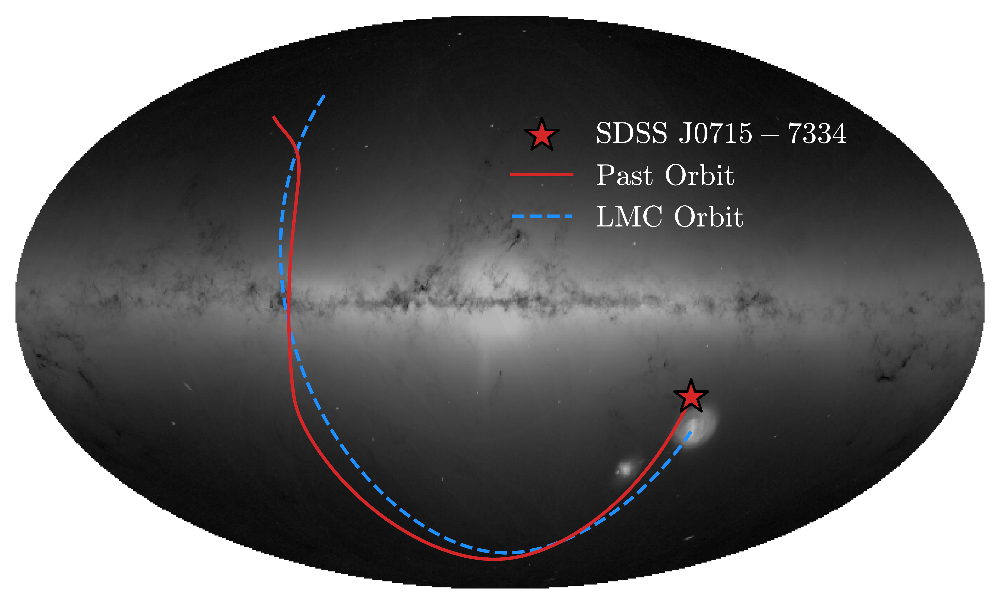
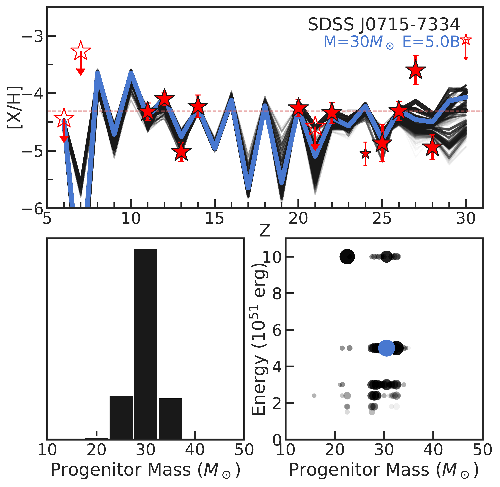

$\newcommand{\ensuremath}{}$
$\newcommand{\xspace}{}$
$\newcommand{\object}[1]{\texttt{#1}}$
$\newcommand{\farcs}{{.}''}$
$\newcommand{\farcm}{{.}'}$
$\newcommand{\arcsec}{''}$
$\newcommand{\arcmin}{'}$
$\newcommand{\ion}[2]{#1#2}$
$\newcommand{\textsc}[1]{\textrm{#1}}$
$\newcommand{\hl}[1]{\textrm{#1}}$
$\newcommand{\footnote}[1]{}$
$\newcommand{\pasa}{PASA}$
$\newcommand{\pasp}{PASP}$
$\newcommand$
$\newcommand$
$\newcommand$
$\newcommand$
$\newcommand{\code}[1]{\texttt{#1}\xspace}$
$\newcommand{\FIXME}[1]{\textcolor{red}{#1}}$
$\newcommand{\gaia}{\textit{Gaia}\xspace}$
$\newcommand{\Gaia}{\gaia}$
$\newcommand{\unit}[1]{\ensuremath{\mathrm{ #1}}\xspace}$
$\newcommand{\feh}{\unit{[Fe/H]}}$
$\newcommand{\mgh}{\unit{[Mg/H]}}$
$\newcommand{\sih}{\unit{[Si/H]}}$
$\newcommand{\cfe}{\unit{[C/Fe]}}$
$\newcommand{\ch}{\unit{[C/H]}}$
$\newcommand{\mh}{\unit{[M/H]}}$
$\newcommand{\zzsun}{\ensuremath{Z/Z_\odot}\xspace}$
$\newcommand{\logzzsun}{\ensuremath{\log Z/Z_\odot}\xspace}$
$\newcommand{\teff}{\ensuremath{T_\mathrm{eff}}\xspace}$
$\newcommand{\Teff}{\teff}$
$\newcommand{\logg}{\ensuremath{\log g}\xspace}$
$\newcommand{\alphafe}{\unit{[\alpha/Fe]}}$
$\newcommand{\vhel}{\mbox{v_{\mathrm{hel}}}}$
$\newcommand{\vgsr}{\mbox{v_{\mathrm{gsr}}}}$
$\newcommand{\pmragsr}{\mbox{\mu_{\alpha,\mathrm{gsr}}}}$
$\newcommand{\pmdecgsr}{\mbox{\mu_{\delta,\mathrm{gsr}}}}$
$\newcommand{\sigmav}{\mbox{{\sigma_v}}}$
$\newcommand{\sigmafeh}{\mbox{\sigma_{\mathrm{[Fe/H]}}}}$
$\newcommand{\kms}{\unit{km s^{-1}}}$
$\newcommand{\masyr}{\unit{mas yr^{-1}}}$
$\newcommand{\msun}{\unit{M_\odot}}$
$\newcommand{\lsun}{\unit{L_\odot}}$
$\newcommand{\umpstarsdss}{SDSS~J0715-7334\xspace}$
$\newcommand{\umpstar}{J0715-7334\xspace}$
$\newcommand{\umpstartmass}{2MASS~J07153858-7334530\xspace}$
$\newcommand{\umpstargaia}{Gaia~DR3~5262850721755411072\xspace}$
$\newcommand{\umpstarsdssid}{SDSS\_ID~95803549\xspace}$
$\newcommand{\cdstar}{CD-38~245\xspace}$
$\newcommand{\caffaustarsdss}{SDSS J1029+1729\xspace}$
$\newcommand{\caffaustar}{J1029+1729\xspace}$
$\newcommand{\kellerstar}{SMSS J0313-6708\xspace}$
$\newcommand{\lmcstar}{LMC-119\xspace}$
$\newcommand{\sclstar}{Scl-07\xspace}$
$\newcommand{\asstar}{AS0039\xspace}$
$\newcommand{\pristinestar}{Pristine\_221}$
$\newcommand{\thefigure}{Extended Data Figure \arabic{figure}}$
$\newcommand{\thetable}{Extended Data Table \arabic{table}}$

# A nearly pristine star from the Large Magellanic Cloud

<mark>Appeared on: 2025-09-29</mark> -  _18 pages, 9 figures, 1 table, submitted_

A. P. Ji, et al. -- incl., <mark>P. Eitner</mark>, <mark>M. Bergemann</mark>

**Abstract:** The first stars formed out of pristine gas, causing them to be so massive that none are expected to have survived until today Bromm2009, Klessen2023 .  If their direct descendants were sufficiently low-mass stars, they could exist today and would be recognizable by having the lowest metallicity (abundance of elements heavier than helium) Frebel2015 . The lowest metallicity star currently known is a star in the thick disk of the Milky Way with total metallicity $Z < 1.4 \times 10^{-6}$ ( $\logzzsun < -4.0$ ) Caffau2011, Lagae2023, Caffau2024 . While other stars with lower iron abundance have been discovered Christlieb2002, Frebel2005, Keller2014 , they have high carbon abundances and thus higher total metallicities ( $\logzzsun > -3$ ). Here we present the discovery and detailed chemical analysis of the most metal-poor star yet found: the red giant star SDSS J0715-7334 with ultra-low abundances of both iron and carbon ( $\mbox{[Fe/H]} = -4.3$ , $\mbox{[C/Fe]} < -0.2$ ), resulting in total metallicity $Z < 7.8 \times 10^{-7}$ ( $\logzzsun < -4.3$ ). This star has the most pristine composition of any object known in the universe. The star's orbit indicates that it originates from the halo of the Large Magellanic Cloud. Its detailed chemical composition implies a supernova progenitor with initial mass of 30 solar masses Heger2010 . Current models of low-mass star formation can explain the existence of SDSS J0715-7334 only if dust cooling was already able to operate at the time of its formation Schneider2003, Schneider2012 . SDSS J0715-7334 is over ten times more metal-poor than the most metal-poor high-redshift galaxies found by the James Webb Space Telescope, some of which have been claimed to be potentially metal-free Fujimoto2025, Nakajima2025, Morishita2025 . Substantially deeper observations of high-redshift galaxies would be needed to prove that they are truly pristine galaxies made of metal-free stars and not metal-enriched galaxies composed of second-generation stars like SDSS J0715 $-$ 7334 Katz2023 .

**Figure 2. -** **Carbon and iron abundances of ultra-metal-poor stars.**$\umpstar$ is shown as a large red star. Black points show a literature sampleAbohalima2018, Sestito2019. Colored points highlight eight other notable stars, with 1D LTE abundances shown as small open symbols and a combination of 1D NLTE, 3D LTE, and 3D NLTE analyses shown as large solid colored symbols. The dashed blue contours indicate an approximate total metallicity assuming $\mbox{[Mg/Fe]}=+0.4$(see Methods).
 (*fig:cfe*)

**Figure 3. -** **Kinematic properties.**_Top:_
    Past orbit of $\umpstar$ over $4$ Gyr in Galactocentric coordinates, integrated in a potential that includes the gravitational influence of the LMC (solid lines).
    Circular markers are placed every $1$ Gyr.
    For comparison, the past orbit of the LMC itself is shown, along with orbits of the stars $\caffaustar$(confined to the disk) and LMC-119 (closely bound to the LMC).
    The dashed red line shows the unbound orbit of $\umpstar$ in a MW-only potential.
    _Bottom:_ The past orbit of $\umpstar$ and the LMC in Galactic coordinates on-sky, overlaid on the distribution of all stars observed by _Gaia_.
     (*fig:kinematics*)

**Figure 4. -** **Population III Supernova Progenitor Constraints.**_Top:_ Chemical abundance pattern of $\umpstar$. Filled red stars show measured abundances with $1\sigma$ uncertainties; open red stars with arrows are upper limits (treated as hard cutoffs). Sc is treated as an upper limit due to model uncertainties; Cr and Zn are excludedHeger2010. The blue line and caption shows the best-fit model; black lines show other models within $95\%$ confidence, with opacity indicating fit quality.
    _Bottom left:_ Progenitor mass distribution of models weighted using total absolute error (see Methods).
    _Bottom right:_ Explosion energy vs. progenitor mass for the same models; point size scales with fit quality. Best-fit model shown in blue.
     (*fig:popiii*)

