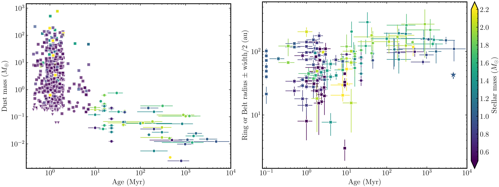
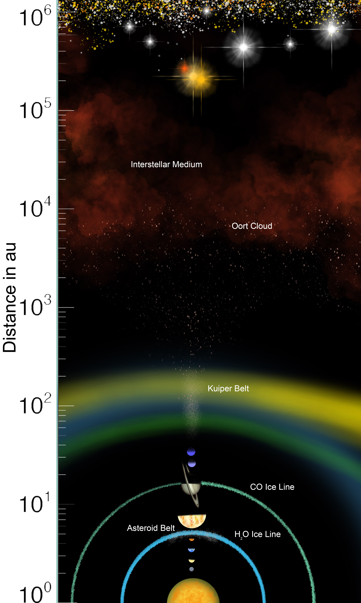
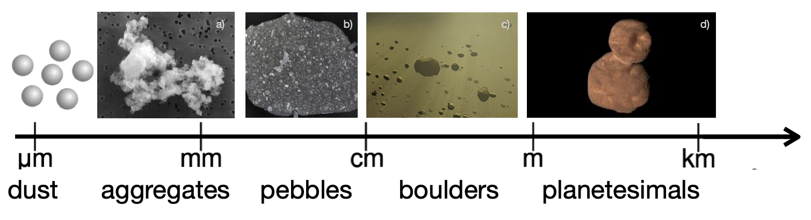

$\newcommand{\ensuremath}{}$
$\newcommand{\xspace}{}$
$\newcommand{\object}[1]{\texttt{#1}}$
$\newcommand{\farcs}{{.}''}$
$\newcommand{\farcm}{{.}'}$
$\newcommand{\arcsec}{''}$
$\newcommand{\arcmin}{'}$
$\newcommand{\ion}[2]{#1#2}$
$\newcommand{\textsc}[1]{\textrm{#1}}$
$\newcommand{\hl}[1]{\textrm{#1}}$
$\newcommand{\footnote}[1]{}$
$\newcommand{\aap}{{Astron. Astrophys.}}$
$\newcommand{\aapr}{{Astron. Astrophys. Rev.}}$
$\newcommand{\aj}{{Astron. J.}}$
$\newcommand{\apj}{{Astrophys. J.}}$
$\newcommand{\apjl}{{Astrophys. J. Lett.}}$
$\newcommand{\apjs}{{Astrophys. J. Supp. Ser.}}$
$\newcommand{\apss}{{Astrophys. Space Sci.}}$
$\newcommand{\araa}{{Annu. Rev. Astron. Astrophys.}}$
$\newcommand{\grl}{{Geophys. Res. Lett.}}$
$\newcommand{\icarus}{{Icarus}}$
$\newcommand{\iaucirc}{{Int. Astron. U. Circ.}}$
$\newcommand{\jgr}{{J. Geophys. Res.}}$
$\newcommand{\mnras}{{Mon. Not. Roy. Astron. Soc.}}$
$\newcommand{\na}{{New Astronomy}}$
$\newcommand{\nat}{{Nature}}$
$\newcommand{\pasj}{{Publ. Astron. Soc. Jap.}}$
$\newcommand{\pasp}{{Publ. Astron. Soc. Pac.}}$
$\newcommand{\planss}{{Plan. Spac. Sci.}}$
$\newcommand{\procspie}{{Proc. of SPIE}}$
$\newcommand{\solphys}{{Solar Phys.}}$
$\newcommand{\ssr}{{Space Sci. Rev.}}$
$\newcommand{\psj}{{Planet. Sci. J.}}$
$\newcommand{\prl}{{Phys. Rev. Lett.}}$
$\newcommand{\bain}{{Bull. Astron. Inst. Netherlands}}$
$\newcommand{\timCom}[1]{\textbf{{\color{red}[#1 - Tim]}}}$
$\newcommand{\red}[1]{\textcolor{red}{#1}}$
$\newcommand{\dimitriCom}[1]{\textbf{{\color{orange}[#1 - Dimitri]}}}$
$\newcommand{\orange}[1]{\textcolor{orange}{#1}}$
$\newcommand{\MattHCom}[1]{\textbf{{\color{teal}[#1 - Matt H.]}}}$
$\newcommand{\rk}[1]{\textbf{{\color{magenta}[#1 - RK]}}}$

# The Origins \& Reservoirs of Exocomets

<mark>Appeared on: 2025-09-29</mark> -  _Accepted for publication in Space Science Reviews. Chapter written for the the workshop 'Exocomets: Bridging our Understanding of Minor Bodies in Solar and Exoplanetary Systems' (July 2024), at the International Space Science Insitute (ISSI), Bern_

M. Bannister, et al. -- incl., <mark>H. Klahr</mark>

**Abstract:** Small bodies exist in distinct populations within their planetary systems.These reservoir populations hold a range of compositions, which to first order are dependent on formation location relative to their star.We provide a general overview of the nature of the reservoirs that source exocomets, from the influence of the stellar environment through planetesimal formation to comparisons with Solar System populations.Once transitioned from a young protoplanetary disc to a debris disc, a star can expect to be rained with exocomets.While exocomets are predominantly detected to date at A-type stars, planetesimals plausibly exist across a range of stellar masses, based on exoplanet abundance, debris disc occurrence and white dwarf infall.

**Figure 4. -** Dust mass (left) and radius (right) of protoplanetary and debris discs as a function of system age. Protoplanetary discs are represented with squares and debris or evolved discs with circles. The Kuiper belt is represented with a star on the right panel. Debris data from \cite{Matra2025}, and protoplanetary disc data from \citet{Bae2023}. The colour scale indicates the stellar mass in both panels.
     (*fig:DebrisDiscMassAndLocationVsAge*)

**Figure 1. -** Schematic picture illustrating the approximate location of the different small-body and comet reservoirs in the Solar System.  (*fig:Location_reservoirs*)

**Figure 2. -** Schematic picture illustrating the growth from dust to planetesimal sizes.
    `Dust' of silicate- and organics-rich grains are shown schematically; these grow to fractal dust structures via sticking collisions.
    After compactifying and further growth they reach planetesimal sizes.
    Credits: a) Amara/Wikipedia (CC), b) via Wikimedia Commons, c) adapted from Wikipedia Commons, and d) cold classical Arrokoth (NASA). (*fig:Dust2planetesimals*)

