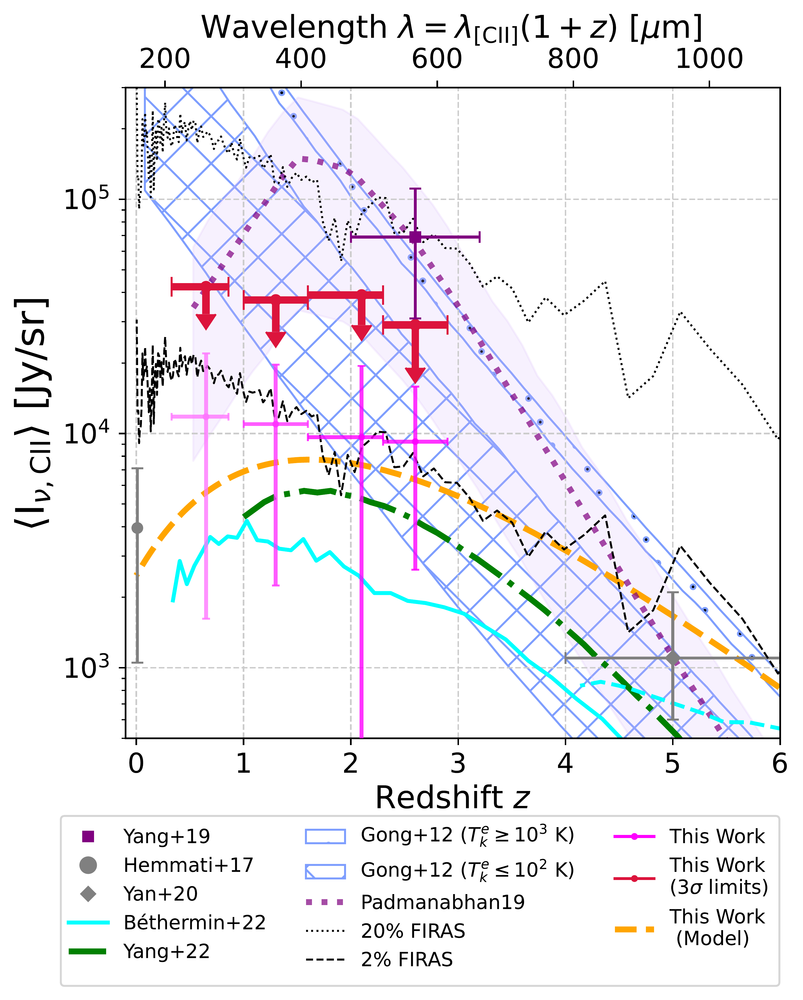
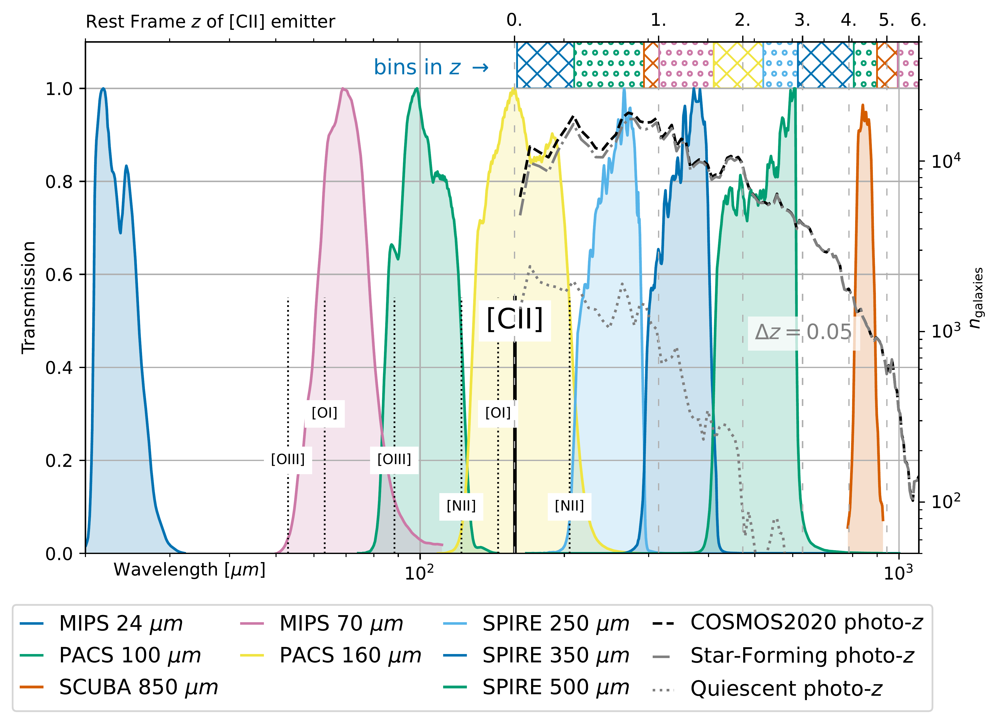
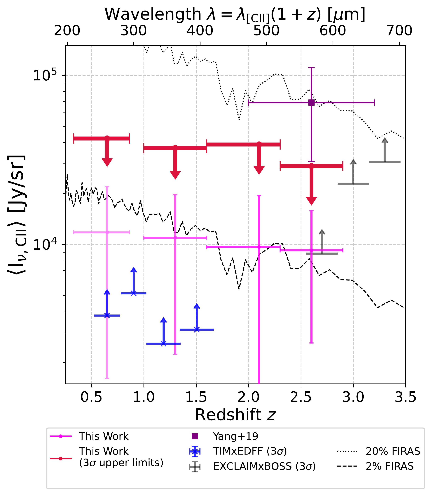

$\newcommand{\ensuremath}{}$
$\newcommand{\xspace}{}$
$\newcommand{\object}[1]{\texttt{#1}}$
$\newcommand{\farcs}{{.}''}$
$\newcommand{\farcm}{{.}'}$
$\newcommand{\arcsec}{''}$
$\newcommand{\arcmin}{'}$
$\newcommand{\ion}[2]{#1#2}$
$\newcommand{\textsc}[1]{\textrm{#1}}$
$\newcommand{\hl}[1]{\textrm{#1}}$
$\newcommand{\footnote}[1]{}$
$\newcommand$
$\newcommand$
$\newcommand$
$\newcommand$
$\newcommand$
$\newcommand$
$\newcommand$
$\newcommand$
$\newcommand$
$\newcommand$
$\newcommand$
$\newcommand$
$\newcommand{\linsimstackns}{\texttt{LinSimStack}}$
$\newcommand{\linsimstack}{\linsimstackns\;}$
$\newcommand{\mum}{{\ensuremath{\mu \mathrm{m}}}}$
$\newcommand{\reviewEditOne}[1]{#1}$

# Far-infrared lines hidden in archival deep multi-wavelength surveys: Limits on $\ciium$ at $z\sim 0.3-2.9$

<mark>Appeared on: 2025-09-30</mark> -  _Submitted to Astronomy & Astrophysics on July 19, 2025_

S. Agrawal, J. Aguirre, <mark>R. Keenan</mark>

**Abstract:** _Context:_ Singly-ionized carbon $\cii$ is theorized to be the brightest emission line feature in star-forming galaxies, and hence an excellent tracer of the evolution of cosmic star formation. Archival maps from far-infrared and sub-millimeter surveys potentially contain the redshifted $\ciiumns$ , hidden in the much-brighter continuum emission. _Aim:_ We present a search for aggregate $\ciium$ line emission across the predicted peak of star formation history by tomographically stacking a high-completeness galaxy catalog on broadband deep maps of the COSMOS field and constraining residual excess emission after subtracting the continuum spectral energy distribution (SED). _Methods:_ The COSMOS equatorial $2\deg^2$ patch has been mapped by _Spitzer_ , _Herschel_ , and SCUBA2/JCMT. With the high precision UV-O-IR photometry catalog COSMOS2020, we perform unbiased simultaneous stacking of $\sim360,000$ photometric redshifts on these confusion-limited maps to resolve the sub-THz radiation background.By subtracting an continuum SED model with conservative uncertainty estimation and completeness correction through comparison to the _COBE_ /FIRAS monopole spectrum, we obtain tomographic constraints on the sky-averaged $\ciium$ signal within the three SPIRE maps: $11.8 \pm 10.2$ , $11.0 \pm 8.7$ , $9.6 \pm 9.8$ , and $9.2 \pm 6.6$ $k$ Jy/sr at redshifts $z\sim 0.65$ , $\sim1.3$ , $\sim2.1$ , and $\sim2.6$ respectively, corresponding to $1-1.4\sigma$ significance in each bin. _Results:_ Our $3\sigma$ upper limits are in tension with past $z\sim 2.6$ results from cross-correlating SDSS-BOSS quasars with high-frequency _Planck_ maps, and indicate a much less dramatic evolution ( $\sim\times 7.5$ ) of mean $\cii$ intensity across the peak of star formation history than collisional excitation models or frameworks calibrated to the tentative _Planck_ xBOSS measurement. We discuss this tension, particularly in the context of in-development surveys (TIM, EXCLAIM) that will map this $\cii$ at high redshift resolution. _Conclusion:_ Having demonstrated stacking in broadband deep surveys as a complementary methodology to next-generation spectrometers for line intensity mapping, our novel methods can be extended to upcoming galaxy surveys such as _Euclid_ , as well as to place upper limits on fainter atomic and molecular lines.

**Figure 4. -** $\reviewEditOne${Our measurements of \ciium at $z\sim 0.3-2.9$, plotted with estimates obtained from measurements of the \ciiumns-LF in the local universe and $z\sim5$. Also shown are theoretical predictions from C+ evolution models; our $3\sigma$ upper limits disfavor high-temperature collisional excitation frameworks and best-fit empirical models calibrated to the Pullen_2018 _Planck_ measurement. Our $1\sigma$ results have a higher chance of agreement with SFR-scaling models, which calibrate C+ luminosity to the star formation rate of sources.
Additionally, we plot the _COBE_/FIRAS measurement of the monopole spectrum of the Cosmic Infrared Background as a function of wavelength matched to the rest frame redshift of \ciium emission. We find \ciium likely does not contribute more than a few percent of the total Cosmic Infrared Background, and the intensity history to have undergone a less dramatic evolution across cosmic noon, rising and falling within an order of magnitude.
} (*fig:constraints*)

**Figure 1. -**  Overview of data used in our analysis. We include transmission curves (left vertical, bottom horizontal axes) of the eight broadband maps used, from _Spitzer_, _Herschel_, and SCUBA-2. We overplot the rest frame wavelengths of some far-infrared emission lines, including \ciiumns; these lines are redshifted into the broadband maps. Notably, the top horizontal axis labels translate the observer wavelengths into $\reviewEditOne${the} rest frame redshift $z$ of a \ciium emitter. We trace the $z$ distribution of the COSMOS2020 photometric catalog (in bins of $\Delta z = 0.05$), with number counts on the right vertical axis; $\reviewEditOne${number counts for the selection into star-forming or quiescent emitters is also shown}. Redshifted C+ emission will end up in the SPIRE maps for specific $z$ ranges. Finally, at the top, we demarcate the $z$-binning used for stacking with $\linsimstack$; bins at $z\sim0.65$, 1.3, 2.1, \& 2.6 were chosen such that they overlap with the SPIRE bands. (*fig:filter_curves*)

**Figure 6. -** Our constraints, incl. $3\sigma$ upper bounds, plotted with the 95\% C.L. bounds from the Yang_2019(a followup of Pullen_2018) measurement at $z\sim 2.6$. We do not find \ciium at the levels previously tentatively detected; our best estimates are $\sim7.5\times$ lower, with our $3\sigma$ upper bound at $z\sim2.6$ lower than the 95\% C.L. interval.
Also plotted are expected $3\sigma$ sensitivity limits of two in-development surveys  (Pullen_2023,  timconstraints)  that will measure C+ at high $R$. We discuss these and this tension further in text (Section \ref{sec:results}). (*fig:compare*)

