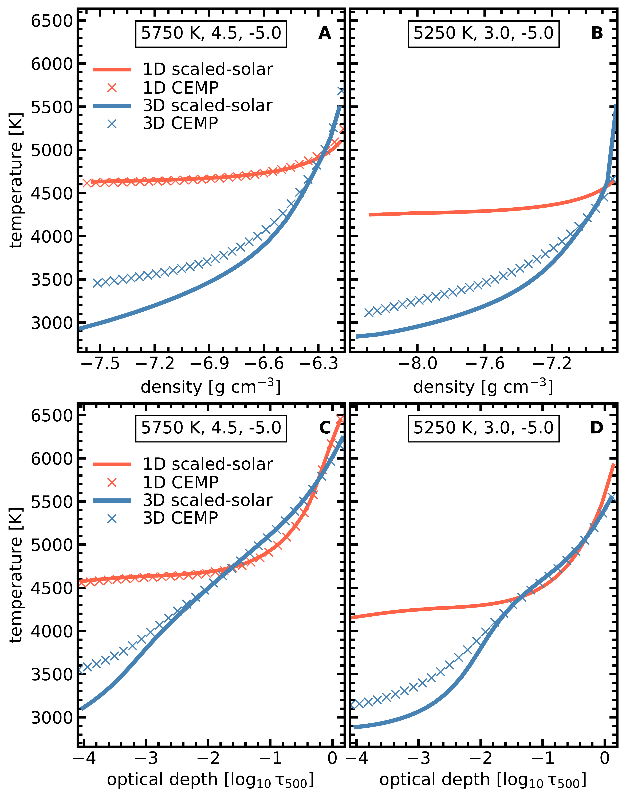
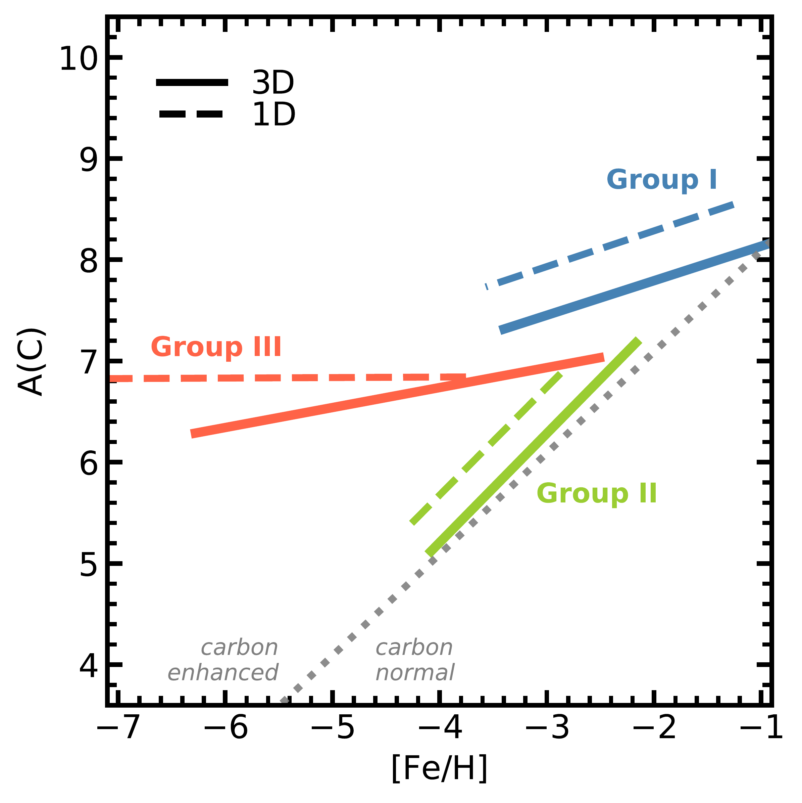
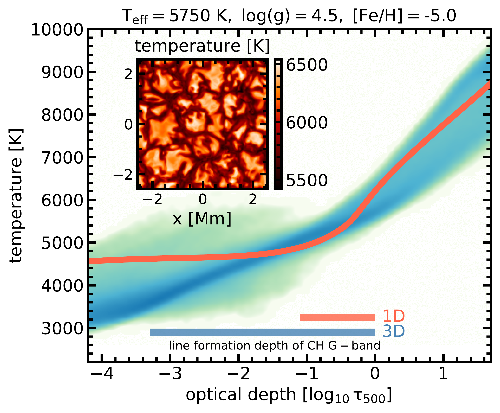
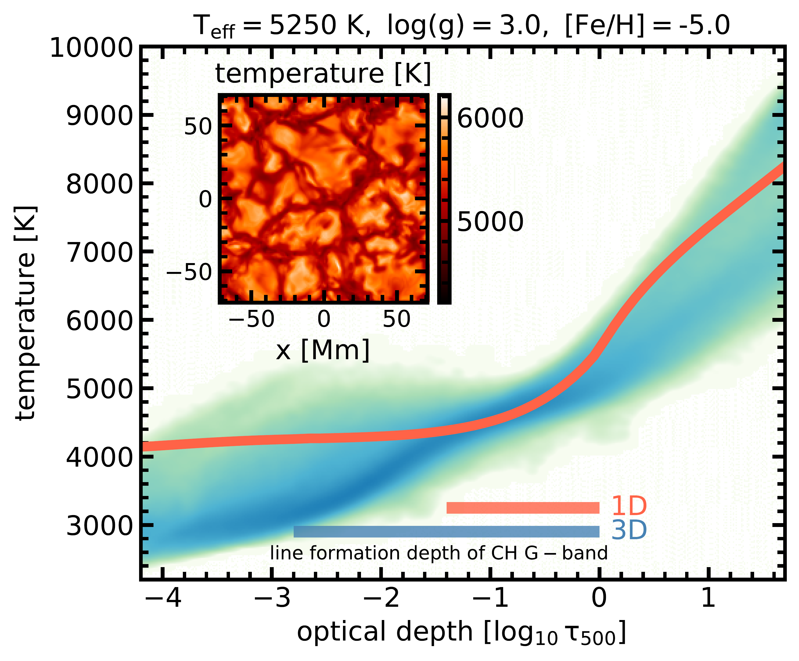

$\newcommand{\ensuremath}{}$
$\newcommand{\xspace}{}$
$\newcommand{\object}[1]{\texttt{#1}}$
$\newcommand{\farcs}{{.}''}$
$\newcommand{\farcm}{{.}'}$
$\newcommand{\arcsec}{''}$
$\newcommand{\arcmin}{'}$
$\newcommand{\ion}[2]{#1#2}$
$\newcommand{\textsc}[1]{\textrm{#1}}$
$\newcommand{\hl}[1]{\textrm{#1}}$
$\newcommand{\footnote}[1]{}$
$\newcommand{\uproman}[1]{\uppercase\expandafter{\romannumeral#1}}$
$\newcommand{\ur}[1]{\uproman{#1}}$
$\newcommand{\kms}{km s^{-1}}$
$\newcommand{\ha}{\ensuremath{{\rm H_{\alpha}}}}$
$\newcommand{\hb}{\ensuremath{{\rm H_{\beta}}}}$
$\newcommand{\der}{{\rm d}}$
$\newcommand{\feh}{{\rm[Fe/H]}}$
$\newcommand{\afe}{{\rm[\rm \alpha/Fe]}}$
$\newcommand{\teff}{\rm T_{eff}}$
$\newcommand{\logg}{\rm \log{g}}$
$\newcommand{\vmic}{\rm v_{mic}}$
$\newcommand{\vbrd}{\rm v_{brd}}$
$\newcommand{\dnlte}{\rm \Delta_{NLTE}}$
$\newcommand{\chem}[2]{\rm ^{#2}#1}$
$\newcommand{\tross}{\rm \tau_{ross}}$
$\newcommand{\ltross}{\rm \log \tau_{ross}}$
$\newcommand{\mA}{{\rm mÅ}}$
$\newcommand{\Elow}{E_{\rm low}}$
$\newcommand{\Eup}{E_{\rm up}}$
$\newcommand{\SH}{S\!_{\rm H}}$
$\newcommand{\opd}{\log \tau_{\rm 5000}}$
$\newcommand{\lin}{ \lambda}$
$\newcommand{\tda}{\langle{\rm 3D}\rangle}$
$\newcommand{\multitd}{MULTI3D}$
$\newcommand{\dis}{\texttt{DISPATCH} }$
$\newcommand{\medis}{\texttt{M3DIS}}$
$\newcommand{\logtr}{\log{\tau_{\rm ross}}}$
$\newcommand{\iso}[2]{\rm ^{#2} #1 }$
$\newcommand{\PEremark}[1]{\textcolor{red}{#1 /PE.}}$
$\newcommand{\MBremark}[1]{\textcolor{red}{#1 /MB.}}$
$\newcommand{\RHremark}[1]{\textcolor{red}{#1 /RH.}}$
$\newcommand{\ANremark}[1]{\textcolor{red}{#1 /{Å}N.}}$
$\newcommand{\BPremark}[1]{\textcolor{red}{#1 /BP.}}$
$\newcommand{\JKremark}[1]{\textcolor{red}{#1 /JK.}}$
$\newcommand{\APremark}[1]{\textcolor{red}{#1 /AP.}}$
$\newcommand{\added}[1]{\ifhighlight\textbf{#1}\else#1\fi}$
$\newcommand{\mb}[1]{\ifhighlight\textbf{\textcolor{magenta}{#1}}\else#1\fi}$
$\newcommand{\revisedPE}[1]{\ifhighlight\textbf{\textcolor{green}{#1}}\else#1\fi}$
$\newcommand{\addedPE}[1]{\ifhighlight\textbf{\textcolor{blue}{#1}}\else#1\fi}$
$\newcommand{\arraystretch}{1.2}$

# M3DIS - A grid of 3D radiation-hydrodynamics stellar atmosphere models for stellar surveys.: II. Carbon-enhanced metal-poor stars${\thanks{All \medis 3D RHD CEMP models are available under \url{https://nlte.mpia.de}}}$

<mark>Appeared on: 2025-09-30</mark> -  _16 pages, 13 figures, accepted by A&A_

<mark>P. Eitner</mark>, et al. -- incl., <mark>M. Bergemann</mark>, <mark>R. Hoppe</mark>, <mark>N. Storm</mark>

**Abstract:**            Understanding the origin and evolution of carbon-enhanced metal-poor (CEMP) stars is key to tracing the Galaxy's early chemical enrichment. We investigate how realistic 3D radiation-hydrodynamics (RHD) model atmospheres affect carbon abundances in CEMP stars and implications for their classification and Galactic chemical evolution (GCE). We focus on biases from traditional 1D hydrostatic models. We use the M3DIS code to compute 3D RHD model atmospheres for main-sequence and sub-giant stars over a wide range of metallicities and carbon enhancements. Synthetic spectra of the CH G-band are calculated with 3D radiative transfer and compared to spectra from classical 1D MARCS models. We derive abundance corrections and apply them to a large SAGA database sample to quantify effects on the carbon abundance distribution and CEMP classification. Our new 3D CEMP models predict cooler upper atmospheric layers than in 1D models, resulting in stronger CH absorption and lower inferred carbon abundances by up to -0.9 dex at the lowest metallicities. Carbon enhancement in the atmosphere itself increases molecular opacities and leads to radiative re-heating, partly offsetting adiabatic cooling in 3D models and reducing 3D-1D abundance corrections. Applying these corrections lowers the CEMP fraction by up to 20% below [Fe/H]=-3 and alters the relative contribution of CEMP sub-classes. The fraction of CEMP-no stars increases while the number of CEMP-r/s stars decreases, due to the downward revision of absolute carbon abundances. These changes bring the Galactic carbon distribution into better agreement with GCE models assuming a 20% contribution from faint supernovae. Realistic model atmospheres are essential to reliably reconstruct the Galaxy's early chemical enrichment history.         

**Figure 1. -** Comparison of the mean temperature stratification between 1D scaled-solar MARCS (red solid lines), 3D scaled-solar (blue solid lines), and 3D CEMP (blue crosses) models against mean density (top) and optical depth at $\rm 500 nm$(bottom). Left: MS model. Right: sub-giant model. For the MS model in the left panels we furthermore include a CEMP MARCS model (provided by B. Plez, priv. conv., shown with red crosses) (*fig:ttau_ttho*)

**Figure 5. -** Yoon-Beers \citep{Yoon2016} diagram, A(C) against [Fe/H] for the 3D-corrected measurements for Galactic stars from the literature (see text). The grey dotted line represents the dividing CEMP classification abundance of $\rm[C/Fe]=0.7$. Coloured lines show the major axis of the ellipse representing the distribution of different CEMP groups. In 1D (dashed lines), ellipses are drawn similar to \cite{Yoon2016}, their Fig. 1. In 3D (solid lines) ellipses are obtained from fitting a Gaussian mixture model to the data. (*fig:yoon-beers*)

**Figure 11. -** Comparison of mean temperature stratification between the \texttt{DISPATCH} 3D CEMP model and the 1D MARCS model on the optical depth scale. Left: $\rm T_{eff} = 5750 K, log(g)=4.5$, Right: $\rm T_{eff} = 5250 K, log(g)=3.0$. Horizontal bars at the bottom correspond to the approximate formation region of the G-band in 1D and 3D. (*fig:average_profiles*)

