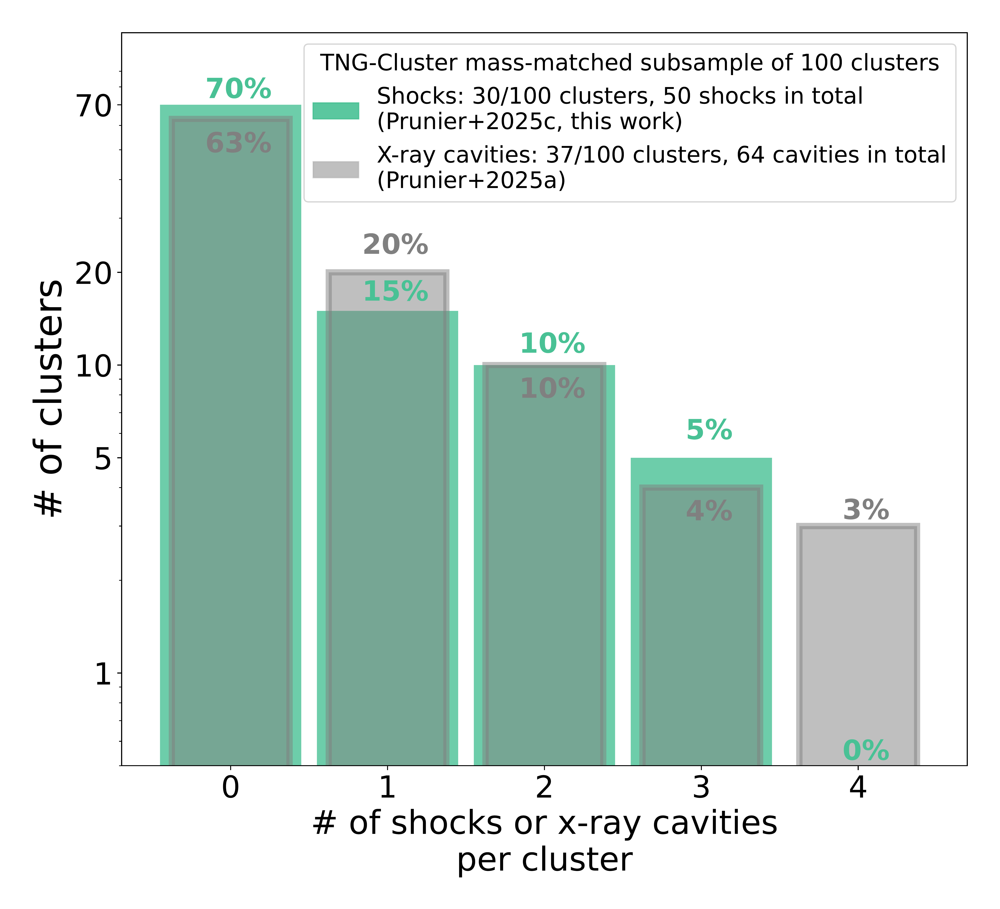
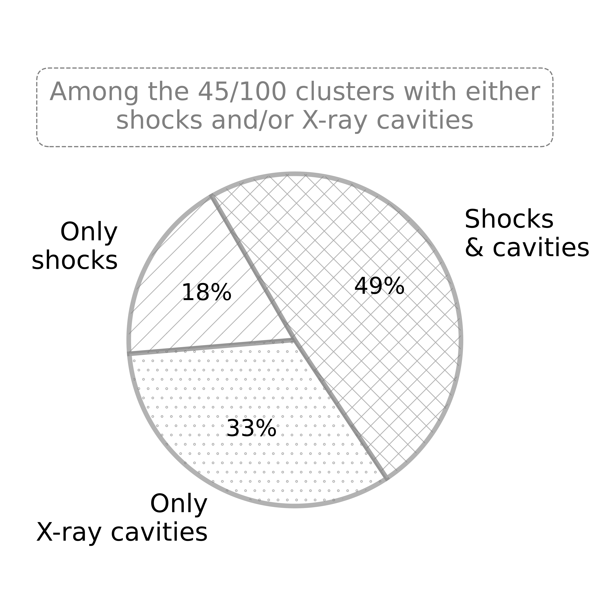

$\newcommand{\ensuremath}{}$
$\newcommand{\xspace}{}$
$\newcommand{\object}[1]{\texttt{#1}}$
$\newcommand{\farcs}{{.}''}$
$\newcommand{\farcm}{{.}'}$
$\newcommand{\arcsec}{''}$
$\newcommand{\arcmin}{'}$
$\newcommand{\ion}[2]{#1#2}$
$\newcommand{\textsc}[1]{\textrm{#1}}$
$\newcommand{\hl}[1]{\textrm{#1}}$
$\newcommand{\footnote}[1]{}$
$\newcommand{\msun}{ M_{\odot}}$
$\newcommand{\kpc}{{\rm kpc}}$
$\newcommand\francesco{#1}$
$\newcommand\julie{#1}$
$\newcommand\annalisa{#1}$

# ${X-ray shocks in the cool cores of galaxy clusters: insights from TNG-Cluster}$

<mark>Appeared on: 2025-10-01</mark> -  _Accepted to MNRAS. The data of the TNG-Cluster simulation is now fully public and accessible at this URL this https URL_

M. Prunier, F. Ubertosi, J. Hlavacek-Larrondo, <mark>A. Pillepich</mark>

**Abstract:** Shock fronts driven by active galactic nuclei in galaxy cluster cores represent a promising mechanism to heat the intracluster gas by converting kinetic energy into thermal energy through gas compression, thereby offsetting radiative cooling. Despite their potential importance, such shocks are challenging to detect, requiring deep X-ray exposures, and have only been identified in ${ten massive clusters}$ . We present the first systematic detection and characterization of AGN-driven shocks in simulated clusters from the TNG-Cluster magnetohydrodynamic cosmological zoom-in simulations of galaxies. TNG-Cluster exhibits a rich variety of spatially-resolved X-ray structures, including realistic populations of X-ray cavities, as well as shocks, ${produced by its AGN feedback model, without collimated, relativistic jets, nor cosmic rays.}$ We produce mock _Chandra_ observations with deep, 600-ks exposure times, for a selected sample of 100 clusters, mass-matched (M $_\text{500c}=1.2$ - $8.5 \times 10^{14}$ M $_\odot$ ) to the ten observed clusters with shocks. Using observational techniques, we identify shocks through surface brightness edges fitted with broken power laws and associated density and temperature jumps. We detect 50 shocks in 30 of the 100 clusters, with $\sim$ 35 per cent hosting multiple shocks. These shocks typically lie within a hundred kiloparsec of the central SMBH, are weak (Mach number $<$ 2, median $\sim$ 1.1), and ${are associated with X-ray cavities in about half of the cases.}$ Both in observations and in TNG-Cluster, shocks tend to be located at larger radii than cavities, with median offsets of 46 kpc and 27 kpc, respectively. The observationally inferred shock powers are comparable to the cluster cooling luminosities (10 $^{44-46}$ erg s $^{-1}$ ), suggesting that shocks in the simulation are a crucial heating mechanism. Our results ${indicate}$ that shocks play a role as important as cavities in balancing cooling in cluster cores, acting isotropically and up to larger distances.

**Figure 6. -** Gallery of {simulated galaxy clusters from TNG-Cluster} exhibiting X-ray shocks. Mock _Chandra_ surface brightness images of the central $200\times200$ kpc region of six selected clusters in TNG-Cluster, alongside images processed with unsharp masking or Gaussian gradient magnitude filters to highlight the shock fronts. Images are centered on the AGN position. White dashed arrows mark identified shock fronts, while the green arrow points the specific shock for which we show, in Fig. \ref{fig:panel_shocks_fit_temp_jump}, the surface brightness profile and associated temperature jump. The gallery illustrates the diversity of AGN-driven shocks in TNG-Cluster cores, including features located at cavity edges or at larger radii, and exhibiting a range of morphologies, from arc-like fronts with varying opening angles to complete ellipses. (*fig:panel_shocks*)

**Figure 8. -** Demographics of clusters with and without identified shocks and X-ray cavities in the TNG-Cluster subsample of 100 clusters (at snapshot 99). _Left:_ Distribution of the number of shocks (mint green) or X-ray cavities (gray) per cluster, showing the percentage of clusters with none, one, two, three, or four detected features. _Right:_ Among the 45 clusters with at least one identified shock or cavity, the fraction hosting only shocks, only cavities, or both. Shocks are detected in 30 out of the 100 clusters in our subsample, indicating that they are {reasonably} common features in simulated clusters. While shocks frequently appear in clusters that also host X-ray cavities, about 18\% of the detected shocks are found in clusters where no cavities were previously identified in Prunier2025a. (*fig:panel*)

**Figure 10. -** _Left:_ Total shock (P$_\text{shock,tot}$) and X-ray cavity power (P$_\text{cav,tot}$) vs. cooling luminosity (L$_\text{cool}$, for a cooling radius of 7.7 Gyr) for the 45 clusters with either identified shock or X-ray cavities (or both) in the TNG-Cluster sample (mint green circle, respectively, blue square markers) and the observational sample (values from the literature see Table \ref{tab:shocks}). Each point represents the sum of shocks or X-ray cavities in the considered system. The dashed gray diagonal marks the 1:1 correlation between power and cooling luminosity. The side histograms display the distribution of each quantity, with the median. _Right:_ Total power from the summed shock(s) and X-ray cavity(ies) vs. cooling luminosity for each of the 22 clusters hosting both, and for the observational sample (triangle). In the TNG-Cluster sample, the distributions of shock and cavity power are similar and generally comparable to the cooling luminosity. For clusters with both features, the total power typically exceeds L$_\text{cool}$ by a factor of 1 to 10, which is lower than in most observed systems (10 to 100 $\times$ L$_\text{cool}$).  (*fig:pcav_pshock_lcool*)

