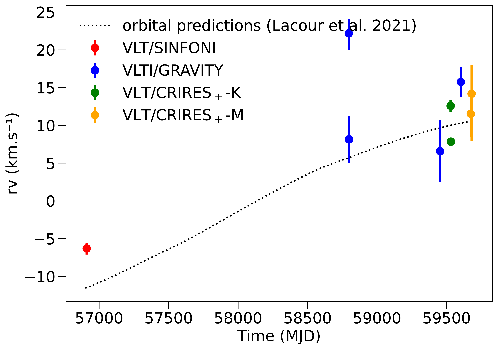
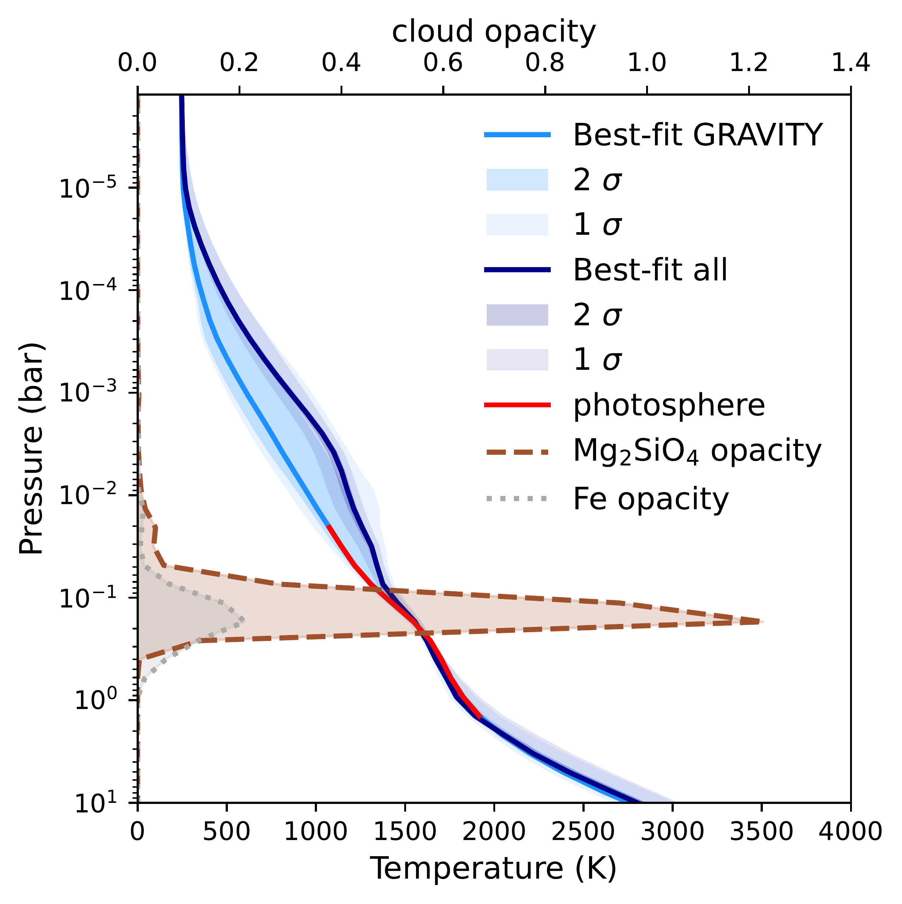

$\newcommand{\ensuremath}{}$
$\newcommand{\xspace}{}$
$\newcommand{\object}[1]{\texttt{#1}}$
$\newcommand{\farcs}{{.}''}$
$\newcommand{\farcm}{{.}'}$
$\newcommand{\arcsec}{''}$
$\newcommand{\arcmin}{'}$
$\newcommand{\ion}[2]{#1#2}$
$\newcommand{\textsc}[1]{\textrm{#1}}$
$\newcommand{\hl}[1]{\textrm{#1}}$
$\newcommand{\footnote}[1]{}$
$\newcommand{\Rjup}{\ensuremath{\mathrm{R_{Jup}}}\xspace}$
$\newcommand{\MJup}{\ensuremath{\mathrm{M_{Jup}}}\xspace}$
$\newcommand{\Teff}{\ensuremath{\mathrm{T_{eff}}}\xspace}$
$\newcommand{\Mjup}{\MJup}$
$\newcommand{\Msun}{\ensuremath{\mathrm{M_{\odot}}}}$
$\newcommand{\kms}{km/s\xspace}$
$\newcommand{\um}{\upmum\xspace}$
$\newcommand{\Mdot}{\ensuremath{\dot{\textrm{M}}}}$
$\newcommand{\arraystretch}{1.5}$
$\newcommand{\arraystretch}{1.5}$
$\newcommand{\arraystretch}{1.5}$
$\newcommand{\arraystretch}{1.5}$
$\newcommand{\arraystretch}{1.5}$
$\newcommand{\arraystretch}{1.5}$
$\newcommand{\arraystretch}{1.5}$
$\newcommand{\arraystretch}{1}$
$\newcommand{\arraystretch}{1.5}$
$\newcommand{\arraystretch}{1.5}$
$\newcommand{\arraystretch}{1.5}$
$\newcommand{\arraystretch}{1.5}$

# Multi-modal atmospheric characterization of $\beta$ Pictoris b: Adding high-resolution continuum spectra from GRAVITY

<mark>Appeared on: 2025-10-01</mark> -  _Accepted for publication in A&A_

<mark>M. Ravet</mark>, et al. -- incl., <mark>G. Chauvin</mark>

**Abstract:** The characterization of giant exoplanets such as $\beta$ Pictoris b (hereafter $\beta$ Pic b)  is now routinely performed with multiple spectrographs and imagers  exploring different spectral bandwidths and resolutions, allowing for atmospheric retrieval of spectra with or without the conservation of the planet spectral continuum. The accounting of data multi-modality in the analysis can provide a more comprehensive determination of the planets physical and chemical properties and inform on their formation history. We present the first VLTI observations at R $_{\lambda}\sim$ 4 000 of $\beta$ Pic b, the first obtained on an exoplanet with GRAVITY at such resolution. We upgrade the forward modelling code \texttt{_ForMoSA_} to account for the data multi-modality, including low- medium- and high-resolution spectroscopy both based on direct model-data comparison and the analysis of cross-correlation signals. We use \texttt{_ForMoSA_} to refine the constraints on the atmospheric properties of the exoplanet and evaluate the sensitivity on the retrieved values to the input dataset. We obtain four high signal-to-noise (S/N $\sim$ 20) spectra of $\beta$ Pic b at K-band with GRAVITY at R $_{\lambda}\sim$ 4 000 conserving both the pseudo-continuum and the pattern of molecular absorptions. We use \texttt{_ForMoSA_} with four grids of self-consistent forward models (Exo-REM, ATMO, BT-Settl, and Sonora) exploring different $\Teff$ , log(g), metallicity,  C/O, and $^{12}$ CO/ $^{13}$ CO ratio. We then combine the GRAVITY spectra with published 1-5 µm photometry (NaCo, VisAO, NICI, SPHERE), low- to medium- resolution ( $R_{\lambda} \leq 700$ broad band, 0.9-7 µm) spectra, and echelle spectra covering narrower bandwidths ( $R_{\lambda}\sim$ 100 000, 2.1-5.2 µm). Sonora and Exo-REM are statistically preferred among all four models, regardless of the dataset used. Exo-REM predicts $\Teff$  $=1607.45^{+4.85}_{-6.20}$ K and log(g) $=4.46^{+0.02}_{-0.04}$ dex when using only the GRAVITY epochs and $\Teff$  $=1502.74^{+2.32}_{-2.14}$ K and log(g) $=4.00\pm0.01$ dex when incorporating all available datasets. The inclusion of archival data significantly affects all retrieved posteriors. Using all datasets, C/O mostly remains solar (C/O = $0.552^{+0.003}_{-0.002}$ ) while [ M/H ] reaches super-solar values (0.50 $\pm$ 0.01). We report the first tentative constrain on the isotopic ratio log( $^{12}$ CO/ $^{13}$ CO) = 1.12 $^{+0.11}_{-0.08}$ in $\beta$ Pic b's atmosphere; however, this detection remains inconclusive due to telluric residuals affecting both the GRAVITY and SINFONI data. Additionally, we estimate the bolometric luminosity as log(L/L $\mathrm{_{\odot}}$ ) = -4.01 $^{+0.04}_{-0.05}$ dex. Using a system age of 23 $\pm$ 3 Myr, this bolometric luminosity and the constraints on the dynamical mass of $\beta$ Pic b we constrain the maximum of heavy-element content of the planet to be on the order of 5 \% (20-80 $\ensuremath{\mathrm{M_{Earth}}}$ $\xspace$ ). The joint access to the pseudo-continuum and molecular lines at K-band as provided by GRAVITY have a significant impact on the retrieved metallicity, possibly owing to the collision-induced absorption driving the continuum shape of K-band. Echelle spectra do not dominate the final fit with respect to lower resolution data covering a broader portion of the spectral energy distribution and the latter keeps encapsulating more robust information on $\Teff$ . Future multi-modal framework should include a weighting scheme accounting for the bandwidth and central wavelength of the observations.

**Figure 5. -** Orbital predictions from lacour_mass_2021 (dotted line) vs. retrieved radial velocities (colored bars) for each epoch,  using forward modeling (here BT-Settl). The four GRAVITY epochs were fitted in parallel using MOSAIC,  and we can see that the observation on the 2019/11/09 is significantly shifted. (*all_rvs*)

**Figure 15. -** Results of the forward modeling of $\beta$ Pic b using the most recent spectro/photometric observations of the planet (including CRIRES$_+$) using BT-Settl. _Top panel:_ spectra (points) and photometry (squares) of $\beta$ Pic b alongside a R$_{\lambda\sim$ 4 000 spectrum extracted using the best fit parameters for the inversion. Observations have been re-normalized using the analytic scaling factors computed during the inversion. Associated residuals are shown below. Dotted lines represents the $\pm\sigma$ (68$\%$) confidence interval. _Bottom sub-panels:_ zoom versions of the top panel on GRAVITY (upper left), SINFONI (upper right), CRIRES$_+$-K (lower left) and CRIRES$_+$-M (lower right). Similarly to landman__2024, each CRIRES$_+$ spectra are shown smoothed by their retrieved broadening to show the planet features more clearly.} (*ALL_MOSAIC_CRIRES_spec*)

**Figure 3. -** Retrieved best-fit pressure-temperature profiles when using GRAVITY (light blue) and all datasets except CRIRES$_+$ (dark blue) for Exo-REM forward modeling. Shaded regions represent the 1 and 2 $\sigma$ confidence interval, respectively. They are compared with the cloud opacities of $Mg_2SiO_4$ (dashed brown) and Fe (dashed gray) defined as $d\tau=\sigma_c n dz$ with $\sigma_c$ the effective extinction cross-section of the cloud (in m$^2$), $n$ its concentration (in particles/m$^3$) and $dz$ the thickness of the atmospheric layer (in m). The red curve represents the photosphere (region from which most thermal emission originates). In practice, we used a similar approach as charnay_self-consistent_2018 and constrained the pressure-temperature between the minimum and maximum of the brightness temperature computed between 0.625 to 10 µm. (*Free_MOSAIC_PT*)

