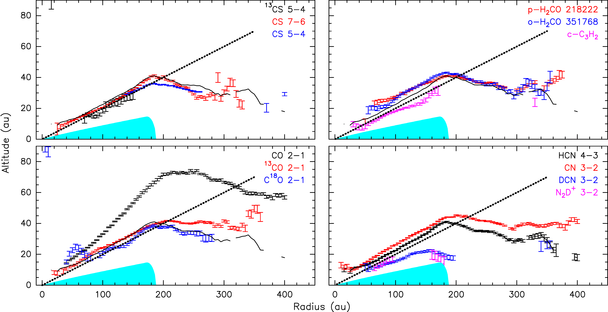
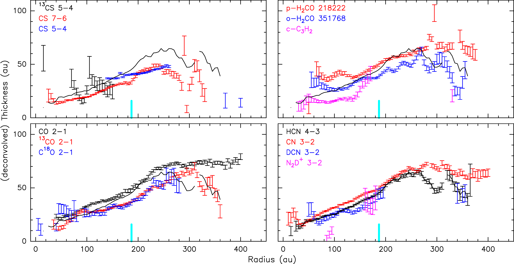
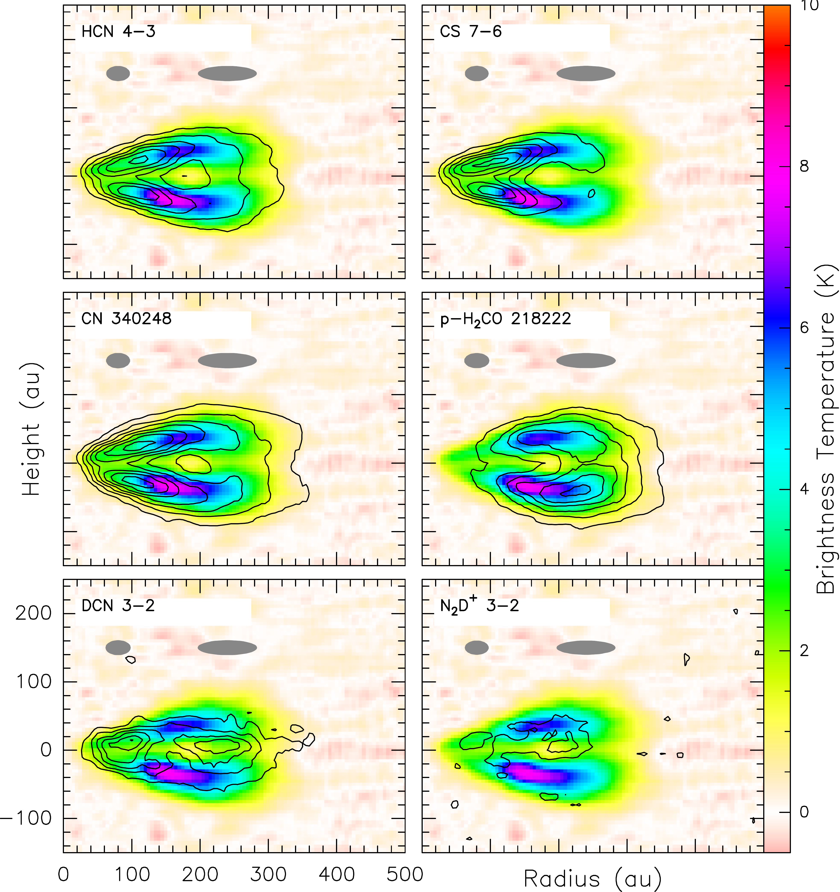
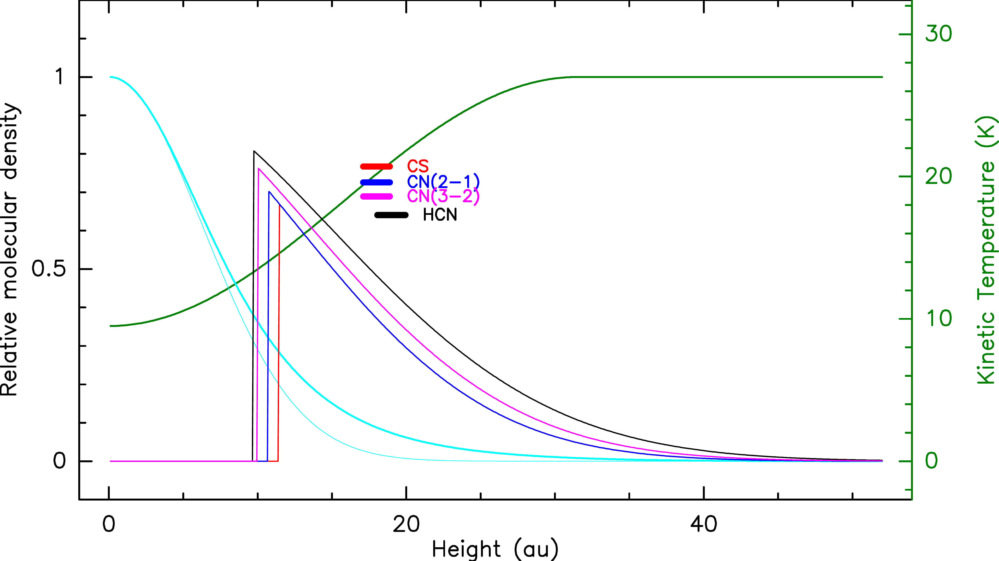

$\newcommand{\ensuremath}{}$
$\newcommand{\xspace}{}$
$\newcommand{\object}[1]{\texttt{#1}}$
$\newcommand{\farcs}{{.}''}$
$\newcommand{\farcm}{{.}'}$
$\newcommand{\arcsec}{''}$
$\newcommand{\arcmin}{'}$
$\newcommand{\ion}[2]{#1#2}$
$\newcommand{\textsc}[1]{\textrm{#1}}$
$\newcommand{\hl}[1]{\textrm{#1}}$
$\newcommand{\footnote}[1]{}$
$\newcommand{\vlsr}{v_{\rm lsr}}$
$\newcommand{\kms}{km s^{-1}}$
$\newcommand{\Lsun}{L_\odot}$
$\newcommand{\mdot}{\dot{M}}$
$\newcommand{\Msun}{ \mathrm{M}_\odot}$
$\newcommand{\Msunpyr}{\unit{M_\odot yr^{-1}}}$
$\newcommand{\coto}{\mbox{CO(2--1)}}$
$\newcommand{\cott}{\mbox{CO(3--2)}}$
$\newcommand{\tcott}{\mbox{^{13}CO(2--1)}}$
$\newcommand{\csff}{\mbox{CS(5--4)}}$
$\newcommand{\csss}{\mbox{CS(7--6)}}$
$\newcommand{\cnto}{\mbox{CN(2--1)}}$
$\newcommand{\cntt}{\mbox{CN(3--2)}}$
$\newcommand{\textsg}[1]{\textcolor{red}{SGu: #1}}$
$\newcommand{\textad}[1]{\textcolor{magenta}{ADu: #1}}$
$\newcommand{\textds}[1]{\textcolor{blue}{DS: #1}}$

# Edge-On Disk Study (EODS) III: Molecular Stratification in the Flying Saucer Disk

<mark>Appeared on: 2025-10-01</mark> - 

A. Dutrey, et al. -- incl., <mark>D. Semenov</mark>, <mark>T. Henning</mark>

**Abstract:** Investigating the vertical distribution of molecular content in protoplanetary disks remains difficult in most disks mildly inclined along the line of sight.In contrast, edge-on disks provide a direct (tomographic) view of the 2D molecular brightness. We study the radial and vertical molecular distribution as well as the gas temperature and density by observing the Keplerian edge-on disk surrounding the Flying Saucer, a Class II object located in Ophiuchus. We use new and archival ALMA data to perform a tomography of $^{12}$ CO, $^{13}$ CO, C $^{18}$ O, CN, HCN, CS, $H_2$ CO, c-$C_3$ $H_2$ , $N_2$ D $^+$ , DCN and $^{13}$ CS. We analyze molecular tomographies and model data using the radiative transfer code DiskFit . We directly measure the altitude above the mid-plane for each observed species. For the first time, we unambiguously demonstrate the presence of a common molecular layer and measure its thickness: most molecules are located at the same altitude versus radius. Beyond CO, as predicted by chemical models, the CN emission traces the upper boundary of the molecular layer, whereas the deuterated species (DCN and $N_2$ D $^+$ ) resides below one scale-height. Our best fits from DiskFit show that most observed transitions in the molecular layer are thermalized  because their excitation temperature is the same, around $\sim$ 17-20 K. These long-integration observations clearly reveal a molecular layer predominantly located around 1-2 scale height, at a temperature above the CO freeze-out temperature. The deuterated molecules are closer to the mid-plane and $N_2$ D $^+$ may be a good proxy for the CO snowline. Some molecules, such as CN and $H_2$ CO, are likely influenced by the disk environment, at least beyond the mm dust disk radius. The direct observation of the molecular stratification opens the door to detailed chemical modeling in this disk which appears representative of T Tauri disks.

**Figure 5. -** Top: Altitude $A(r)$ of the molecular layer as a function of radius. The black curve is the HCN(4-3) altitude for comparison. The cyan region indicates the
the approximate size of the dust disk. The dotted line corresponds to z/r = 0.2.
Bottom: Deconvolved thickness of the molecular layer. The deconvolution is done assuming Gaussian shapes, using the Clean beam minor axis since synthesized beams are elongated almost parallel to the disk plane. The black curve is the HCN(4-3) thickness for comparison. The cyan bar marks the edge of the dust disk. (*fig:height-tomo*)

**Figure 1. -** $^{13}$CO tomography in false color with superimposition of the tomographies, in contours, of the HCN 4-3, CS 7-6, CN at 340.348 GHz, p-$H_2$CO at 218.222 GHz, DCN 3-2 and $N_2$D$^+$ 3-2. Contours are in steps
of 1.5 K for HCN, CS, CN and p-$H_2$CO, 0.75 K for DCN, and 0.375 K for $N_2$D$^+$. The grey ellipses indicate the impact of line width on the effective beam at 80 and 240 au (*fig:tomo-super*)

**Figure 2. -** Profiles resulting from DiskFit at 100 au.
The green curve is the temperature profile, and the cyan curves indicate the $H_2$ density structure (thin: under isothermal assumption at the mid-plane temperature (10 K), thick: using the full temperature profile) that were derived from the CO analysis by [Guilloteau, Denis-Alpizar and Dutrey (2025)]().
The other colored curves are the molecular density profiles for CS (red), HCN (black), CN 2-1 (blue) and 3-2 (magenta), using parameters from Table \ref{tab:models}. The corresponding horizontal bars indicate the measured temperatures and the density weighted
 average height of the emission. (*fig:profiles*)

