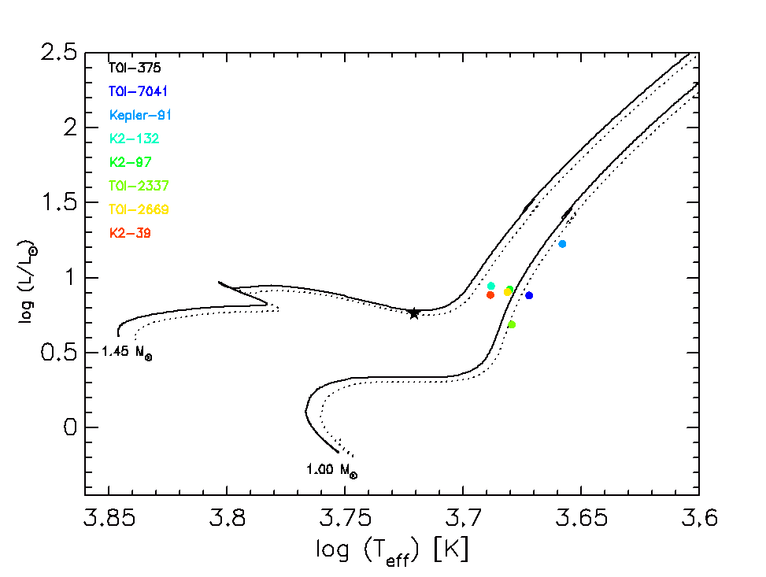
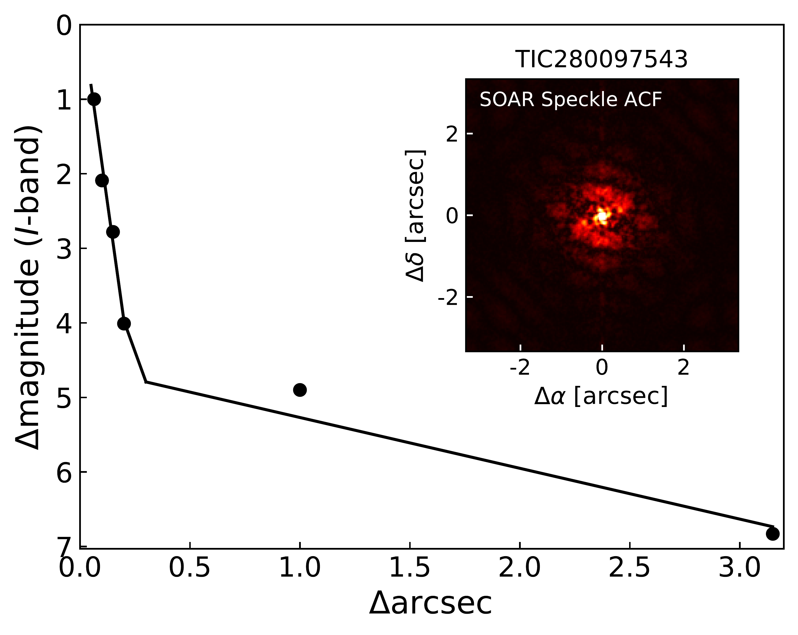

$\newcommand{\ensuremath}{}$
$\newcommand{\xspace}{}$
$\newcommand{\object}[1]{\texttt{#1}}$
$\newcommand{\farcs}{{.}''}$
$\newcommand{\farcm}{{.}'}$
$\newcommand{\arcsec}{''}$
$\newcommand{\arcmin}{'}$
$\newcommand{\ion}[2]{#1#2}$
$\newcommand{\textsc}[1]{\textrm{#1}}$
$\newcommand{\hl}[1]{\textrm{#1}}$
$\newcommand{\footnote}[1]{}$
$\newcommand{\vdag}{(v)^\dagger}$
$\newcommand$
$\newcommand$
$\newcommand{\feh}{\ensuremath{{\rm[Fe/H]}}}$
$\newcommand{\teff}{\ensuremath{T_{\rm eff}}}$
$\newcommand{\teq}{\ensuremath{T_{\rm eq}}}$
$\newcommand{\logg}{\ensuremath{\log{g}}}$
$\newcommand{\zaspe}{\textsf{ZASPE}}$
$\newcommand{\ceres}{\textsf{CERES}}$
$\newcommand{\tess}{\textit{TESS}}$
$\newcommand{\vsini}{\ensuremath{v \sin{i}}}$
$\newcommand{\kms}{\ensuremath{{\rm km s^{-1}}}}$
$\newcommand{\mjup}{\ensuremath{{\rm M_{J}}}}$
$\newcommand{\mearth}{\ensuremath{{\rm M}_{\oplus}}}$
$\newcommand{\mpl}{\ensuremath{{\rm M_p}}}$
$\newcommand{\rjup}{\ensuremath{{\rm R_J}}}$
$\newcommand{\rpl}{\ensuremath{{\rm R_P}}}$
$\newcommand{\rstar}{\ensuremath{{\rm R}_{\star}}}$
$\newcommand{\mstar}{\ensuremath{{\rm M}_{\star}}}$
$\newcommand{\lstar}{\ensuremath{{\rm L}_{\star}}}$
$\newcommand{\rsun}{\ensuremath{{\rm R}_{\odot}}}$
$\newcommand{\msun}{\ensuremath{{\rm M}_{\odot}}}$
$\newcommand{\lsun}{\ensuremath{{\rm L}_{\odot}}}$
$\newcommand{\stlum}{\ensuremath{2.33 \pm 0.11 }}$
$\newcommand{\stage}{\ensuremath{2.92_{-0.73}^{+0.80} }}$
$\newcommand{\av}{\ensuremath{0.226_{-0.058}^{+0.056} }}$
$\newcommand{\stteff}{\ensuremath{6295 \pm 77 }}$
$\newcommand{\stfeh}{\ensuremath{0.00 \pm 0.05 }}$
$\newcommand{\stlogg}{\ensuremath{4.291 \pm 0.025 }}$
$\newcommand{\stvsini}{\ensuremath{7.80 \pm 0.19 }}$
$\newcommand{\stmstan}{\ensuremath{1.170\pm0.06}}$
$\newcommand{\strstan}{\ensuremath{1.282\pm0.03}}$
$\newcommand{\per}{\ensuremath{11.23660 \pm 0.00011}}$
$\newcommand{\bb}{\ensuremath{0.723_{-0.024}^{+0.018}}}$
$\newcommand{\rr}{\ensuremath{0.0942_{-0.0012}^{+0.0010}}}$
$\newcommand{\omegapost}{\ensuremath{1.230_{-0.063}^{+0.063}}}$
$\newcommand{\ecc}{\ensuremath{0.435\pm 0.024 }}$
$\newcommand{\logm}{\ensuremath{5.973_{-0.056}^{+0.054}}}$
$\newcommand{\mptess}{\ensuremath{1.236_{-0.067}^{+0.069}}}$
$\newcommand{\rptess}{\ensuremath{0.1202 \pm 0.003 }}$
$\newcommand{\rptessrjup}{\ensuremath{1.170\pm 0.03 }}$
$\newcommand{\stm}{\ensuremath{1.181\pm 0.058 }}$
$\newcommand{\str}{\ensuremath{1.28_{-0.03}^{+0.03}}}$
$\newcommand{\aone}{\ensuremath{1.58\pm 0.19 }}$
$\newcommand{\azero}{\ensuremath{-6.4_{-8.2}^{+8.1}}}$
$\newcommand{\bone}{\ensuremath{0.0204_{-0.0040}^{+0.0039}}}$
$\newcommand{\bzero}{\ensuremath{-0.00197_{-0.00032}^{+0.00033}}}$
$\newcommand{\etaferos}{\ensuremath{13.5_{-3.1}^{+3.3}}}$
$\newcommand{\etacoralie}{\ensuremath{45.1_{-11.4}^{+12.4}}}$
$\newcommand{\etachiron}{\ensuremath{21.7_{-7.6}^{+8.0}}}$
$\newcommand{\etassmko}{\ensuremath{0.00114_{-0.00010}^{+0.00011}}}$
$\newcommand{\gammaferos}{\ensuremath{-42.8_{-8.6}^{+8.8}}}$
$\newcommand{\gammacoralie}{\ensuremath{-26.9_{-15.4}^{+14.7}}}$
$\newcommand{\gammachiron}{\ensuremath{-20.9_{-10.6}^{+10.7}}}$
$\newcommand{\gammanres}{\ensuremath{-28.5_{-11.4}^{+11.4}}}$
$\newcommand{\uone}{\ensuremath{0.50_{-0.27}^{+0.19}}}$
$\newcommand{\utwo}{\ensuremath{-0.06_{-0.23}^{+0.33}}}$
$\newcommand{\rone}{\ensuremath{0.0942_{-0.0012}^{+0.0010}}}$
$\newcommand{\rtwo}{\ensuremath{0.723_{-0.024}^{+0.018}}}$
$\newcommand{\strho}{\ensuremath{0.80_{-0.06}^{+0.06}}}$
$\newcommand{\tzero}{\ensuremath{2458547.47448_{-0.00029}^{+0.00028}}}$
$\newcommand{\sma}{\ensuremath{0.1038_{-0.0017}^{+0.0017}}}$
$\newcommand{\inc}{\ensuremath{87.63_{-0.1}^{+0.11}}}$
$\newcommand{\teqv}{\ensuremath{1252\pm 21 }}$
$\newcommand{\stnameTIC}{TIC~280206394}$
$\newcommand{\rhopl}{\ensuremath{{\rm \rho_P}}}$
$\newcommand{\rhostar}{\ensuremath{\rho_*}}$
$\newcommand{\gccm}{\ensuremath{\mathrm{g} \mathrm{cm}^{-3}}}$

# A transiting hot Jupiter with two outer siblings orbiting an intermediate-mass post main-sequence star

<mark>Appeared on: 2025-10-01</mark> -  _resubmitted without line numbers_

Y. Reinarz, et al. -- incl., <mark>T. Henning</mark>

**Abstract:** Exoplanetary systems with multiple giant planets present an opportunity to understand planet formation, migration processes, and long-term system-wide dynamical interactions. In particular, they provide constraints to distinguish between smooth disk-driven migration or more dynamically excited system evolution pathways.We report the discovery and characterization of a unique multi-planet system hosting three gas giant planets, orbiting the post-main sequence star TOI-375. The innermost planet, TOI-375 b, was initially detected by the _TESS_ mission, and then confirmed with photometric follow-up observations conducted using _MEarth_ and _LCOGT_ , and radial velocity measurements obtained with _FEROS_ and _CHIRON_ . The radial velocity data revealed the presence of two additional planetary candidates, TOI-375 c and TOI-375 d. We find that TOI-375 b is a hot Jupiter with an orbital period of $\ensuremath{9.45469 \pm 0.00002}$ days, mass $\ensuremath{0.745 \pm 0.053 M_\mathrm{J}}$ , radius $\ensuremath{0.961 \pm 0.043 R_\mathrm{J}}$ , and eccentricity $\ensuremath{0.087 \pm 0.042}$ . The outer two planets, TOI-375 c and TOI-375 d, are warm-cold and cold Jupiters with orbital periods of $\ensuremath{115.5^{+2.0}_{-1.6}}$ days and $\ensuremath{297.9^{+28.9}_{-18.6}}$ days, and minimum masses of $\ensuremath{2.11 \pm 0.22 M_\mathrm{J}}$ and $\ensuremath{1.40 \pm 0.28 M_\mathrm{J}}$ , respectively.In terms of formation and overall system architecture, the physical properties of TOI-375 b are consistent with the core accretion scenario, while the current configuration of the system could be explained by both disk-driven and high-eccentricity migration scenarios. The discovery of TOI-375 as the first known system hosting three or more fully evolved gas giants, with at least one transiting planet, makes it an excellent candidate for testing formation and migration theories.

**Figure 1. -** Position of TOI-375 in the HR diagram (black star), using the stellar parameters derived here (see Table 3). For comparison, the position of known giant stars hosting transiting giant planets are overplotted. Two different \textsf{PARSEC} models  (parsec)  for 1.0 and 1.45 $\msun$, are overplotted. The solid and dotted lines correspond to Z$_\star$=0.017 and 0.020, respectively. (*fig:HR_diagram*)

**Figure 4. -** In green, we show the Phase-folded light curves from each instrument (or sector in the case of _TESS_) with the best-fit transit model for TOI-375 b derived using \textsf{juliet}. In blue, we show the potential single transit event of one of the outer planets on _TESS_ sector 2. Data points are shown in their original time sampling (small green or blue points) and binned in phase with 6-minute intervals (white markers). The solid black line represents the best-fit transit model. We do not include the transit of TOI-375 c in the final model as there is not enough evidence to support it is from true planetary origin. (*fig:transit_models*)

**Figure 2. -** Speckle autocorrelation function for TOI-375, obtained with the _SOAR_ telescope. The black dots represent the $5\sigma$ contrast curve, and the solid line shows a linear fit to the data at separations smaller and larger than $\sim 0.2$ arcseconds. (*fig:soar*)

