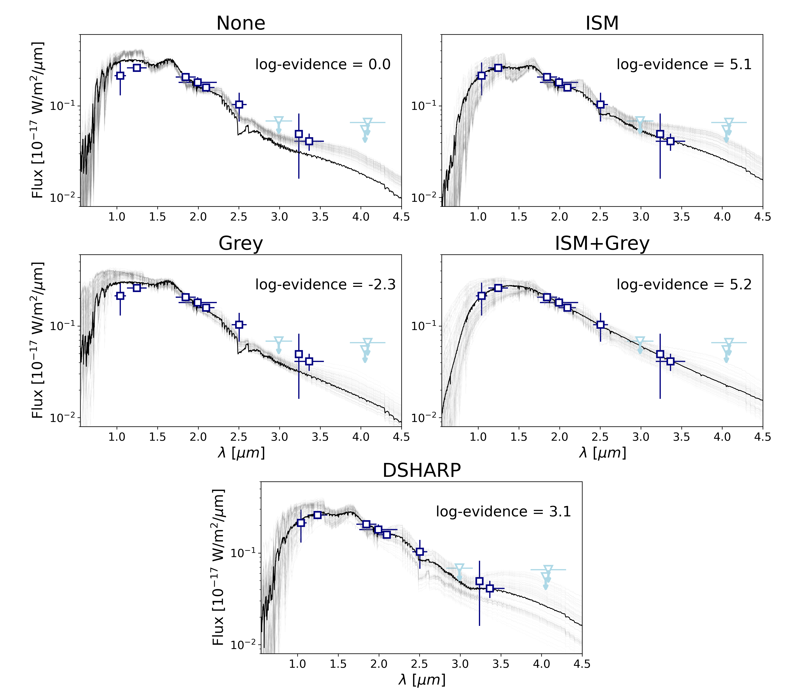
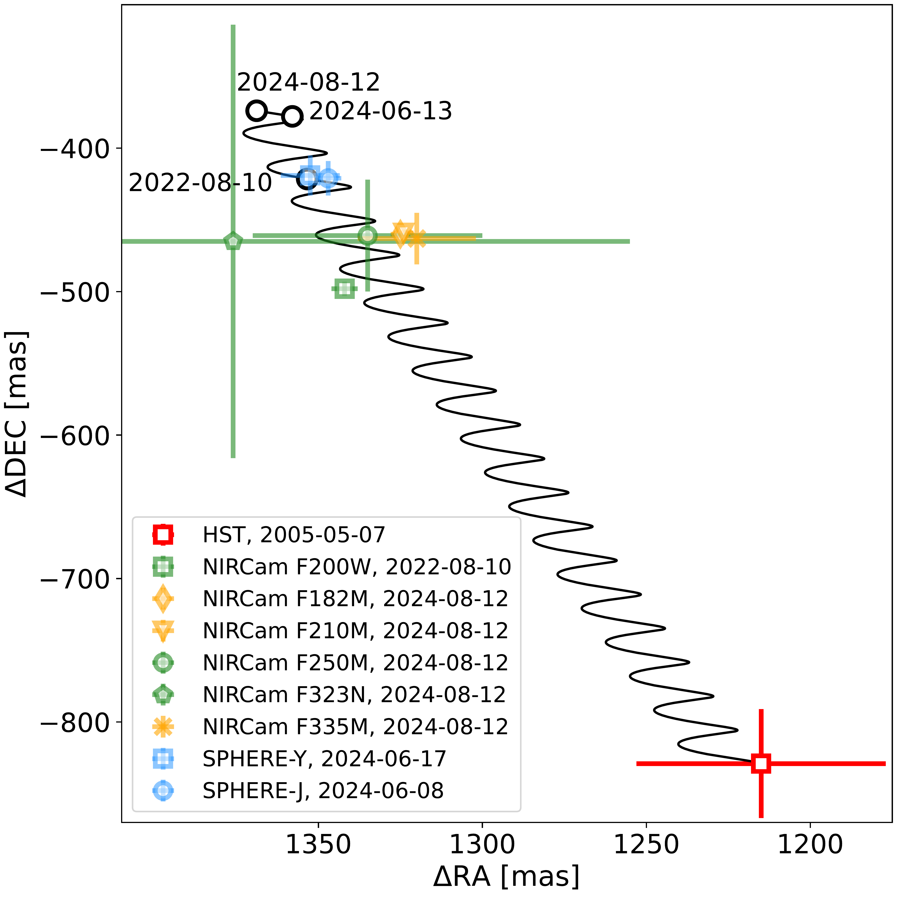
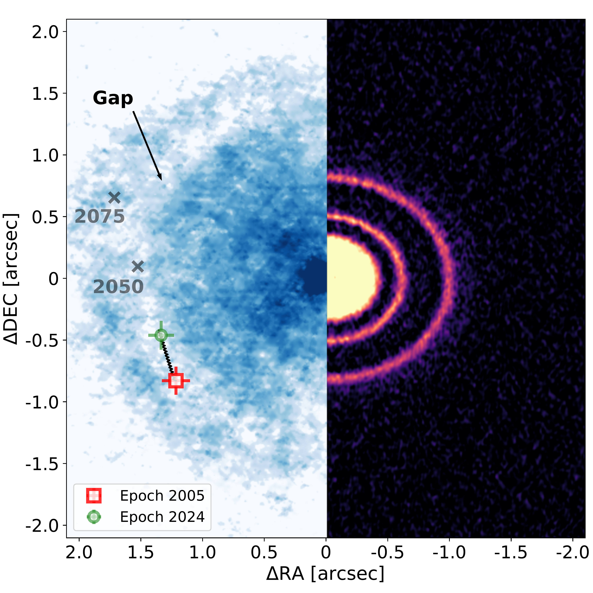
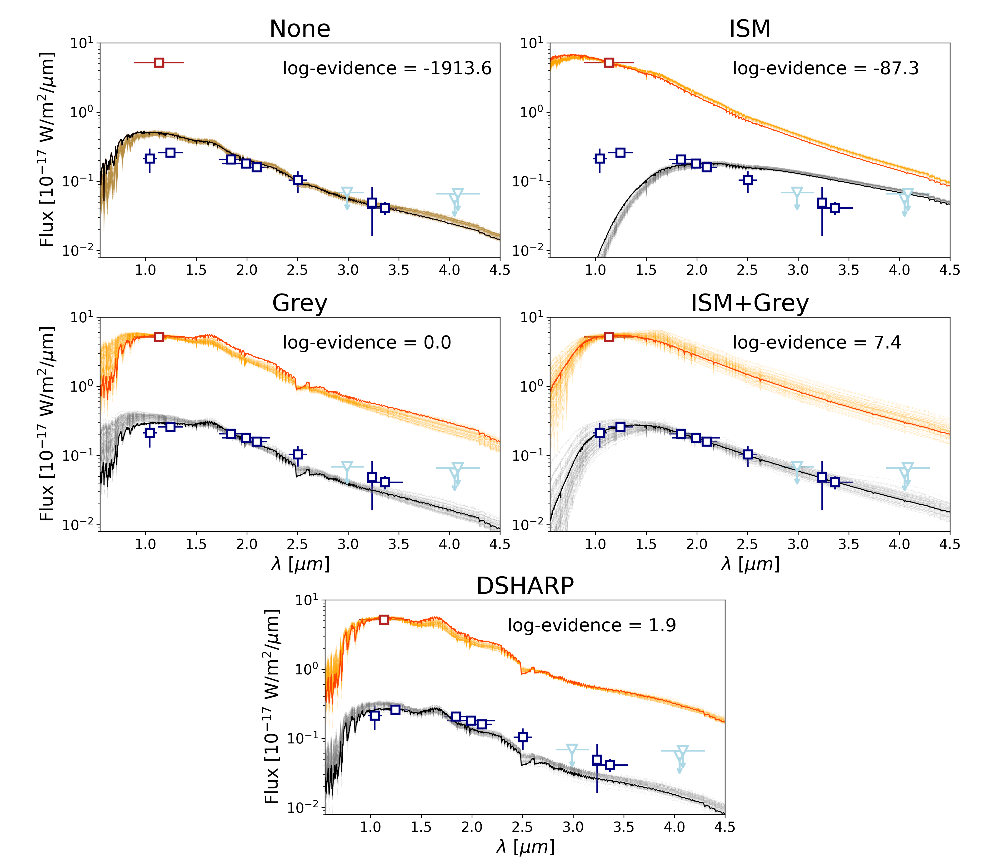

$\newcommand{\ensuremath}{}$
$\newcommand{\xspace}{}$
$\newcommand{\object}[1]{\texttt{#1}}$
$\newcommand{\farcs}{{.}''}$
$\newcommand{\farcm}{{.}'}$
$\newcommand{\arcsec}{''}$
$\newcommand{\arcmin}{'}$
$\newcommand{\ion}[2]{#1#2}$
$\newcommand{\textsc}[1]{\textrm{#1}}$
$\newcommand{\hl}[1]{\textrm{#1}}$
$\newcommand{\footnote}[1]{}$
$\newcommand{\vdag}{(v)^\dagger}$
$\newcommand$
$\newcommand$
$\newcommand{\todo}[1]{\textcolor{red}{#1}}$
$\newcommand{\Michael}[1]{\textcolor{violet}{#1}}$
$\newcommand{\final}[1]{\textcolor{green}{#1}}$
$\newcommand{\irchi}[2]{\raisebox{\depth}{#1\chi}}$
$\newcommand{\Lsun}{L_\odot}$
$\newcommand{\Msun}{M_\odot}$
$\newcommand{\MJ}{M_\mathrm{J}}$
$\newcommand{\Mp}{M_\mathrm{p}}$
$\newcommand{\Macc}{\dot{M}_\mathrm{acc}}$
$\newcommand{\RJ}{R_\mathrm{J}}$
$\newcommand{\Rp}{R_\mathrm{p}}$
$\newcommand{\Teff}{T_{\text{eff}}}$
$\newcommand{\MJyr}{\MJ \mathrm{yr}^{-1}}$
$\newcommand{\Rd}{R_\mathrm{dust}}$
$\newcommand{\Rcav}{R_\mathrm{cav}}$
$\newcommand{\Rout}{R_\mathrm{out}}$
$\newcommand{\Rg}{R_\mathrm{gas}}$
$\newcommand{\micron}{\mu\mathrm{m}}$
$\newcommand{\Lacc}{L_\mathrm{acc}}$
$\newcommand{\LHa}{L_\mathrm{H\alpha}}$
$\newcommand{\FHa}{F_\mathrm{H\alpha}}$
$\newcommand{\AHa}{A_\mathrm{H\alpha}}$
$\newcommand{\Av}{A_\mathrm{V}}$
$\newcommand{\MaccAv}{\overline{\dot{M}_\mathrm{acc}}}$
$\newcommand{\chisquared}{\rchi^2}$
$\newcommand{\chimrs}{\rchi^2_\mathrm{MRS}}$
$\newcommand{\arraystretch}{1.25}$
$\newcommand{\arraystretch}{1.25}$
$\newcommand{\arraystretch}{1.25}$
$\newcommand{\arraystretch}{1.5}$
$\newcommand{\arraystretch}{1.5}$

# Direct Measurement of Extinction in a Planet-Hosting Gap

<mark>Appeared on: 2025-10-01</mark> -  _Accepted for publication in AJ. 22 pages, 10 figures, 5 tables_

G. Cugno, et al. -- incl., <mark>M. Benisty</mark>

**Abstract:** Recent disk observations have revealed multiple indirect signatures of forming gas giant planets, but high-contrast imaging has rarely confirmed the presence of the suspected perturbers.Here, we exploit a unique opportunity provided by the background star AS 209bkg, which shines through a wide annular gap in the AS 209 disk, to perform transmission spectrophotometry and directly measure the extinction from gap material for the first time.By combining new VLT/SPHERE and JWST/NIRCam observations with archival HST data from 2005, we model the spectral energy distribution (SED) of AS 209bkg over a 19-year baseline. We find that the SED and its variability are best explained by increasing extinction along the line of sight as AS 209bkg approaches the gap edge in projection. The extinction is best described by a combination of ISM-like extinction component and a grey extinction component. This points to the presence of grains in the disk outer gap that are larger than in the ISM.We find that the extinction in the gap at $\lambda\sim4.0 \mu$ m is $A_{4 \mu\mathrm{m}} = 2.7^{+0.7}_{-0.7}$ mag, while at H $\alpha$ ( $\lambda=0.656 \mu$ m), where most searches for accretion signatures take place, the extinction could be as high as $A_\mathrm{H\alpha} = 4.2^{+0.9}_{-1.2}$ mag ( $A_V=4.6^{+1.0}_{-1.3}$ ). This suggests that even wide, deep gaps can significantly obscure emission from protoplanets, even those following a hot-start evolutionary model. Our extinction measurements help reconcile the discrepancy between ALMA-based predictions of planet-disk interactions and the non-detections from sensitive optical and near-infrared imaging campaigns.

**Figure 8. -** SED fits for AS 209bkg using multiple extinction models. In each panel, the observed fluxes are reported in blue squares, while detection limits are shown in light blue arrows. The F300M detection limits, potentially impacted by the $3.0 \mu$m water-ice band, is shown for completeness but is not used in the fit. The best fit model is shown with a black line, while 100 random samples drawn by the posterior distribution are shown in grey. The log-evidence with respect to the `None' scenario (top left) is reported in each panel. (*fig:spectra_all*)

**Figure 7. -** Astrometry of the AS 209 system. _ Left:_ Proper motion analysis of AS 209bkg. The red square represent the location of the source in 2005. The black line shows the expected trajectory from 2005 through 2024 assuming it is a stationary object, with the expected locations at the SPHERE and NIRCam epochs highlighted with black circles. The NIRCam and SPHERE data agree with the prediction (when considering the HST uncertainties), demonstrating that the source is indeed a background object. _ Right:_ Projected location of AS 209bkg in the AS 209 disk. On the right side, the millimeter image is reported, showcasing a series of dust rings  ([Andrews, Huang and Pérez 2018]()) . On the left side, the CO gas as measured by the DSHARP program  ([Andrews, Huang and Pérez 2018](), [Guzmán, Huang and Andrews 2018]())  is reported. AS 209bkg shines through the deep outer CO gap. Grey crosses mark the expected position of AS 209bkg in 2050 and 2075.  (*fig:proper_motion*)

**Figure 9. -** Same as Fig. \ref{fig:spectra_all}, with the addition of the red square representing the 2005 HST detection, and orange lines that represent the random sample and best-fit model for the 2005 epoch. In this case, the `Grey' model is used to benchmark the Bayesian log-evidences (*fig:spectra_ep2005*)

