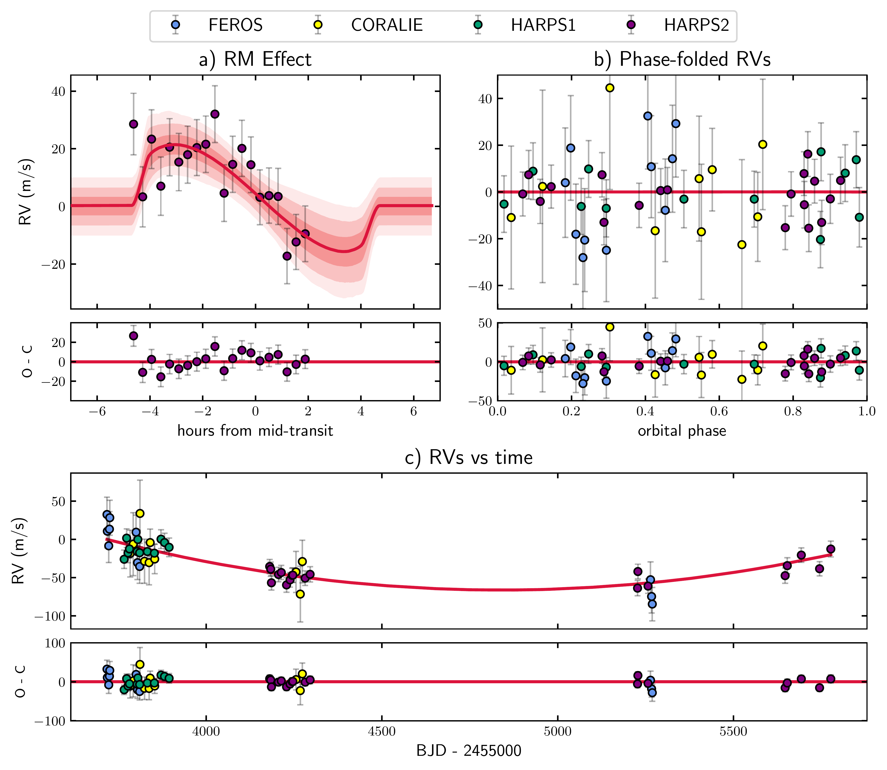
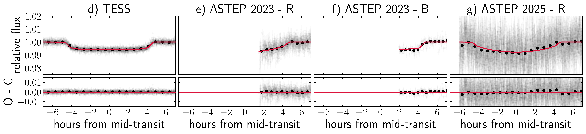
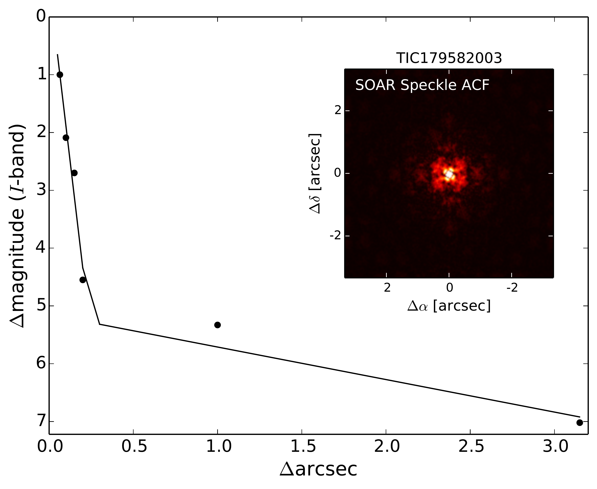
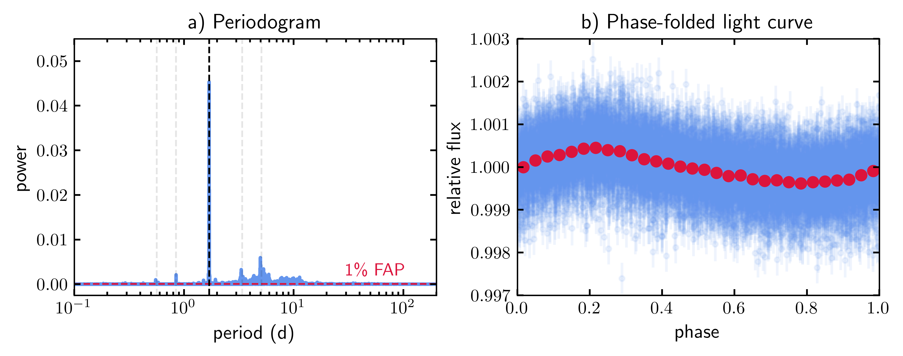

$\newcommand{\ensuremath}{}$
$\newcommand{\xspace}{}$
$\newcommand{\object}[1]{\texttt{#1}}$
$\newcommand{\farcs}{{.}''}$
$\newcommand{\farcm}{{.}'}$
$\newcommand{\arcsec}{''}$
$\newcommand{\arcmin}{'}$
$\newcommand{\ion}[2]{#1#2}$
$\newcommand{\textsc}[1]{\textrm{#1}}$
$\newcommand{\hl}[1]{\textrm{#1}}$
$\newcommand{\footnote}[1]{}$
$\newcommand{\vdag}{(v)^\dagger}$
$\newcommand$
$\newcommand$
$\newcommand{\red}{\color{red}}$

# A Cold and Super-Puffy Planet on a Polar Orbit

<mark>Appeared on: 2025-10-02</mark> -  _16 pages, 4 figures, submitted to AAS journals_

J. I. Espinoza-Retamal, et al. -- incl., <mark>T. Henning</mark>, <mark>J. Eberhardt</mark>

**Abstract:** We report the discovery of TOI-4507 b, a transiting sub-Saturn with a density $<$ 0.3 g/cm $^3$ on a 105-day polar orbit around a 700 Myr old F star. The transits were detected using datafrom TESS as well as the Antarctic telescope ASTEP. A joint analysis of the light curves and radial velocities from HARPS, FEROS, and CORALIE confirmed the planetary nature of the signal by limitingthe mass to be below $30 M_\oplus$ at 95 \% confidence. The radial velocities alsoexhibit the Rossiter-McLaughlin effectand imply that the star's equatorial planeis tiltedby $82.0_{-2.4}^{+2.6}$ deg with respect to the planet'sorbital plane. With these characteristics, TOI-4507 bis one of longest-period planets forwhich the stellar obliquity has been measured,and is among the longest-period and youngest "super-puff" planetsyet discovered.

**Figure 2. -** Different observations of TOI-4507 along with the best model. All error bars include a white noise jitter term applied in quadrature to the RV and photometric data points. a) ESPRESSO observations of the RM effect. We show the best model as the red line, and the $1\sigma$, $2\sigma$, and $3\sigma$ models as the shaded areas. b) Phase-folded out-of-transit RVs along with the best model. c) RVs as a function of time showing the long-term trend detected at $5\sigma$. d-g) Different light curves along with the best model. Binned data are shown as solid black points.
    The data used to create this figure are available as the data behind the figure.  (*fig:TOI-4507*)

**Figure 1. -** High-resolution imaging observations of TOI-4507 taken with the 4.1 m SOAR telescope. We show the $5\sigma$ detection sensitivity and speckle autocorrelation functions. No companions to TOI-4507 within $3^{\prime\prime}$ are found in these observations. (*fig:soar*)

**Figure 3. -** a) Lomb-Scargle periodogram of the 2-min cadence TESS light curve of TOI-4507. A false alarm probability (FAP) level of 1\% is marked with a red dashed line. The black dashed line marks the highest-power peak, indicating the most likely stellar rotation period of 1.7 days. Aliases of this period are also shown as faint black dashed lines. b) TESS light curve phased to the rotational period of 1.7 days. All the work done here made use of the 2-min cadence light curve, but for illustrative purposes only, the 30-min cadence TESS light curve is shown here in blue, with binned data in red.
    The amplitude of the seen variability is $\sim500$ ppm. (*fig:Prot*)

