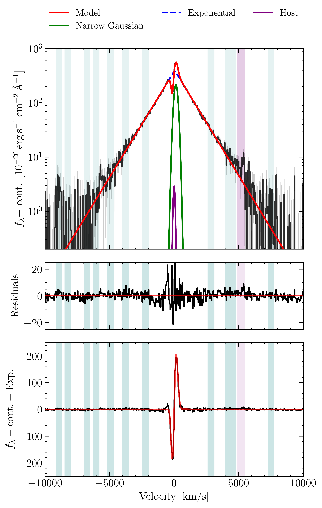
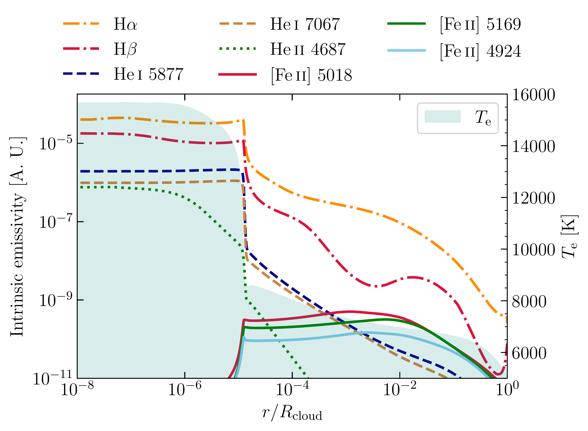
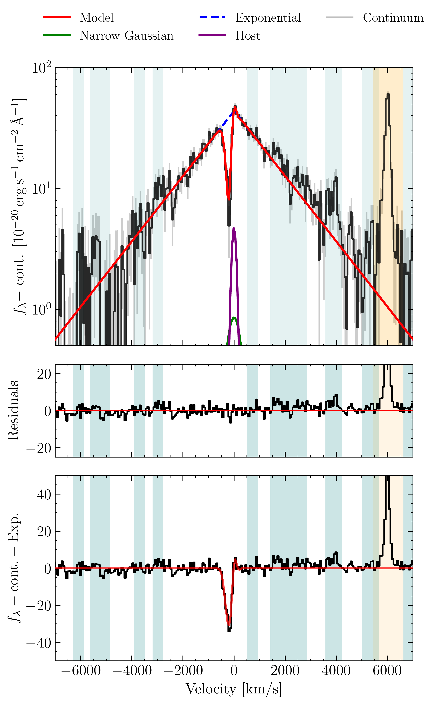

$\newcommand{\ensuremath}{}$
$\newcommand{\xspace}{}$
$\newcommand{\object}[1]{\texttt{#1}}$
$\newcommand{\farcs}{{.}''}$
$\newcommand{\farcm}{{.}'}$
$\newcommand{\arcsec}{''}$
$\newcommand{\arcmin}{'}$
$\newcommand{\ion}[2]{#1#2}$
$\newcommand{\textsc}[1]{\textrm{#1}}$
$\newcommand{\hl}[1]{\textrm{#1}}$
$\newcommand{\footnote}[1]{}$
$\newcommand{\lya}{{\text{Ly}\ensuremath{\alpha}}}$
$\newcommand{\Halpha}{{\text{H}\ensuremath{\alpha}}}$
$\newcommand{\Hbeta}{{\text{H}\ensuremath{\beta}}}$
$\newcommand{\Hgamma}{{\text{H}\ensuremath{\gamma}}}$
$\newcommand{\oiii}{{\text{[\ion{O}{iii}]}}}$
$\newcommand{\niv}{{\text{\ion{N}{iv}]}}}$
$\newcommand{\feii}{{\text{\ion{Fe}{ii}}}}$
$\newcommand{\fesclya}{\ensuremath{f_{\rm esc}(\lya )}}$
$\newcommand{\fesclyc}{\ensuremath{f_{\rm esc}(\rm LyC)}}$
$\newcommand{\fcov}{\ensuremath{f_{\rm cov}}}$
$\newcommand{\jwst}{{JWST}}$
$\newcommand{\nircam}{NIRCam}$
$\newcommand{\muse}{MUSE}$
$\newcommand{\flambdaunits}{\ensuremath{\rm erg s^{-1} cm^{-2} {Å }^{-1}}}$
$\newcommand{\contblue}{{\it cont. blue}}$
$\newcommand{\contred}{{\it cont. red}}$
$\newcommand{\Hden}{\ensuremath{n_{\rm H}}}$
$\newcommand{\NH}{\ensuremath{N_{\rm H}}}$
$\newcommand{\NHI}{\ensuremath{N_{\rm \ion{H}{i}}}}$
$\newcommand{\eden}{\ensuremath{n_{\rm e}}}$
$\newcommand{\Ne}{\ensuremath{N_{\rm e}}}$
$\newcommand{\Te}{\ensuremath{T_{\rm e}}}$
$\newcommand{\logten}{\ensuremath{\log_{10}}}$
$\newcommand{\vturb}{\ensuremath{v_{\rm turb}}}$
$\newcommand{\logU}{\ensuremath{\logten U}}$
$\newcommand{\attnote}[1]{{\color{mycolor}[AT: #1]}}$

# The warm outer layer of a Little Red Dot as the source of [$\feii$ ] and collisional Balmer lines with scattering wings

<mark>Appeared on: 2025-10-02</mark> -  _18 pages incl. references. Main figure: 4 ([Fe II] model). To be submitted to A&A. Comments welcome_

A. Torralba, et al. -- incl., <mark>A. d. Graaff</mark>

**Abstract:** The population of the Little Red Dots (LRDs) may represent a key phase of supermassive black hole (SMBH) growth. A cocoon of dense excited gas is emerging as key component to explain the most striking properties of LRDs, such as strong Balmer breaks and Balmer absorption, as well as the weak IR emission. To dissect the structure of LRDs, we analyze new deep JWST/NIRSpec PRISM and G395H spectra of FRESCO-GN-9771, one of the most luminous known LRDs at $z=5.5$ . These reveal a strong Balmer break, broad Balmer lines and very narrow [ O ${\sc iii}$ ] emission. We unveil a forest of optical [ Fe ${\sc ii}$ ] lines, which we argue is emerging from a dense ( $n_{\rm H}=10^{9-10}$ cm $^{-3}$ ) warm layer with electron temperature $T_{\rm e}\approx7000$ K. The broad wings of H $\alpha$ and H $\beta$ have an exponential profile due to electron scattering in this same layer. The high $\rm H\alpha:H\beta:H\gamma$ flux ratio of $\approx10.4:1:0.14$ is an indicator of collisional excitation and resonant scattering dominating the Balmer line emission. A narrow H $\gamma$ component, unseen in the other two Balmer lines due to outshining by the broad components, could trace the ISM of a normal host galaxy with a star formation rate $\sim5$ M $_{\odot}$ yr $^{-1}$ . The warm layer is mostly opaque to Balmer transitions, producing a characteristic P-Cygni profile in the line centers suggesting outflowing motions. This same layer is responsible for shaping the Balmer break. The broad-band spectrum can be reasonably matched by a simple photoionized slab model that dominates the $\lambda>1500$ ${Å}$ continuum and a low mass ( $\sim10^8$ M $_{\odot}$ ) galaxy that could explain the narrow [ O ${\sc iii}$ ] , with only subdominant contribution to the UV continuum. Our findings indicate that Balmer lines are not directly tracing gas kinematics near the SMBH and that the BH mass scale is likely much lower than virial indicators suggest.

**Figure 1. -** ** Triangular P-Cygni H$\pmb\alpha$ spectrum of GN-9771.** The continuum-subtracted H$\alpha$ spectrum based on the G395H data is shown in black, whereas the red line shows the best-fit combined model. Residuals to the model are shown in the middle panel.
    The fiducial fitting model is described in Sect. \ref{sec:balmer_O3}.
    We indicate the masked regions based on the locations of possible narrow [$\feii$] emission in [Véron-Cetty, Joly and Véron (2004)]()(teal) and $\ion${He}{i}$\lambda$6680 (purple). The [$\ion${N}{ii}] component is not shown due to its relative flux being negligible. The bottom panel shows the $\Halpha$  spectrum and best-fit after subtracting the exponential component to highlight the P-Cygni profile. (*fig:Ha_line_fit*)

**Figure 8. -** ** Where do lines originate from?** The intrinsic emissivity of selected emission lines in the photoionized Cloudy model, for $\Hden = 10^{10}$ \unit{cm^{-3}}, and $\NH = 10^{25}$ \unit{cm^{-2}}. Emissivities are expressed in arbitrary units of energy per unit time per unit volume. The ionization parameter is $\logU = -3$. The Hydrogen Balmer and Helium lines are intrinsically strong in the inner layers due to recombination emission, although the opacity of $\Halpha$  and $\Hbeta$  is high leading to scattering effects. [$\feii$] is mostly emitted in a warm layer with $\Te=6000$--7500 K, which is shielded from the far-UV ionizing radiation. (*fig:BHS_line_emissivities*)

**Figure 2. -** {** The H$\pmb\beta$  spectrum of GN-9771**. A similar model set-up was used as for H$\alpha$ described in Fig. \ref{fig:Ha_line_fit}}. Teal regions highlight that are masked due to possible $\feii$  emission. The orange region indicates the masked $\oiii$  wavelengths. The bottom panel shows the $\Hbeta$  spectrum and best fit (red) after subtracting the exponential component to highlight the P-Cygni profile. Figure \ref{fig:Hb_fit_fixed_exp} shows a version of the same fit with the exponential scale fixed to that fitted for $\Halpha$ . (*fig:Hb_line_fit*)

