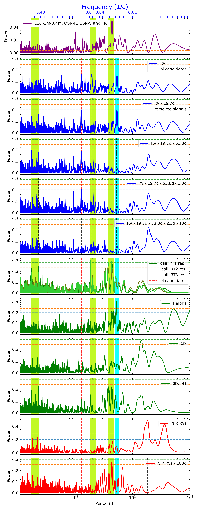
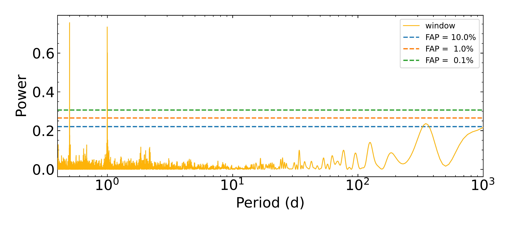
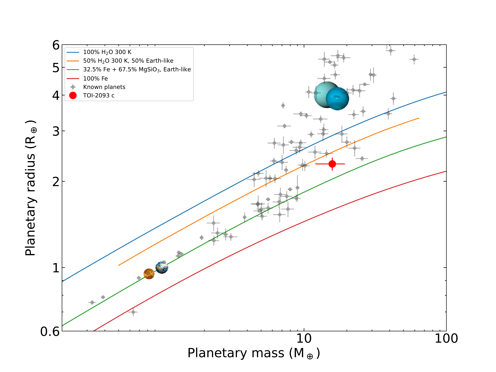
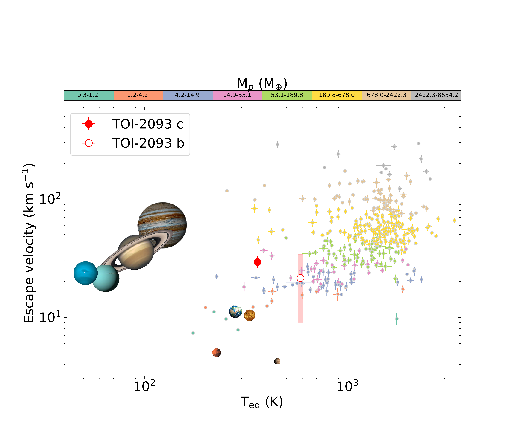

$\newcommand{\ensuremath}{}$
$\newcommand{\xspace}{}$
$\newcommand{\object}[1]{\texttt{#1}}$
$\newcommand{\farcs}{{.}''}$
$\newcommand{\farcm}{{.}'}$
$\newcommand{\arcsec}{''}$
$\newcommand{\arcmin}{'}$
$\newcommand{\ion}[2]{#1#2}$
$\newcommand{\textsc}[1]{\textrm{#1}}$
$\newcommand{\hl}[1]{\textrm{#1}}$
$\newcommand{\footnote}[1]{}$
$\newcommand{\arraystretch}{1.2}$
$\newcommand{\arraystretch}{1.}$
$\newcommand{\arraystretch}{1.3}$
$\newcommand{\arraystretch}{1.}$
$\newcommand{\arraystretch}{1.2}$
$\newcommand{\arraystretch}{1.}$
$\newcommand{\arraystretch}{1.3}$
$\newcommand{\arraystretch}{1.}$
$\newcommand{\arraystretch}{1.3}$
$\newcommand{\arraystretch}{1.}$
$\newcommand\natexlab{#1}$

# A planetary system with a sub-Neptune planet \ in the habitable zone of TOI-2093

<mark>Appeared on: 2025-10-02</mark> -  _Accepted by A&A. 12 pages, 7 figures, 5 tables in the main body (20 pages, 19 figures, 9 tables including appendices)_

J. Sanz-Forcada, et al. -- incl., <mark>T. Henning</mark>

**Abstract:**            Aims. We aim to confirm and measure the mass of the transiting planet candidate around the K5V star TOI-2093, previously announced by the Transiting Exoplanet Survey Satellite (TESS) project. Methods. We combined photometric data from 32 sectors between 2019 and 2024 with 86 radial velocity measurements obtained with the CARMENES spectrograph over a period of 2.4 years, along with a series of ground-based, broadband photometric monitoring campaigns to characterize the host star and the transiting planet candidate, as well as to search for additional planets in the system. Our data indicate that TOI-2093 is a main-sequence star located at a distance of 83 pc, with solar metallicity, and a rotation period of 43.8 +- 1.8 d. Results. We have confirmed the planetary nature of the TESS transiting planet candidate, named TOI-2093 c, through the detection of its Keplerian signal in the spectroscopic data. We measured a planetary radius of 2.30 +- 0.12 Rearth, a Neptune-like mass of 15.8 +- 3.7 Mearth, and an orbital period of 53.81149 +- 0.00017 d. This makes TOI-2093 c the smallest exoplanet known in the habitable zone of a main-sequence FGK star. Given its size and relatively high density, TOI-2093 c belongs to a class of planets with no analog in the Solar System. In addition, the CARMENES data revealed the presence of a second planet candidate with a minimum mass of 10.6 +- 2.5 Mearth and an orbital period of 12.836 +- 0.021 d. This inner planet, which we designated TOI-2093 b, shows no detectable photometric transit in the TESS light curves. The orbital planes of the two planets are misaligned by more than 1.6 deg despite the near 4:1 mean-motion resonance of their orbital periods.         

**Figure 1. -** GLS periodograms of all photometric and spectroscopic data. Vertical dashed lines mark planetary orbital periods (transiting planet on a cyan band), and vertical green bands indicate stellar activity timescales (see text). Horizontal dashed lines show FAP levels (0.1 \% in green, 1 \% in orange, and 10 \% in blue) across all panels. (*fig:glsgeneral*)

**Figure 8. -** Window function of TOI-2093 CARMENES VIS RV data. (*fig:window_carmenes_vis*)

**Figure 14. -** TOI 2093 c in the context of exoplanets with known mass and radius with errors smaller than 12\%. * Left panel:* Planetary mass and radius, with theoretical models from \citet{zen16}(see Sect. \ref{sec:TOI-2093 planetary system}). * Right panel:* Escape velocity against equilibrium temperature (planetary data from the NASA exoplanets database).
 TOI 2093 b is included assuming $i_{\rm b} \gtrsim 50◦$,
      with the planet radius calculated for a bulk density between 0.5 and 10 g cm$^{-3}$, with errors shown as a red band. (*fig:diagramaMR*)

