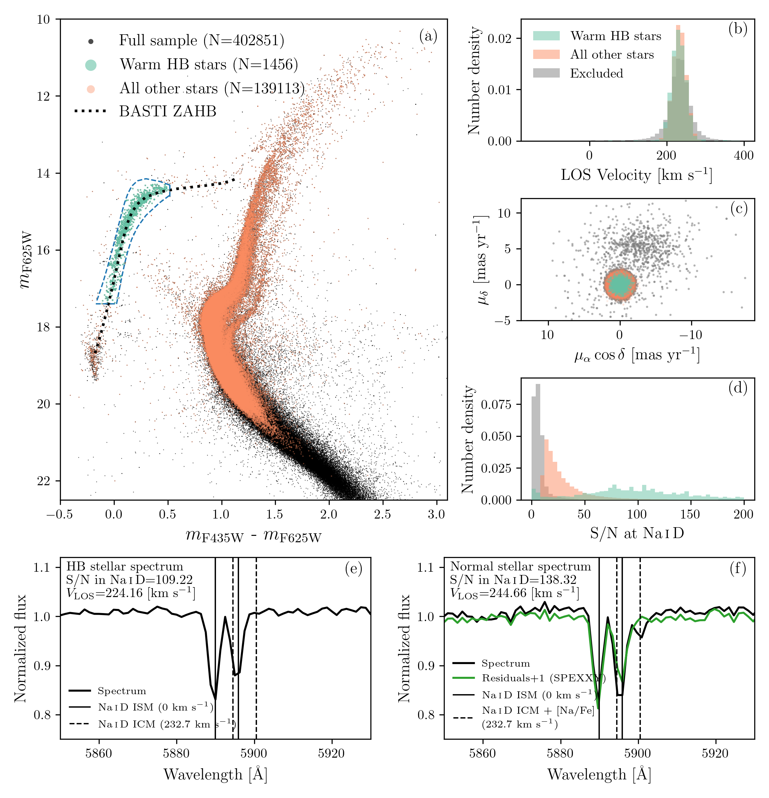
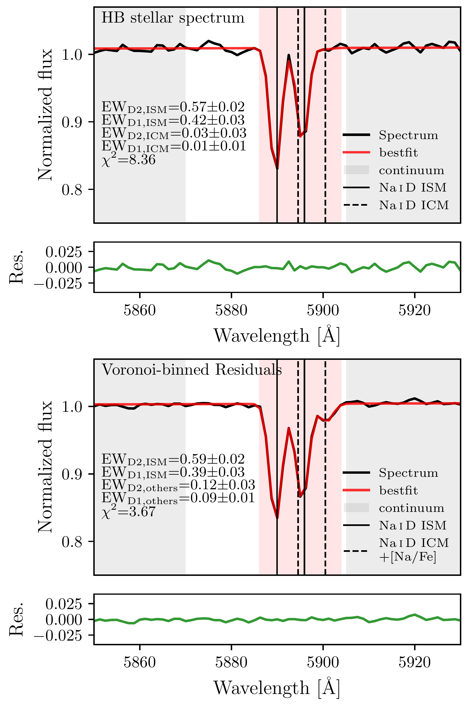
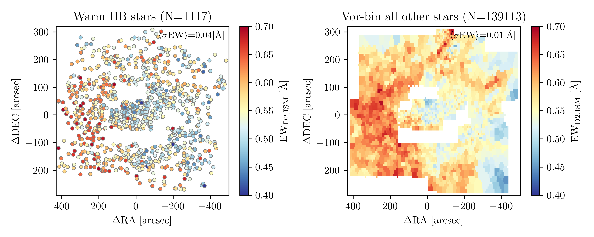

$\newcommand{\ensuremath}{}$
$\newcommand{\xspace}{}$
$\newcommand{\object}[1]{\texttt{#1}}$
$\newcommand{\farcs}{{.}''}$
$\newcommand{\farcm}{{.}'}$
$\newcommand{\arcsec}{''}$
$\newcommand{\arcmin}{'}$
$\newcommand{\ion}[2]{#1#2}$
$\newcommand{\textsc}[1]{\textrm{#1}}$
$\newcommand{\hl}[1]{\textrm{#1}}$
$\newcommand{\footnote}[1]{}$
$\newcommand{\vdag}{(v)^\dagger}$
$\newcommand$
$\newcommand$
$\newcommand{\omc}{\omega Cen}$
$\newcommand{\ebv}{\ensuremath{E(B-V)}}$
$\newcommand{\nad}{\ensuremath{\mathrm{Na \textsc{i} D}}}$
$\newcommand{\nadtwo}{\ensuremath{\mathrm{Na \textsc{i} D_2}}}$
$\newcommand{\nadone}{\ensuremath{\mathrm{Na \textsc{i} D_1}}}$
$\newcommand{\snrnad}{\rm{S/N_{\ensuremath{\mathrm{Na \textsc{i} D}}}}}$
$\newcommand{\ewismdtwo}{\rm{EW}_{\rm{D2, ISM}}}$
$\newcommand{\ewismdone}{\rm{EW}_{\rm{D1, ISM}}}$
$\newcommand{\ewicmdtwo}{\rm{EW}_{\rm{D2, ICM}}}$
$\newcommand{\ewicmdone}{\rm{EW}_{\rm{D1, ICM}}}$
$\newcommand{\ewicmdoneul}{\rm{EW}_{\rm{D1, ICM}}^{\rm{upper}}}$
$\newcommand{\vlos}{V_{\rm LOS}}$
$\newcommand{\teff}{\ensuremath{T_{\mathrm{eff}}}}$
$\newcommand{\maspyr}{\rm{mas}~\rm{yr}^{-1}}$
$\newcommand{\perpixel}{\text{pix}^{-1}}$
$\newcommand{\maxperyr}{\rm{mas}~\rm{yr}^{-1}}$
$\newcommand{\angstrom}{\mbox{\normalfontÅ}}$
$\newcommand{\kms}{\rm{km~s^{-1}}}$

# oMEGACat. VII. Tracing Interstellar and Intracluster Medium of $\omega$ Centauri using Sodium Absorptions

<mark>Appeared on: 2025-10-02</mark> -  _23 pages, 11 figures, and 2 tables, accepted by ApJ. Machine-readable data is available in the online article_

Z. Wang (王梓先), et al. -- incl., <mark>M. Häberle</mark>, <mark>N. Neumayer</mark>, <mark>C. Clontz</mark>

**Abstract:** We investigate the foreground interstellar medium along the line of sight and intracluster medium of $\omega$ Centauri ( $\omc$ ) by measuring the equivalent width of $\nad$ absorptions from MUSE observations.The large line-of-sight velocity difference between $\omc$ and the foreground enables us to separate $\nad$ absorption contributed from atomic gas in the interstellar and intracluster medium.We find that small-scale substructures in the foreground $\nad$ distribution correlate with differential reddening derived from photometric methods.Using an empirical $\nad$ equivalent width-reddening relation, we determine an average reddening of $E(B-V)=0.153\pm0.003$ mag within the half-light radius of $\omc$ .However, the $\nad$ -inferred differential reddening is significantly larger than photometric estimates. This is likely due to scatter in the $\nad$ -reddening relation.We find no evidence for intracluster atomic gas from spectra of horizontal branch stars, as there is no significant $\nad$ absorption at $\omc$ 's systemic velocity.Given this non-detection, we place the strongest upper limit to date on the intracluster atomic gas column density in $\omc$ of $\lesssim2.17 \times 10^{18} \rm{cm^{-2}}$ .We also estimate the ionized gas density from pulsar dispersion measure variations, which exceed the atomic gas limit by $\sim$ 50 times.Nevertheless, the strong correlation between dispersion measure and foreground $\nad$ suggests that much or all of this ionized gas resides in the foreground.Given ongoing mass loss from bright giant stars, our findings imply that the intracluster gas accumulation timescale is short, and gas removal in the cluster is likely not tied to stripping as $\omc$ passes through the Galactic disk.

**Figure 8. -** 
Data sample used in this study.
**Panel (a):** CMD of the data sample in Section \ref{subsec:data-muse-hst} using \citetalias{2010ApJ...710.1032A} photometry.
The blue region defines the selection of warm HB stars.
The black dotted line shows the ZAHB track from the BaSTI model (see Section \ref{subsubsec:data-target-selection-hb} for details).
**Panel (b):**$\vlos$  distribution of the warm HB stars and all other stars. The gray histogram indicates stars excluded based on the selection criteria for the two samples.
**Panel (c):** Proper motion distribution of the same samples, with colors corresponding to panel (b).
**Panel (d):** Re-estimated S/N distribution in the $\nad$  region.
**Panel (e) and (f):** Example MUSE spectra (black line) of warm HB and all other stars, with the S/N and $\vlos$  indicated in the top left corner.
The green lines show the residuals between the observed spectra and the best-fit SPEXXY model from \citetalias{2023ApJ...958....8N}.
Vertical lines are the positions of the $\nad$  absorptions from foreground (solid, located at 0 $\kms$) and intracluster (dashed, at 232.7 $\kms$) atomic gas of $\omc$ .
An additional contribution from the stellar photosphere, seen as the right-most absorption feature, is present in panel (f).
 (*fig:samplefig*)

**Figure 2. -** 
    Demonstration of spectral fitting to measure the EWs of $\nad$ , as described in Section \ref{subsec:methods-ew}.
    The top panel shows an example spectrum of a warm HB star, while the bottom panel shows a Voronoi-binned residual spectrum from all other stars.
    The equivalent widths (EWs) of the $\nad$  lines, in units of Å , are labeled in each panel.
    The red-shaded region indicates the wavelength range used for fitting.
    The gray-shaded regions are used to estimate the continuum ($f_{c}$) in Eq. \ref{eqn:nad-fit}.
    Fitting residuals are shown in green as a separate sub-panel.
    The warm HB spectrum is expected to have minimal photospheric contribution to $\nad$  and thus we name them as "ISM" and "ICM".
    For all other stars that are mostly cooler, contamination from the stellar photosphere could remain in the SPEXXY residuals.
    Therefore, we label the absorptions at $\omc$  systemic velocity as "others".
    Note that the D2 line is at a shorter wavelength than the D1 line for both the ISM and ICM/others components.
     (*fig:fitting-example*)

**Figure 9. -** 
    Spatial distribution of $\ewismdtwo$  from the foreground Na atomic gas.
    The left panel shows individual measurements from the original spectra of warm HB stars.
    The right panel shows measurements from Voronoi-binned SPEXXY residual spectra \citepalias{2023ApJ...958....8N} of all other stars.
    The number of stars used for each panel is noted in the subtitles.
    The x- and y-axes indicate coordinates in $(\alpha, \delta)$ relative to the center of $\omc$ .
    The two blank regions near the center of $\omc$  are due to the lack of non-AO observations.
    Both warm HB and all other stars demonstrate clear spatial substructures of foreground Na atomic gas, and they are consistent with the differential reddening distribution from previous studies (see Section \ref{subsec:discuss-comparison} for detailed discussion).
    The individual warm HB $\ewismdtwo$  measurements and the Voronoi-binned $\ewismdtwo$  map with uncertainties are available as a machine-readable table (columns listed in Table. \ref{tab:ewd2ism_table}) and a FITS image, respectively.
     (*fig:ew-ism-distribution*)

