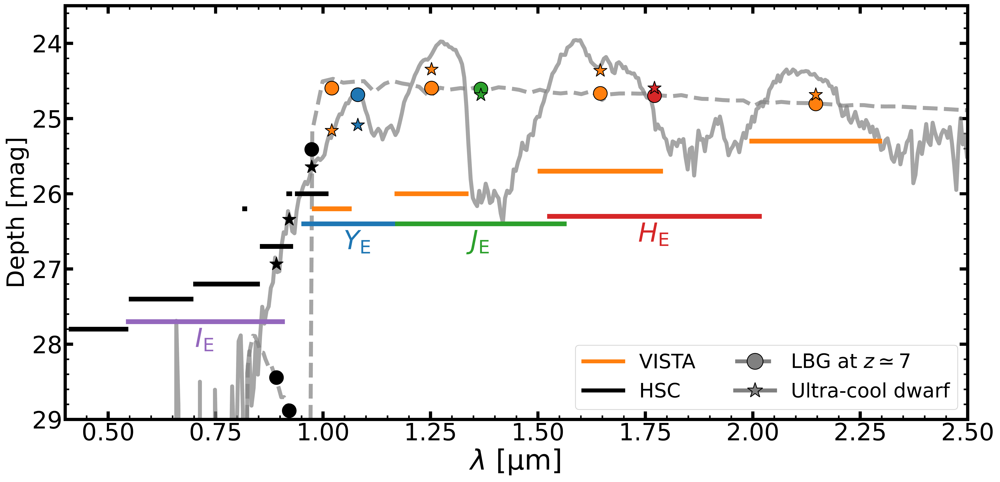
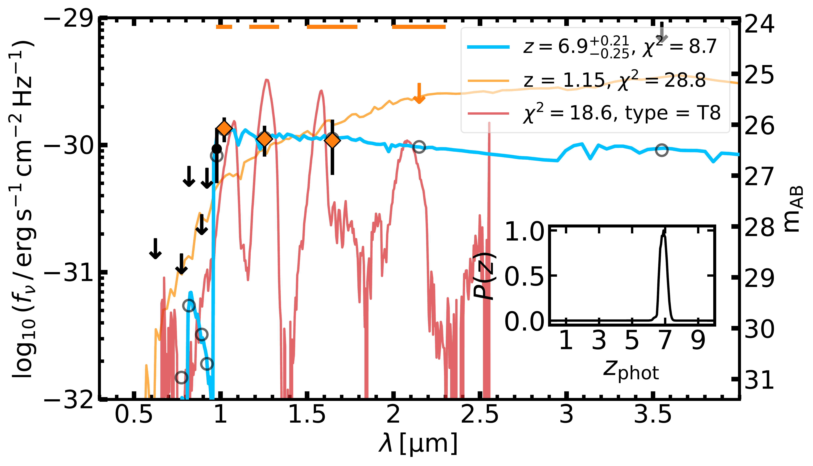
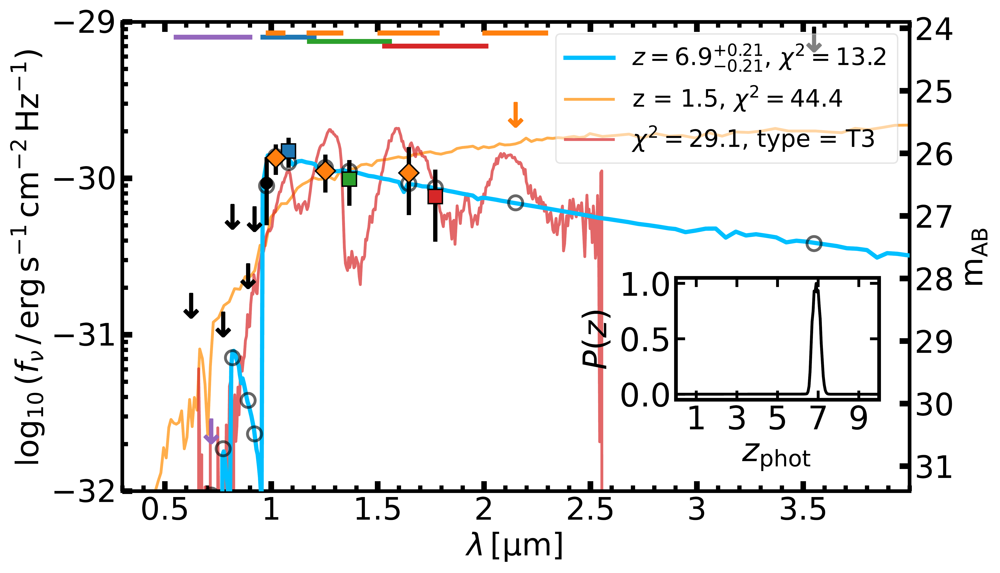
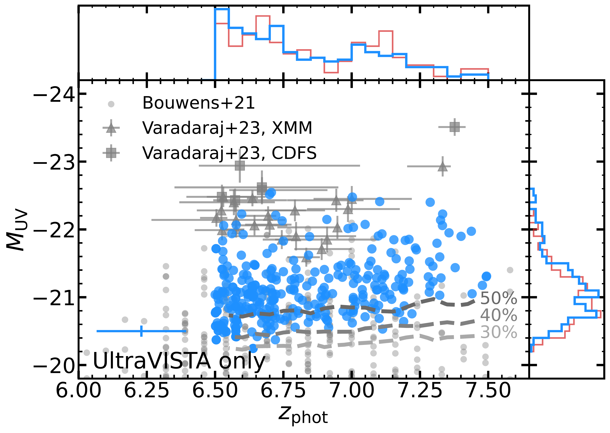
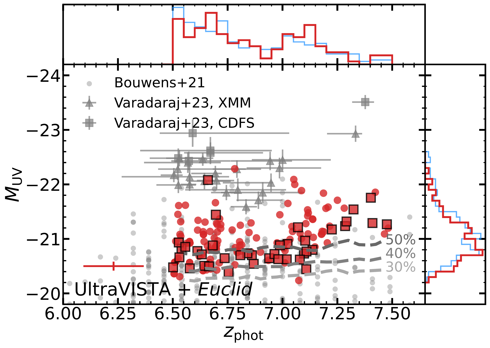

$\newcommand{\ensuremath}{}$
$\newcommand{\xspace}{}$
$\newcommand{\object}[1]{\texttt{#1}}$
$\newcommand{\farcs}{{.}''}$
$\newcommand{\farcm}{{.}'}$
$\newcommand{\arcsec}{''}$
$\newcommand{\arcmin}{'}$
$\newcommand{\ion}[2]{#1#2}$
$\newcommand{\textsc}[1]{\textrm{#1}}$
$\newcommand{\hl}[1]{\textrm{#1}}$
$\newcommand{\footnote}[1]{}$
$\newcommand{\Muv}{M_{\rm{UV}}}$
$\newcommand{\spitzer}{\textit{Spitzer}/IRAC\xspace}$
$\newcommand{\zphot}{z_{\rm{phot}}}$
$\newcommand{\orcid}[1]$

# $\Euclid$: Discovery of bright $\boldsymbol{z\simeq7}$ Lyman-break galaxies in UltraVISTA and $\Euclid$ COSMOS$\thanks{This paper is published on       behalf of the Euclid Consortium}$

<mark>Appeared on: 2025-10-02</mark> -  _18 pages, 13 figures, 5 tables, additional figures in appendix. Submitted to A&A_

R. G. Varadaraj, et al. -- incl., <mark>E. Bañados</mark>, <mark>K. Jahnke</mark>

**Abstract:** We present a search for $z\simeq7$ Lyman-break galaxies using the $1.72   \rm{deg}^2$ near-infrared UltraVISTA survey in the COSMOS field, reaching $5 \sigma$ depths in $Y$ of 26.2.We incorporate deep optical and _Spitzer_ imaging for a full spectral energy distribution (SED) fitting analysis.We find 289 candidate galaxies at $6.5\leq z \leq 7.5$ covering $-22.6 \leq \Muv \leq -20.2$ , faint enough to overlap with _Hubble_ Space Telescope studies.We conduct a separate selection by including complementary $\Euclid$ performance verification imaging (reaching $5 \sigma$ depths of $26.3$ ), yielding 140 galaxies in $0.65   \rm{deg}^2$ , with 38 sources unique to this sample.We compute the rest-frame UV luminosity function (UV LF) from our samples, extending below the knee ( $M^*=-21.14^{+0.28}_{-0.25}$ ).We find that the shape of the UV LF is consistent with both a Schechter function and double-power law (DPL) at the magnitudes probed by this sample, with a DPL preferred at $\Muv<-22.5$ when bright-end results are included.The UltraVISTA+ $\Euclid$ sample provides a clean measurement of the LF due to the overlapping near-infrared filters identifying molecular absorption features in the SEDs of ultra-cool dwarf interlopers, and additional faint galaxies are recovered.A comparison with JWST LFs at $z>7$ suggests a gentle evolution in the bright-end slope, although this is limited by a lack of robust bright-end measurements at $z>9$ .We forecast that in the Euclid Deep Fields, the removal of contaminant ultra-cool dwarfs as point sources will be possible at $\JE < 24.5$ .Finally, we present a high-equivalent-width Lyman- $\alpha$ emitter candidate identified by combining HSC, VISTA, and $\Euclid$ broadband photometry, highlighting the synergistic power these instruments will have in the Euclid Auxiliary Fields for identifying extreme sources in the Epoch of Reionisation.

**Figure 12. -** Limiting magnitudes, or modal depths ($5 \sigma$) of the photometric filters used in this work within the COSMOS field.
    The line widths represent the FWHM of the filter transmission curves, and the depths are reported in Table \ref{tab:Depths}.
    The HSC and VISTA filters are shown in black and orange, respectively, and the four \Euclid filters are labelled.
    We also show example SEDs of a UCD and a LBG with the solid and dashed lines, respectively.
    The model photometry for the UCD and the LBG are shown by the stars and circles respectively, and are colour-coded by their filters.
    Note that the \Euclid NIR filters cover the gaps between the VISTA filters. These wavelengths are inaccessible from the ground due to the atmospheric absorption. (*fig:filters*)

**Figure 13. -** 
    SED fitting of a candidate LBG, EUCL J100041.40$+$020157.5 (hereafter LBG 10004$+$02015), at $z=6.90$.
    Additional candidates are presented in Appendix \ref{sec: candidate seds and stamps}.
    *Left*: the SED fitting without \Euclid data, as part of the U-only selection (see Sect. \ref{sec: candidate selection}).
    *Right*: the SED fitting including \Euclid data, as part of the U+E selection.
    The HSC, VISTA and \Euclid photometry are shown by the points, diamonds and squares, respectively.
    The photometry is coloured following Fig. \ref{fig:filters}.
    Non-detections are replaced with $2 \sigma$ upper limits.
    We also show the filter widths for VISTA and \Euclid at the top of the plot.
    The $\spitzer$ model photometry and upper limit in the $3.6 \micron$ filter is also shown.
    The blue curve shows the best high-redshift solution, and the grey open circles are its expected model photometry.
    The orange curve shows the best dusty low-redshift solution, and the red curve shows the best UCD solution.
    The legend in the top right shows the redshift and $\chi^2$ of the galaxy solutions, and the $\chi^2$ and spectral type of the UCD solution.
    The inset panel shows the redshift probability distribution for this source.
    The inclusion of \Euclid data reinforces the exclusion the UCD solution.
    Also note that the inclusion of \Euclid data prefers a bluer slope. (*fig:UVISTA euclid SED*)

**Figure 2. -** The $z\simeq7$ LBG sample from this work plotted in photometric redshift $z_{\rm{phot}}$ and absolute rest-frame UV magnitude $\Muv$ space.
    *Top*: the U-only sample (blue).
    *Bottom*: the U+E sample (red).
    The red squares with a black outline indicate galaxies which are not recovered in the U-only sample, and are thus unique to the U+E sample.
    In both panels, we also show the candidates from \citetalias{Varadaraj23} in the XMM-LSS and ECDF-S fields, and the HST-selected candidates from \citetalias{Bouwens21}.
    The dashed grey lines show the 30\%, 40\%, and 50\% completeness limits, as derived from the injection-recovery simulation (see Sect. \ref{sec:completeness}).
    We also show the marginalised distributions in $z_{\rm{phot}}$ and $\Muv$ as normalised histograms, and also overplot the distribution of the other sample as the thinner, fainter line for comparison. The mean uncertainties are shown on the bottom left. (*fig:z-Muv*)

