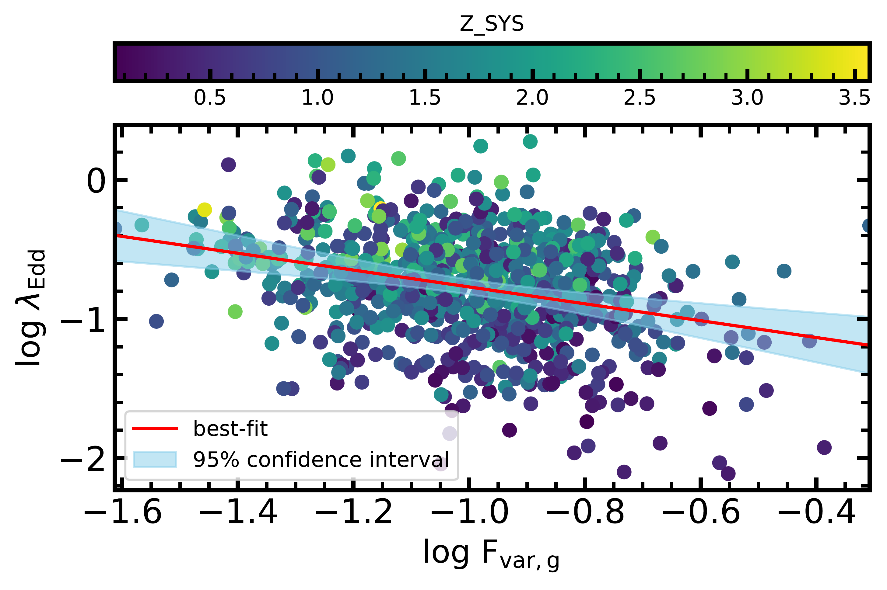
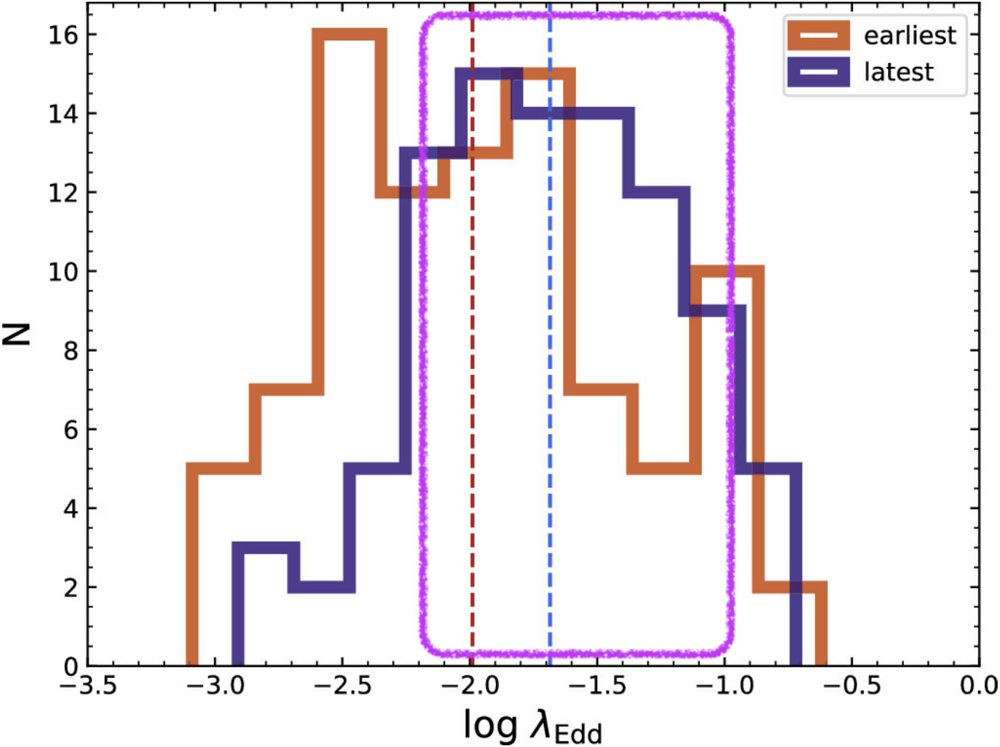
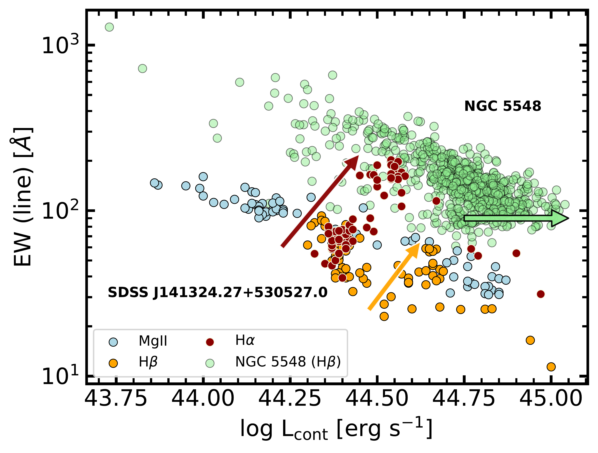

$\newcommand{\ensuremath}{}$
$\newcommand{\xspace}{}$
$\newcommand{\object}[1]{\texttt{#1}}$
$\newcommand{\farcs}{{.}''}$
$\newcommand{\farcm}{{.}'}$
$\newcommand{\arcsec}{''}$
$\newcommand{\arcmin}{'}$
$\newcommand{\ion}[2]{#1#2}$
$\newcommand{\textsc}[1]{\textrm{#1}}$
$\newcommand{\hl}[1]{\textrm{#1}}$
$\newcommand{\footnote}[1]{}$
$\newcommand{\BibTeX}{{\rm B\kern-.05em{\sc i\kern-.025em b}$
$             T\kern-.1667em\lower.7ex\hbox{E}\kern-.125emX}}$

# Feeding frenzy in the mighty black holes:\ what we could learn from them

<mark>Appeared on: 2025-10-03</mark> -  _30 pages, 8 figures, review based on the invited talk at the 15th Serbian Conference on Spectral Line Shapes in Astrophysics_

S. Panda, et al. -- incl., <mark>E. Bañados</mark>

**Abstract:** * Data-driven era, need for us to consolidate/learn from/stitch the different aspects together; a bit of out-of-the-box thinking and novel relations borne out of the analyses of large datasets and innovative techniques\end{itemize}\end{comment}$ $\keywords{Supermassive black holes (1663) -- Active galactic nuclei (16) -- Quasars (1319) -- Spectroscopy (1558) -- Photometry (1234) -- Scaling relations (2031) -- Spectral energy distribution (2129) -- Photoionization (2060)}$

**Figure 1. -** Distribution of the fractional variability (F$_{\rm var}$) in the g-band ZTF lightcurves for the AQMES medium field monitored within the SDSS-V, versus the Eddington ratio. The latter is taken from the SDSS DR16 QSO catalogue \citep{Wu_Shen_2022ApJS..263...42W}. The color axis depicts the distribution of redshift. The best-fit correlation after cleaning sources with insufficient F$_{\rm var}$ in g-band information: log $\lambda_{\rm Edd}$ = -0.61 log F$_{\rm var}$ - 1.38 ($\rho$ = -0.28; p-value = 2.8E-18). (*fig1*)

**Figure 2. -** (_Left:_) Distribution of Eddington ratios in the sample from \citet{PandaSniegowska2024ApJS}. We show the distributions for the earliest (in brown) and the latest (in purple) epochs for the sources in our sample. The median values for the two distributions (red = -1.99, blue = -1.685) are marked with vertical dashed lines. The magenta box marks the range of the Eddington ratio for NGC 5548, i.e., log $\lambda_{\rm Edd}$ = [-2.2, -1]. (_Right:_) The distribution of the emission line EW versus the AGN continuum luminosity. Here, we demonstrate the trend for two sources:  SDSS J141324.27+530527.0 \citep{Wang_2018ApJ...858...49W} with 72 spectral epochs over $\sim$15 years (5527 days), and NGC 5548 \citep{Bon_2018FrASS...5....3B, Panda2022AN, Panda2023BASBr} with more than 750 spectral epochs over $\sim$25 years (9624 days). For the former source (SDSS J141324.27+530527.0), we have taken the spectral data from the homogeneous fitting in \citet{PandaSniegowska2024ApJS}, which includes the Mg{\sc ii}, H$\beta$, and H$\alpha$ emission lines and the corresponding AGN continua nearest to these lines (at 3000Å, 5100Å, and 6000Å), as shown in the panel. For NGC 5548, we show the dataset from Panda et al. (in prep.), which is an updated version of the dataset provided in \citet{Bon_2018FrASS...5....3B}, where the authors analyzed the H$\beta$ region. The SDSS source shows a clear rise from a deep minimum to a high state in both Balmer lines. However, the Mg{\sc ii} shows a rather flat behavior - reminiscent of the Baldwin effect, suggesting the difference in ionization and response to the changing continuum levels. NGC 5548 data has a wealth of data, but the change in the source is rather gradual, and hence, a clear spike in the trend is not that prominent. (*fig:clagns*)

**Figure 3. -** (_Left:_)[O {\sc iii}]$\lambda$5007 emission image of ESO 138-G001 from the HST/WFPC2 \citep{HST2000ApJS..128..139F} with a small inset showing the details of the central part, where the nucleus is marked with a plus sign; (_Right:_) [O {\sc iii}]$\lambda$5007 emission image from SIFS after data treatment involving spatial re-sampling with quadratic interpolation followed by the Richardson-Lucy PSF deconvolution \citep[see][for more details]{SIFS2024MNRAS}. The green circles – with an aperture radius of 0.6 arcsec – denote the extraction regions of the spectra for the North-East (NE) knot (top left), the South-East (SE) blob (bottom left), and the nuclear region. The red circle denotes the PSF FWHM of 0.71 arcsec. (*fig:hst-sifs*)

