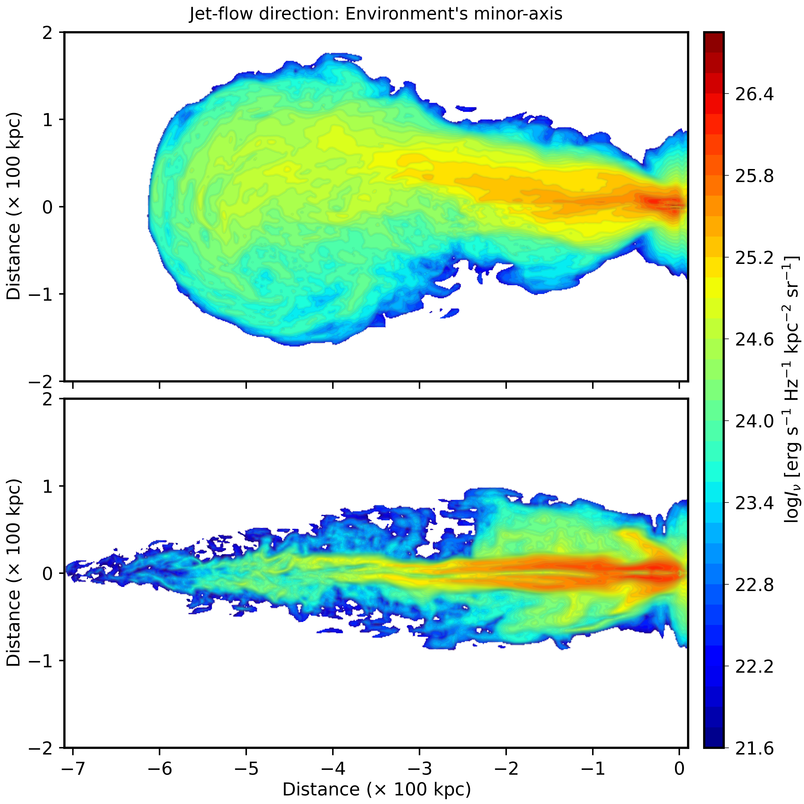

$\newcommand{\ensuremath}{}$
$\newcommand{\xspace}{}$
$\newcommand{\object}[1]{\texttt{#1}}$
$\newcommand{\farcs}{{.}''}$
$\newcommand{\farcm}{{.}'}$
$\newcommand{\arcsec}{''}$
$\newcommand{\arcmin}{'}$
$\newcommand{\ion}[2]{#1#2}$
$\newcommand{\textsc}[1]{\textrm{#1}}$
$\newcommand{\hl}[1]{\textrm{#1}}$
$\newcommand{\footnote}[1]{}$
$\newcommand{\cf}{\color{magenta}}$
$\newcommand{\fpath}{figures/}$
$\newcommand{\labelenumi}{\Roman{enumi}.}$

# Probing the formation of megaparsec-scale giant radio galaxies\ II. Continuum \& polarization behavior from MHD simulations

<mark>Appeared on: 2025-10-06</mark> -  _Accepted for publication in A&A journal_

G. Giri, et al. -- incl., <mark>C. Fendt</mark>

**Abstract:** The persistence of radiative signatures in giant radio galaxies (GRGs $\gtrsim 700$ kpc) remains a frontier topic of research, with contemporary telescopes revealing intricate features that require investigation. This study aims to examine the emission characteristics of simulated GRGs, and correlate them with their underlying three-dimensional dynamical properties. Sky-projected continuum and polarization maps at 1 GHz were computed from five 3D relativistic magnetohydrodynamical (RMHD) simulations by integrating the synthesized emissivity data along the line of sight, with the integration path chosen to reflect the GRG evolution in the sky plane. The emissivities were derived from these RMHD simulations, featuring FR-I and FR-II jets injected from different locations of the large-scale environment, with propagation along varying jet frustration paths. Morphologies, such as widened lobes from low-power jets and collimated flows from high-power jets, are strongly shaped by the triaxiality of the environment, resulting in features like wings and asymmetric cocoons, thereby making morphology a crucial indicator of GRG formation mechanisms. The decollimation of the bulk flow in GRG jets gives rise to intricate cocoon features, most notably filamentary structures—magnetically dominated threads with lifespans of a few Myr. High-jet-power cases frequently display enhanced emission zones at mid-cocoon distances (alongside warmspots around the jet-head), contradicting the interpretations of the GRG as a restarting source. In such cases, examining the lateral intensity variation of the cocoon may reveal the source's state, with a gradual decrease in emission suggesting a low-active stage. This study highlights that applying a simple radio power–jet power relation to a statistical GRG sample is unfeasible, as it depends on growth conditions of individual GRGs. Effects such as inverse-Compton CMB cooling and matter entrainment significantly impact the long-term emission persistence of GRGs. The diminishing fractional polarization with GRG evolution reflects increasing turbulence, underscoring the importance of modeling this characteristic further, particularly for even larger-scaled sources.

**Figure 2. -** A. Intensity maps (log $I_{\nu}$) at 1 GHz radio frequency are presented for two simulation cases: a low-power jet ("GRG\_lp\_min"; _top_) and a high-power jet ("GRG\_hp\_min"; _bottom_), both propagating along the minor axis of the ambient medium. While the overall structures resemble the dynamical maps from \citetalias{Giri2025}, the emission maps offer deeper insights, highlighting crucial aspects of the observability of these simulated giant radio structures at their evolved stages ($\sim$ 167 Myr: _top_; $\sim$ 69 Myr: _bottom_). (*Fig:Emission_minor*)

**Figure 15. -** Intensity variation maps (as background) for five simulated scenarios at their evolved stages, presented as colormaps, overlaid with projected magnetic field distributions. The line lengths indicate proportionality to the corresponding fractional polarization (FP) values at each point. Median FP values are noted for `GRG\_lp\_min' (41.9\%), `GRG\_hp\_min' (45.8\%), `GRG\_lp\_maj' (38.4\%), `GRG\_hp\_maj' (39.2\%), and 'GRG\_hp\_edge' (35.1\%), and are annotated in each subfigure alongside a scale bar for reference. (*Fig:Polarization*)

**Figure 10. -** Sliced velocity maps ($x-y$ plane, $z=0$) for the resultant giant radio galaxy morphologies from five simulation cases (labels indicated in each plot) are shown, illustrating the underlying matter-transport mechanisms responsible for these structures. These maps are displayed at dynamical ages of $\sim$ 167 Myr (GRG\_lp\_min), 196 Myr (GRG\_lp\_maj), 49 Myr (GRG\_hp\_edge), 137 Myr (GRG\_hp\_maj), and 69 Myr (GRG\_hp\_min), as also highlighted in \citetalias{Giri2025}. The colormap represents the $x-$component of velocity, capturing the bulk-flow (in blue) and back-flow (in red) dynamics, while the contours depict the $y-$component of velocity, with solid lines indicating $0.005c$ and dashed lines indicating $-0.005c$, to highlight the behavior of secondary structures forming within the domain. To analyze the impact of jet power on morphology and the influence of the tri-axial environment on the resulting structure, comparisons are made column-wise and row-wise, respectively. (*Fig:Velocity_dynamics*)

