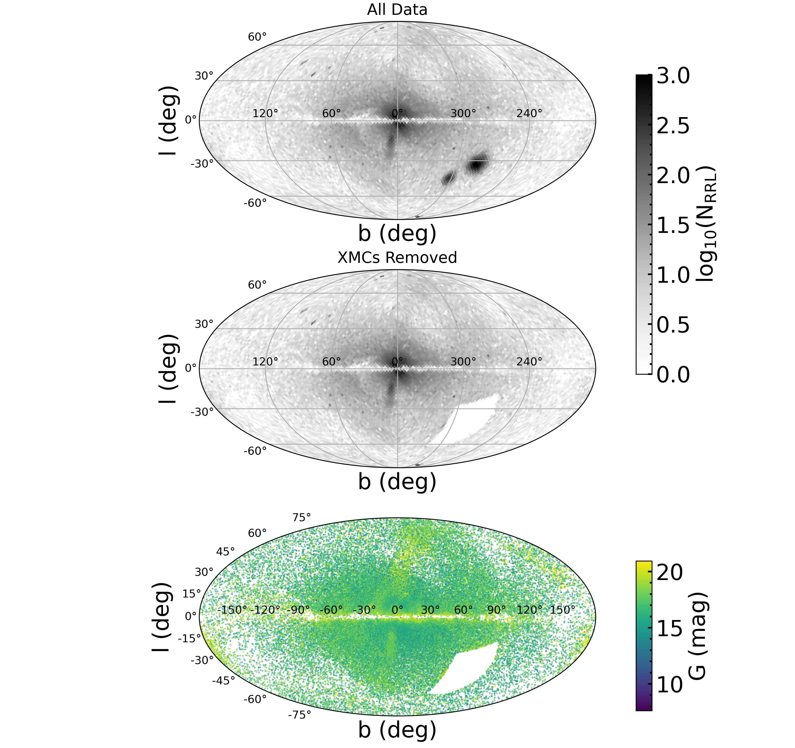
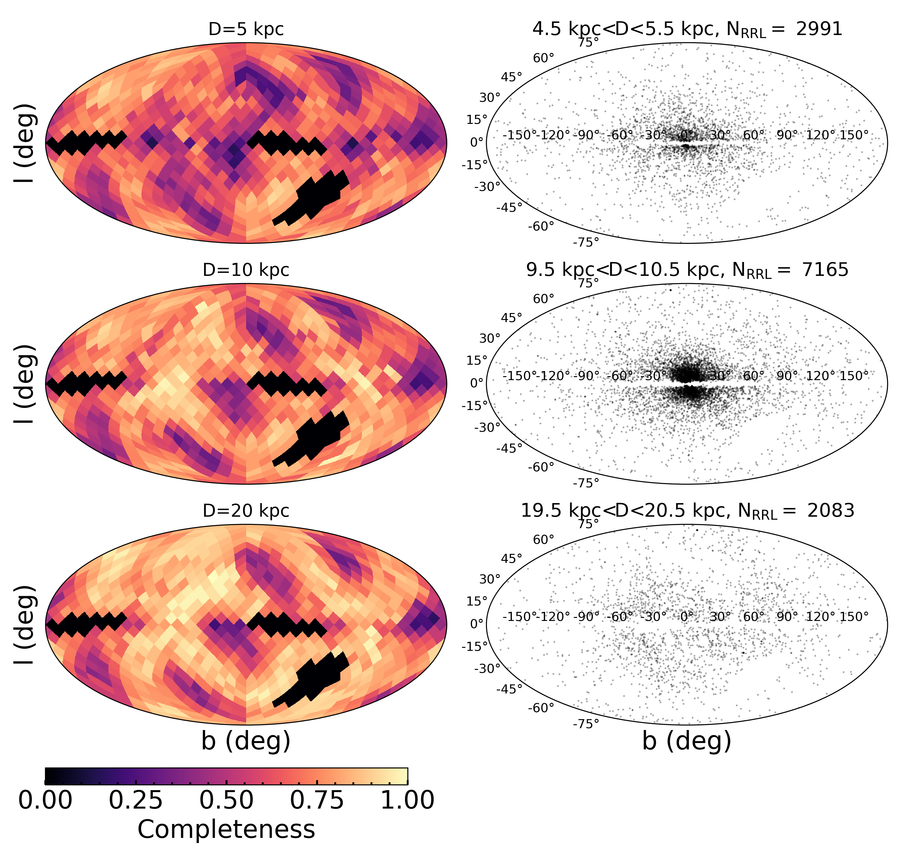
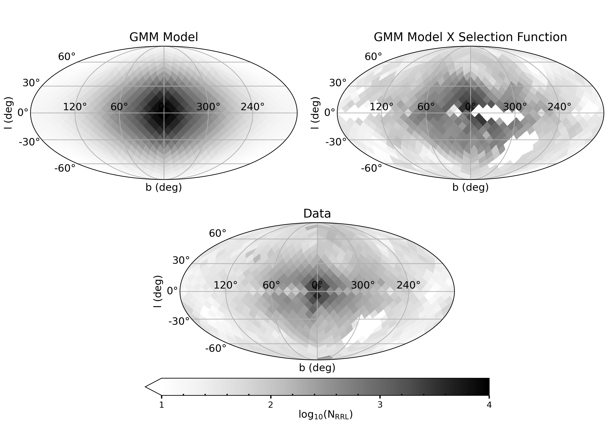

$\newcommand{\ensuremath}{}$
$\newcommand{\xspace}{}$
$\newcommand{\object}[1]{\texttt{#1}}$
$\newcommand{\farcs}{{.}''}$
$\newcommand{\farcm}{{.}'}$
$\newcommand{\arcsec}{''}$
$\newcommand{\arcmin}{'}$
$\newcommand{\ion}[2]{#1#2}$
$\newcommand{\textsc}[1]{\textrm{#1}}$
$\newcommand{\hl}[1]{\textrm{#1}}$
$\newcommand{\footnote}[1]{}$
$\newcommand{\vdag}{(v)^\dagger}$
$\newcommand$
$\newcommand$
$\newcommand{\ml}[1]{\textcolor{red}{#1}}$
$\newcommand{\cmj}[1]{\textcolor{magenta}{#1}}$
$\newcommand{\bs}[1]{\boldsymbol{#1}}$
$\newcommand{\vec}[1]{\boldsymbol{#1}}$

# Inferring Stellar Densities with Flexible Models I: The Distribution of RR Lyrae in the Milky Way with _Gaia_ DR3

<mark>Appeared on: 2025-10-06</mark> -  _13 pages, 6 figures, submitted to ApJ, comments welcome!_

M. Lucey, et al. -- incl., <mark>H.-W. Rix</mark>

**Abstract:** Understanding the formation and evolutionary history of the Milky Way requires detailed mapping of its stellar components, which preserve fossil records of the Galaxy's assembly through cosmic time. RR Lyrae stars are particularly well-suited for this endeavor, as they are old, standard candle variables that probe the Galaxy's earliest formation epochs. In this work, we employ a hierarchical Bayesian Gaussian Mixture Model (GMM) to characterize the three-dimensional density distribution of RR Lyrae stars in the Milky Way. This approach provides a flexible framework for modeling complex stellar distributions, particularly in the inner Galaxy where the bulge, disk, and halo components overlap. Our analysis reveals that the inner Galaxy is dominated by a distinct prolate stellar population with axis ratio $q$ =1.30. Consistent with previous work, we find the halo follows a $r^{-4}$ power-law profile that flattens within 12 kpc of the Galactic center. We also confirm the halo is oblate $q$ =0.62 with a tilt angle of $12.22^{\circ}$ . We report for the first time that this tilt aligns the halo major axis in the direction of the Sagittarius dwarf galaxy. These results establish GMMs as an effective and flexible tool for modeling Galactic structure and provide new constraints on the distribution of old stars in the inner Galaxy.

**Figure 2. -** The sky distribution in Galactic coordinates ($l,b$) of our RR Lyrae sample. stars in our sample. The top panel shows the log density for the entire sample of 128,353 RR Lyrae. After removing the XMCs with a cut in RA and DEC, there are 105,325 RRL that we use in our analysis as shown in the middle panel. The bottom panel shows the sky distribution of our final sample colored by the _Gaia_ G magnitude, which, because of their standard-candle nature, is strongly correlated with the distance.  (*fig:sky*)

**Figure 3. -** Empirical Completeness Maps of the RR Lyrae sample in Galactic Coordinates at distances of 5 kpc (top left), 10 kpc (middle left), and 20 kpc (bottom left). We show corresponding slices of the data in distance bins of 1 kpc in the right panels. At small distances, the completeness is degraded because of the bright limits of surveys. The dominant structure in the completeness map is consistent with the _Gaia_ scanning law.   (*fig:sf*)

**Figure 4. -**  Comparison of the sky projected densities of our model to the data in Galactic coordinates ($l, b$). The top left panel is sky projection of our model where the darkest patches indicate the highest density of RRL. The top right panel shows the same but convolved with our model for the selection function. The bottom panel shows the equivalent sky projection of the RRL sample used in this work. In general, the sky projected model is similar to the data when convolved with the selection.    (*fig:skymodel*)

