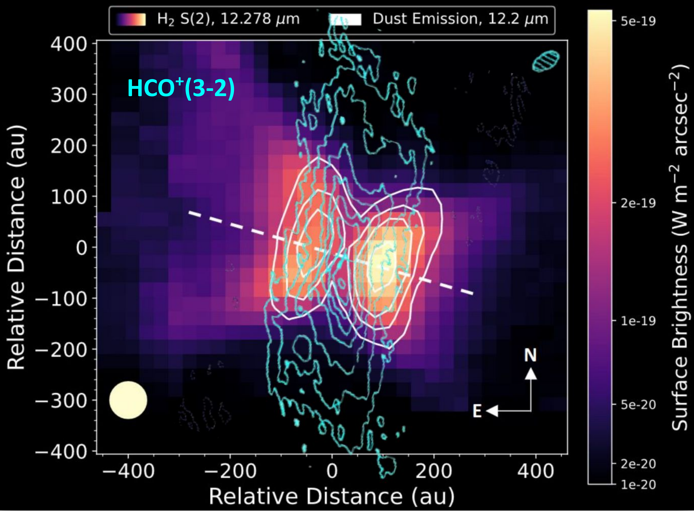

$\newcommand{\ensuremath}{}$
$\newcommand{\xspace}{}$
$\newcommand{\object}[1]{\texttt{#1}}$
$\newcommand{\farcs}{{.}''}$
$\newcommand{\farcm}{{.}'}$
$\newcommand{\arcsec}{''}$
$\newcommand{\arcmin}{'}$
$\newcommand{\ion}[2]{#1#2}$
$\newcommand{\textsc}[1]{\textrm{#1}}$
$\newcommand{\hl}[1]{\textrm{#1}}$
$\newcommand{\footnote}[1]{}$
$\newcommand{\vlsr}{v_{\rm lsr}}$
$\newcommand{\kms}{km s^{-1}}$
$\newcommand{\Lsun}{L_\odot}$
$\newcommand{\mdot}{\dot{M}}$
$\newcommand{\Msun}{ \mathrm{M}_\odot}$
$\newcommand{\Msunpyr}{\unit{M_\odot yr^{-1}}}$
$\newcommand{\coto}{\mbox{CO(2--1)}}$
$\newcommand{\cott}{\mbox{CO(3--2)}}$
$\newcommand{\tcott}{\mbox{^{13}CO(2--1)}}$
$\newcommand{\csff}{\mbox{CS(5--4)}}$
$\newcommand{\csss}{\mbox{CS(7--6)}}$
$\newcommand{\cnto}{\mbox{CN(2--1)}}$
$\newcommand{\cntt}{\mbox{CN(3--2)}}$
$\newcommand{\tablecontinuum}{$
$\begin{table}$
$\caption{Continuum Fit Parameters and Results}$
$\label{tab:disk}$
$\centering$
$\begin{tabular}{ p{4.5cm}|p{3cm}}$
$ \hline$
$Parameters  & Values \  \hline$
$ Inclination i_D & 86.6 \pm 0.1^\circ \  Inner radius  R_{Din}  & < 4 au \  Outer radius  R_{Dout}& 317 \pm 5 au\  T_{Do} = T_D({100 \mathrm{au}}) & 9.8 \pm 0.6 K \  Exponent of T_D & -0.3 \pm 0.2 \  \Sigma_{Do} = \Sigma_D({100 \mathrm{au}}) & 1.6\pm0.3 10^{23} cm^{-2} \  Exponent of \Sigma_D & 0.48 \pm 0.04 \ Dust emissivity index \beta  & 0.63 \pm 0.07  \ Absorption coefficient \kappa_0 & 0.052 cm^{2}/g \ \  \hline$
$ H_{Do} = H_D({100 \mathrm{au}}) & 11.6 au\  Exponent of H_D(r), h_d & -1.38  \   \hline$
$\end{tabular}$
$\tablefoot{\small{$
$Dust emissivity is \kappa(\nu) = \kappa_0 (\nu/345 \mathrm{GHz})^\beta. H_{Do} and h_D were fixed to the best fit values found from a simultaneous fit of the 220 and 330 GHz data only.}$
$}$
$  \label{tab:obtained-cont}$
$\end{table}$
$}$
$\newcommand{\tablemodel}{$
$\begin{table*}[!th]$
$\small$
$\caption{Best fit models for molecular lines}$
$\centering$
$\begin{tabular}{|c c|l|l|l|}$
$\hline$
$\multicolumn{2}{|c|}{Parameters} &  \multicolumn{1}{c|}{^{12}CO 2-1 \& 3-2} & \multicolumn{1}{c|}{^{13}CO 2-1 \& C^{18}O 2-1} &\multicolumn{1}{c|}{HCO^+ 3-2} \ \hline$
$\deltaV & (km s^{-1}) &  0.20 \pm 0.01  & 0.15 \pm 0.01 & 0.15 \ T_{atm}(r) & (K) & 31.2 \pm 0.2 (r/R_0)^{-0.68 \pm 0.02} & 16.8 \pm 0.2 (r/R_{0})^{0.07 \pm 0.01} & 15.0 \pm 0.2 (r/R_{0})^{(-0.12 \pm 0.03)} \ T_{mid}(r) & (K)&  \min(T_{atm},7.4 \pm 0.2  (r/R_{0})^{-0.27}) & \min(T_{atm},10.4 \pm 0.1  (r/R_{0})^{(-0.27 \pm 0.03)} & \min(T_{atm},9.1 \pm 0.4 (r/R_{0})^{-0.27} \ H(r)= & (au) & 27.9 \pm 0.2 (r/R_{0})^{1.16 \pm 0.02} & 24.0 \pm 0.2 (r/R_{0})^{1.25 \pm 0.03} & 30.8 \pm 0.8 (r/R_{0})^{0.93 \pm 0.13}\ \Sigma(r) & (cm^{-2}) & 8.2 \pm 1.2   10^{18} (r/R_{0})^{-3.1 \pm 0.2} & ^{13}CO : 4.5 \pm 0.4 10^{17} (r/R_{0})^{-3.3 \pm 0.2} & 6.1\pm 1.0  10^{13} (r/R_{0})^{-1.6 \pm 0.9} \  & &  & C^{18}O : 1.9 \pm 0.1 10^{16} (r/R_{0})^{-3.3 \pm 0.2} &\ \Sigma_{dep}   & (cm^{-2}) & 3.7\pm0.4 10^{22}  &  3.5\pm0.1  10^{22} & 8.7\pm0.2  10^{22} \ \hline$
$Inclination & (^\circ) & 85.5 \pm 0.6 & 89.8 \pm 0.4 & 87.4 \pm 0.8\ R_{in} & (au) &  61 \pm 1 & 77 \pm 2 & 53 \pm 1\ R_{out} & (au) & 760 \pm 5 & 790 \pm 6 & 521 \pm 2\  \hline$
$\end{tabular}$
$\label{tab:gas-model}$
$\tablefoot{Error bars are 1\sigma formal errors. All parameters are newcommandined in Appendix \ref{app:modeling}. Parameters with no error bars were fixed. The distance used is 160 pc and the V_\mathrm{LSR} is 7.35 km s^{-1}.$
$The mid-plane temperature exponent being loosely constrained, we fixed its value to that found from ^{13}CO 2-1 for all lines. Following Eq.\ref{Temperature}, we fix the exponent \delta that controls the steepness of the gradient to 2.5, see Appendix \ref{app:modeling}.$
$The pivot R_0 is fixed at 100 au to maximize the sensitivity. For all lines, we checked that the disk is in Keplerian rotation.}$
$\end{table*}$
$}$
$\newcommand{\figtomo}{$
$\begin{figure*}$
$  \subfigure(a){\hspace{5cm}}$
$  \subfigure(b){\hspace{5cm}}$
$  \subfigure(c) $
$  \centering$
$  \subfigure{\includegraphics[width=0.268\textwidth]{tomob_obs_12co21.pdf}}$
$  \subfigure{\includegraphics[width=0.268\textwidth]{tomob_mod_12co21.pdf}}$
$  \subfigure{\includegraphics[width=0.268\textwidth]{tomob_diff_12co21.pdf}}$
$  \centering$
$  \subfigure{\includegraphics[width=0.268\textwidth]{tomob_obs_12co32.pdf}}$
$  \subfigure{\includegraphics[width=0.268\textwidth]{tomob_mod_12co32.pdf}}$
$  \subfigure{\includegraphics[width=0.268\textwidth]{tomob_diff_12co32.pdf}}$
$  \centering$
$  \subfigure{\includegraphics[width=0.268\textwidth]{tomob_obs_13co.pdf}}$
$  \subfigure{\includegraphics[width=0.268\textwidth]{tomo_mod_13co_newcommand.pdf}}$
$  \subfigure{\includegraphics[width=0.268\textwidth]{tomo_diff_13co_newcommand.pdf}}$
$  \centering$
$  \subfigure{\includegraphics[width=0.268\textwidth]{tomob_obs_c18o.pdf}}$
$  \subfigure{\includegraphics[width=0.268\textwidth]{tomob_mod_c18o.pdf}}$
$  \subfigure{\includegraphics[width=0.268\textwidth]{tomob_diff_c18o.pdf}}$
$  \centering$
$  \subfigure{\includegraphics[width=0.268\textwidth]{tomob_obs_hco+.pdf}}$
$  \subfigure{\includegraphics[width=0.268\textwidth]{tomob_mod_hco+.pdf}}$
$  \subfigure{\includegraphics[width=0.268\textwidth]{tomob_diff_hco+.pdf}}$
$  \caption{From top to bottom: Tomographically Reconstructed Distribution (TRD) of ^{12}CO 2-1, ^{12}CO 3-2, ^{13}CO 2-1, C^{18}O 2-1 and HCO^+ 3-2 : (a) TRD of the observations (b) TRD of the final result of the models (c) difference between the observations and models TRD. For ^{12}CO (2–1), the residuals range from –2 to 2 K, while for the ^{12}CO (3–2) transition, they extend from –3 to 2 K. In the case of ^{13}CO (2–1), the differences are between 0 and 2 K. For C^{18}O (2–1), the deviations range from –1 to 2 K, and for HCO^+ (3–2), they span from –1 to 3 K. The vertical black line represents the effective resolution and two error bars show the widening of the beam as a function of radius caused by the TRD method.$
$  The contours are newcommandined from 4 K to 20 K in steps of 2 K for observational and model maps, and from -3 K to 3 K in steps of 1 K for the residual maps.}$
$\label{fig:tomo}$
$\end{figure*}$
$}$

# Edge-On Disk Study (EODS) II: HCO$^+$ and CO vertical stratification in the disk surrounding SSTTau042021

<mark>Appeared on: 2025-10-07</mark> - 

C. Foucher, et al. -- incl., <mark>T. Henning</mark>, <mark>D. Semenov</mark>

**Abstract:** Edge-on disks offer a unique opportunity to directly examine their vertical structure, providing valuable insights into planet formation processes. We investigate the dust properties, as well as the CO and HCO $^+$ gas properties, in the edge-on disk surrounding the T Tauri star 2MASS J04202144+281349 (SSTTau042021). We estimate the radial and vertical temperature and density profile for the gas and the dust. We use ALMA archival data of CO isotopologues and continuum emission at 2, 1.3 and 0.9 mm together with new NOEMA HCO $^+$ 3-2 observations. We retrieve the gas and dust disk properties using the tomographic method and the DiskFit model. The vertical CO emission appears very extended, partly tracing the $H_2$ wind observed by JWST. C $^{18}$ O, $^{13}$ CO and HCO $^+$ emission characterize the bulk of the molecular layer. The dust and gas have a mid-plane temperatures of $\sim 7-11$ K. The temperature of the molecular layer (derived from $^{13}$ CO and HCO $^+$ ) is on the order of 16 K. HCO $^+$ 3-2 being thermalized, we derive a lower limit for the $H_2$ volume density of $\sim 3 \times 10^6$ cm $^{-3}$ at radius 100-200 au between 1 and 2 scale heights. The atmosphere temperature of the CO gas is of the order $\sim$ 31 K at a radius of 100 au. We directly observe CO and HCO $^+$ gas onto the mid-plane beyond the dust outer radius ( $\ge 300$ au). The (gas+dust) disk mass estimated up to a radius of 300 au is on the order of $4.6\times10^{-2} \Msun$ . Thanks to the favorable disk inclination, we present the first quantitative evidence for vertical molecular stratification with direct observation of CO and HCO $^+$ gas along the mid-plane. We estimate the temperature profile with temperature of 7-11 K near the mid-plane, and 15-20 K in the dense part of the molecular layer up to $\sim$ 35 K above.

**Figure 2. -** From top to bottom: Tomographically Reconstructed Distribution (TRD) of $^{12}$CO 2-1, $^{12}$CO 3-2, $^{13}$CO 2-1, C$^{18}$O 2-1 and HCO$^+$ 3-2 : (a) TRD of the observations (b) TRD of the final result of the models (c) difference between the observations and models TRD. For $^{12}$CO (2–1), the residuals range from –2 to 2 K, while for the $^{12}$CO (3–2) transition, they extend from –3 to 2 K. In the case of $^{13}$CO (2–1), the differences are between 0 and 2 K. For C$^{18}$O (2–1), the deviations range from –1 to 2 K, and for HCO$^+$(3–2), they span from –1 to 3 K. The vertical black line represents the effective resolution and two error bars show the widening of the beam as a function of radius caused by the TRD method.
  The contours are defined from 4 K to 20 K in steps of 2 K for observational and model maps, and from -3 K to 3 K in steps of 1 K for the residual maps. (*fig:tomo*)

**Figure 5. -** Montage of JWST and interferometric data for SSTTau042021. MIRI MRS images from JWST reveal H$_{2}$ S(2) emission at 12.278 $\mu$m ([Arulanantham, McClure and Pontoppidan (2024)]()). White contours indicate the mid-infrared scattered-light continuum at 12.2 $\mu$m, and the white dashed line marks the rotation axis of the disk at PA = 73.5$^\circ$.
  From archival ALMA data and new NOEMA observations, cyan contours show molecular emission lines of HCO$^+$ 3–2, $^{13}$CO 2–1, C$^{18}$O 2–1, $^{12}$CO 2–1, and $^{12}$CO 3–2, while yellow contours represent the 0.85 mm continuum emission at 1 mJy/beam.  Beige circles in the bottom left corner of each panel represent the average theoretical FWHM of the PSF for JWST data, calculated from the relationship reported in [Law, Booth and Öberg (2023)](), and the beam of the molecular line emission is shown as a cyan ellipse in the top-right corner of each panel. The contours for HCO$^+$(3–2) range from 0.02 to 0.2 Jy/beam.km/s with a step of 0.02 Jy/beam.km/s, i.e 2.5 $\sigma$; for $^{13}$CO (2–1), they range from 0.02 to 0.08 Jy/beam.km/s with a step of 0.01 Jy/beam.km/s, i.e 3.5 $\sigma$; for C$^{18}$CO (2–1), they range from 0.008 to 0.016 Jy/beam.km/s with a step of 0.008 Jy/beam.km/s, i.e 3.5$ \sigma$; for $^{12}$CO (2–1), from 0.01 to 0.08 Jy/beam.km/s with a step of 0.02 Jy/beam.km/s, i.e 6 $\sigma$; and for $^{12}$CO (3–2) , from 0.06 to 0.8 Jy/beam.km/s with a step of 0.06 Jy/beam.km/s , i.e 4.2$\sigma$.
   (*fig:jwst*)

**Figure 6. -**  Velocity channel maps from top to bottom: for $^{12}$CO 2-1, 3-2, $^{13}$CO 2-1, C$^{18}$O 2-1 and HCO$^{+}$ 3-2. The channels corrupted by the CO clouds along the line of sight are marked with a red cross. These channels were not used in the DiskFit analysis. All the maps are rotated by $-73.5^\circ$. The contours are defined as follows: from 3 to 12 K in steps of 3 K (i.e., $3.6\sigma$) for the $^{12}$CO 2–1, $3.3\sigma$ for $^{12}$CO 3–2, and $3.6\sigma$ for $^{13}$CO 2–1; from 2 to 6 K in steps of 2 K (i.e., $3.2\sigma$) for C$^{18}$O 2–1; and from 3 to 9 K in steps of 3 K (i.e., $3.3\sigma$) for HCO$^+$ 3–2. (*fig:vel_channel*)

