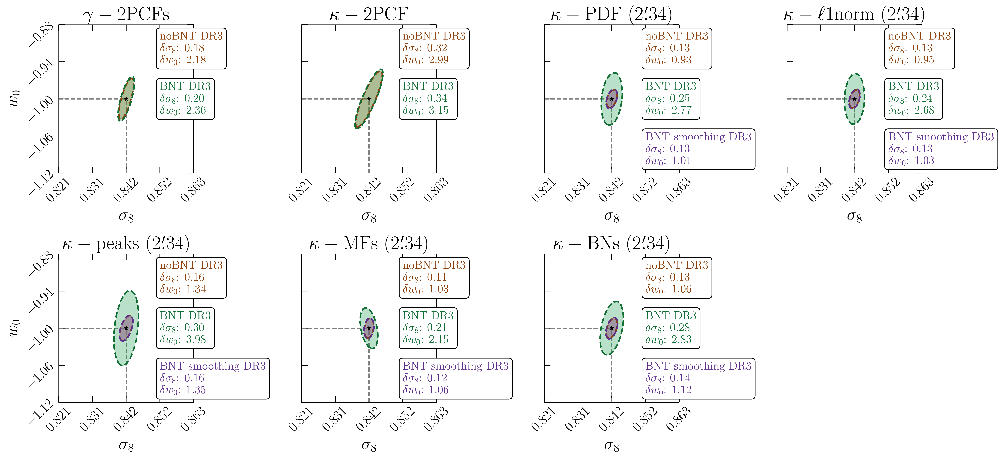
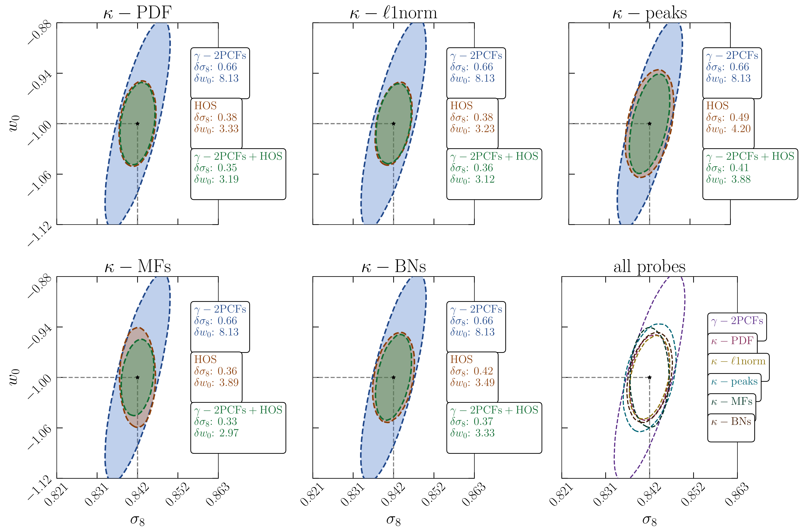
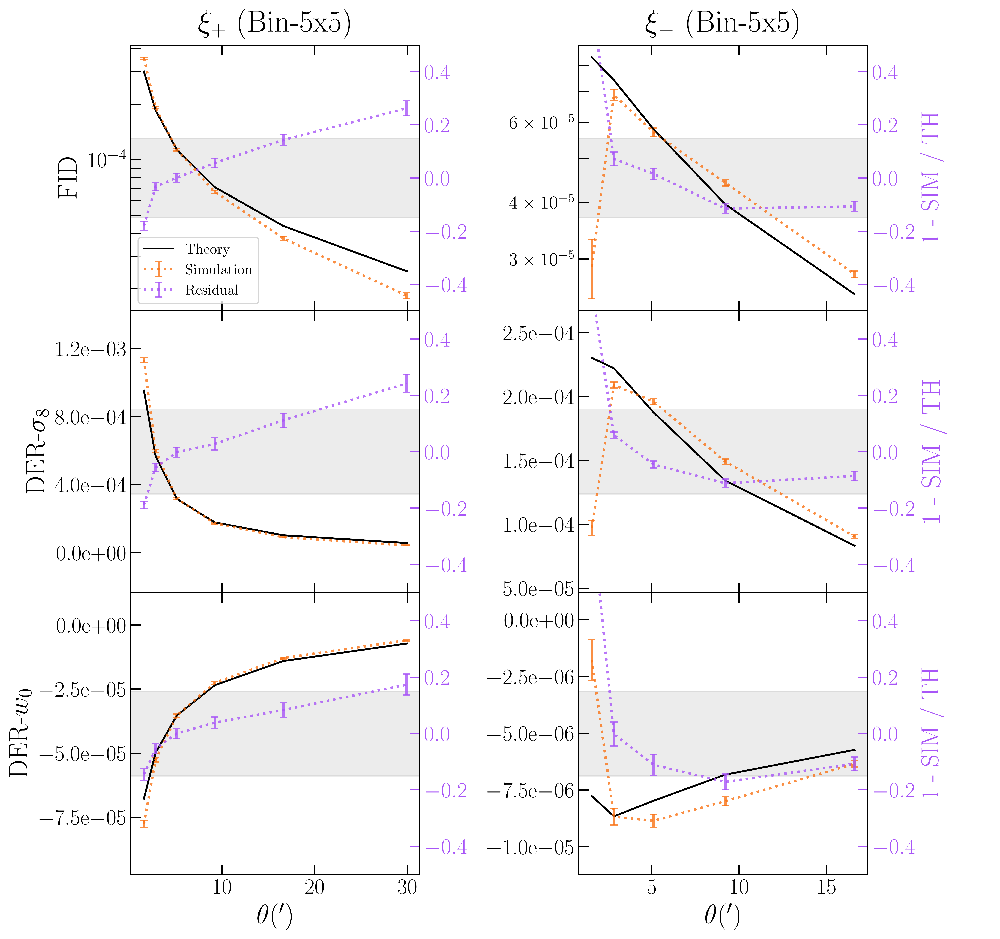

$\newcommand{\ensuremath}{}$
$\newcommand{\xspace}{}$
$\newcommand{\object}[1]{\texttt{#1}}$
$\newcommand{\farcs}{{.}''}$
$\newcommand{\farcm}{{.}'}$
$\newcommand{\arcsec}{''}$
$\newcommand{\arcmin}{'}$
$\newcommand{\ion}[2]{#1#2}$
$\newcommand{\textsc}[1]{\textrm{#1}}$
$\newcommand{\hl}[1]{\textrm{#1}}$
$\newcommand{\footnote}[1]{}$
$\newcommand{\astroang}[1]{\ang[angle-symbol-over-decimal]{#1}}$
$\newcommand{\assign}[1]{\textcolor{red}{[#1]}}$
$\newcommand{\inprogress}[1]{\textcolor[rgb]{1,0.5,0}{[#1]}}$
$\newcommand{\done}[1]$
$\newcommand{\R}[1]{\textcolor{red}{#1}}$
$\newcommand{\help}[1]{\textcolor{magenta}{[{\bf HELP!: #1}]}}$
$\newcommand{\nico}[1]{\textcolor{red}{[nico: #1]}}$
$\newcommand{\lucas}[1]{\textcolor{gray}{[lucas: #1]}}$
$\newcommand{\laila}[1]{\textcolor{magenta}{[laila: #1]}}$
$\newcommand{\JHD}[1]{\textcolor{magenta}{[JHD: #1]}}$
$\newcommand{\cora}[1]{\textcolor{purple}{[cora: #1]}}$
$\newcommand{\vincenzo}[1]{\textcolor{cyan}{[vincenzo: #1]}}$
$\newcommand{\lina}[1]{\textcolor{teal}{[Lina: #1]}}$
$\newcommand{\Sandrine}[1]{\textcolor{violet}{[Sandrine C.: #1]}}$
$\newcommand{\SP}[1]{\textcolor{teal}{[Sandrine P.: #1]}}$
$\newcommand{\ismael}[1]{\textcolor{brown}{[ismael: #1]}}$
$\newcommand{\sven}[1]{\textcolor{orange}{[sven: #1]}}$
$\newcommand{\simone}[1]{\textcolor{olive}{[Simone: #1]}}$
$\newcommand{\sihao}[1]{\textcolor{green}{[sihao: #1]}}$
$\newcommand{\filippo}[1]{\textcolor{cerulean}{[filippo: #1]}}$
$\newcommand{\cgiocoli}[1]{\textbf{\textcolor{brilliantlavender}{[cgiocoli: #1]}}}$
$\newcommand{\jeger}[1]{\textcolor{pink}{jeger: #1]}}$
$\newcommand{\alessandro}[1]{\textcolor{prune}{[alessandro: #1]}}$
$\newcommand{\natalia}[1]{\textcolor{cyan}{[natalia: #1]}}$
$\newcommand{\dani}[1]{\textcolor{teal}{[Daniela: #1]}}$
$\newcommand{\Francis}[1]{\textcolor{dgold}{[Francis: #1]}}$
$\newcommand{\ND}[1]{\textcolor{green}{[Nicolas D.: #1]}}$
$\newcommand{\andreas}[1]{\textcolor{kindofgreen}{[andreas: #1]}}$
$\newcommand{\MapMapMap}{\expval{\Map^3}}$
$\newcommand{\Mapn}{\expval{\Map^n}}$
$\newcommand{\varthetavec}{\vb*{\vartheta}}$
$\newcommand{\thetavec}{\vb*{\theta}}$
$\newcommand{\MapMap}{\expval{\Map^2}}$
$\newcommand{\ellvec}{\vb*{\ell}}$
$\newcommand{\inlinecomment}[1]$
$\newcommand{\orcid}[1]$
$\newcommand{\simone}[1]{\textcolor{red}{[#1]}}$
$\newcommand{\filippo}[1]{\textcolor{red}{[#1]}}$
$\newcommand{\vincenzo}[1]{\textcolor{red}{[#1]}}$
$\newcommand{\Map}{M_\mathrm{ap}}$
$\newcommand{\arraystretch}{1.2}{$
$    \begin{tabular}{c c c c c c c}$
$        \hline$
$        \multicolumn{1}{c}{Statistics} & Abbreviation & Algorithm \         \hline$
$        shear 2-point correlation functions & \gamma-2PCFs (\xi_{+}/\xi_{-}) & \texttt{TreeCorr} \         convergence 2-point correlation function & \kappa-2PCF (\xi_{\kappa}) & \texttt{TreeCorr} \         1-point probability distribution function & PDF (\mathcal{P}) & \citetalias{Ajani-EP29},  \citet{Castiblanco:2024xnd} \         \rm \ell1 \! - \! norm & \rm \ell1 \! - \! norm & \citet{sreekanth2024theoreticalwaveletell1normonepoint} \         peak counts & peaks (N) & \texttt{lenspack} \         Minkowski functionals & MFs (V_0, V_1, V_2) & \citet{Vicinanza_2019} \         Betti numbers & BNs (\beta_0, \beta_1) & \citet{Parroni_2021} \         \hline$
$    \end{tabular}$
$    }$
$\newcommand{\tabcolsep}{2.5mm}{\newcommand{\arraystretch}{2.}$
$\begin{table}[ht]$
$\begin{minipage}{8.5cm}$
$\huge$
$\centering$
$\caption{\filippo{Rebinning and tail cuts of the non-tomographic fiducial DVs: DR1 optimistic is used as the fiducial n(z); KS is used as the fiducial mass reconstruction technique; 2.34 arcminuts is used as the fiducial top-hat smoothing scale (true ?). The second, third, fourth and fifth columns respectively correspond to the number of DV elements; the range of scales \theta, convergence \kappa, or SN \nu that is used for each DV; the observed SMAPE value; and the limit SMAPE value.}}\label{tab:tail_cuts}$
$\vspace{5pt}$
$\resizebox*{0.85\textwidth}{!}{$
$\begin{tabular}{c|c|c|c|c}$
$\hline$
$Statistics & N_{\rm d} & Range & \mathcal{S}_{\text{obs}} & \mathcal{S}_{\text{lim}} \ \hline$
$\xi_+ & 6 & 1'.57 < \theta < 29'.9  & \multirow{2}{*}{0.017} & \multirow{2}{*}{0.021} \ \xi_-$
$& 5 & 1'.57 < \theta < 16'.6 & & \ \hline$
$\kappa-2PCF & 4 & 2'.84 < \theta < 16'.6 & 0.018 & 0.021 \ \hline$
$PDF & 11 & -0.048 < \kappa < 0.033 & 0.018 & 0.021 \ \hline$
$\ell1-norm & \dots & \dots & \dots & \dots \ \hline$
$Peaks & \dots & \dots & \dots & \dots \ \hline$
$V_0 & \dots & \dots & \multirow{3}{*}{\dots} & \multirow{3}{*}{\dots} \ V_1 & \dots & \dots &  & \ V_2 & \dots & \dots & & \ \hline$
$\beta_0 & \dots & \dots & \multirow{2}{*}{\dots} & \multirow{2}{*}{\dots} \ \beta_1 & \dots & \dots &  & \ \hline$
$persistent BNs & \dots & \dots & \dots & \dots \ \hline$
$persistent heat. & \dots & \dots & \dots & \dots \ \hline$
$ST coef. & \dots & \dots & \dots & \dots \ \hline$
$\end{tabular}}$
$\end{minipage}$
$\end{table}}$
$\newcommand{\arraystretch}{2.}$

# $\Euclid$ preparation: Towards a DR1 application of higher-order weak lensing statistics

<mark>Appeared on: 2025-10-07</mark> - 

E. Collaboration, et al. -- incl., <mark>K. Jahnke</mark>

**Abstract:** This is the second paper in the HOWLS (higher-order weak lensing statistics) series exploring the usage of non-Gaussian statistics for cosmology inference within _Euclid_ . With respect to our first paper, we develop a full tomographic analysis based on realistic photometric redshifts which allows us to derive Fisher forecasts in the ( $\sigma_8$ , $w_0$ ) plane for a _Euclid_ -like data release 1 (DR1) setup. We find that the 5 higher-order statistics (HOSs) that satisfy the Gaussian likelihood assumption of the Fisher formalism (1-point probability distribution function, $\ell$ 1-norm, peak counts, Minkowski functionals, and Betti numbers) each outperform the shear 2-point correlation functions by a factor $2.5$ on the $w_0$ forecasts, with only marginal improvement when used in combination with 2-point estimators, suggesting that every HOS is able to retrieve both the non-Gaussian and Gaussian information of the matter density field. The similar performance of the different estimators $\inlinecomment{, with a slight preference for Minkowski functionals and 1-point probability distribution function,}$ is explained by a homogeneous use of multi-scale and tomographic information, optimized to lower computational costs. These results hold for the $3$ mass mapping techniques of the _Euclid_ pipeline: aperture mass, Kaiser--Squires, and Kaiser--Squires plus, and are unaffected by the application of realistic star masks. Finally, we explore the use of HOSs with the Bernardeau--Nishimichi--Taruya (BNT) nulling scheme approach, finding promising results towards applying physical scale cuts to HOSs.

**Figure 9. -** Impact of BNT: from left to right, DR3-like unmasked Fisher contours inferred from $\gamma$-2PCFs, $\kappa$-2PCF and HOSs (smoothing scale $\ang{;2.34;}$) measured on KS-reconstructed mass maps of all tomographic slices excluding the non-tomographic configuration in no-BNT (orange), BNT (green) and BNT-smoothing (purple) setups. (*fig:no-BNT vs. BNT vs. BNT-smoothing*)

**Figure 12. -** Fisher forecasts of reference setup with masks, full-tomography and multiscale, for $\gamma$-2PCFs (cyan) and HOSs (orange), as well as for their combination (green). For a qualitative inspection, contours of all statistics are overplotted in the last panel for varying colors. $\inlinecomment${$\cora${change title of 2pcf plot to remove $\kappa$ as it also shows $\gamma$.}$\cora${Can we remove the l1 norm here (saying it looks like the pdf as seen in previous figs) to gain more space and make the comparison plot less busy. also please remove contour shading at least in the all probes case.} $\simone${Addressed all comments: we keep l1-norm for completeness.}} (*fig:money_plot*)

**Figure 3. -** $\gamma$-2PCFs (upper panel) and derivatives (lower panels) DV-comparison for bin 5 between the mean computed from DUSTGRAIN mocks (orange) and theory predictions (black) for the fiducial cosmology (top), $\sigma_8$(middle) and $w_0$(bottom) derivatives. Fractional residuals are reported in purple on the secondary $y$-axis, emphasizing a 15\% threshold as a grey-shaded horizontal band. $\inlinecomment${$\jeger${The labels on the right hand side are cut off} $\simone${I did it on purpose to save space, it should be clear through the color-coding.}}$\inlinecomment${$\JHD${Only the top panel shows $\gamma$-2PCFs, the other panels show derivatives. Maybe have 'upper:' and 'lower:'? } $\simone${Agreed, added.}} (*fig:shear_2pcfs_theory_validation:DV_comparison_bin4*)

