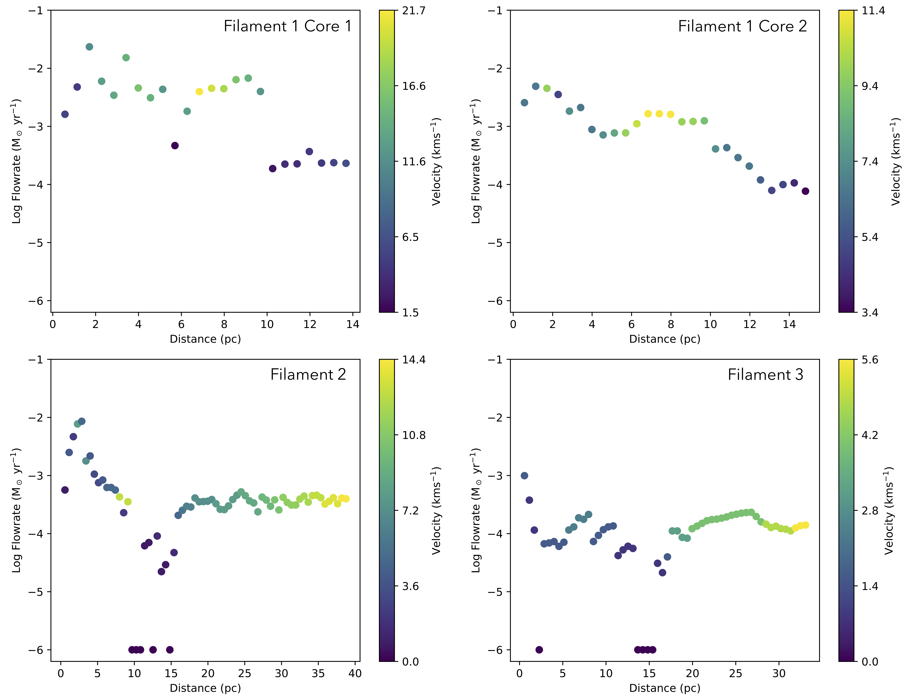
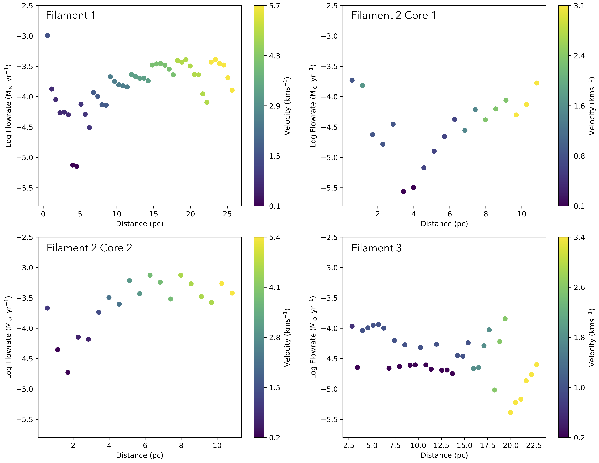

$\newcommand{\ensuremath}{}$
$\newcommand{\xspace}{}$
$\newcommand{\object}[1]{\texttt{#1}}$
$\newcommand{\farcs}{{.}''}$
$\newcommand{\farcm}{{.}'}$
$\newcommand{\arcsec}{''}$
$\newcommand{\arcmin}{'}$
$\newcommand{\ion}[2]{#1#2}$
$\newcommand{\textsc}[1]{\textrm{#1}}$
$\newcommand{\hl}[1]{\textrm{#1}}$
$\newcommand{\footnote}[1]{}$
$\newcommand{\flowrate}{~M_{\sun}\mathrm{yr}^{-1}}$

# From theory to observation: understanding filamentary flows in high-mass star-forming clusters

<mark>Appeared on: 2025-10-07</mark> -  _13 pages, 14 figures, accepted for publication in A&A_

M. R. A. Wells, et al. -- incl., <mark>H. Beuther</mark>

**Abstract:** Filamentary structures on parsec scales play a critical role in feeding star-forming regions, often acting as the main channels through which gas flows into dense clumps that foster star formation. Understanding the dynamics of these filaments is crucial for explaining the mechanisms of star formation across a range of environments. Here we use data from multi-scale galactic MHD simulations to observe filaments and star forming clumps on 10's of pc scales and investigate flow rate relationships along, and onto filaments as well as flows towards the clumps. Using the \texttt{FilFinderPPV} identification technique, we identify the prominent filamentary structures in each data cube. Each filament and its corresponding clump are analysed by calculating flow rates along each filament towards the clump, onto each filament from increasing distances, and radially around each clump. This analysis is conducted for two cubes, one feedback dominated region, and one with less feedback, as well as for five different inclinations (0, 20, 45, 70, and 90 degrees) of one filament and clump system. Looking at the face-on inclination of the simulations (0 degrees), we observe different trends depending on the environmental conditions (more or less feedback). The median flow rate in the region with more feedback is 8.9 $\times$ 10 $^{-5}$ $\flowrate$ and we see that flow rates along the filaments toward the clumps generally decrease in these regions. In the region with less feedback we have a median flow rate of 2.9 $\times$ 10 $^{-4}$ $\flowrate$ and when looking along the filaments here we see the values either increase or remain constant. We find that the flow rates from the environments onto the primary filaments are of an order of magnitude sufficient to sustain the flow rates along these filaments. When discussing the effects of galactic and filamentary inclination, we also observe that viewing the filaments from different galactic inclinations can reveal the presence of feeder structures (smaller filamentary structures aiding in the flow of material). Additionally, considering the inclination of the filaments themselves allows us to determine how much we are overestimating or underestimating the flow rates for those filaments. The different trends in the relationship between flow rate and distance along the filaments in both the feedback and non-feedback dominated cubes confirm that the environment is a significant factor in accretion flows and their relationship with filament parameters. The method used to estimate these flow rates, which has been previously applied to observational data, produced results consistent with those obtained from the simulations themselves, providing high confidence in the flow rate calculation method.

**Figure 11. -** Flow rate vs. distance relation for the quiet cubeDistance vs flow rate, in log space, relationship for each filament in the quiet cube (filaments are labelled in Fig. \ref{fig:quietcubeskel}), colour coded by velocity difference. (*fig:quiet_along*)

**Figure 10. -** Flow rate vs. distance relation for the active cubeDistance vs flow rate, in log space, relationship for each filament in the active cube (filaments are labelled in Fig. \ref{fig:activecubeskel}), colour coded by velocity difference. (*fig:active_along*)

**Figure 1. -** Along, onto and polar points demonstration0th moment map of the Active column density cube with the identified filamentary structure, colour coded by velocity, overlaid on top. Green, red and blue points indicating the different types of flow rate, green is along the filamentary structure, red is onto, and blue is polar around the clumps. 2.85 pc scale bar in the top right corner.  (*fig:starpoints*)

