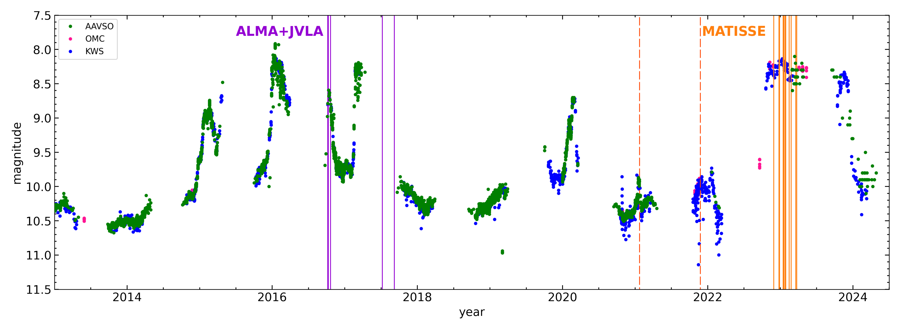
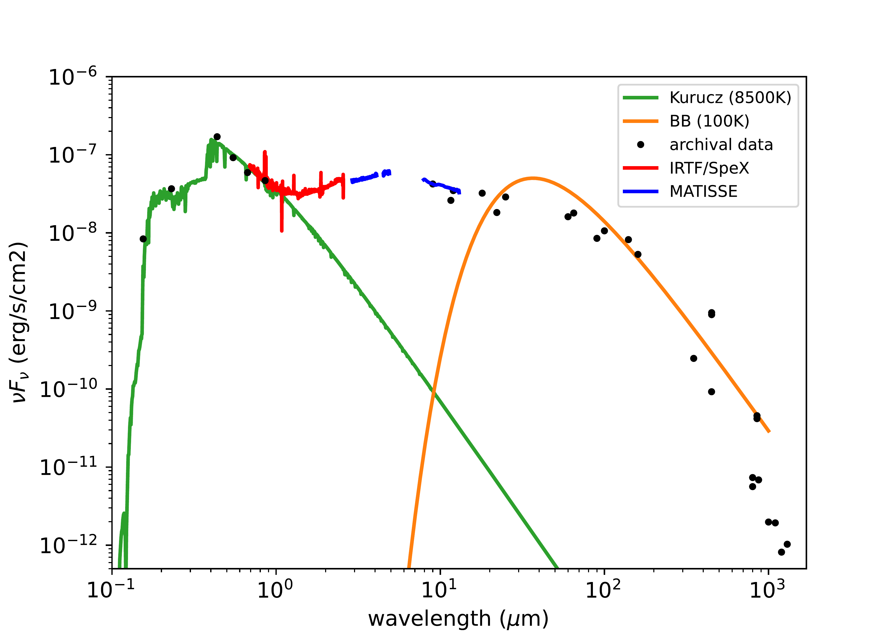
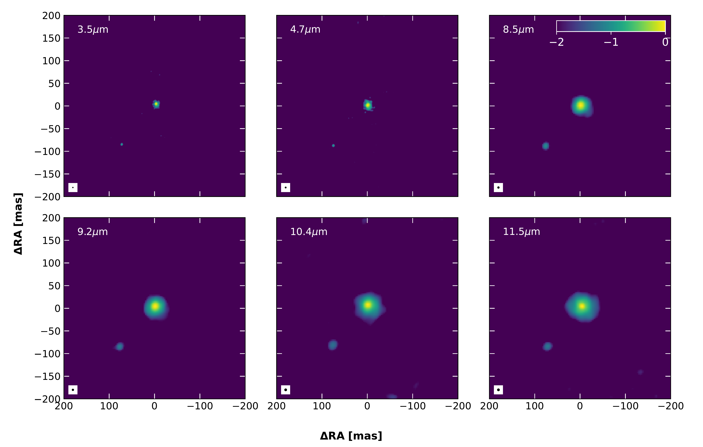

$\newcommand{\ensuremath}{}$
$\newcommand{\xspace}{}$
$\newcommand{\object}[1]{\texttt{#1}}$
$\newcommand{\farcs}{{.}''}$
$\newcommand{\farcm}{{.}'}$
$\newcommand{\arcsec}{''}$
$\newcommand{\arcmin}{'}$
$\newcommand{\ion}[2]{#1#2}$
$\newcommand{\textsc}[1]{\textrm{#1}}$
$\newcommand{\hl}[1]{\textrm{#1}}$
$\newcommand{\footnote}[1]{}$
$\newcommand{\micron}{\rm \mum}$
$\newcommand{\massyear}{M_\odot~yr^{-1}}$
$\newcommand{\kms}{km s^{-1}}$

# An interferometric mid-infrared study of the eruptive star binary Z CMa with MATISSE/VLTI$\thanks{Reproduced with permission from Astronomy \& Astrophysics, \textcopyright  ESO.}$: I. Imaging the protoplanetary disks during the 2023 outburst$\thanks{Based on observations collected at the European Organisation for Astronomical Research in the Southern Hemisphere under ESO programs 0106.C-0501(B), 0108.C-0385(D), and 0110.C-4209(A).}$

<mark>Appeared on: 2025-10-08</mark> -  _25 pages, 21 figures, accepted for publication in Astronomy & Astrophysics_

F. Lykou, et al. -- incl., <mark>T. Henning</mark>, <mark>P. Boley</mark>

**Abstract:**            The mid-infrared (MIR) emitting regions of the individual protoplanetary disks in the binary system Z CMa are resolved by MATISSE/VLTI. The observations were obtained during a serendipitous large outburst of the HBe star that lasted more than 100 days, while the FUor companion is presumed to be in quiescence. The size of the MIR-emitting disk region of the more massive HBe star increases toward longer wavelengths from $<14$ mas at 3.5$\mu m$ to $\ll 50$ mas at 11.5$\mu m$ . The lack of substructures in the HBe disk might suggest that it is a continuous disk; however, this could be due to observational constraints. We also note a radial variation of the silicate absorption feature over the disk, where the optical depth increases inwards of $<$40~au radii. This contradicts the scenario of a carved, dusty cocoon surrounding the HBe star. In the case of the less massive FUor companion, the MIR-emitting region is much smaller with an angular size $\leq$15 mas (or else a physical radius $<9$ au) in all bands, suggesting a compact disk. Both disks are aligned within uncertainties, and their orientation agrees with that of the known jets. Furthermore, MATISSE data place the binary's separation at $117.88 \pm 0.73$ mas and a position angle of $139.16^o\,\pm\,0.29^o$ east of north. Our estimates for the orbital elements gave an eccentric orbit ($e\sim0.17$) with a moderate inclination ($i\sim 66$\degr). The derived total mass is $M_{\rm total} = 16.4^{+2.1}_{-2.3}$ M$_\odot$, while the period is approximately 950 years. Our MATISSE imaging of the Herbig disk during outburst indicates a temperature gradient for the disk, while imaging of the FUor companion's disk corroborates previous studies showing that FUor disks are rather compact in the MIR. We cannot infer any misalignment between the MATISSE results and earlier ALMA/JVLA data, nor can we infer any influence from the alleged flyby event.         

**Figure 7. -** $V$-band light curve of Z CMa with corresponding epochs of MATISSE observations (orange lines; dashed and solid for the quiescent and the outburst phase, respectively) as in Table \ref{tab:matlog}. Photometric data from the Archive of the American Association of Variable Star Observers (AAVSO; green circles), the INTErnational Gamma-Ray Astrophysics Laboratory (INTEGRAL) Optical Monitoring Camera (OMC; magenta circles), and the Kamogata/Kiso/Kyoto Wide-field Survey of Variable Star Observers League in Japan \citep[KWS; blue circles][]{vsolj}. The imaging data were obtained during the outburst from late 2022 to early 2023. Also shown for reference are the epochs of archival ALMA and JVLA observations \citep[purple lines;][]{takami2019}. (*fig:vislc*)

**Figure 1. -** Dereddened SED of Z CMa during the 2023 outburst. Our own SpeX/IRTF and MATISSE spectra are shown in red and blue, respectively. For a description of the archival photometry (black points), we refer the reader to Sect. \ref{phot}. A Kurucz model (green) and a blackbody model (orange) are shown for reference.  (*fig:specsed*)

**Figure 8. -** MiRA image reconstructions in $L$, $M$, and $N$ bands during the 2023 outburst. From left to right and top to bottom, these correspond to pseudo-continuum reconstructed images at 3.5, 4.7, 8.5, 9.2, 10.4, and 11.5 $\micron$. These are smoothed with a Gaussian beam with a FWHM similar to the image resolution, normalized to unity, and shown in a logarithmic stretch with a minimum value of $10^{-2}$ to suppress image reconstruction residuals below that level. Such residuals are the result of insufficient $uv$ coverage (Fig. \ref{fig:uv}).  The SE component (FUor) becomes much fainter than the NW component (HBe) at longer wavelengths. The beam size is shown as a black circle at the bottom left corner of each panel.  (*fig:mirarecon*)

