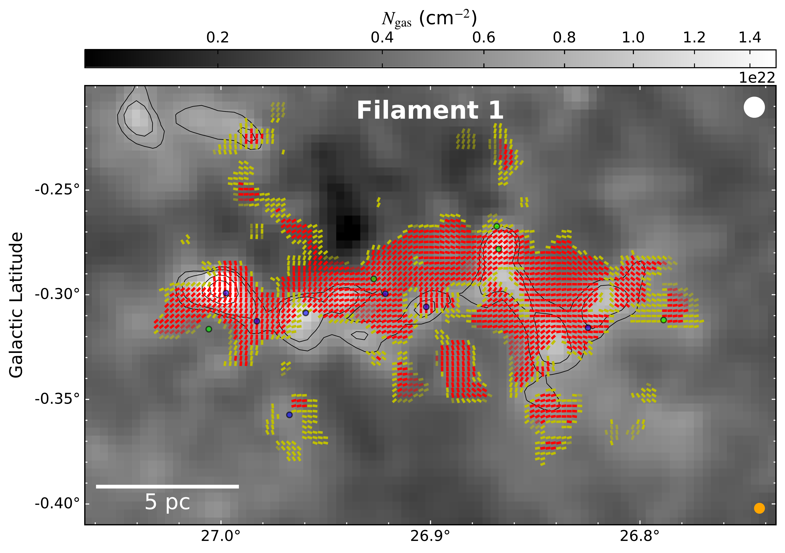

$\newcommand{\ensuremath}{}$
$\newcommand{\xspace}{}$
$\newcommand{\object}[1]{\texttt{#1}}$
$\newcommand{\farcs}{{.}''}$
$\newcommand{\farcm}{{.}'}$
$\newcommand{\arcsec}{''}$
$\newcommand{\arcmin}{'}$
$\newcommand{\ion}[2]{#1#2}$
$\newcommand{\textsc}[1]{\textrm{#1}}$
$\newcommand{\hl}[1]{\textrm{#1}}$
$\newcommand{\footnote}[1]{}$
$\newcommand{\pfrac}{P_{\text{frac}}}$
$\newcommand{\sigpfrac}{\sigma_{P_{\text{frac}}}}$
$\newcommand{\ceooz}{\mbox{C^{18}O(1--0)}}$
$\newcommand{\ceoto}{\mbox{C^{18}O(2--1)}}$
$\newcommand{\ttcooz}{\mbox{^{13}CO(1--0)}}$
$\newcommand{\ttcoto}{\mbox{^{13}CO(2--1)}}$
$\newcommand{\Ngas}{N_{\text{gas}}}$
$\newcommand{\smallngas}{n_{\text{gas}}}$
$\newcommand{\NHt}{N_{\text{H_2}}}$
$\newcommand{\NHe}{N_{\text{He}}}$
$\newcommand{\muHt}{\mu_{\text{H_2}}}$
$\newcommand{\mup}{\mu_p}$
$\newcommand{\kms}{km s^{-1}}$
$\newcommand{\tco}{\mbox{^{13}CO(1--0)}}$
$\newcommand{\ceo}{\mbox{C^{18}O(1--0)}}$
$\newcommand{\nht}{\mbox{NH_3(1,1)}}$

# Magnetic Fields in the Bones of the Milky Way

<mark>Appeared on: 2025-10-08</mark> -  _Accepted to ApJ_

I. W. Stephens, et al. -- incl., <mark>M. Zhang</mark>

**Abstract:** Stars primarily form in galactic spiral arms within dense, filamentary molecular clouds. The largest and most elongated of these molecular clouds are referred to as "bones," which are massive, velocity-coherent filaments (lengths $\sim$ 20 to $>$ 100 pc, widths $\sim$ 1--2 pc) that run approximately parallel and in close proximity to the Galactic plane. While these bones have been generally well characterized, the importance and structure of their magnetic fields (B-fields) remain largely unconstrained. Through the SOFIA Legacy program FIELDMAPS, we mapped the B-fields of 10 bones in the Milky Way. We found that their B-fields are varied, with no single preferred alignment along the entire spine of the bones. At higher column densities, the spines of the bones are more likely to align perpendicularly to the B-fields, although this is not ubiquitous, and the alignment shows no strong correlation with the locations of identified young stellar objects. We estimated the B-field strengths across the bones and found them to be $\sim$ 30--150 $\mu$ G at pc scales. Despite the generally low virial parameters, the B-fields are strong compared to the local gravity, suggesting that B-fields play a significant role in resisting global collapse. Moreover, the B-fields may slow and guide gas flow during dissipation. Recent star formation within the bones may be due to high-density pockets at smaller scales, which could have formed before or simultaneously with the bones.

**Figure 1. -** 
Top Panel: Filament 1 inferred B-field vectors overlaid on the Herschel-derived column density map, with contours for this figure and in Appendix \ref{appendix:vectormaps} at [0.63, 0.75, 1.3, 1.8, 2.5, 5.0, 7.5]$\times$ 10$^{22}$ cm$^{-2}$. Bright red and yellow vectors have measurements of $\pfrac$/$\sigpfrac$$>$ 3 and 2 $\leq$\pfrac/$\sigpfrac$$\leq$ 3, respectively; faded vectors indicate where $\pfrac$$>$ 0.15. Blue and green circles mark known Class I and II YSOs, respectively (Section \ref{sec:YSOs}).  Vectors are spaced by 2 HAWC+ pixels (9$\farcs$1), near Nyquist sampling. Bottom Panel: LIC map overlaid on column density, where the wavy pattern shows the B-field direction for $\pfrac$/$\sigpfrac$$>$ 1.5 and $I/\sigma_I$$>$ 10. The spine's polynomial fit is the solid line. The white beam (top right;  36$\farcs$4) shows the resolution for the column density map and the orange beam (bottom right; 18$\farcs$7) shows the resolution for SOFIA/HAWC+.  (*fig:fil1vectors*)

**Figure 4. -** $\Ngas$ versus $|\theta_B -\theta_{\text{fil}}|$ for each bone, shown for every other HAWC+ pixel (approximately Nyquist sampled). Only data within 23$\arcsec$ of the bone (two spine pixels) are considered. The data is binned into 10 equal $\Ngas$ ranges, and box plots are shown if there are at least 4 points in the bin. The box plots show the first and third quartiles in black and the median in orange. A red vertical line is shown for the first $\Ngas$ box plot bin where $|\theta_B -\theta_{\text{fil}}|$$>$ 60$^\circ$, which indicates the first sign of perpendicularity with $\Ngas$. Blue and green circles show the $\Ngas$ and $|\theta_B -\theta_{\text{fil}}|$ values at the nearest pixel for the known Class I and II YSOs, respectively.  (*fig:columndiff*)

**Figure 5. -** Cumulative distribution function of the angle difference between each bone's spine and B-field direction, $|\theta_B -\theta_{\text{fil}}|$. Only pixels within 23$\arcsec$ of the spine are considered. The red line in each panel shows the results for that particular bone. The blue lines in each panel show a Monte Carlo simulation of the expected distribution of projected angles if the spine and B-field directions in 3D are mostly parallel (within $0^\circ$ to $20^\circ$; dashed blue line), mostly perpendicular (within $70^\circ$ to $90^\circ$; dashed-dotted blue line), or random (solid blue line). The cyan lines show the expected projected angles if the bone is fixed in the plane-of-the-sky for mostly parallel (dashed cyan line) and mostly perpendicular (dashed-dotted cyan line).   (*fig:cdfs*)

