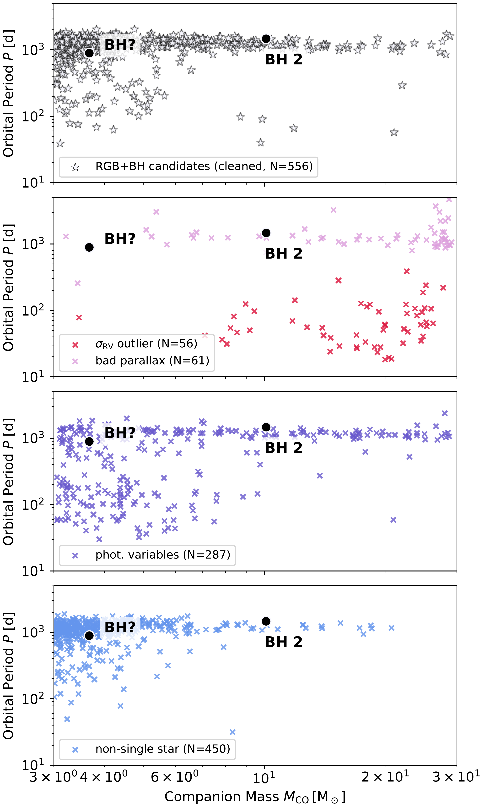

$\newcommand{\ensuremath}{}$
$\newcommand{\xspace}{}$
$\newcommand{\object}[1]{\texttt{#1}}$
$\newcommand{\farcs}{{.}''}$
$\newcommand{\farcm}{{.}'}$
$\newcommand{\arcsec}{''}$
$\newcommand{\arcmin}{'}$
$\newcommand{\ion}[2]{#1#2}$
$\newcommand{\textsc}[1]{\textrm{#1}}$
$\newcommand{\hl}[1]{\textrm{#1}}$
$\newcommand{\footnote}[1]{}$
$\newcommand{\aj}{Astronomical Journal}$
$\newcommand{\apj}{Astrophysical Journal}$
$\newcommand{\aap}{Astronomy \& Astrophysics}$
$\newcommand{\jcap}{Journal of Cosmology and Astroparticle Physics}$
$\newcommand{\aapr}{The Astronomy and Astrophysics Review}$
$\newcommand{\mnras}{Monthly Notices of the Royal Astronomical Society}$
$\newcommand{\araa}{Annual Review of Astronomy and Astrophysics}$
$\newcommand{\Msun}{\mathrm{M}_\odot}$

# Dormant BH candidates from _Gaia_ DR3 summary diagnostics

<mark>Appeared on: 2025-10-08</mark> -  _17 pages, 15 figures, submitted to A&A, comments welcome, catalogues are available here: this https URL_

<mark>J. Müller-Horn</mark>, et al. -- incl., <mark>H.-W. Rix</mark>, <mark>K. El-Badry</mark>, <mark>B. Pennell</mark>, <mark>J. Li</mark>, <mark>R. Seeburger</mark>

**Abstract:** We present a rigorous identification of candidates for dormant black holes (BHs) and neutron stars (NSs) in binaries using summary statistics from _Gaia_ Data Release 3 (DR3), rather than full orbital solutions. Although _Gaia_ astrometric orbits have already revealed a small sample of compact object binaries, many systems remain undetected due to stringent quality cuts imposed on the published orbits.    Using a forward-modelling framework that simulates _Gaia_ observables, in particular the renormalised unit weight error ( \texttt{ruwe} ) and radial velocity (RV) scatter, we infer posterior distributions for companion mass and orbital period via Markov chain Monte Carlo (MCMC) sampling, marginalising over nuisance orbital parameters. We validate our approach by comparing the predicted masses and periods against full orbit solutions from DR3, and by successfully recovering known compact object binaries as promising candidates.    The method is best suited for systems with red giant primaries, which have more reliable _Gaia_ RV scatter and a light centroid more likely dominated by one component, compared to main-sequence stars. And they are less likely to be triples with short-period inner binaries, which produce confounding signatures.    We apply the method to three million giants and identify 556 systems with best-fit companion masses $\gtrsim 3 \mathrm{M}_\odot$ . Recovery simulations suggest our selection method is substantially more sensitive than the DR3 non-single-star catalogue, particularly for binaries with periods below 1 year and above $\sim 6$ years.    These candidates represent promising targets for spectroscopic follow-up and _Gaia_ DR4 analysis to confirm the presence of compact objects and build a more complete census of the Galactic BH and NS population. Candidate main-sequence stars with massive companions face a larger set of confounding effects. Therefore, we present an analogous catalogue of 279 additional `main sequence' candidates only as an appendix.

**Figure 16. -** Simulated completeness of the RGB+BH binary catalogue as a function of BH mass and orbital period. Top panels: Mean values of predicted \texttt{ruwe}(left) and \texttt{rv\_amplitude\_robust}(right) from mock _Gaia_ DR3 observations, shown for simulated binaries with BH masses of 5, 10, and 20 M$_\odot$. Shaded regions indicate one standard deviation from the mean. Threshold values for the cuts on excess scatter in RV and position applied to the candidate sample are shown in black. Larger BH masses generally yield stronger astrometric and RV signals. Astrometric \texttt{ruwe} increases with orbital period up to the DR3 baseline ($\sim$1000 d) while the RV amplitude is highest for short-period systems.
    Bottom panels: Recovery fractions for simulated binaries that pass the initial cuts on excess scatter in RV and position (left), that exceed the inferred companion mass threshold of 3 M$_\odot$(centre), and that meet both criteria (right). The final completeness is highest ($\gtrsim$80\% for 10–20 M$_\odot$ BH) for binaries with periods of 100–2000 d. Completeness decreases for longer periods due to incomplete phase coverage within the DR3 observing baseline. For reference, we show approximate completeness fractions for the _Gaia_ DR3 astrometric (dashed) and spectroscopic (dotted) orbital solutions estimated based on the \texttt{gaiamock} forward-model and SBX catalogue of spectroscopic binaries (see Sect. \ref{sec:completeness} for details). (*fig:completeness*)

**Figure 2. -** Predicted vs. catalogued _Gaia_ DR3 summary statistics for known binaries, with the predictions based on forward modelling of their orbital parameters. Top panel: Comparison between predicted and catalogue values of the astrometric goodness of fit of the single-star astrometric solution, \texttt{ruwe}, for binaries with published orbital solutions. Bottom panel: Predicted vs. observed RV "errors" for spectroscopic binaries (SB1) in _Gaia_ DR3. In both plots, the blue line shows the median trend, while the dashed blue lines indicate the 16th and 84th percentiles. The 1:1 relation is marked in black. Lower subpanels show the logarithmic residuals between observed and predicted values, with side histograms illustrating their normalised distribution. The mean bias ($\mu$) and scatter ($\sigma$) of the residuals are indicated. (*fig:forward_model*)

**Figure 6. -** Inferred orbital periods and companion masses for the 1410 RGB stars with excess RV and astrometric scatter and companion mass estimates above $3 \mathrm{M}_\odot$. The top panel shows the final cleaned catalogue of 556 RGB+BH candidates (see Sect. \ref{sec:cleaning}), obtained after applying a series of quality cuts. The lower panels display the subsets of sources removed as likely contaminants by said cuts. Stars excluded because of spurious RV scatter (red) are concentrated at short inferred periods and high companion masses. Those with unreliable, underestimated parallaxes (pink) are typically found at long inferred periods. Eclipsing binaries and stars with photometric variability in excess of that expected from ellipsoidal modulation (purple) are scattered across both short and long periods. Systems excluded due to existing NSS orbital solutions (blue) occupy a broadly similar parameter space as the final candidates. (*fig:cleaning*)

