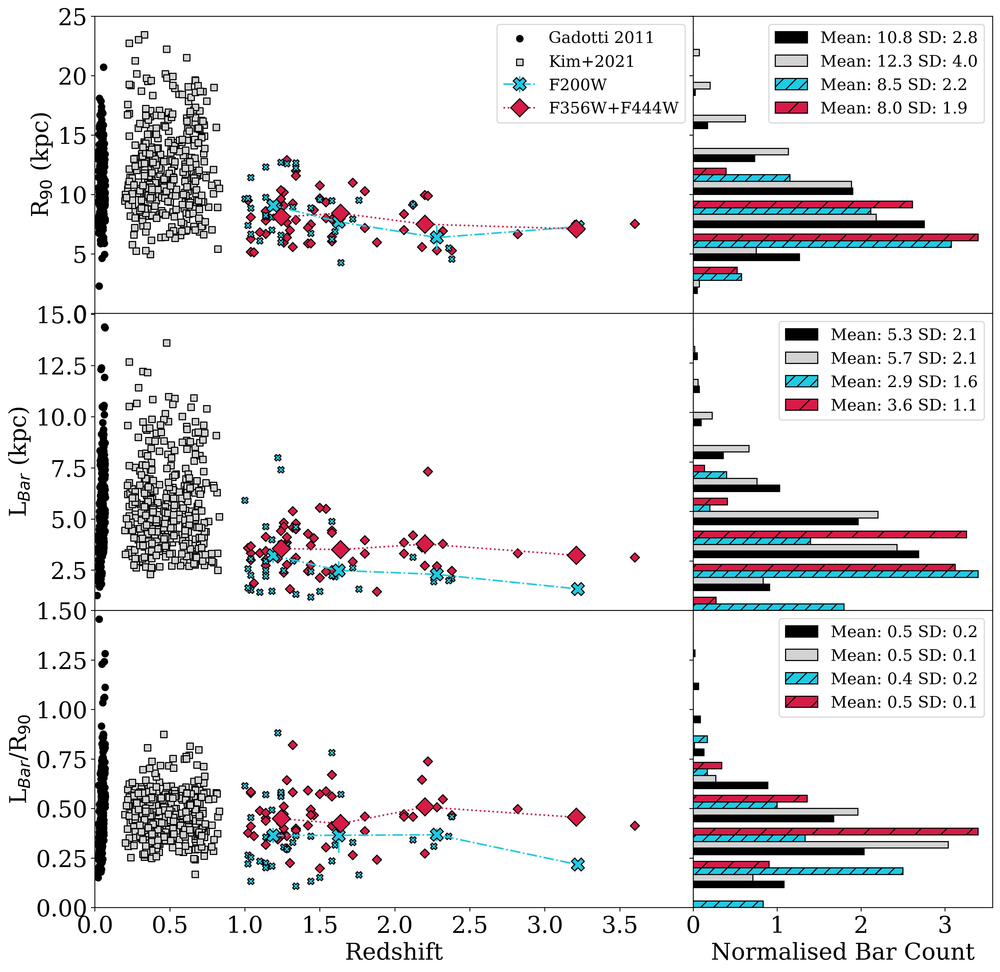
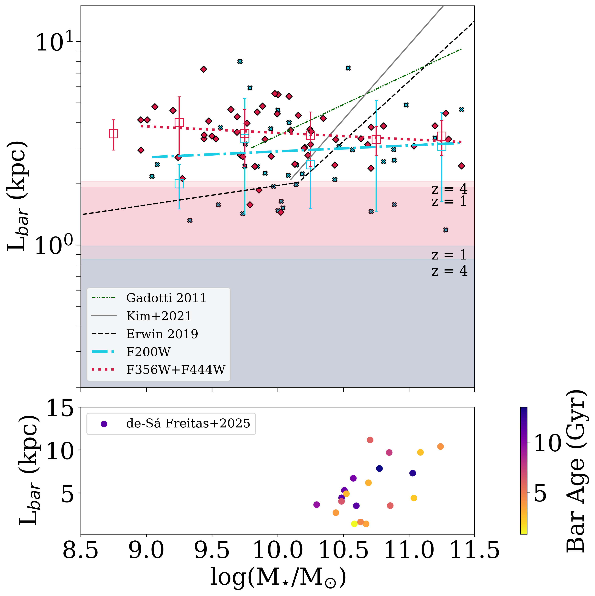
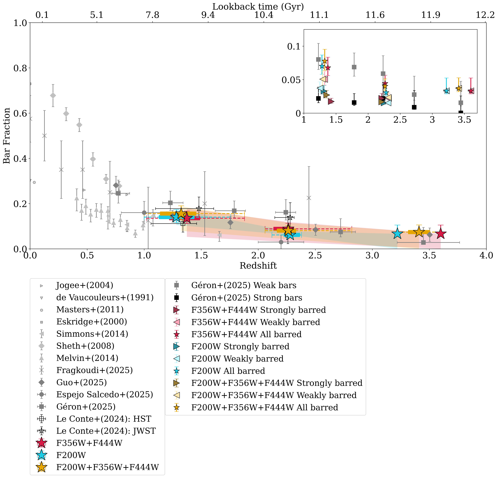

$\newcommand{\ensuremath}{}$
$\newcommand{\xspace}{}$
$\newcommand{\object}[1]{\texttt{#1}}$
$\newcommand{\farcs}{{.}''}$
$\newcommand{\farcm}{{.}'}$
$\newcommand{\arcsec}{''}$
$\newcommand{\arcmin}{'}$
$\newcommand{\ion}[2]{#1#2}$
$\newcommand{\textsc}[1]{\textrm{#1}}$
$\newcommand{\hl}[1]{\textrm{#1}}$
$\newcommand{\footnote}[1]{}$
$\newcommand{\arraystretch}{1.5}$
$\newcommand{\thebibliography}{\DeclareRobustCommand{\VAN}[3]{##3}\VANthebibliography}$

# The evolution of the bar fraction and bar lengths in the last 12 billion years

<mark>Appeared on: 2025-10-10</mark> -  _18 pages, 12 figures. Submitted to MNRAS_

Z. A. L. Conte, et al. -- incl., <mark>J. Neumann</mark>

**Abstract:** We investigate the evolution of the bar fraction and length using an extended JWST NIRCam imaging dataset of galaxies in the $1 \leq z \leq 4$ redshift range. We assess the wavelength dependence of the bar fraction in disc galaxies and bar length evolution by selecting a nearly mass-complete CEERS disc sample and performing independent visual classifications on the short (F200W) and long (F356W+F444W) wavelength channels. A similar bar fraction is observed for both samples, and combined we find a declining trend in the bar fraction: $0.16^{+0.03}_{-0.03}$ at $1 \leq z < 2$ ; $0.08^{+0.02}_{-0.01}$ at $2 \leq z < 3$ ; $0.07^{+0.03}_{-0.01}$ at $3 \leq z \leq 4$ . This corroborates our previous work and other recent studies, suggesting that dynamically cold and rotationally supported massive discs are present at Cosmic Noon. No evolution in the F356W+F444W bar length is measured from $z = 4$ to $z = 1$ , which has a mean of 3.6 kpc, but a slight increase of about 1 kpc towards $z = 1$ is measured in the F200W sample, which has a mean of 2.9 kpc. The bar sample is shorter in the short-wavelength channel due to the better physical spatial resolution; however, we also suggest that dust obscuration plays a role. We find that the correlation between bar length and galaxy mass for massive galaxies observed at $z < 1$ is not seen at $z > 1$ . By adding samples of barred galaxies at $z<1$ , we show that there is a modest increase in the bar length ( $\approx 2$ kpc) towards $z=0$ , but bars longer than $\approx8$ kpc are only found at $z<1$ . We show that bars and discs grow in tandem, for the bar length normalised by disc size does not evolve from $z = 4$ to $z = 0$ . Not only is a significant population of bars forming beyond $z = 1$ , but our results also show that some of these bars are as long and strong as the average bar at $z\approx0$ .

**Figure 11. -** The evolution of the bar length over $0 \leq z \leq 4$. The left panels show lengths measured in this work from JWST NIRCam filters F200W (blue) and F356W+F444W (red) for bars found in galaxies between the redshift range $1 \leq z \leq 4$, with their normalised distribution (see text for details) shown on the right panels. The first row shows the distribution of $R_{90}$, whilst the second row is the deprojected $L_{bar}$ and the third row is the normalised $L_{bar}$, $L_{bar}/R_{90}$. The high redshift sample is compared against a sample of SDSS $i-$band barred galaxies at $z \approx 0$\citepalias[][black]{Gadotti_2011} and a sample of barred galaxies at $0.2 < z \leq 0.835$ using F814W images from the COSMOS survey \citepalias[][grey]{Kim_2021}. The mean value for each parameter in each sample is given in the right panel, with the standard deviation. (*fig:length dist*)

**Figure 7. -** Bar length versus stellar mass for JWST NIRCam barred galaxies at $1 \leq z \leq 4$. The two JWST samples in F200W (crosses) and F356W+F444W (diamonds) with ordinary least squares fits (dash-dotted and dotted, respectively); binned mean L$_{bar}$ as boxes and standard deviation as error bars. The green dash-dot-dotted is the ordinary least squares fit to nearby SDSS barred galaxies from \citetalias{Gadotti_2011}. The grey solid line is the ordinary least squares bisector fit to barred galaxies between $0.2 \leq z \leq 0.8$ from \citetalias{Kim_2021}. The black dashed line shows the locally weighted regression fit for nearby S$^4$G  spiral galaxies from \citet{Erwin_2019}. The red and blue shaded regions show $2 \times FWHM$ for the lower and upper redshift boundaries of the F356W+F444W and F200W samples, respectively. The bottom panel shows the bar length stellar mass relation for local galaxies with bar ages estimated. (*fig: length-mass*)

**Figure 10. -** Evolution of the bar fraction in disc galaxies. At high-$z$ the bar fraction is found in three redshift bins, $1 \leq z < 2$, $2 \leq z < 3$ and $3 \leq z \leq 4$, using the visual classification of the images from the JWST NIRCam filters F356W+F444W (red stars) and F200W (blue stars) and combining these results to find a total bar fraction (yellow stars). Error bars in $f_{bar}$ are the $1\sigma$ bimodal interval, and the shaded area is the upper and lower bounds of the bar fraction (see text for details). Dashed horizontal error bars show the full range in $z$ of the identified bars, while thick horizontal solid lines show the corresponding 25\%-75\% inter-quartile range. The insert shows the bar fraction for the breakdown of strongly (right-pointing triangle) and weakly (left-pointing triangle) barred galaxies. The results of Paper 1 are black unfilled squares (HST) and stars (JWST), and in grey are the JWST bar fraction of \citetalias{Guo_2025}(diamond), \citetalias{Salcedo_2025}(circle) and \citetalias{Géron_2025}(square). (*fig:bar fraction*)

