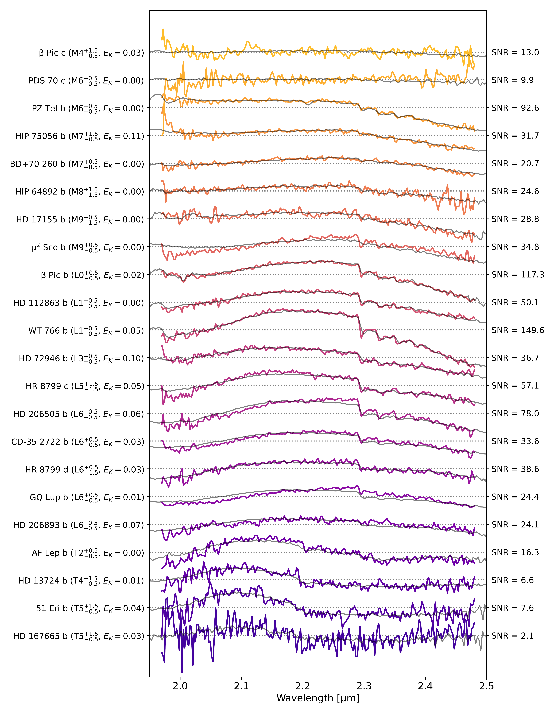

$\newcommand{\ensuremath}{}$
$\newcommand{\xspace}{}$
$\newcommand{\object}[1]{\texttt{#1}}$
$\newcommand{\farcs}{{.}''}$
$\newcommand{\farcm}{{.}'}$
$\newcommand{\arcsec}{''}$
$\newcommand{\arcmin}{'}$
$\newcommand{\ion}[2]{#1#2}$
$\newcommand{\textsc}[1]{\textrm{#1}}$
$\newcommand{\hl}[1]{\textrm{#1}}$
$\newcommand{\footnote}[1]{}$
$\newcommand{\micron}{\text{\textmu m}}$
$\newcommand{\red}[1]{\textcolor{black}{#1}}$

# The ExoGRAVITY survey: a _K_-band spectral library of giant exoplanet and brown dwarf companions

<mark>Appeared on: 2025-10-13</mark> -  _21 pages, 11 figures, accepted for publication in A&A_

J. Kammerer, et al. -- incl., <mark>T. Henning</mark>, <mark>M. Benisty</mark>, <mark>W. Brandner</mark>, <mark>G. Chauvin</mark>, <mark>P. Garcia</mark>, <mark>L. Kreidberg</mark>, <mark>P. Mollière</mark>, <mark>M. Samland</mark>

**Abstract:** Direct observations of exoplanet and brown dwarf companions with near-infrared interferometry, first enabled by the dual-field mode of VLTI/GRAVITY, provide unique measurements of the objects' orbital motion and atmospheric composition. Here, we compile a homogeneous library of all exoplanet and brown dwarf _K_ -band spectra observed by GRAVITY thus far. This ExoGRAVITY Spectral Library is made publicly available online. $\red{We re-reduce all available GRAVITY dual-field high-contrast data in a uniform and highly automated way and, where companions are detected, extract their $\sim2.0$--$2.4 \micron$ _K_-band contrast spectra.}$ We then derive stellar model atmospheres for all employed flux references (either the host star or the swap calibrator) that we use to convert the companion contrast into companion flux spectra. Solely from the resulting GRAVITY _K_ -band flux spectra, we extract spectral types, spectral indices, and bulk physical properties for all companions. Finally, and with the help of age constraints from the literature, we also derive isochronal masses for most companions using evolutionary models. The resulting library contains $R \sim 500$ GRAVITY _K_ -band spectra of 39 substellar companions from late M to late T spectral type, including the entire L-T transition. Throughout this transition, a shift from CO-dominated late M- and L-type dwarfs to CH $ _4$ -dominated T-type dwarfs can be observed in the _K_ -band. The GRAVITY spectra alone constrain the objects' bolometric luminosity to typically within $\pm0.15$ dex. The derived isochronal masses agree with dynamical masses from the literature where available, except for HD 4113 c for which we confirm its previously reported potential underluminosity. Medium resolution spectroscopy of substellar companions with GRAVITY provides insight into the carbon chemistry and the cloudiness of these objects' atmospheres. It also constrains these objects' bolometric luminosity which can yield measurements of their formation entropy if combined with dynamical masses, for instance from Gaia and GRAVITY astrometry.

**Figure 1. -** $\red${Combination of the GRAVITY epochs of HD 206505 b after scaling them to bring them into mutual agreement.}_Top panel_: GRAVITY _K_-band flux spectra for each individual epoch. The $3\sigma$ flux uncertainties are shown as shaded regions. The legend reveals that for this object, both observations were done in dual-field on-axis mode, with the companion located at an angular separation of $425$ mas from the host star. _Bottom panel_: Scaled GRAVITY flux spectra for each individual epoch and the resulting combined spectrum (black line). The legend reveals the scale factors applied to each epoch (values in brackets). (*fig:hd206505_b_all*)

**Figure 6. -** GRAVITY _K_-band spectra at medium spectral resolution ($R \sim 500$) of the 22 substellar companions with well-constrained spectral type, sorted from M-type (top) to T-type (bottom). The spectra are scaled with respect to each other by the ratio of the square root of their SNR and their mean flux, and they are offset along the y-axis so that their mean value is located at the height of their corresponding tick mark for better readability. The best fitting spectral type templates from the SpeX Prism Libraries are shown in gray with their corresponding _K1_-_K2_ extinction $E_K$ in units of magnitudes shown on the left. The SNR of each spectrum is shown on the right. (*fig:all_combined_spectra_good*)

**Figure 8. -** _Left panel_: Sonora Diamondback hybrid gravity solar metallicity (\citealp{morley2024}) and BHAC15 (\citealp{baraffe2015}) cooling curves for substellar companions. The 37 objects from the ExoGRAVITY Spectral Library with age constraints available in the literature are shown by red points, and those with dynamical mass measurements have a black contour. Cooling curves for a few masses are highlighted in blue (1 m$\text{M}_\text{sol} = 1.048 \text{M}_\text{Jup}$). _Right panel_: Correlation between dynamical mass constraints from the literature and evolutionary mass constraints from GRAVITY. HD 984 b lies outside the shown mass range but is still consistent between its evolutionary and dynamical mass to within $2\sigma$. (*fig:evolutionary_models*)

