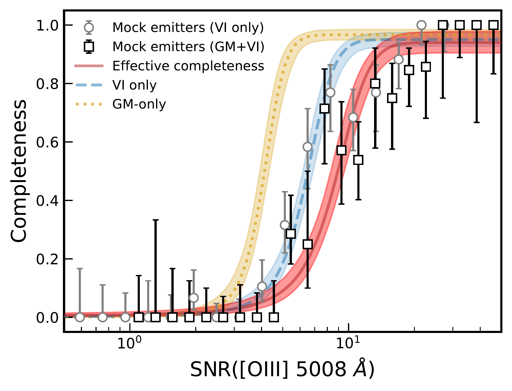
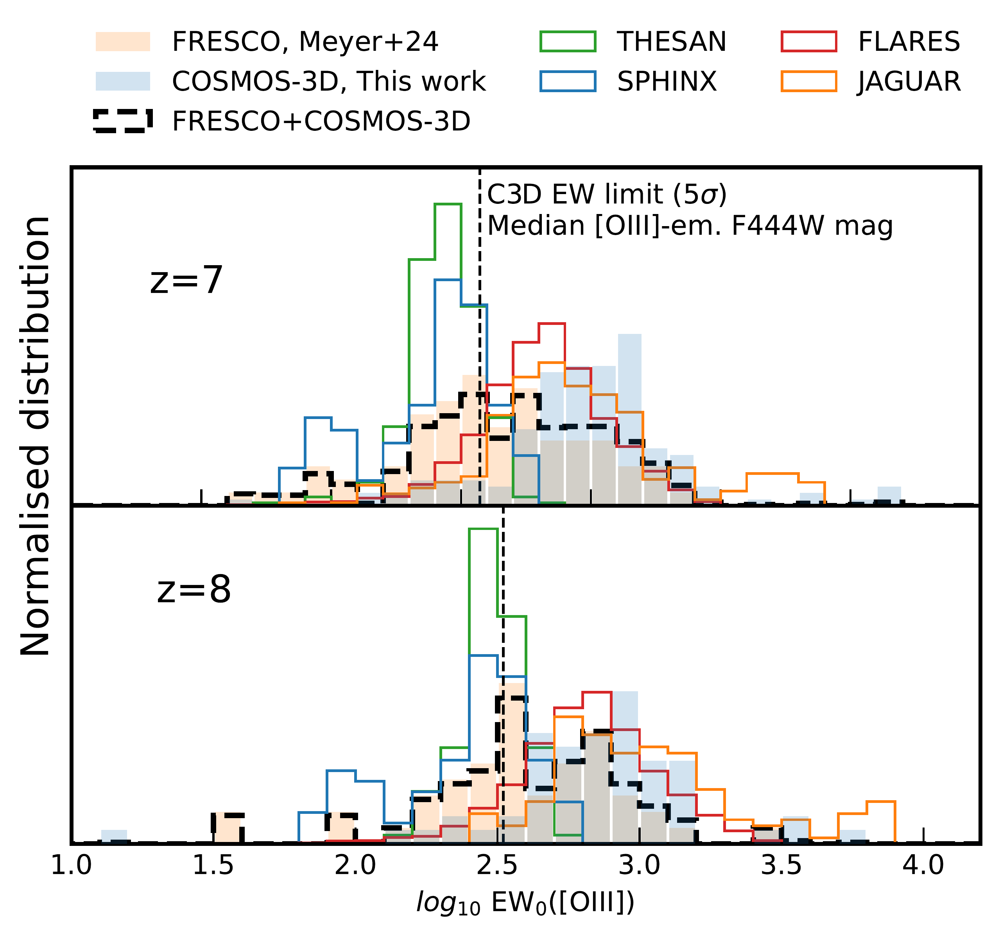

$\newcommand{\ensuremath}{}$
$\newcommand{\xspace}{}$
$\newcommand{\object}[1]{\texttt{#1}}$
$\newcommand{\farcs}{{.}''}$
$\newcommand{\farcm}{{.}'}$
$\newcommand{\arcsec}{''}$
$\newcommand{\arcmin}{'}$
$\newcommand{\ion}[2]{#1#2}$
$\newcommand{\textsc}[1]{\textrm{#1}}$
$\newcommand{\hl}[1]{\textrm{#1}}$
$\newcommand{\footnote}[1]{}$
$\newcommand{\oiii}{\ifmmode \text{[O~{\sc iii}]} \else[O~{\sc iii}]\fi}$
$\newcommand{\neiii}{[Ne~{\sc iii}]}$
$\newcommand{\ha}{\ifmmode \text{H}\alpha \else H\alpha\fi}$
$\newcommand{\hb}{\ifmmode \text{H}\beta \else H\beta\fi}$
$\newcommand{\oiiihb}{\text{\oiii+\hb}}$
$\newcommand{\kms}{\rm{km s}^{-1}}$
$\newcommand{\arraystretch}{1.3}$
$\newcommand{\arraystretch}{1.3}$
$\newcommand{\arraystretch}{1.3}$

# JWST COSMOS-3D: Spectroscopic Census and Luminosity Function of $\oiii$  Emitters at $6.75\!<\!z\!<\!9.05$ in COSMOS

<mark>Appeared on: 2025-10-14</mark> -  _Submitted to A&A. 10 pages + appendices. [OIII] catalogue release after acceptance. Comments welcome!_

R. A. Meyer, et al. -- incl., <mark>J. Matharu</mark>

**Abstract:** We present a spectroscopically-selected $\oiiihb$ emitters catalogue at $6.75\!<\!z\!<\!9.05$ and the resulting $\oiii$ $5008$ Å  Luminosity Function (LF) in the COSMOS field. We leverage the 0.3 deg $^{2}$ covered  to date by COSMOS-3D using NIRCam/WFSS F444W ( $90\%$ of the survey) to perform the largest spectroscopic search for $\oiii$ emitters at $6.75\!<\!z\!<\!9.05$ . We present our catalogue of $237$ $\oiii$ emitters and their associated completeness function. The inferred constraints on the $\oiii$ LF enable us to characterise the knee of the $\oiii$ LF, resulting in improved $\oiii$ LF constraints at $z\sim 7, 8$ . Notably, we find evidence for an accelerated decline of the $\oiii$ luminosity density between $z\sim7$ and $z\sim8$ , which could be expected if the metallicity of $\oiii$ emitters, as well as the cosmic star-formation rate density, is declining at these redshifts. We find that theoretical models that reproduce the $z\sim7,8$ $\oiii$ LF do not reproduce well the $\oiii$ equivalent width distribution, pointing to potential challenges in the modelling of $\oiii$ and other nebular lines in the early Universe. Finally, we provide the first constraints on the cosmic variance of $\oiii$ emitters, estimating at $15\%$ the relative uncertainty for the z $\sim 7,8$ $\oiii$ LF in the 0.3 deg $^2$ field. This estimate is in good agreement with that inferred from clustering, and shows that the $\oiii$ LF derived from smaller extragalactic legacy fields is strongly affected by cosmic variance. Our results highlight the fundamental role that wide-area JWST slitless surveys play to map the galaxy large-scale structure down into the reionisation era, serving as a springboard for a variety of science cases.

**Figure 1. -** 2D SNR spectra of all $237$ individual $\oiii$ emitters reported in this work. The emitters are ordered by redshift (only a subsample of redshifts are shown on the y-axis for readability). (*fig:fig1_allspectra*)

**Figure 2. -** Completeness functions for the $\oiii$hb emitter search as a function of the measured $\oiii$ 5008 $Å$ SNR. The black square datapoints and red curve denote the effective completeness including the initial Gaussian-matched filtering (GM) and the subsequent visual inspection (VI). The best-fit completeness function of each separate step is shown with yellow and blue lines, as well as the binned data values for the visual inspection (gray dots). Note that the visual inspection is specific to the quality threshold chosen (here $q\geq1.5$).  (*fig:completeness_function*)

**Figure 3. -** Equivalent width ($EW_0$) distribution of the $\oiii$ emitters in this work, FRESCO  ([Meyer, Oesch and Giovinazzo 2024]())  and predictions from THESAN \citep[][]{Kannan2022a,Kannan2022}  , SPHINX \citep[][]{Katz2023_sphinx}  , JAGUAR \citep[][]{Williams2018}  , FLARES \citep[][]{Lovell2021,Wilkins2023_o3}  . The combined distribution of FRESCO and COMSOS-3D, re-weighted by survey area, is shown in dashed black lines.  (*fig:ew_o3*)

