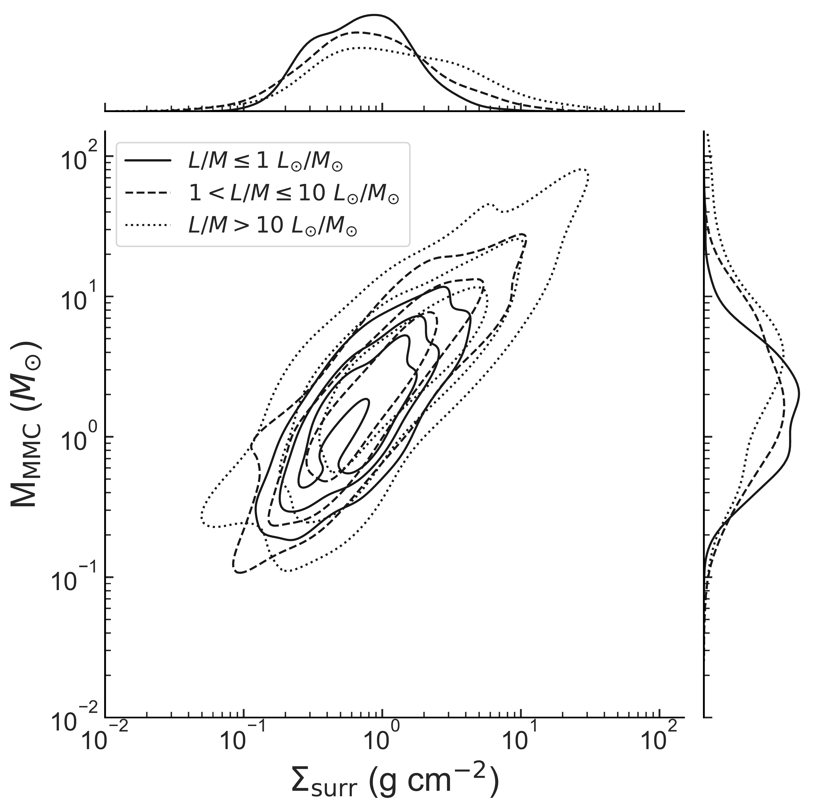
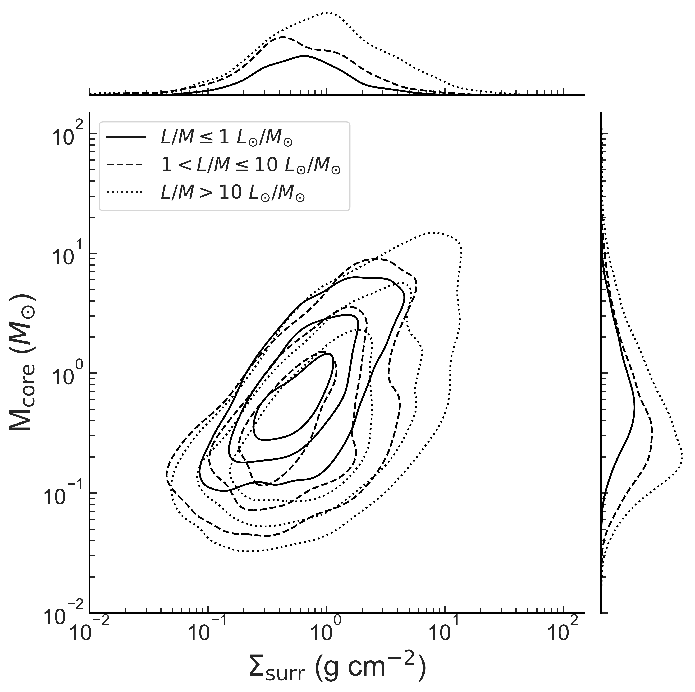
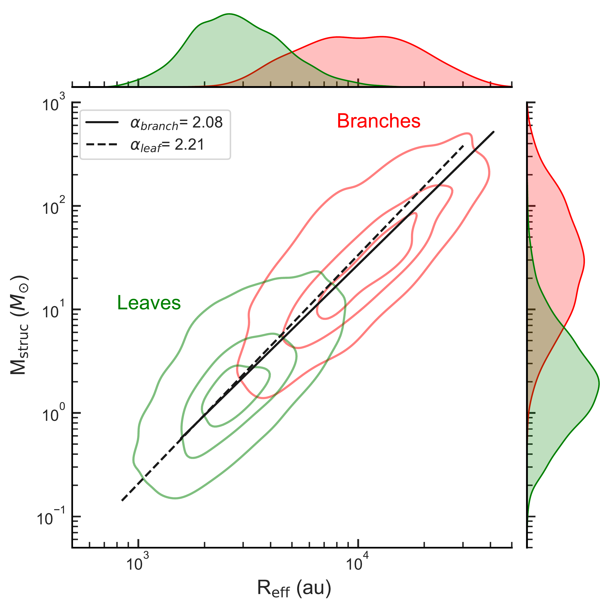
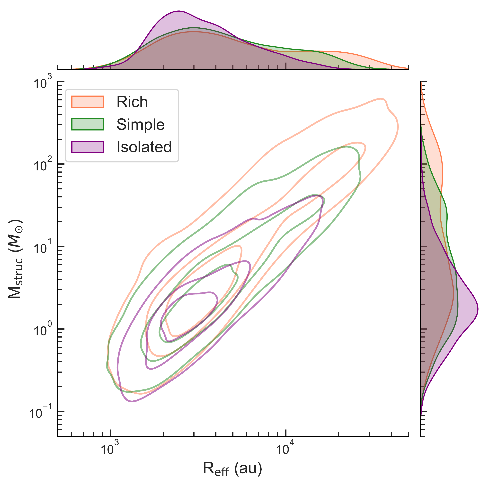

$\newcommand{\ensuremath}{}$
$\newcommand{\xspace}{}$
$\newcommand{\object}[1]{\texttt{#1}}$
$\newcommand{\farcs}{{.}''}$
$\newcommand{\farcm}{{.}'}$
$\newcommand{\arcsec}{''}$
$\newcommand{\arcmin}{'}$
$\newcommand{\ion}[2]{#1#2}$
$\newcommand{\textsc}[1]{\textrm{#1}}$
$\newcommand{\hl}[1]{\textrm{#1}}$
$\newcommand{\footnote}[1]{}$
$\newcommand{\vdag}{(v)^\dagger}$
$\newcommand$
$\newcommand$
$\newcommand{\GG}[1]$

# ALMAGAL VIII. Cataloging Hierarchical Mass Structure from Cores to Clumps\ across the Galactic Disk

<mark>Appeared on: 2025-10-16</mark> -  _29 pages, 12 figures, submitted to the Astrophysical Journal_

J. Wallace, et al. -- incl., <mark>H. Beuther</mark>

**Abstract:** Investigating the multi-scale fragmentation of dense clumps into compact cores is essential for understanding the processes that govern the initial distribution of mass in stellar clusters and how high-mass stars ( $>8 M_{\odot}$ ) form. We present a catalog of the hierarchical continuum structure from 904 clumps observed in the ALMAGAL program, a high resolution ( $0.15-0.8$ $\arcsec$ ) 1.38 mm Atacama Large Millimeter/submillimeter Array (ALMA) large program targeting dense clumps capable of high-mass star formation throughout the Galactic disk. We use $\verb$ |astrodendro|, a dendrogram-based algorithm, on a uniform linear resolution (2000 au) version of the data to extract 5160 continuum structures with effective radii spanning $800-42000$ au and estimated masses between $ 0.05-670 M_{\odot}$ . With our large sample, we statistically examine the difference in clump properties for regions with varying levels of hierarchical complexity. We find that clumps exhibiting the richest hierarchical morphology have distributions with higher dust temperatures, surface densities, luminosity-to-mass ( _L/M_ ) ratios, and most massive core (MMC) masses, indicating that these regions tend to be at later evolutionary stages. We find a positive correlation between the mass of cores from the ALMAGAL core catalog and the surface density of their surrounding structures identified in this work. However, this correlation is weaker for cores in more evolved clumps, where lower mass cores can be found at higher local surface densities. This could indicate that some cores accrete mass less efficiently from the intra-clump reservoir than others, despite the total available mass increasing over time, a scenario that is congruent with a clump-fed core accretion model.

**Figure 9. -** (Left panel) A 2D kernel density estimate plot of the mass of the MMC as a function of the surface density of its most immediate underlying dendrogram structure that has an effective radius at least 3 times the radius of the core ($\Sigma_{\text{surr}}$). (Right panel) The same figure, but we include all cores from the ALMAGAL core catalog. ALMAGAL targets are divided into three evolutionary categories based on their _L/M_ ratio.  Contours indicate the shape of the distribution for the inner [90, 70, 40]\% of the data.  Marginal plots indicate the 1D kernel density estimates of the dendrogram structure surface density and core mass on the _x_- and _y_-axes, respectively.  (*fig:surfd_mcore*)

**Figure 8. -** (Left) A 2D Kernel density estimate plot of the mass-radius relation for leaf (green) and branch structures (red) in the ALMAGAL hierarchical structure catalog. Best fits corresponding to the power law relation $M \propto R^{\alpha}$ for each population are indicated with the solid and dashed black lines. (Right) A 2D kernel density estimate plot for the mass-radius relation for all dendrogram structures in the Rich (orange), Simple (green), and Isolated (purple) sub-samples. For both panels, the contours indicate the shape of the distributions for the inner [90, 50, 20]\% of the data (*fig:mvr_full*)

**Figure 1. -** The maximum dendrogram level distribution for the near (top panel) and far (bottom panel) clumps in our ALMAGAL sample. The vertical dashed lines indicate the 1$\sigma_{\text{level}}$ and 3$\sigma_{\text{level}}$ of the fitted exponential distribution, shown by the solid black line. Since we cannot use the exact 1$\sigma_{\text{level}}$ and 3$\sigma_{\text{level}}$ values as thresholds on the integer-valued dendrogram levels, we instead round each value to the nearest integer and use that as a threshold. The integer ranges for the maximum level are shown for the Rich, Simple, and Isolated targets. The Empty targets do not have a threshold value, since they represent regions with non-detections and do not have an associated dendrogram level. (*fig:max_lvl_dists*)

