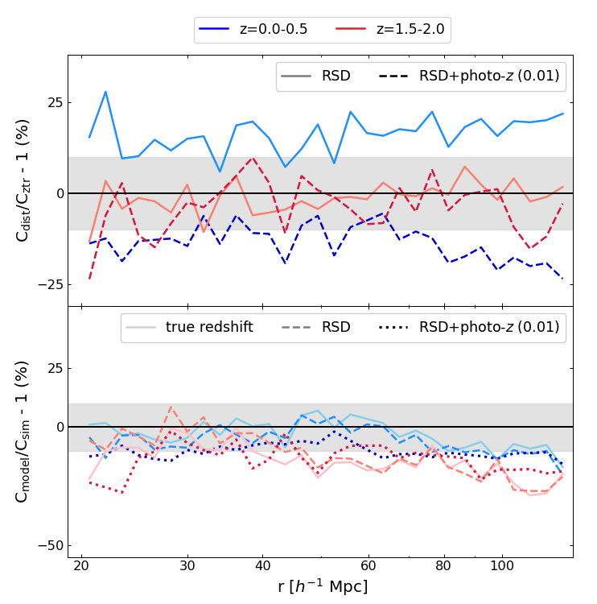
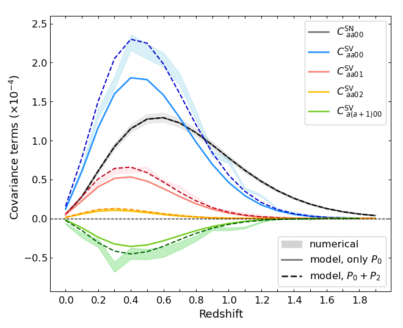
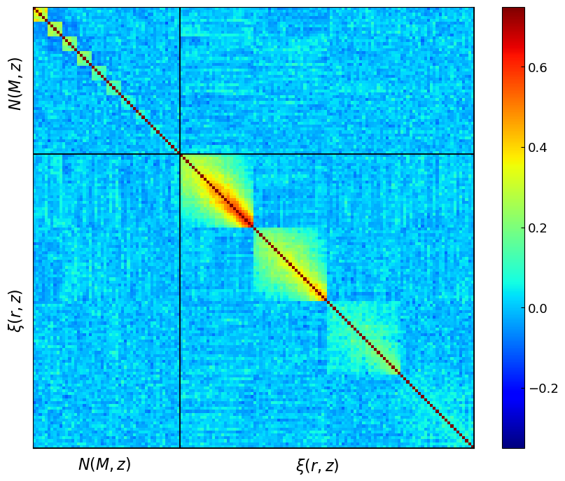
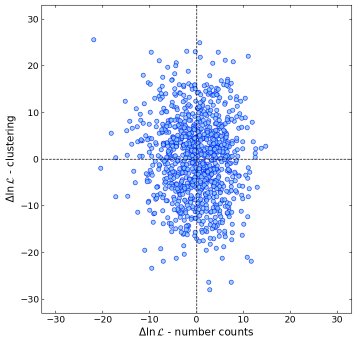

$\newcommand{\ensuremath}{}$
$\newcommand{\xspace}{}$
$\newcommand{\object}[1]{\texttt{#1}}$
$\newcommand{\farcs}{{.}''}$
$\newcommand{\farcm}{{.}'}$
$\newcommand{\arcsec}{''}$
$\newcommand{\arcmin}{'}$
$\newcommand{\ion}[2]{#1#2}$
$\newcommand{\textsc}[1]{\textrm{#1}}$
$\newcommand{\hl}[1]{\textrm{#1}}$
$\newcommand{\footnote}[1]{}$
$\newcommand{\af}[1]{\textcolor{red1}{AF:~#1}}$
$\newcommand{\todo}[1]{\textcolor{red1}{TO DO:~#1}}$
$\newcommand{\comm}[1]{\textcolor{blue1}{#1}}$
$\newcommand{\orcid}[1]$
$\newcommand{\om}{\Omega_{\rm m}}$
$\newcommand{\logas}{\logten(A_{\rm s})}$
$\newcommand{\lnas}{\ln(10^{10} A_s)}$
$\newcommand{\mwl}{{\rm M}_{\rm WL}}$
$\newcommand{\lob}{\lambda^{\rm ob}}$
$\newcommand{\ltr}{\lambda^{\rm tr}}$
$\newcommand{\zob}{z^{\rm ob}}$
$\newcommand{\ztr}{z^{\rm tr}}$
$\newcommand{\mmin}{M_{\rm min}}$
$\newcommand{\arraystretch}{1.3}$

# $\Euclid$: Exploring systematics effects in cluster cosmology -- a comprehensive analysis of cluster counts and clustering$\thanks{This paper is published on behalf of the Euclid Consortium.}$

<mark>Appeared on: 2025-10-16</mark> -  _16 pages, 14 figures_

A. Fumagalli, et al. -- incl., <mark>K. Jahnke</mark>

**Abstract:** This study explores the impact of observational and modelling systematic effects on cluster number counts and cluster clustering and provides model prescriptions for their joint analysis, in the context of the $\Euclid$ survey.   Using 1000 $\Euclid$ -like cluster catalogues, we investigate the effect of systematic uncertainties on cluster summary statistics and their auto- and cross-covariance, and perform a likelihood analysis to evaluate their impact on cosmological constraints, with a focus on the matter density parameter $\om$ and on the power spectrum amplitude $\sigma_8$ .   Combining cluster clustering with number counts significantly improves cosmological constraints, with the figure of merit increasing by over 300 \% compared to number counts alone. We confirm that the two probes are uncorrelated, and the cosmological constraints derived from their combination are almost insensitive to the cosmology dependence of the covariance. We find that photometric redshift uncertainties broaden cosmological posteriors by 20--30 \% , while secondary effects like redshift-space distortions (RSDs) have a smaller impact on the posteriors -- 5 \% for clustering alone, 10 \% when combining probes -- but can significantly bias the constraints if neglected. We show that clustering data below $60 h^{-1} $ Mpc provides additional constraining power, while scales larger than acoustic oscillation scale add almost no information on $\om$ and $\sigma_8$ parameters. RSDs and photo- $z$ uncertainties also influence the number count covariance, with a significant impact, of about 15--20 \% , on the parameter constraints.

**Figure 3. -** Residuals of the clustering covariance diagonal terms for the lowest (blue) and highest (red) redshift bins and $\lambda \in [20, 30]$. The grey area marks the 10\% region. _Top_: Residuals of the distorted numerical covariance relative to the undistorted redshift case. Solid lines indicate the RSDs case, while dashed lines include both RSDs and photo-$z$ effects ($\sigma_{z0} = 0.01$). _Bottom_: Residuals between analytical and numerical covariances for different cases: solid lines for true redshift, dashed for RSDs, and dotted for both RSDs and photo-$z$ effects. (*fig:cl_cov_diff*)

**Figure 6. -** Number count covariance terms:  numerical matrix (shaded areas, representing the 1$\sigma$ region), analytical model with power spectrum monopole (solid lines), and model with effective power spectrum (see Eq. \ref{eq:eff_pk}, dashed lines). Colour-coded terms represent different components: grey for diagonal shot-noise, blue for diagonal sample variance, red and yellow for first and second off-diagonal sample covariance between mass bins, respectively, and green for first off-diagonal sample covariance in redshift bins.  (*fig:nc_cov_RSD*)

**Figure 12. -** Cross-covariance between number counts and clustering. For better visualisation, here we use redshift bins of width $\Delta z=0.2$ for counts and $\Delta z=0.5$ for the 2PCF. _Left_: Auto- and cross-correlation matrix of number counts and clustering, computed from 1000 mocks. _Right_: Log-likelihood residuals for number counts and clustering, for each one of the 1000 lightcones, with respect to the mean value assuming the fiducial model parameters. (*fig:cross_cov*)

