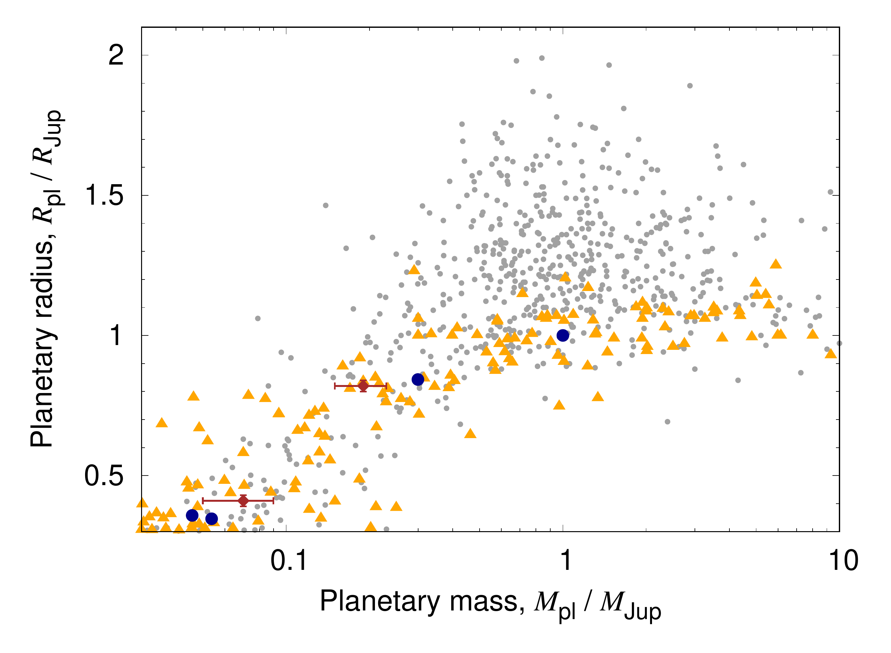
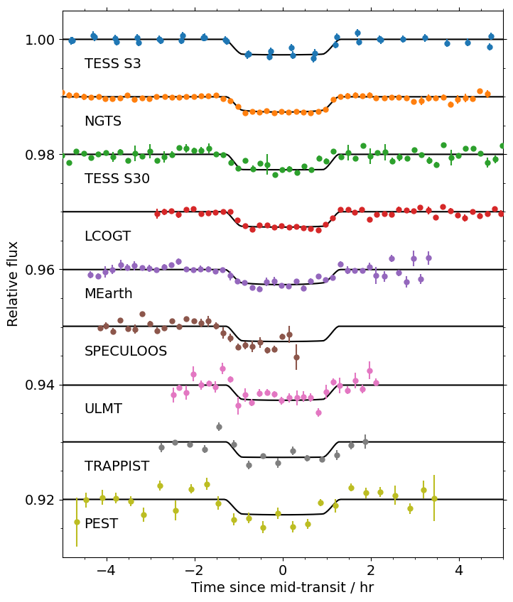
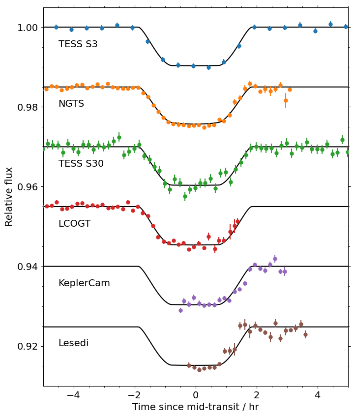

$\newcommand{\ensuremath}{}$
$\newcommand{\xspace}{}$
$\newcommand{\object}[1]{\texttt{#1}}$
$\newcommand{\farcs}{{.}''}$
$\newcommand{\farcm}{{.}'}$
$\newcommand{\arcsec}{''}$
$\newcommand{\arcmin}{'}$
$\newcommand{\ion}[2]{#1#2}$
$\newcommand{\textsc}[1]{\textrm{#1}}$
$\newcommand{\hl}[1]{\textrm{#1}}$
$\newcommand{\footnote}[1]{}$
$\newcommand{\nbs}{\nobreak\hspace{0.15em}}$
$\newcommand{\feh}{\ensuremath{{\rm[Fe/H]}}}$
$\newcommand{\teff}{\ensuremath{T_{\rm eff}}}$
$\newcommand{\teq}{\ensuremath{T_{\rm eq}}}$
$\newcommand{\logg}{\ensuremath{\log{g}}}$
$\newcommand{\zaspe}{\texttt{ZASPE}}$
$\newcommand{\ceres}{\texttt{CERES}}$
$\newcommand{\juliet}{{\sc juliet}}$
$\newcommand{\tess}{\textit{TESS}}$
$\newcommand{\vsini}{\ensuremath{v \sin{i}}}$
$\newcommand{\kms}{\ensuremath{{\rm km s^{-1}}}}$
$\newcommand{\ms}{\ensuremath{{\rm m s^{-1}}}}$
$\newcommand{\mjup}{\ensuremath{{M_{\rm Jup}}}}$
$\newcommand{\mnep}{\ensuremath{{M_{\rm Nep}}}}$
$\newcommand{\msat}{\ensuremath{{M_{\rm Sat}}}}$
$\newcommand{\mearth}{\ensuremath{M_{\rm \oplus}}}$
$\newcommand{\mpl}{\ensuremath{{M_{\rm pl}}}}$
$\newcommand{\rjup}{\ensuremath{R_{\rm Jup}}}$
$\newcommand{\rnep}{\ensuremath{R_{\rm Nep}}}$
$\newcommand{\rsat}{\ensuremath{R_{\rm Sat}}}$
$\newcommand{\rpl}{\ensuremath{R_{\rm pl}}}$
$\newcommand{\rstar}{\ensuremath{R_{\rm \star}}}$
$\newcommand{\mstar}{\ensuremath{M_{\rm \star}}}$
$\newcommand{\lstar}{\ensuremath{L_{\rm \star}}}$
$\newcommand{\rsun}{\ensuremath{R_{\rm \odot}}}$
$\newcommand{\msun}{\ensuremath{M_{\rm \odot}}}$
$\newcommand{\lsun}{\ensuremath{L_{\rm \odot}}}$
$\newcommand{\rhopl}{\ensuremath{{\rho_{\rm pl}}}}$
$\newcommand{\gccm}{\ensuremath{\rm{g} \rm{cm}^{-3}}}$
$\newcommand{\stnameA}{NGTS-11}$
$\newcommand{\plnameA}{NGTS-11\nbs c}$
$\newcommand{\plnameB}{NGTS-11\nbs b}$
$\newcommand{\plnameC}{NGTS-11\nbs d}$
$\newcommand{\altstnameA}{TOI-1847}$
$\newcommand{\altplnameA}{TOI-1847\nbs c}$
$\newcommand{\altplnameB}{TOI-1847\nbs b}$
$\newcommand{\altplnameC}{TOI-1847\nbs d}$
$\newcommand{\PA}{\ensuremath{12.77264 \pm 0.000017}}$
$\newcommand{\tcA}{\ensuremath{2459117.83838 \pm 0.00058}}$
$\newcommand{\pA}{\ensuremath{0.05297 \pm 0.00065}}$
$\newcommand{\bA}{\ensuremath{0.808 \pm 0.015}}$
$\newcommand{\KA}{\ensuremath{6.4^{+1.6}_{-1.5}}}$
$\newcommand{\PB}{\ensuremath{35.455882 \pm 0.000039}}$
$\newcommand{\tcB}{\ensuremath{2459135.28040 \pm 0.00055}}$
$\newcommand{\pB}{\ensuremath{0.1005 \pm 0.0011}}$
$\newcommand{\bB}{\ensuremath{0.846 \pm 0.014}}$
$\newcommand{\KB}{\ensuremath{12.9^{+1.7}_{-1.8}}}$
$\newcommand{\rhostA}{\ensuremath{1920 \pm 170}}$
$\newcommand{\qaTESSTRAPPIST}{\ensuremath{0.11 \pm 0.09}}$
$\newcommand{\qbTESSTRAPPIST}{\ensuremath{0.41 \pm 0.31}}$
$\newcommand{\qaNGTS}{\ensuremath{0.26 \pm 0.13}}$
$\newcommand{\qbNGTS}{\ensuremath{0.18 \pm 0.15}}$
$\newcommand{\qaMEarthULMTPEST}{\ensuremath{0.28 \pm 0.17}}$
$\newcommand{\qaLCOKeplerCamSAAO}{\ensuremath{0.25 \pm 0.11}}$
$\newcommand{\mfluxTESSA}{\ensuremath{-0.00002	\pm	0.00005}}$
$\newcommand{\mfluxTESSB}{\ensuremath{-0.00003	\pm	0.00005}}$
$\newcommand{\mfluxNGTS}{\ensuremath{0.00002	\pm	0.00003}}$
$\newcommand{\mfluxMEarth}{\ensuremath{-0.00002	\pm	0.00008}}$
$\newcommand{\mfluxLCO}{\ensuremath{-0.00006	\pm	0.00006}}$
$\newcommand{\mfluxKeplerCam}{\ensuremath{0.0000	\pm	0.0002}}$
$\newcommand{\mfluxULMT}{\ensuremath{-0.0001	\pm	0.0003}}$
$\newcommand{\mfluxTRAPPIST}{\ensuremath{-0.0001	\pm	0.0002}}$
$\newcommand{\mfluxPEST}{\ensuremath{-0.0001	\pm	0.0004}}$
$\newcommand{\mfluxSPECULOOS}{\ensuremath{0.0003	\pm	0.0002}}$
$\newcommand{\sigmaTESSA}{\ensuremath{{0	^{+	10	}_{-	0	}}}}$
$\newcommand{\sigmaTESSB}{\ensuremath{{2	^{+	150	}_{-	2	}}}}$
$\newcommand{\sigmaNGTS}{\ensuremath{773 \pm 36}}$
$\newcommand{\sigmaMEarth}{\ensuremath{{972 \pm 86}}}$
$\newcommand{\sigmaLCO}{\ensuremath{832 \pm 54	}}$
$\newcommand{\sigmaKeplerCam}{\ensuremath{2660 \pm 120 }}$
$\newcommand{\sigmaULMT}{\ensuremath{{0	^{+	39	}_{-	0	}}}}$
$\newcommand{\sigmaTRAPPIST}{\ensuremath{{2070 \pm 170 }}}$
$\newcommand{\sigmaPEST}{\ensuremath{0	^{+	45	}_{-	0	}}}$
$\newcommand{\sigmaSPECULOOS}{\ensuremath{0	^{+	45	}_{-	0	}}}$
$\newcommand{\sigmaSAAO}{\ensuremath{1	^{+	51	}_{-	0	}}}$
$\newcommand{\muFEROSA}{\ensuremath{21 384.0 \pm 8.2}}$
$\newcommand{\sigmawFEROSA}{\ensuremath{24.4 \pm 5.6}}$
$\newcommand{\muHARPSA}{\ensuremath{21 400.6 \pm 2.0}}$
$\newcommand{\dmuA}{\ensuremath{0.072 \pm 0.012}}$
$\newcommand{\ddmuA}{\ensuremath{0.000170 \pm 0.000019}}$
$\newcommand{\mpA}{\ensuremath{0.064^{+0.019}_{-0.013} }}$
$\newcommand{\mpAnep}{\ensuremath{1.2^{+0.3}_{-0.2}}}$
$\newcommand{\mpAearth}{\ensuremath{20^{+6}_{-4}}}$
$\newcommand{\rpA}{\ensuremath{0.429 \pm 0.009}}$
$\newcommand{\rpAnep}{\ensuremath{1.24 \pm 0.03}}$
$\newcommand{\rhoA}{\ensuremath{1040 \pm 260}}$
$\newcommand{\arstarA}{\ensuremath{25.5 \pm 0.7}}$
$\newcommand{\smaA}{\ensuremath{0.099 \pm 0.003}}$
$\newcommand{\smaAsimp}{\ensuremath{0.099}}$
$\newcommand{\incA}{\ensuremath{88.21 \pm 0.09}}$
$\newcommand{\tqA}{\ensuremath{594 \pm 13}}$
$\newcommand{\eccA}{\ensuremath{0.09}^{+0.09}_{-0.06}}$
$\newcommand{\omegaA}{\ensuremath{108^{+35}_{-49}}}$
$\newcommand{\mpB}{\ensuremath{0.189 \pm 0.026}}$
$\newcommand{\mpBsat}{\ensuremath{0.63 \pm 0.09}}$
$\newcommand{\mpBsatOld}{\ensuremath{1.2 \pm 0.3}}$
$\newcommand{\mpBearth}{\ensuremath{60 \pm 8}}$
$\newcommand{\rpB}{\ensuremath{0.81 \pm 0.02}}$
$\newcommand{\rpBsat}{\ensuremath{0.97 \pm 0.02}}$
$\newcommand{\rhoB}{\ensuremath{423 \pm 65}}$
$\newcommand{\arstarB}{\ensuremath{50 \pm 2}}$
$\newcommand{\smaB}{\ensuremath{0.195 \pm 0.006}}$
$\newcommand{\smaBsimp}{\ensuremath{0.195}}$
$\newcommand{\incB}{\ensuremath{89.05 \pm 0.04}}$
$\newcommand{\tqB}{\ensuremath{423 \pm 9}}$
$\newcommand{\eccB}{\ensuremath{0.08^{+0.06}_{-0.05}}}$
$\newcommand{\omegaB}{\ensuremath{12^{+56}_{-10}}}$
$\newcommand{\nbs}{\nobreak\hspace{0.15em}}$
$\newcommand{\feh}{\ensuremath{{\rm[Fe/H]}}}$
$\newcommand{\teff}{\ensuremath{T_{\rm eff}}}$
$\newcommand{\teq}{\ensuremath{T_{\rm eq}}}$
$\newcommand{\logg}{\ensuremath{\log{g}}}$
$\newcommand{\zaspe}{\texttt{ZASPE}}$
$\newcommand{\ceres}{\texttt{CERES}}$
$\newcommand{\juliet}{{\sc juliet}}$
$\newcommand{\tess}{\textit{TESS}}$
$\newcommand{\vsini}{\ensuremath{v \sin{i}}}$
$\newcommand{\kms}{\ensuremath{{\rm km s^{-1}}}}$
$\newcommand{\ms}{\ensuremath{{\rm m s^{-1}}}}$
$\newcommand{\mjup}{\ensuremath{{M_{\rm Jup}}}}$
$\newcommand{\mnep}{\ensuremath{{M_{\rm Nep}}}}$
$\newcommand{\msat}{\ensuremath{{M_{\rm Sat}}}}$
$\newcommand{\mearth}{\ensuremath{M_{\rm \oplus}}}$
$\newcommand{\mpl}{\ensuremath{{M_{\rm pl}}}}$
$\newcommand{\rjup}{\ensuremath{R_{\rm Jup}}}$
$\newcommand{\rnep}{\ensuremath{R_{\rm Nep}}}$
$\newcommand{\rsat}{\ensuremath{R_{\rm Sat}}}$
$\newcommand{\rpl}{\ensuremath{R_{\rm pl}}}$
$\newcommand{\rstar}{\ensuremath{R_{\rm \star}}}$
$\newcommand{\mstar}{\ensuremath{M_{\rm \star}}}$
$\newcommand{\lstar}{\ensuremath{L_{\rm \star}}}$
$\newcommand{\rsun}{\ensuremath{R_{\rm \odot}}}$
$\newcommand{\msun}{\ensuremath{M_{\rm \odot}}}$
$\newcommand{\lsun}{\ensuremath{L_{\rm \odot}}}$
$\newcommand{\rhopl}{\ensuremath{{\rho_{\rm pl}}}}$
$\newcommand{\gccm}{\ensuremath{\rm{g} \rm{cm}^{-3}}}$
$\newcommand{\stnameA}{NGTS-11}$
$\newcommand{\plnameA}{NGTS-11\nbs c}$
$\newcommand{\plnameB}{NGTS-11\nbs b}$
$\newcommand{\plnameC}{NGTS-11\nbs d}$
$\newcommand{\altstnameA}{TOI-1847}$
$\newcommand{\altplnameA}{TOI-1847\nbs c}$
$\newcommand{\altplnameB}{TOI-1847\nbs b}$
$\newcommand{\altplnameC}{TOI-1847\nbs d}$
$\newcommand{\PA}{\ensuremath{12.77264 \pm 0.000017}}$
$\newcommand{\tcA}{\ensuremath{2459117.83838 \pm 0.00058}}$
$\newcommand{\pA}{\ensuremath{0.05297 \pm 0.00065}}$
$\newcommand{\bA}{\ensuremath{0.808 \pm 0.015}}$
$\newcommand{\KA}{\ensuremath{6.4^{+1.6}_{-1.5}}}$
$\newcommand{\PB}{\ensuremath{35.455882 \pm 0.000039}}$
$\newcommand{\tcB}{\ensuremath{2459135.28040 \pm 0.00055}}$
$\newcommand{\pB}{\ensuremath{0.1005 \pm 0.0011}}$
$\newcommand{\bB}{\ensuremath{0.846 \pm 0.014}}$
$\newcommand{\KB}{\ensuremath{12.9^{+1.7}_{-1.8}}}$
$\newcommand{\rhostA}{\ensuremath{1920 \pm 170}}$
$\newcommand{\qaTESSTRAPPIST}{\ensuremath{0.11 \pm 0.09}}$
$\newcommand{\qbTESSTRAPPIST}{\ensuremath{0.41 \pm 0.31}}$
$\newcommand{\qaNGTS}{\ensuremath{0.26 \pm 0.13}}$
$\newcommand{\qbNGTS}{\ensuremath{0.18 \pm 0.15}}$
$\newcommand{\qaMEarthULMTPEST}{\ensuremath{0.28 \pm 0.17}}$
$\newcommand{\qaLCOKeplerCamSAAO}{\ensuremath{0.25 \pm 0.11}}$
$\newcommand{\mfluxTESSA}{\ensuremath{-0.00002	\pm	0.00005}}$
$\newcommand{\mfluxTESSB}{\ensuremath{-0.00003	\pm	0.00005}}$
$\newcommand{\mfluxNGTS}{\ensuremath{0.00002	\pm	0.00003}}$
$\newcommand{\mfluxMEarth}{\ensuremath{-0.00002	\pm	0.00008}}$
$\newcommand{\mfluxLCO}{\ensuremath{-0.00006	\pm	0.00006}}$
$\newcommand{\mfluxKeplerCam}{\ensuremath{0.0000	\pm	0.0002}}$
$\newcommand{\mfluxULMT}{\ensuremath{-0.0001	\pm	0.0003}}$
$\newcommand{\mfluxTRAPPIST}{\ensuremath{-0.0001	\pm	0.0002}}$
$\newcommand{\mfluxPEST}{\ensuremath{-0.0001	\pm	0.0004}}$
$\newcommand{\mfluxSPECULOOS}{\ensuremath{0.0003	\pm	0.0002}}$
$\newcommand{\sigmaTESSA}{\ensuremath{{0	^{+	10	}_{-	0	}}}}$
$\newcommand{\sigmaTESSB}{\ensuremath{{2	^{+	150	}_{-	2	}}}}$
$\newcommand{\sigmaNGTS}{\ensuremath{773 \pm 36}}$
$\newcommand{\sigmaMEarth}{\ensuremath{{972 \pm 86}}}$
$\newcommand{\sigmaLCO}{\ensuremath{832 \pm 54	}}$
$\newcommand{\sigmaKeplerCam}{\ensuremath{2660 \pm 120 }}$
$\newcommand{\sigmaULMT}{\ensuremath{{0	^{+	39	}_{-	0	}}}}$
$\newcommand{\sigmaTRAPPIST}{\ensuremath{{2070 \pm 170 }}}$
$\newcommand{\sigmaPEST}{\ensuremath{0	^{+	45	}_{-	0	}}}$
$\newcommand{\sigmaSPECULOOS}{\ensuremath{0	^{+	45	}_{-	0	}}}$
$\newcommand{\sigmaSAAO}{\ensuremath{1	^{+	51	}_{-	0	}}}$
$\newcommand{\muFEROSA}{\ensuremath{21 384.0 \pm 8.2}}$
$\newcommand{\sigmawFEROSA}{\ensuremath{24.4 \pm 5.6}}$
$\newcommand{\muHARPSA}{\ensuremath{21 400.6 \pm 2.0}}$
$\newcommand{\dmuA}{\ensuremath{0.072 \pm 0.012}}$
$\newcommand{\ddmuA}{\ensuremath{0.000170 \pm 0.000019}}$
$\newcommand{\mpA}{\ensuremath{0.064^{+0.019}_{-0.013} }}$
$\newcommand{\mpAnep}{\ensuremath{1.2^{+0.3}_{-0.2}}}$
$\newcommand{\mpAearth}{\ensuremath{20^{+6}_{-4}}}$
$\newcommand{\rpA}{\ensuremath{0.429 \pm 0.009}}$
$\newcommand{\rpAnep}{\ensuremath{1.24 \pm 0.03}}$
$\newcommand{\rhoA}{\ensuremath{1040 \pm 260}}$
$\newcommand{\arstarA}{\ensuremath{25.5 \pm 0.7}}$
$\newcommand{\smaA}{\ensuremath{0.099 \pm 0.003}}$
$\newcommand{\smaAsimp}{\ensuremath{0.099}}$
$\newcommand{\incA}{\ensuremath{88.21 \pm 0.09}}$
$\newcommand{\tqA}{\ensuremath{594 \pm 13}}$
$\newcommand{\eccA}{\ensuremath{0.09}^{+0.09}_{-0.06}}$
$\newcommand{\omegaA}{\ensuremath{108^{+35}_{-49}}}$
$\newcommand{\mpB}{\ensuremath{0.189 \pm 0.026}}$
$\newcommand{\mpBsat}{\ensuremath{0.63 \pm 0.09}}$
$\newcommand{\mpBsatOld}{\ensuremath{1.2 \pm 0.3}}$
$\newcommand{\mpBearth}{\ensuremath{60 \pm 8}}$
$\newcommand{\rpB}{\ensuremath{0.81 \pm 0.02}}$
$\newcommand{\rpBsat}{\ensuremath{0.97 \pm 0.02}}$
$\newcommand{\rhoB}{\ensuremath{423 \pm 65}}$
$\newcommand{\arstarB}{\ensuremath{50 \pm 2}}$
$\newcommand{\smaB}{\ensuremath{0.195 \pm 0.006}}$
$\newcommand{\smaBsimp}{\ensuremath{0.195}}$
$\newcommand{\incB}{\ensuremath{89.05 \pm 0.04}}$
$\newcommand{\tqB}{\ensuremath{423 \pm 9}}$
$\newcommand{\eccB}{\ensuremath{0.08^{+0.06}_{-0.05}}}$
$\newcommand{\omegaB}{\ensuremath{12^{+56}_{-10}}}$

# $\plnameA$: a transiting Neptune-mass planet interior to the warm Saturn $\plnameB$

<mark>Appeared on: 2025-10-17</mark> -  _12 pages, 6 figures, submitted to ApJ_

D. R. Anderson, et al. -- incl., <mark>T. Henning</mark>

**Abstract:** We report the discovery of $\plnameA$ , a transiting warm Neptune ( $P \sim 12.8$ d; $\mpl = \mpAnep \mnep$ ; $\rpl = \rpAnep \rnep$ ),orbiting closer to the K-dwarf $\stnameA$ than the previously reported transiting warm Saturn $\plnameB$ ( $P \sim 35.5$ $\nbs$ d), and we report evidence of a third, outer companion.We first detected transits of $\plnameA$ in TESS light curves and confirmed them with follow-up transits from NGTS and many other ground-based facilities.Radial-velocity monitoring with the HARPS and FEROS spectrographs revealed the mass of $\plnameA$ and provided evidence, via a long-term trend, for a long-period companion ( $P > 2300$ $\nbs$ d and $\mpl \sin i > 3.6$ $\nbs$ $\mjup$ ).Taking into account the two additional bodies in our expanded data sets, we find that the mass of $\plnameB$ ( $\mpl$ = $\mpBsat$ $\msat$ ; $\rpl$ = $\rpBsat$ $\rsat$ ) is lower than previously reported ( $\mpl$ = $\mpBsatOld$ $\msat$ ).Given their near-circular, compact orbits, $\plnameA$ and b are unlikely to have arrived in place via high-eccentricity migration.Instead, they likely formed in situ, or they formed farther out and then moved inward through disk migration.A comparison of $\stnameA$ with the eight other known systems hosting multiple well-characterized warm giants reveals that it is most similar to Kepler-56.Finally, we find that the commonly used 10-day boundary between hot and warm Jupiters appears empirically well supported.

**Figure 2. -** 
Mass--radius distribution of known exoplanets (gray dots have $P<10$\nbs d and orange triangles have 10$\nbs$$\le P \le 200$\nbs d), solar system giants (blue circles), and $\plnameA$ and b (brown diamonds, with error bars).
At $\mpl$$\sim 0.2$\nbs$\mjup$, $\plnameB$ approximately marks the mass boundary above which hot Jupiters are often inflated, whereas warm Jupiters generally are not.
Data were retrieved on 2025 Oct 1 from the composite data table of the NASA Exoplanet Archive.
Planets with masses inferred from a mass--radius relationship were excluded, as were those with imprecise parameters ($\Delta$\mpl/$\mpl$$>$ 0.5 or $\Delta$\rpl/$\rpl$$>$ 0.2).
 (*fig:m-r*)

**Figure 5. -** 
Mass--radius distribution of known exoplanets (gray dots have $P<10$\nbs d and orange triangles have 10$\nbs$$\le P \le 200$\nbs d), solar system giants (blue circles), and $\plnameA$ and b (brown diamonds, with error bars).
At $\mpl$$\sim 0.2$\nbs$\mjup$, $\plnameB$ approximately marks the mass boundary above which hot Jupiters are often inflated, whereas warm Jupiters generally are not.
Data were retrieved on 2025 Oct 1 from the composite data table of the NASA Exoplanet Archive.
Planets with masses inferred from a mass--radius relationship were excluded, as were those with imprecise parameters ($\Delta$\mpl/$\mpl$$>$ 0.5 or $\Delta$\rpl/$\rpl$$>$ 0.2).
 (*fig:m-r*)

**Figure 7. -** Transit light curves of $\plnameA$(left panel) and $\plnameB$(right panel), shown offset in relative flux for clarity and plotted to the same scale for comparison.
The data were phase-binned to 10$\nbs$ min, except for TESS Sector 3 (30$\nbs$ min) and TRAPPIST and PEST (20$\nbs$ min for both).
The error bars represent formal uncertainties and do not include the photometric jitter terms (\autoref{tab:props}).
The transit model (\autoref{sec:anal}), including limb darkening, is shown for each case.
 (*fig:phot*)

