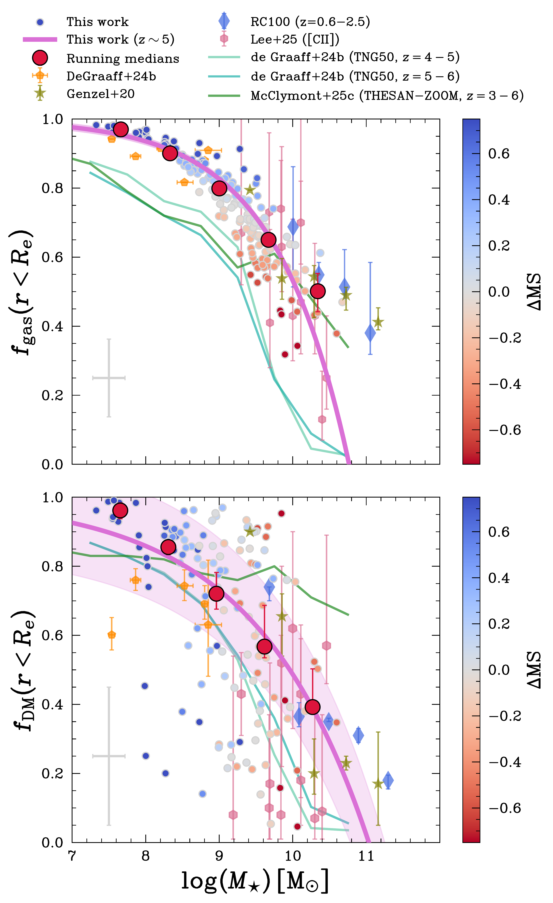
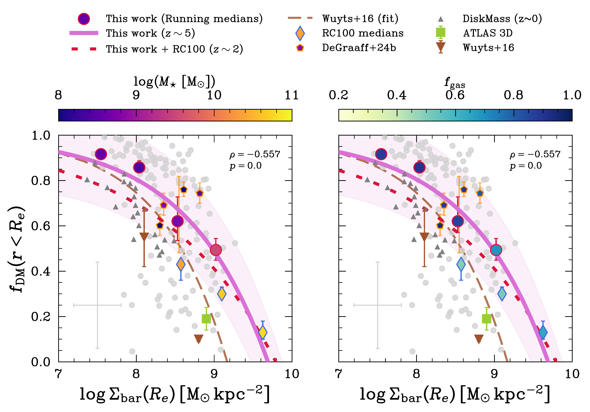
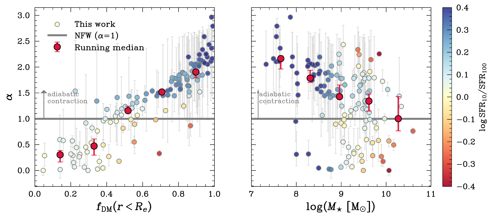

$\newcommand{\ensuremath}{}$
$\newcommand{\xspace}{}$
$\newcommand{\object}[1]{\texttt{#1}}$
$\newcommand{\farcs}{{.}''}$
$\newcommand{\farcm}{{.}'}$
$\newcommand{\arcsec}{''}$
$\newcommand{\arcmin}{'}$
$\newcommand{\ion}[2]{#1#2}$
$\newcommand{\textsc}[1]{\textrm{#1}}$
$\newcommand{\hl}[1]{\textrm{#1}}$
$\newcommand{\footnote}[1]{}$
$\newcommand{\kthrd}{\ensuremath{k_{\mathrm{3D}}}\xspace}$
$\newcommand{\bn}{\ensuremath{b_{\mathrm{n}}}\xspace}$
$\newcommand{\Reff}{\ensuremath{r_{\mathrm{e}}}\xspace}$
$\newcommand{\D}{\ensuremath{\mathrm{d}}\xspace}$
$\newcommand{\qint}{\ensuremath{q_0}\xspace}$
$\newcommand{\qobs}{\ensuremath{q_{\mathrm{obs}}}\xspace}$
$\newcommand{\vcirc}{\ensuremath{v_{\mathrm{circ}}}\xspace}$
$\newcommand{\vcircobs}{\ensuremath{v_{\mathrm{circ,obs}}}\xspace}$
$\newcommand{\Menc}{\ensuremath{M_{\mathrm{sph}}}\xspace}$
$\newcommand{\vrot}{\ensuremath{v_{\mathrm{rot}}}\xspace}$
$\newcommand{\sigmaint}{\ensuremath{\sigma_{0}}\xspace}$
$\newcommand{\Msun}{\ensuremath{\rm M_{\odot}}\xspace}$
$\newcommand{\Mstar}{\ensuremath{M_{\star}}\xspace}$
$\newcommand{\Mgas}{\ensuremath{M_{\mathrm{gas}}}\xspace}$
$\newcommand{\Mbar}{\ensuremath{M_{\mathrm{bar}}}\xspace}$
$\newcommand{\Mdyn}{\ensuremath{M_{\mathrm{dyn}}}\xspace}$
$\newcommand{\Mbh}{\ensuremath{M_{\mathrm{BH}}}\xspace}$
$\newcommand{\lMstar}{\ensuremath{\log_{10}(\Mstar/\Msun)}\xspace}$
$\newcommand{\lMgas}{\ensuremath{\log_{10}(\Mgas/\Msun)}\xspace}$
$\newcommand{\lMbar}{\ensuremath{\log_{10}(\Mbar/\Msun)}\xspace}$
$\newcommand{\lMdyn}{\ensuremath{\log_{10}(\Mdyn/\Msun)}\xspace}$
$\newcommand{\logMstar}{\ensuremath{\log(\Mstar ~\rm[\Msun])}\xspace}$
$\newcommand{\logMbh}{\ensuremath{\log(\Mbh ~\rm[\Msun])}\xspace}$
$\newcommand{\logMdyn}{\ensuremath{\log(\Mdyn ~\rm[\Msun])}\xspace}$
$\newcommand{\fgas}{\ensuremath{f_{\mathrm{gas}}}\xspace}$
$\newcommand{\fDM}{\ensuremath{f_{\mathrm{DM}}}\xspace}$
$\newcommand{\nSdisk}{\ensuremath{n_{\mathrm{disk}}}\xspace}$
$\newcommand{\nSbulge}{\ensuremath{n_{\mathrm{bulge}}}\xspace}$
$\newcommand{\Ha}{\ensuremath{\mathrm{H}\alpha}\xspace}$
$\newcommand{\vsigma}{\ensuremath{\mathrm{v}/\sigmaint}\xspace}$
$\newcommand{\geko}{\textsc{geko}}$
$\newcommand{\sersic}{Sérsic }$
$\newcommand{\angstrom}{\mbox{\normalfontÅ}}$
$\newcommand{\deltaMS}{\ensuremath{\Delta \rm MS}\xspace}$
$\newcommand{\rotsupp}{\text{v}/\sigma_0}$
$\newcommand{\disp}{\sigma_0}$
$\newcommand{\rHa}{\ensuremath{r_{\rm e, Ha}}\xspace}$
$\newcommand{\rNUV}{\ensuremath{r_{\rm e, NUV}}\xspace}$
$\newcommand{\rFUV}{\ensuremath{r_{\rm e, FUV}}\xspace}$
$\newcommand{\ropt}{\ensuremath{r_{\rm e, opt}}\xspace}$
$\newcommand{\HatoUV}{\ensuremath{r_{\rm e, Ha}/r_{\rm e, UV}}\xspace}$
$\newcommand{\HatoNUV}{\ensuremath{r_{\rm e, Ha}/r_{\rm e, NUV}}\xspace}$
$\newcommand{\FUVtoNUV}{\ensuremath{r_{\rm e, FUV}/r_{\rm e, NUV}}\xspace}$
$\newcommand{\FUVtoopt}{\ensuremath{r_{\rm e, FUV}/r_{\rm e, opt}}\xspace}$
$\newcommand{\sigmabar}{\ensuremath{\Sigma_{\rm bar}}\xspace}$
$\newcommand{\logsigmabar}{\ensuremath{\log (\Sigma_{\rm bar}) [\Msun \thinspace \rm kpc^{-2}]}\xspace}$
$\newcommand$
$\newcommand{\labelitemi}{\labelitemii}$
$\newcommand{\arraystretch}{1.5}$
$\newcommand{\thebibliography}{\DeclareRobustCommand{\VAN}[3]{##3}\VANthebibliography}$

# The dark side of early galaxies: $\geko$ uncovers dark-matter fractions at$z\sim4-6$

<mark>Appeared on: 2025-10-17</mark> -  _14 pages, 7 figures, 2 tables. Submitted to MNRAS_

A. L. Danhaive, et al. -- incl., <mark>A. d. Graaff</mark>

**Abstract:** _JWST_ /NIRCam slitless spectroscopy enables dynamical mass measurements for typical star-forming galaxies only a billion years after the Big Bang. We model the H $\alpha$ morpho-kinematics of 163 galaxies at redshift $z\approx4$ -6 from FRESCO and CONGRESS (with JADES imaging), using the $\texttt{geko}$ code, and infer rotational velocities and dispersions within $r_{\rm e}$ . Our sample spans $\log M_{\star}\approx7$ -10 and $\log M_{\rm dyn}\approx9$ -11. Gas masses are estimated via scaling relations, yielding baryonic masses and dark-matter (DM) fractions $f_{\rm DM}(r<r_{\rm e})$ within the H $\alpha$ half-light radius. We find high median fractions of $\langle f_{\rm gas}\rangle=0.77$ and $\langle f_{\rm DM}\rangle=0.73$ , where $f_{\rm gas}$ is measured with respect to the baryonic mass and $f_{\rm DM}$ with respect to the DM+baryonic mass. About two-thirds of systems are DM-dominated within $r_{\rm e}\sim0.5-1$ kpc. Both $f_{\rm gas}$ and $f_{\rm DM}$ decrease with stellar mass, consistent with simulations. The stellar Tully-Fisher relation shows a tentative offset to higher $v_{\rm circ}$ at fixed $M_{\star}$ and substantial intrinsic scatter, suggesting that the relation is only beginning to emerge at $z\sim5$ . We measure a negative correlation between $f_{\rm DM}$ and baryonic surface density $\Sigma_{\rm bar}$ , weaker but broadly consistent with trends at cosmic noon and at $z\sim0$ . Qualitatively comparing with modified NFW profiles coupled to an empirical stellar-to-halo mass relation suggests that the lowest $f_{\rm DM}$ ( $\lesssim0.4$ ) require cored inner DM profiles, while the highest fractions favour cuspier profiles, potentially reflecting adiabatic contraction. Overall, the elevated $f_{\rm gas}$ and $f_{\rm DM}$ at $z\gtrsim4$ are compatible with progenitors of baryon-dominated systems at $z\sim2$ and naturally anticipate overmassive black holes at fixed $M_{\star}$ .

**Figure 3. -** Gas (top) and DM (bottom) fractions (within $\Reff$) as a function of stellar mass, with the characteristic uncertainty shown in grey. The $f_{\text{gas}} (r<$\Reff$)$(Eq. \ref{eq:fgas}) is computed using the sSFR, redshift, and stellar mass of each galaxy following \protect[Tacconi, Genzel and Sternberg (2020)](https://ui.adsabs.harvard.edu/abs/2020ARA&A..58..157T). The $f_{\text{DM}} (r<$\Reff$)$ is computed using $M_{\text{gas}}$ along with $M_{\text{dyn}}$ and $M_{\star}$ as shown in Eq. \ref{eq:fdm}. We fit our data with a power-law (solid purple line) for both relations, showing the intrinsic scatter (shaded region) only for $\fDM$. We cannot constrain $\sigma_{\rm int}$ for $\fgas$ due to the inferred uncertainties being significantly larger than the scatter in the outputs of the [Tacconi, Genzel and Sternberg (2020)](https://ui.adsabs.harvard.edu/abs/2020ARA&A..58..157T) scaling relation for our sample (see Sec. \ref{sec:gas-fracs}). We compare our results with measurements from [ and Genzel (2020)](https://ui.adsabs.harvard.edu/abs/2020ApJ...902...98G)(green stars) and Nestor-Shachar:2023aa(RC100; blue diamonds) at cosmic noon and de-Graaff:2024ab, [Pillepich and Rix (2024)](https://ui.adsabs.harvard.edu/abs/2024ApJ...967L..40D)(orange pentagons) and [ and Lee (2025)](https://ui.adsabs.harvard.edu/abs/2025arXiv250711600L)(pink hexagons) at high redshift. For most of our sample, we find high gas and DM fractions $f > 0.5$. We find relatively good agreement with median trends from the thesan-zoom simulations \citep[green solid line;][]{McClymont:2025ac} and the tng50 simulations \citep[blue solid lines;][]{de-Graaff:2024aa}. (*fig:fractions-mass*)

**Figure 6. -** DM fraction as a function of baryonic surface density ($\Sigma_{\rm bar}$) for our sample (circles) and samples at lower \citep[diamonds, ][]{Nestor-Shachar:2023aa} and similar to higher \citep[pentagons, ][]{de-Graaff:2024aa} redshift. We colour-code points by stellar mass (left panel) and gas fractions (right panel). We show the characteristic uncertainty for our sample in grey. We find a strong negative correlation between $\fDM$ and $\Sigma_{\rm bar}$($\rho = -0.551, p < 0.001$), with a best-fit relation (solid purple line) steeper than [ and Wuyts (2016)](https://ui.adsabs.harvard.edu/abs/2016ApJ...831..149W) at cosmic noon (dashed brown line), and with an offset. We also plot the best-fit relation obtain when fitting our points with those from Nestor-Shachar:2023aa(dashed-dotted red line). For comparison, we plot medians from ETGs at $z\sim 0$ from the ATLAS3D survey \citep[purple square; ][]{Cappellari:2013aa} and LTGs from the DiskMass Survey \citep[grey triangles; ][]{Martinsson:2013aa}. Our galaxies agree with Nestor-Shachar:2023aa at low fractions $\fDM<0.5$, but lie above the relation at high fractions. The galaxies in our sample are smaller, less massive, and more gas rich than those probed at cosmic noon, driving the apparent shift in the relation.  (*fig:fdm-sigmabar*)

**Figure 7. -** Estimated slope $\alpha$ of the inner DM density profile for a modified NFW distribution (Eq. \ref{eq:gen-nfw}) as a function of measured DM fractions (left) and stellar mass (right). A value of $\alpha = 1$ represents the classical NFW profile, whereas $\alpha < 1$ corresponds to a cored profile, and $\alpha>1$ to a cuspier profile. Under the assumed SHMR and concentration ($c=5$), we find that low-mass galaxies with high $\fDM$ are associated with cuspy distributions, converging towards an NFW-like profile at higher masses with a scatter at least in part driven by their star-formation state. To highlight this, we colour-code the galaxies by the ratio of their SFR averaged over 10 and 100 Myr, $\rm SFR_{10}/SFR_{100}$, applying LOESS smoothing  ([ and Cappellari 2013](https://ui.adsabs.harvard.edu/abs/2013MNRAS.432.1862C)) . Galaxies going through a burst of star formation ($\log \rm SFR_{10}/SFR_{100} \gtrapprox 0.4$) have preferentially high values of $\alpha$, which supports the adiabatic contraction scenario. (*fig:alpha_fdm_sfr*)

