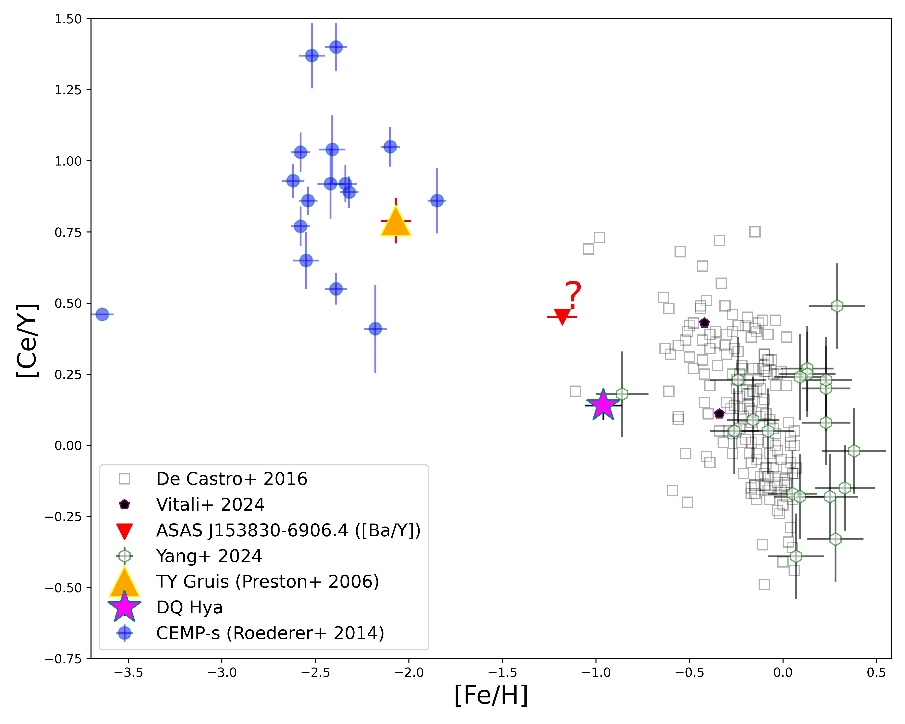
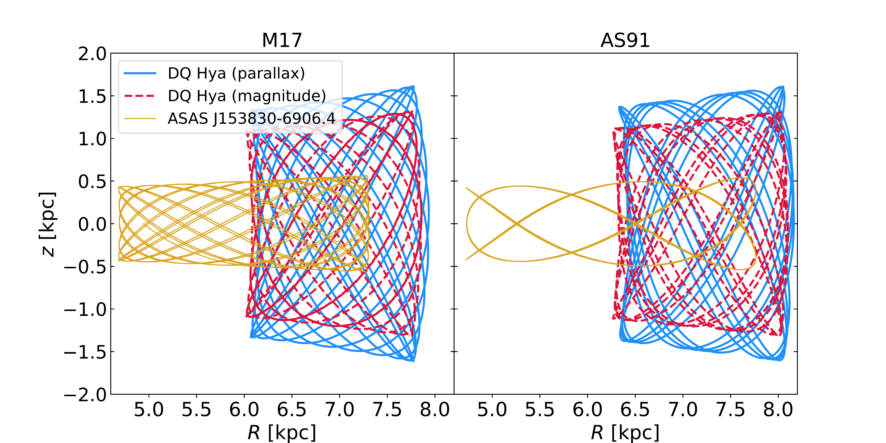
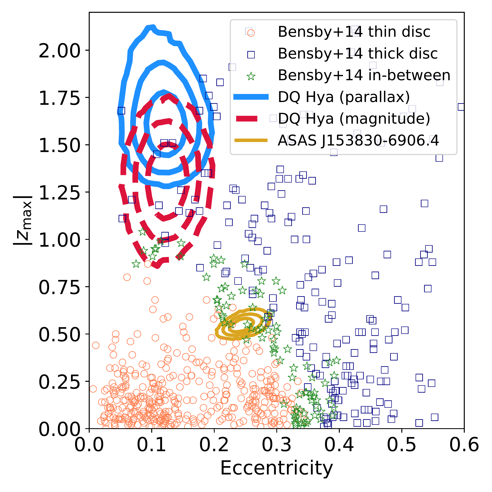

$\newcommand{\ensuremath}{}$
$\newcommand{\xspace}{}$
$\newcommand{\object}[1]{\texttt{#1}}$
$\newcommand{\farcs}{{.}''}$
$\newcommand{\farcm}{{.}'}$
$\newcommand{\arcsec}{''}$
$\newcommand{\arcmin}{'}$
$\newcommand{\ion}[2]{#1#2}$
$\newcommand{\textsc}[1]{\textrm{#1}}$
$\newcommand{\hl}[1]{\textrm{#1}}$
$\newcommand{\footnote}[1]{}$
$\newcommand{\teff}{T_{\rm eff}}$
$\newcommand{\vmic}{V_{\mathrm{mic}}}$
$\newcommand{\msun}{M_\odot}$

# Rare Find: Discovery and chemo-dynamical properties of two s-process enhanced RR Lyrae stars

<mark>Appeared on: 2025-10-20</mark> -  _Accepted for publication in A&A. 16 pages, 11 figures. Abstract shortened_

V. D'Orazi, et al. -- incl., <mark>N. Storm</mark>

**Abstract:**            We report the serendipitous discovery of two RR Lyrae stars exhibiting significant s-process element enrichment, a rare class previously represented solely by TY Gruis. Our goal is to characterise these objects chemically and dynamically, exploring their origins and evolutionary histories. Using high-resolution spectroscopy from HERMES@AAT and UVES@VLT, we derived detailed chemical abundances of key s-process elements, carbon along with $\alpha$-elements. We also employed Gaia DR3 astrometric data to analyse their kinematics, orbital properties, and classify their Galactic population membership. We compared observational results with theoretical asymptotic giant branch nucleosynthesis models to interpret their enrichment patterns. Both stars exhibit clear signatures of s-process enrichment, with significant overabundances in second-peak elements such as Ba and La compared to first-peak Y and Zr. Comparison with AGB nucleosynthesis models suggests their progenitors experienced pollution of s-process-rich material, consistent with early binary interactions. However, notable discrepancies in dilution factors highlight the need for more refined low-metallicity asymptotic giant branch (AGB) models. We also explore and discuss alternative scenarios, including sub-luminous post-AGB-like evolution or double episodes of mass this http URL findings confirm the existence of s-process-enhanced RR Lyrae stars and demonstrate the importance of combining chemical and dynamical diagnostics to unveil their complex evolutionary pathways. Future detailed binary evolution modelling and long-term orbital monitoring are essential to resolve their formation scenarios and assess the role of binarity in the evolution of pulsating variables.         

**Figure 2. -** [Ce/Y] ratios as a function of metallicity [Fe/H]. (*fig:cey_feh*)

**Figure 3. -** Integrated orbits of DQ Hya (thick solid line: distance from parallax inversion; dashed line: distance estimated from the RR Lyrae magnitude–metallicity relation) and ASAS J153830–6906.4 (thin solid line: distance from parallax inversion), computed using the Milky Way potential models by \cite{mcmillan2017}(M17, left panel) and \cite{allen1991}(AS91, right panel). (*fig:orbit*)

**Figure 4. -** Comparison of the orbital properties, eccentricity and maximum distance from the Galactic plane, of DQ Hya and ASAS J153830–6906.4 with the sample of disc stars from \cite{bensby2014}(B14).
    The contours represent the 68\%, 95\%, and 99.7\% confidence intervals from $10^5$ orbit realisations; line styles and colours follow those used in Figure \ref{fig:orbit}.
    Circle and square markers indicate stars classified by B14 as likely thin disc and thick disc members, respectively, based on a thick-to-thin disc likelihood ratio of $<0.5$ and $>2$. Star-shaped markers represent stars in between the two components with intermediate likelihood ratios.
    Both our orbit integrations and those in B14 adopt the Galactic potential from \cite{allen1991}. (*fig:bcomp*)

