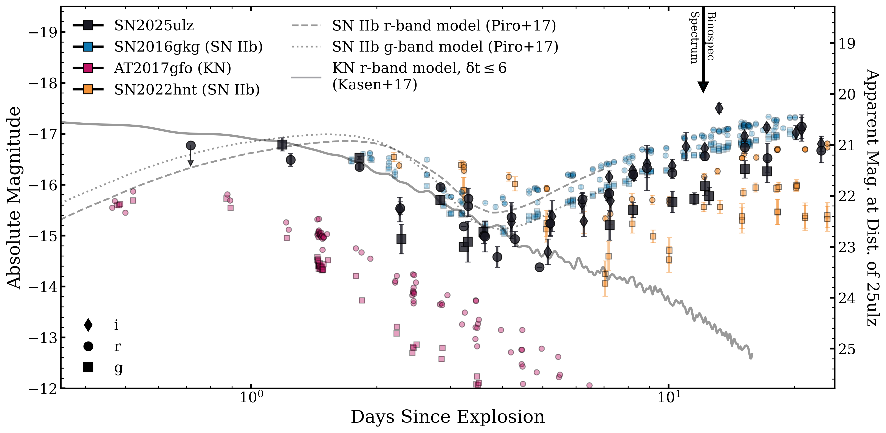
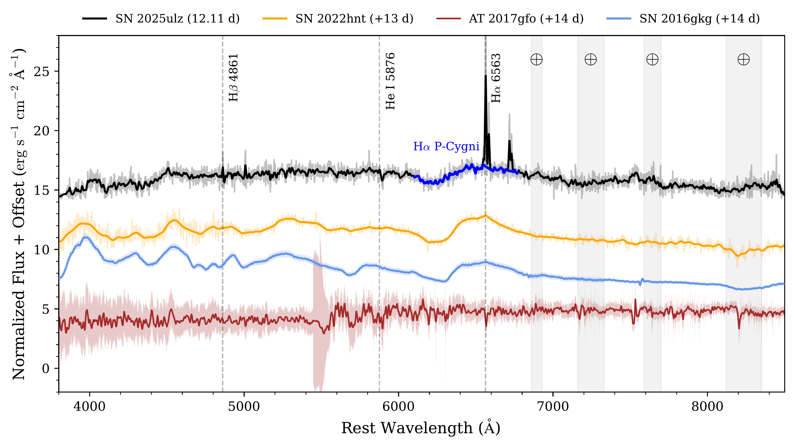
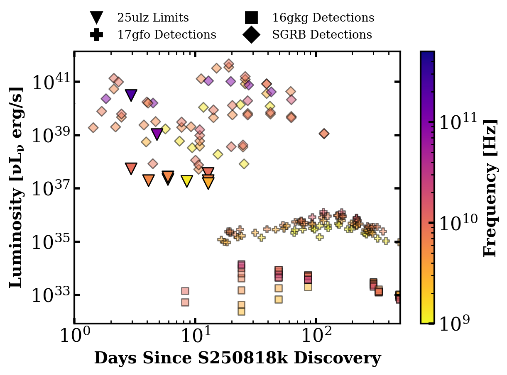

$\newcommand{\ensuremath}{}$
$\newcommand{\xspace}{}$
$\newcommand{\object}[1]{\texttt{#1}}$
$\newcommand{\farcs}{{.}''}$
$\newcommand{\farcm}{{.}'}$
$\newcommand{\arcsec}{''}$
$\newcommand{\arcmin}{'}$
$\newcommand{\ion}[2]{#1#2}$
$\newcommand{\textsc}[1]{\textrm{#1}}$
$\newcommand{\hl}[1]{\textrm{#1}}$
$\newcommand{\footnote}[1]{}$
$\newcommand{\vdag}{(v)^\dagger}$
$\newcommand$
$\newcommand$
$\newcommand{\LCO}{\affiliation{Las Cumbres Observatory, 6740 Cortona Drive, Suite 102, Goleta, CA 93117-5575, USA}}$
$\newcommand{\UCSB}{\affiliation{Department of Physics, University of California, Santa Barbara, CA 93106-9530, USA}}$
$\newcommand{\KITP}{\affiliation{Kavli Institute for Theoretical Physics, University of California, Santa Barbara, CA 93106-4030, USA}}$
$\newcommand{\UCD}{\affiliation{Department of Physics, University of California, 1 Shields Avenue, Davis, CA 95616-5270, USA}}$
$\newcommand{\WIS}{\affiliation{Department of Particle Physics and Astrophysics, Weizmann Institute of Science, 76100 Rehovot, Israel}}$
$\newcommand{\OKC}{\affiliation{Oskar Klein Centre, Department of Astronomy, Stockholm University, Albanova University Centre, SE-106 91 Stockholm, Sweden}}$
$\newcommand{\OAPD}{\affiliation{INAF-Osservatorio Astronomico di Padova, Vicolo dell'Osservatorio 5, I-35122 Padova, Italy}}$
$\newcommand{\Caltech}{\affiliation{Cahill Center for Astronomy and Astrophysics, California Institute of Technology, Mail Code 249-17, Pasadena, CA 91125, USA}}$
$\newcommand{\GSFC}{\affiliation{Astrophysics Science Division, NASA Goddard Space Flight Center, Mail Code 661, Greenbelt, MD 20771, USA}}$
$\newcommand{\UMD}{\affiliation{Joint Space-Science Institute, University of Maryland, College Park, MD 20742, USA}}$
$\newcommand{\UCB}{\affiliation{Department of Astronomy, University of California, Berkeley, CA 94720-3411, USA}}$
$\newcommand{\TTU}{\affiliation{Department of Physics, Texas Tech University, Box 41051, Lubbock, TX 79409-1051, USA}}$
$\newcommand{\STScI}{\affiliation{Space Telescope Science Institute, 3700 San Martin Drive, Baltimore, MD 21218, USA}}$
$\newcommand{\UT}{\affiliation{Department of Astronomy, The University of Texas at Austin, 2515 Speedway, Stop C1400, Austin, TX 78712, USA}}$
$\newcommand{\IoA}{\affiliation{Institute of Astronomy, University of Cambridge, Madingley Road, Cambridge CB3 0HA, UK}}$
$\newcommand{\QUB}{\affiliation{Astrophysics Research Centre, School of Mathematics and Physics, Queen's University Belfast, Belfast BT7 1NN, UK}}$
$\newcommand{\IPAC}{\affiliation{Spitzer Science Center, California Institute of Technology, Pasadena, CA 91125, USA}}$
$\newcommand{\JPL}{\affiliation{Jet Propulsion Laboratory, California Institute of Technology, 4800 Oak Grove Dr, Pasadena, CA 91109, USA}}$
$\newcommand{\Southampton}{\affiliation{Department of Physics and Astronomy, University of Southampton, Southampton SO17 1BJ, UK}}$
$\newcommand{\LANL}{\affiliation{Space and Remote Sensing, MS B244, Los Alamos National Laboratory, Los Alamos, NM 87545, USA}}$
$\newcommand{\Tsinghua}{\affiliation{Physics Department and Tsinghua Center for Astrophysics, Tsinghua University, Beijing, 100084, People's Republic of China}}$
$\newcommand{\NAOC}{\affiliation{National Astronomical Observatory of China, Chinese Academy of Sciences, Beijing, 100012, People's Republic of China}}$
$\newcommand{\Itagaki}{\affiliation{Itagaki Astronomical Observatory, Yamagata 990-2492, Japan}}$
$\newcommand{\Einstein}{\altaffiliation{Einstein Fellow}}$
$\newcommand{\Hubble}{\altaffiliation{Hubble Fellow}}$
$\newcommand{\CfA}{\affiliation{Center for Astrophysics \textbar  Harvard \& Smithsonian, 60 Garden Street, Cambridge, MA 02138-1516, USA}}$
$\newcommand{\UA}{\affiliation{Department of Astronomy and Steward Observatory, University of Arizona, 933 North Cherry Avenue, Tucson, AZ 85721-0065, USA}}$
$\newcommand{\MPA}{\affiliation{Max-Planck-Institut für Astrophysik, Karl-Schwarzschild-Stra\ss e 1, D-85748 Garching, Germany}}$
$\newcommand{\DSFP}{\altaffiliation{LSST-DA Data Science Fellow}}$
$\newcommand{\catalyst}{\altaffiliation{LSST-DA Catalyst Fellow}}$
$\newcommand{\HCO}{\affiliation{Harvard College Observatory, 60 Garden Street, Cambridge, MA 02138-1516, USA}}$
$\newcommand{\Carnegie}{\affiliation{Observatories of the Carnegie Institute for Science, 813 Santa Barbara Street, Pasadena, CA 91101-1232, USA}}$
$\newcommand{\TAU}{\affiliation{School of Physics and Astronomy, Tel Aviv University, Tel Aviv 69978, Israel}}$
$\newcommand{\Edinburgh}{\affiliation{Institute for Astronomy, University of Edinburgh, Royal Observatory, Blackford Hill EH9 3HJ, UK}}$
$\newcommand{\Birmingham}{\affiliation{Birmingham Institute for Gravitational Wave Astronomy and School of Physics and Astronomy, University of Birmingham, Birmingham B15 2TT, UK}}$
$\newcommand{\CIERA}{\affiliation{Center for Interdisciplinary Exploration and Research in Astrophysics and Department of Physics and Astronomy, \\Northwestern University, 1800 Sherman Ave., 8th Floor, Evanston, IL 60201, USA}}$
$\newcommand{\Bath}{\affiliation{Department of Physics, University of Bath, Claverton Down, Bath BA2 7AY, UK}}$
$\newcommand{\CTIO}{\affiliation{Cerro Tololo Inter-American Observatory, National Optical Astronomy Observatory, Casilla 603, La Serena, Chile}}$
$\newcommand{\Potsdam}{\affiliation{Institut für Physik und Astronomie, Universität Potsdam, Haus 28, Karl-Liebknecht-Str. 24/25, D-14476 Potsdam-Golm, Germany}}$
$\newcommand{\INPE}{\affiliation{Instituto Nacional de Pesquisas Espaciais, Avenida dos Astronautas 1758, 12227-010, São José dos Campos -- SP, Brazil}}$
$\newcommand{\UNC}{\affiliation{Department of Physics and Astronomy, University of North Carolina, 120 East Cameron Avenue, Chapel Hill, NC 27599, USA}}$
$\newcommand{\Ohio}{\affiliation{Astrophysical Institute, Department of Physics and Astronomy, 251B Clippinger Lab, Ohio University, Athens, OH 45701-2942, USA}}$
$\newcommand{ÅS}{\affiliation{American Astronomical Society, 1667 K~Street NW, Suite 800, Washington, DC 20006-1681, USA}}$
$\newcommand{\MMT}{\affiliation{MMT and Steward Observatories, University of Arizona, 933 North Cherry Avenue, Tucson, AZ 85721-0065, USA}}$
$\newcommand{\Geneva}{\affiliation{ISDC, Department of Astronomy, University of Geneva, Chemin d'Écogia, 16 CH-1290 Versoix, Switzerland}}$
$\newcommand{\Steward}{\affiliation{Steward Observatory, University of Arizona, 933 North Cherry Avenue, Tucson, AZ 85721, USA}}$
$\newcommand{\Leiden}{\affiliation{Leiden Observatory, Leiden University, PO Box 9513, 2300 RA Leiden, The Netherlands}}$
$\newcommand{\PSU}{\affiliation{Department of Astronomy \& Astrophysics, The Pennsylvania State University, University Park, PA 16802, USA}}$
$\newcommand{\PSUa}{\affiliation{Department of Astronomy \& Astrophysics, The Pennsylvania State University, University Park, PA 16802, USA}}$
$\newcommand{\PSUb}{\affiliation{Institute for Computational \& Data Sciences, The Pennsylvania State University, University Park, PA 16802, USA}}$
$\newcommand{\PSUc}{\affiliation{Institute for Gravitation and the Cosmos, The Pennsylvania State University, University Park, PA 16802, USA}}$
$\newcommand{\IAIFI}{\affiliation{The NSF AI Institute for Artificial Intelligence and Fundamental Interactions, USA}}$
$\newcommand{\JHU}{\affiliation{Department of Physics and Astronomy, Johns Hopkins University, 3400 North Charles Street, Baltimore, MD 21218, USA}}$
$\newcommand{\Utah}{\affiliation{Department of Physics \& Astronomy, University of Utah, Salt Lake City, UT 84112, USA}}$
$\newcommand{\UIUC}{\affiliation{Department of Astronomy, University of Illinois, 1002 W. Green St., Urbana, IL 61801, USA}}$
$\newcommand{\Maryland}{\affiliation{Department of Astronomy, University of Maryland, College Park, MD 20742-2421, USA}}$
$\newcommand{\keck}{\affiliation{W.~M.~Keck Observatory, 65-1120 M\=amalahoa Highway, Kamuela, HI 96y43-8431, USA}}$
$\newcommand{\cbpf}{\affiliation{Laboratório de Inteligência Artificial, Centro Brasileiro de Pesquisas Físicas, 138 Rua Dr. Xavier Sigaud 150, CEP 22290-180, 139 Rio de Janeiro, RJ, Brazil}}$
$\newcommand{\UFRJ}{\affiliation{Instituto de Física, Universidade Federal do Rio de Janeiro (UFRJ), Caixa Postal 68528, 21941-972 Rio de Janeiro, Brazil}}$
$\newcommand{\Monash}{\affiliation{School of Physics and Astronomy, Monash University, Clayton, Victoria 3800, Australia}}$
$\newcommand{\UCSD}{\affiliation{Department of Astronomy \& Astrophysics, University of California, San Diego, 9500 Gilman Drive, MC 0424, La Jolla, CA 92093-0424, USA}}$
$\newcommand{\Northwestern}{\affiliation{Department of Physics and Astronomy, Northwestern University, Evanston, IL 60208, USA}}$
$\newcommand{\todo}{\textcolor{red}{TODO: }\textcolor{red}}$
$\newcommand{\note}{\textcolor{blue}{NOTE: }\textcolor{blue}}$
$\newcommand{\gwdist}{\overline{D_{\rm GW}}}$
$\newcommand{\gwsig}{\sigma_{\rm GW}}$
$\newcommand{\canddist}{\overline{D_{\rm C}}}$
$\newcommand{\candsig}{\sigma_{\rm C}}$
$\newcommand{\candsigpos}{\sigma_{\rm C}^{+}}$
$\newcommand{\candsigneg}{\sigma_{\rm C}^{-}}$

# Optimizing Kilonova Searches: A Case Study of the Type IIb SN 2025ulz in the Localization Volume of the Low-Significance Gravitational Wave Event S250818k

<mark>Appeared on: 2025-10-21</mark> -  _37 pages, 12 figures. Submitted to ApJL_

N. Franz, et al. -- incl., <mark>K. Paterson</mark>

**Abstract:** Kilonovae, the ultraviolet/optical/infrared counterparts to binary neutron star mergers, are an exceptionally rare class of transients. Optical follow-up campaigns are plagued by impostors whose early evolution masquerades as the rapid radioactive decay of heavy elements. In this work, we present an analysis of the multi-wavelength dataset of supernova (SN) 2025ulz, a proposed kilonova candidate following the low-significance detection of gravitational waves originating from the potential binary neutron star merger S250818k.  Despite an early rapid decline in brightness, our multi-wavelength observations of SN 2025ulz reveal that it is a type IIb supernova. As part of this analysis, we demonstrate the capabilities of a novel quantitative scoring algorithm to determine the likelihood that a transient candidate is a kilonova, based primarily on its 3D location and light curve evolution. We also apply our scoring algorithm to other transient candidates in the localization volume of S250818k and find that, at all times after the discovery of SN 2025ulz, there are $\geq 4$ candidates with a score more promising than SN 2025ulz. During future kilonova searches, this type of scoring algorithm will be useful to rule out contaminating transients in real time, optimizing the use of valuable telescope resources.

**Figure 7. -** A comparison of the $gri$ light curves for SN 2025ulz (black), SN 2016gkg \citep[blue; ][]{tartaglia_progenitor_2017}, SN 2022hnt \citep[orange; ][]{farah_when_2025}, and AT 2017gfo \citep[red; ][]{villar_combined_2017}. For SN 2025ulz, We choose an explosion date of MJD=60904 based on our shock cooling modeling (see \autoref{sec:early-lc-model}). The best fit (_i.e._, lowest sum of the residual squared) $r$-band KN model \citep[from][]{kasen_origin_2017} to SN 2025ulz for the early time ($\delta t \leq 6$ days) light curve decline is shown as a solid line. We also show the $r$- (black dashed line) and $g$-band (black dotted line) models for SN 2016gkg from piro_numerically_2017. At phase $\delta t \lesssim 6$ days all four observed light curves appear to redden as they fade rapidly at around the same rate. At $\delta t \gtrsim 6$ days, the light curves of SN 2025ulz and the other SNe IIb begin to re-brighten while the KN light curve continues to fade rapidly. (*fig:optical-lc*)

**Figure 8. -** Comparison of the MMT optical spectrum of SN 2025ulz (black) to the type IIb SN 2022hnt \citep[orange;][]{farah_when_2025}, SN 2016gkg \citep[sky blue;][]{tartaglia_progenitor_2017} and the kilonova AT 2017gfo \citep[red; ][]{pian_spectroscopic_2017}, all at similar phases. The low opacity colored regions behind the spectra show the 1-sigma uncertainty and the grey vertical strips are regions of telluric features. The spectral features from SN 2025ulz appear most similar to SN 2022hnt and do not show any similarity with AT 2017gfo. Most notably, the broad P-Cygni H$\alpha$ feature highlighted in dark blue, present in both SN 2025ulz and SN 2022hnt, is not expected, nor seen, in the KN spectrum. (*fig:binospec*)

**Figure 4. -** The radio light curves of SN 2025ulz (downward triangles as limits) as compared to SN 2016gkg \citep[squares; ][]{a_j_radio_2022}, a sample of short SGRB radio detections \citep[diamonds; ][]{2005Natur.438..988B,2006ApJ...650..261S,2014ApJ...780..118F,2015ApJ...815..102F,2019ApJ...883...48L,2021ApJ...906..127F,2022ApJ...935L..11L,2022ApJ...940...56F,2024ApJ...962....5N,2024ApJ...970..139S,2024Natur.626..737L,2025ApJ...982...42S,2025arXiv250715940D,GCN16815,GCN38189,GCN40966,GCN41038,GCN41046,GCN41419,GCN41060,GCN35097,GCN9958,GCN41455}, and AT 2017gfo \citep[plus signs; ][]{2017ApJ...848L..21A,2017Sci...358.1579H,2017ApJ...850L..21K,2021ApJ...922..154M,2017Sci...358.1579H,2018ApJ...868L..11M,2018Natur.554..207M,2018Natur.561..355M,2018ApJ...867...57R,2018Natur.554..207M,2018ApJ...868L..11M,2018ApJ...858L..15D,2018ApJ...868L..11M,2018ApJ...868L..11M,2018ApJ...856L..18M,2020MNRAS.494.5110B,2018ApJ...858L..15D,2019Sci...363..968G,2018ApJ...863L..18A,2019MNRAS.489.1919T,2019ApJ...886L..17H}. The color of the point is the representative frequency of the receiver used for the observation. Our radio limits on SN 2025ulz rule out an SGRB-like on-axis jet but do not rule out SN IIb-like or late-rising AT2017gfo-like radio emission.  (*fig:radio-lc*)

