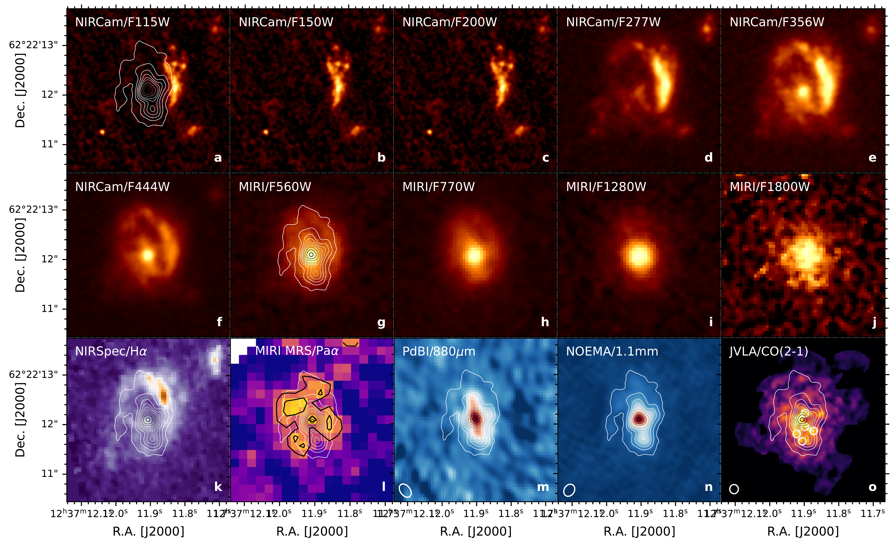
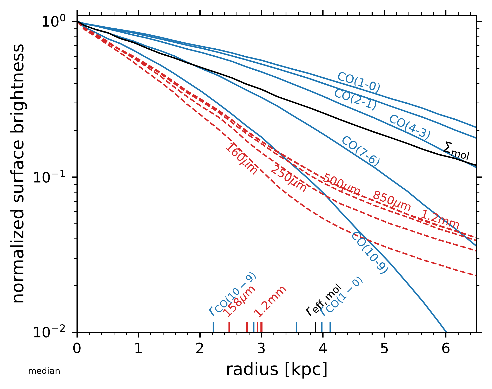
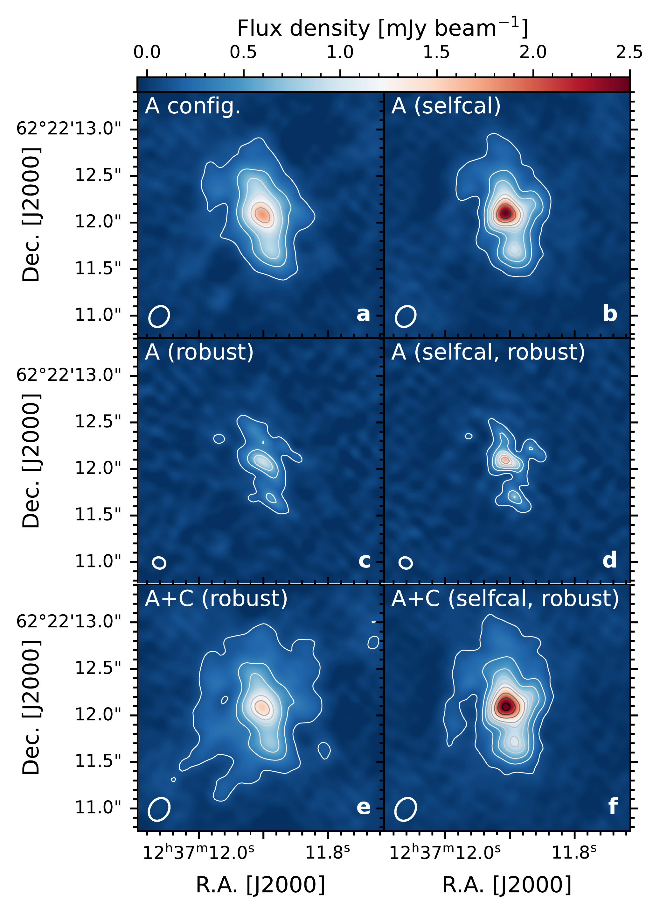

$\newcommand{\ensuremath}{}$
$\newcommand{\xspace}{}$
$\newcommand{\object}[1]{\texttt{#1}}$
$\newcommand{\farcs}{{.}''}$
$\newcommand{\farcm}{{.}'}$
$\newcommand{\arcsec}{''}$
$\newcommand{\arcmin}{'}$
$\newcommand{\ion}[2]{#1#2}$
$\newcommand{\textsc}[1]{\textrm{#1}}$
$\newcommand{\hl}[1]{\textrm{#1}}$
$\newcommand{\footnote}[1]{}$
$\newcommand{\vdag}{(v)^\dagger}$
$\newcommand$
$\newcommand$
$\newcommand{\MPIA}{\affiliation{Max Planck Institute for Astronomy, Königstuhl 17,  69117 Heidelberg, Germany}}$
$\newcommand{\DAWN}{\affiliation{Cosmic Dawn Center (DAWN), Denmark}}$
$\newcommand{\DTU}{\affiliation{DTU Space, Technical University of Denmark, Elektrovej, Building 328, 2800, Kgs. Lyngby, Denmark}}$
$\newcommand{\DARK}{\affil{DARK, Niels Bohr Institute, University of Copenhagen, Jagtvej 128, 2200 Copenhagen, Denmark}}$
$\newcommand{\NBI}{\affil{Niels Bohr Institute, University of Copenhagen, Jagtvej 128, 2200 Copenhagen, Denmark}}$
$\newcommand{\Stockholm}{\affiliation{Department of Astronomy, Stockholm University, Oscar Klein Centre, AlbaNova University Centre, 106 91 Stockholm, Sweden}}$
$\newcommand{\NRAO}{\affiliation{National Radio Astronomy Observatory, Pete V. Domenici Array Science Center, P.O. Box O, Socorro, NM 87801, USA}}$
$\newcommand{\CABcda}{\affiliation{Centro de Astrobiología (CAB), CSIC-INTA, Ctra. de Ajalvir km 4, Torrejón de Ardoz, E-28850, Madrid, Spain}}$
$\newcommand{\CABcbdc}{\affiliation{Centro de Astrobiología (CAB), CSIC-INTA, Camino Bajo del Castillo s/n, 28692 Villanueva de la Cañada, Madrid, Spain}}$
$\newcommand{\ESAC}{\affiliation{Telespazio UK for the European Space Agency, ESAC, Camino Bajo del Castillo s/n, 28692 Villanueva de la Cañada, Spain}}$
$\newcommand{\Kapteyn}{\affiliation{Kapteyn Astronomical Institute, University of Groningen, P.O. Box 800, 9700AV Groningen, The Netherlands}}$
$\newcommand{\Leiden}{\affil{Leiden Observatory,  Leiden University, PO Box 9513, NL-2300 RA Leiden, The Netherlands}}$
$\newcommand{\UCL}{\affiliation{Dept. of Physics and Astronomy, University College London, Gower Street, London WC1E 6BT, United Kingdom}}$
$\newcommand{\Edinburgh}{\affiliation{UK Astronomy Technology Centre, Royal Observatory Edinburgh, Blackford Hill, Edinburgh EH9 3HJ, UK}}$
$\newcommand{\ITA}{\affil{Institute for Theoretical Physics, Heidelberg University, Philosophenweg 12, D–69120, Heidelberg, Germany}}$
$\newcommand{\Cologne}{\affil{I.Physikalisches Institut der Universität zu Köln, Zülpicher Str. 77, 50937 Köln, Germany}}$
$\newcommand{\MPIfR}{\affil{Max Planck Institute for Radiosastronomie, Auf dem Hügel 69, 53121 Bonn, Germany}}$
$\newcommand{\Geneva}{\affil{Departement d'Astronomie, University of Geneva, Chemin Pegasi 51, 1290 Versoix, Switzerland}}$
$\newcommand{\Marseille}{\affil{Aix Marseille Univ, CNRS, CNES, LAM, Marseille, France}}$
$\newcommand{\SPL}{\affil{School of Physics \& Astronomy, Space Research Centre, Space Park Leicester, University of Leicester, 92 Corporation Road, Leicester LE4 5SP, UK}}$
$\newcommand{\Dublin}{\affil{Dublin Institute for Advanced Studies, Astronomy \& Astrophysics Section, 31 Fitzwilliam Place, Dublin 2, Ireland}}$
$\newcommand{\ParisDaddi}{\affil{CEA, IRFU, DAp, AIM, Université Paris-Saclay, Université Paris Cité, Sorbonne Paris Cité, CNRS, 91191 Gif-sur-Yvette, France}}$
$\newcommand{\STScI}{\affil{Space Telescope Science Institute (STScI), 3700 San Martin Drive, Baltimore, MD 21218, USA}}$
$\newcommand{\sectionautorefname}{\S}$
$\newcommand{\subsectionautorefname}{\S}$
$\newcommand{\subsubsectionautorefname}{\S}$
$\newcommand{\figureautorefname}{Fig.}$
$\newcommand{\equationautorefname}{Eq.}$

# Resolving the dusty star-forming galaxy GN20 at $z=4.055$ with  NOEMA and JWST: A similar distribution of stars, gas and dust  despite distinct apparent profiles

<mark>Appeared on: 2025-10-21</mark> -  _20 pages, 11 figures, 3 tables. Accepted for publication in ApJ_

L. A. Boogaard, et al. -- incl., <mark>F. Walter</mark>

**Abstract:** We present high-resolution (0 $\farcs$ 13--0 $\farcs$ 23) NOEMA observations  of the dust continuum emission at 1.1 mm (rest-frame 220 $\micron$ )  and JWST/NIRCam and MIRI imaging of the $z=4.055$ starburst galaxy  GN20.  The sensitive NOEMA imaging at 1.6 kpc resolution reveals  extended dust emission, $\approx$ 14 kpc in diameter  ( $r_e\approx2.5$ kpc, $b/a=0.5$ ), that is centrally asymmetric  and clumpy.  The dust emission is as extended as the stellar  emission and the molecular gas traced by $^{12}$ CO(2--1), with a  common center, and is brightest in the strongly-obscured nuclear  part of the galaxy.  Approximately one-third of the total dust  emission emerges from the nucleus and the most prominent clump to  the south, and (only) 60 \% from the central $3.5\times1.5$ kpc  (0 $\farcs$ 5--0 $\farcs$ 2), implying that the starburst is very extended.  The combined JWST and NOEMA morphology suggests GN20 experienced a  recent interaction or merger, likely invigorating the starburst.  The radial surface brightness profiles of the molecular gas and  near-infrared stellar emission are similar, while in contrast, the  dust emission appears significantly more concentrated.  Through  self-consistent radiative transfer modeling of the integrated and  resolved $^{12}$ CO and dust emission, we derive an $\Mmol=2.9^{+0.4}_{-0.3}\times10^{11}$ $\Msun$ with $\aco=2.8^{+0.5}_{-0.3}$ .  We find the extended dust implies a lower  global dust optical depth than previously reported, but a high dust  mass of $\Mdust=5.7^{+0.8}_{-0.6}\times 10^{9}$ $\Msun$ and  gas-to-dust ratio of $\approx 50$ .  Furthermore, we show that the  distinct apparent radial profiles of the gas and dust can be  explained purely by radiative transfer effects (differences in the  radial optical depths and temperatures) and the observations are  consistent with the gas and dust mass being similarly distributed  throughout the starburst.  The latter highlights the importance of  accounting for radiative transfer effects when comparing molecular  gas and dust distributions from different tracers.

**Figure 6. -** Multi-wavelength cutouts of GN20.  The top two rows show
    the NIRCam and MIRI imaging (\citealt{Colina2023, Crespo2024})
    covering the rest-frame 0.23 \micron--3.56 \micron range.  The
    bottom row shows the \Ha map \citep{Ubler2024}, \Paa map
    \citep[][with 2--3$\sigma$ contours overlaid]{Bik2024}, the dust
    continuum at 880 \micron\citep[PdBI][]{Hodge2012} and 1.1 mm
    (NOEMA; this work) and the JVLA/CO(2--1) \citep[][with their CO
    clumps indicated]{Hodge2012}.  All maps are shown on a linear
    colorscale and NOEMA contours are overlaid on selected images,
    starting at $5\sigma$ and increasing in steps of $10\sigma$ up to
    $55\sigma$ and then steps of $20\sigma$ up to $115\sigma$.  Beam
    sizes of the radio maps are shown in the bottom left
    corner.  (*fig:cutouts*)

**Figure 9. -** **Left:** Median CO (blue)
    and dust (red) continuum surface brightness profiles from best-fit
    model together with the underlying gas mass surface density
    (black). **Right:** Same figure as on the left but now
    normalized to the values in the center. The measured effective
    (half-light) radii are indicated on the x-axis (with the lowest
    and highest-frequency line and transition
    labeled). (*fig:ted_profiles*)

**Figure 1. -**  IRAM/NOEMA long-baseline
    1.1 mm imaging of GN20.  The left and right columns show the
    cleaned images before and after self calibration.  The panels show
    the (a) highest resolution A-configuration tracks only, at natural
    resolution ($0$\farcs$24\times0$\farcs$2$), before and (b) after self
    calibration, (c) A tracks, robust weighted to higher resolution
    ($0$\farcs$14\times0$\farcs$12$), before and (d) after self
    calibration, (e) A+C configuration tracks, robust weighted to the
    A configuration-only resolution ($0$\farcs$26\times0$\farcs$2$) before
    and (f) after self-calibration.  Contours are overlaid on all
    images, starting at $5\sigma$ increasing in steps of $10\sigma$ up
    to $55\sigma$ and then steps of $20\sigma$. (*fig:cutout_weighting*)

