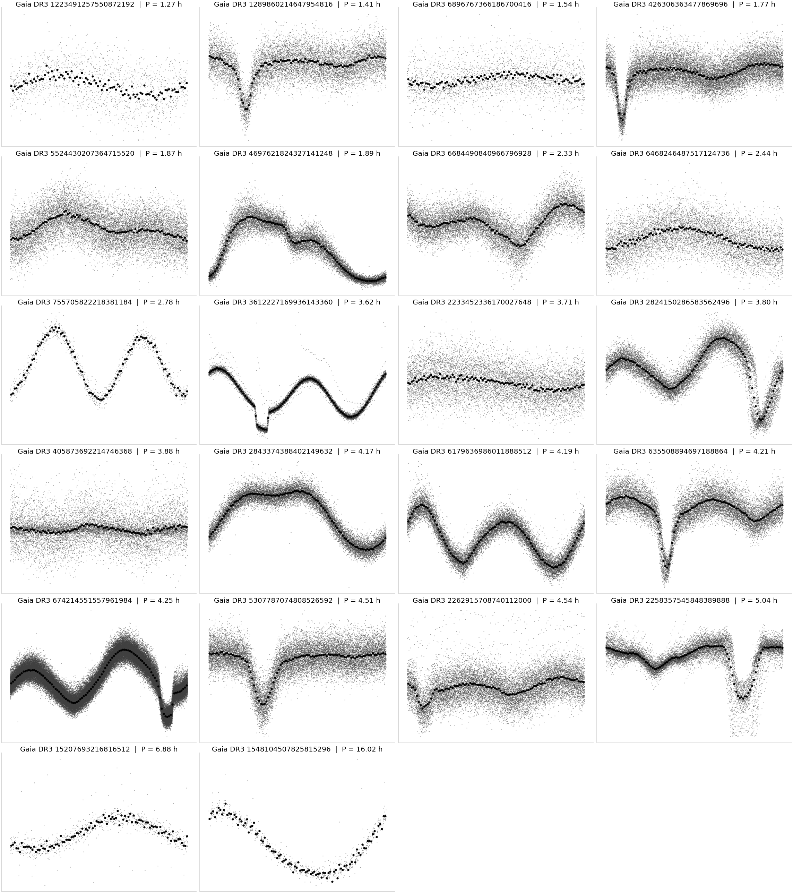
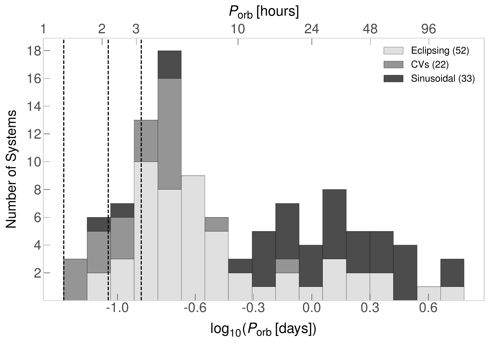
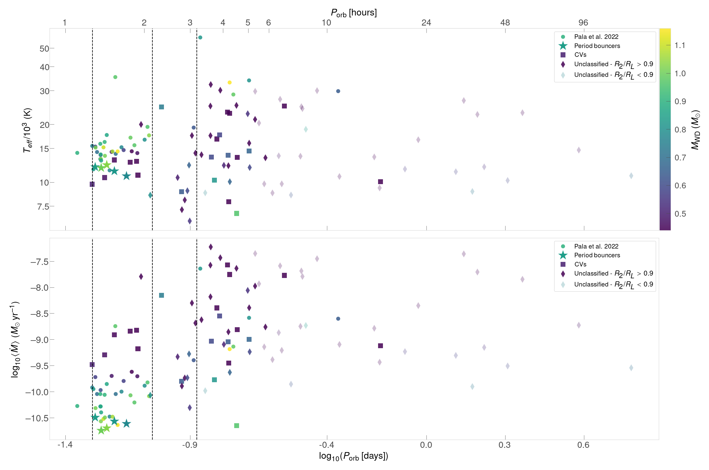

$\newcommand{\ensuremath}{}$
$\newcommand{\xspace}{}$
$\newcommand{\object}[1]{\texttt{#1}}$
$\newcommand{\farcs}{{.}''}$
$\newcommand{\farcm}{{.}'}$
$\newcommand{\arcsec}{''}$
$\newcommand{\arcmin}{'}$
$\newcommand{\ion}[2]{#1#2}$
$\newcommand{\textsc}[1]{\textrm{#1}}$
$\newcommand{\hl}[1]{\textrm{#1}}$
$\newcommand{\footnote}[1]{}$
$\newcommand{\Msun}{\ensuremath{M_\odot}}$
$\newcommand{\vdag}{(v)^\dagger}$
$\newcommand$
$\newcommand$
$\newcommand{\msun}{M_\odot}$
$\newcommand{\arraystretch}{0.9}$

# The Silent Majority: The Interacting Post-Common-Envelope Binaries Underlying Cataclysmic Variables

<mark>Appeared on: 2025-10-22</mark> - 

Y. M. Shani, et al. -- incl., <mark>S. Shahaf</mark>, <mark>J. Li</mark>, <mark>H.-W. Rix</mark>

**Abstract:** We analyze the orbital period distribution of post-common-envelope white-dwarf-main-sequence (WDMS) binaries by cross-matching the new spectroscopic Gaia DR3 WDMS catalog with TESS light curves, and applying a uniform periodicity search and vetting pipeline. We identify 107 periodic systems, including 74 eclipsing binaries (32 new) and 33 binaries exhibiting only sinusoidal variations. Injection-recovery tests and a forward detectability model yield a completeness-corrected distribution that is well-described by a two-component function: a log-period Gaussian peaking at $P_{\rm orb} \approx 4.1 $ h with $\sigma \approx 1.8$ h, plus a rising component that begins near $P_{\rm orb}\approx12.9$ h. We refer to this extended component as the long-period tail. It consists exclusively of detached non-interacting post-common-envelope binaries (PCEBs) that likely emerged from the common envelope and have not yet initiated mass transfer. In contrast, the short-period Gaussian is dominated by interacting or near-contact systems (including 22 known cataclysmic variables), consistent with high Roche-lobe filling factors. From the completeness-corrected distribution we infer that $29.8\%\pm4.5\%$ of the spatially unresolved WDMSs in our parent catalog are close PCEBs. Binary population synthesis models with high common-envelope efficiencies overproduce long-period systems and fail to reproduce the sharp peak, whereas lower efficiencies ( $\alpha\lambda \leq 0.3$ ) match the peak more closely, yet still underpredict the tail. Our results hint at a large, currently under-classified reservoir of pre-cataclysmic variables and weakly accreting binaries, and provide new constraints on common-envelope physics.

**Figure 10. -** Phase-folded (gray) and binned (black) TESS light curves of the known CVs in our sample. (*fig:ecl1*)

**Figure 7. -** Stacked histogram of the orbital period distribution (in log hours) for three sub-classes:
    eclipsing PCEBs (light gray, N = 52), CVs (medium gray, N = 22),  and sinusoidal variables (dark gray, N = 33). Vertical dashed lines mark the minimum observed CV period ($\approx$  80 min ) and the canonical lower ($\sim2$ h) and upper ($\sim3$ h) boundaries of the CV "period gap". (*fig:ellipsoidals_period_distribution*)

**Figure 17. -** Comparison of our eclipsing WDMS systems (52 unclassified PCEBs + 22 CVs; sinusoidal variables excluded) to the UV-calibrated CV locus from the HST+Gaia sample of [Pala, Gänsicke and Belloni (2022)](). _Top_: WD effective temperature versus orbital period. _Bottom_: equivalent long-term accretion rate $\langle\dot M\rangle$(inferred from the WD's $T_{\rm eff}$ following the UV calibration) versus orbital period. Vertical dashed lines mark the minimum observed CV period ($\approx$  80 min ) and the canonical lower ($\sim2$ h) and upper ($\sim3$ h) boundaries of the CV "period gap". Unclassified eclipsers at $P_\text{orb} \approx 3  -  6$ h lie on the same $T_{\rm eff}  -  P_{\rm orb}$ sequence as CVs above the period gap, indicating that many systems are near, or already interacting, even without a CV classification. (*fig:temp_period*)

