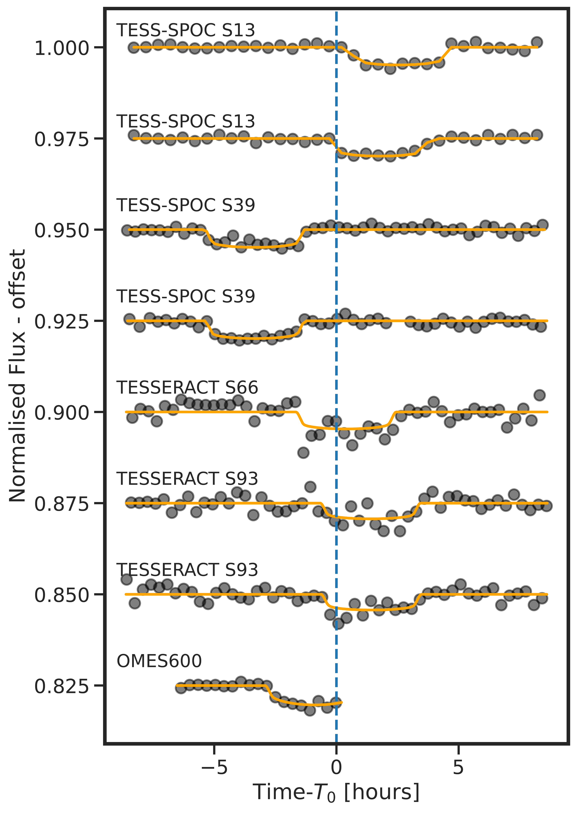
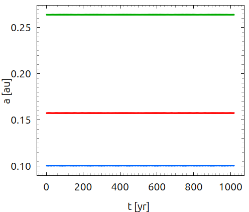
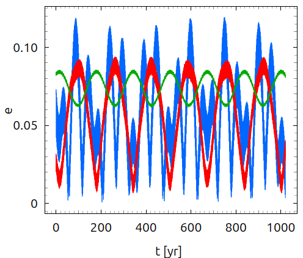
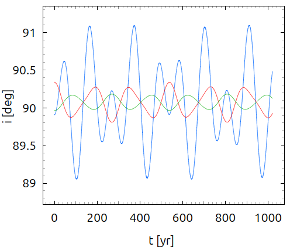
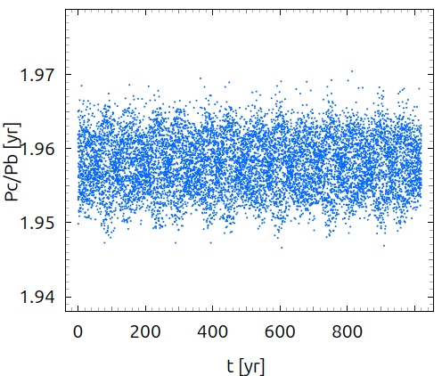
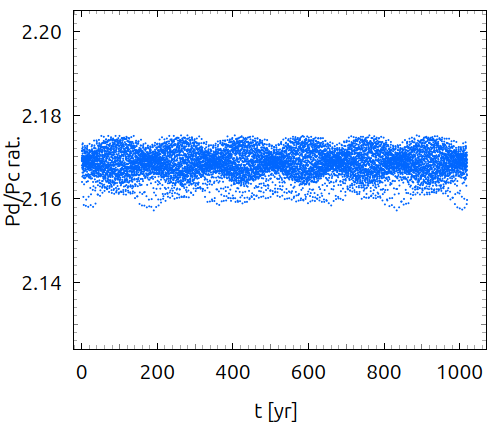
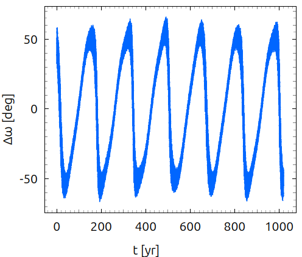
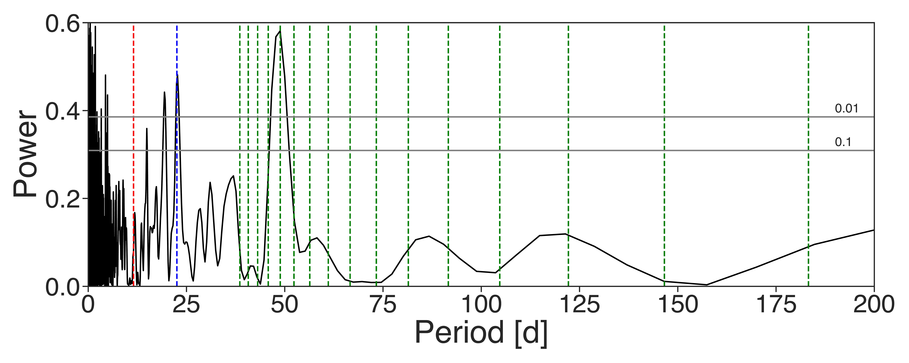
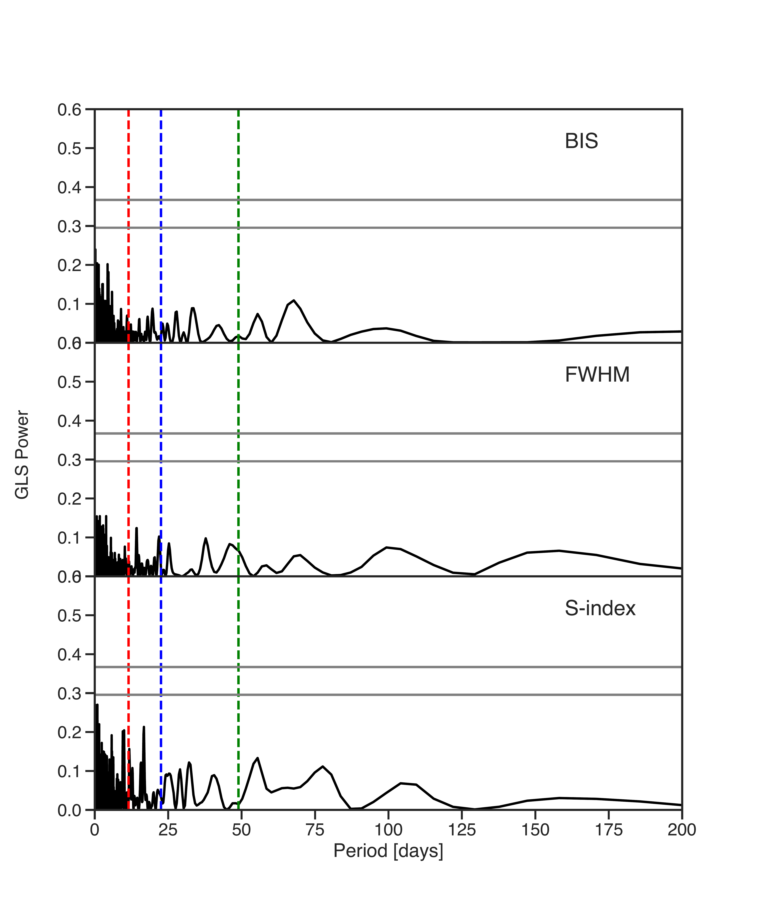

$\newcommand{\ensuremath}{}$
$\newcommand{\xspace}{}$
$\newcommand{\object}[1]{\texttt{#1}}$
$\newcommand{\farcs}{{.}''}$
$\newcommand{\farcm}{{.}'}$
$\newcommand{\arcsec}{''}$
$\newcommand{\arcmin}{'}$
$\newcommand{\ion}[2]{#1#2}$
$\newcommand{\textsc}[1]{\textrm{#1}}$
$\newcommand{\hl}[1]{\textrm{#1}}$
$\newcommand{\footnote}[1]{}$
$\newcommand{\vdag}{(v)^\dagger}$
$\newcommand$
$\newcommand$
$\newcommand$
$\newcommand$
$\newcommand$
$\newcommand$
$\newcommand{\rPb}{11.507 d}$
$\newcommand{\rPc}{22.564 d}$
$\newcommand{\rPd}{48.925 d}$
$\newcommand{\rpl}{R_P}$
$\newcommand{\mpl}{M_P}$
$\newcommand{\rjup}{R_J}$
$\newcommand{\mjup}{M_J}$
$\newcommand{\rsun}{R_{\odot}}$
$\newcommand{\msun}{M_{\odot}}$
$\newcommand{\rpb}{0.655\pm0.018 \rjup}$
$\newcommand{\rpc}{0.973\pm0.023 \rjup}$
$\newcommand{\rpd}{0.923\pm0.044 \rjup}$
$\newcommand{\mpb}{0.0250\pm0.0023 \mjup}$
$\newcommand{\mpc}{0.403\pm0.024 \mjup}$
$\newcommand{\mpd}{0.773\pm0.052 \mjup}$
$\newcommand{\thetable}{A\arabic{table}}$
$\newcommand{\thefigure}{A\arabic{figure}}$

# A Compact Multi-Planet System of Three Transiting Giant Planets Around TIC118798035

<mark>Appeared on: 2025-10-23</mark> -  _17 pages, submitted to AAS journals_

R. Brahm, et al. -- incl., <mark>T. Henning</mark>, <mark>L. Acuña</mark>, <mark>Y. Reinarz</mark>

**Abstract:** We report the discovery and characterization of three transiting giant planets in the $\stname$ system. The three planets were identified as transiting candidates from data of the TESS mission, and confirmed with ground-based photometric transit observations along with radial velocity variations obtained with FEROS, HARPS and ESPRESSO. The three planets present transit timing variations (TTVs). We performed a N-body orbital fitting to the TTVs and radial velocities finding that $\plnameb$ is as warm low-density Neptune with a mass of $\mpb$ , a radius of $\rpb$ , and an orbital period of $\rPb$ ; $\plnamec$ is a warm Saturn with a mass of $\mpc$ , a radius of $\rpc$ , and an orbital period of $\rPc$ ; and $\plnamed$ is a warm Jupiter with a mass of $\mpd$ , a radius of $\rpd$ , and an orbital period of $\rPd$ . The bulk metallicities of the three planets don't fully follow the mass-metallicity correlation found for the giant planets of the solar system, which hints at a somewhat different formation history for the planets of the $\stname$ system. $\stname$ is the only system having more than two transiting planets larger than 0.5 $R_J$ with a precise orbital and physical characterization, amenable for future atmospheric studies.

**Figure 2. -** TESS and ground-based transits of \plnameb centered on the transit time predicted from linear ephemeris. The transit model generated by  \texttt{juliet} is also plotted for each transit.  (*fig:transitsb*)

**Figure 10. -** Orbital evolution of the TIC 118798035 system for an extent of 1000 years for the best-fit (maximum $-lnL$) sample from the MCMC posteriors.
    *Top panels, from left to right:* evolution of the planetary semi-major axes, eccentricities and inclinations where \plnameb is shown with blue
    \plnamec with red, and \plnamed with green, respectively.
    *Bottom panels, from left to right* show the evolution of the period ratio between the inner pair $P_{\rm{c}} / P_{\rm{b}}$, the outer pair $P_{\rm{d}} / P_{\rm{c}}$, and the libration of the apsidal angle $\Delta\omega_{c-d}$ in aligned configuration around 0$^\circ$.
     (*evol_plot*)

**Figure 1. -** GLS periodogram generated from the FEROS, HARPS, and ESPRESSO radial velocities of \stname. The horizontal lines correspond to the 10\% and 1\% false alarm probabilities. The red and blue dashed vertical lines mark the orbital periods of candidates $b$ and $c$, respectively. The green dashed vertical lines mark the possible period aliases of \plnamed based on TESS photometry.Same as in Figure \ref{fig:gls} but for the bisector spans, FWHM, and S-index. Here the green dashed line corresponds to the orbital period of \plnamed constrained by the radial velocities and HATPI light curve. (*fig:gls*)

