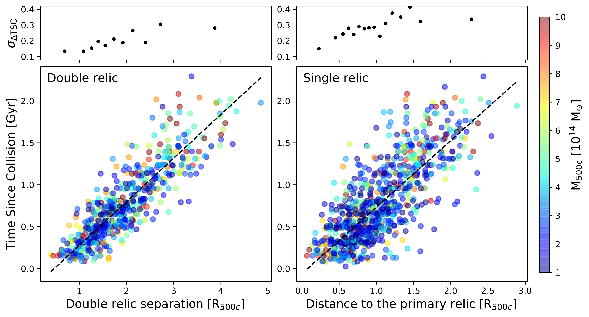
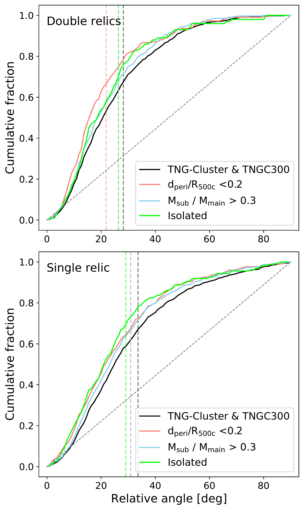

$\newcommand{\ensuremath}{}$
$\newcommand{\xspace}{}$
$\newcommand{\object}[1]{\texttt{#1}}$
$\newcommand{\farcs}{{.}''}$
$\newcommand{\farcm}{{.}'}$
$\newcommand{\arcsec}{''}$
$\newcommand{\arcmin}{'}$
$\newcommand{\ion}[2]{#1#2}$
$\newcommand{\textsc}[1]{\textrm{#1}}$
$\newcommand{\hl}[1]{\textrm{#1}}$
$\newcommand{\footnote}[1]{}$
$\newcommand{\mytilde}{\raise.19ex\hbox{\scriptstyle\sim}}$
$\newcommand{\vdag}{(v)^\dagger}$
$\newcommand$
$\newcommand$
$\newcommand\MSUN{\rm M_{\odot}}$
$\newcommand\MTWOC{M_{\rm 200c}}$
$\newcommand\MFIVEC{M_{\rm 500c}}$

# Exploring the statistical properties of double radio relics in the TNG-Cluster and TNG300 simulations

<mark>Appeared on: 2025-10-27</mark> -  _22 pages, 16 figures_

W. Lee, et al. -- incl., <mark>A. Pillepich</mark>

**Abstract:** Double radio relics, pairs of diffuse radio features located on opposite sides of merging galaxy clusters, are a rare subclass of radio relics that are believed to trace merger shocks and provide valuable constraints on plasma acceleration models and merger history. With the number of known double relics growing in recent and upcoming radio surveys, statistical analyses of their properties are becoming feasible. In this study, we utilize the cosmological magnetohydrodynamics zoom-in simulations TNG-Cluster, in combination with TNG300-1, to examine the statistical properties of double radio relics. The simulated double relic pairs exhibit a wide range of luminosity ratios, broadly consistent with the observations. We find that the two relics in a given double system often differ significantly in their shock properties and magnetic field strengths. This diversity implies that the observed brightness asymmetry in the pair cannot be explained by a single factor alone,but instead reflects an interplay of multiple physical parameters. Nevertheless, double radio relics tend to align with the collision axis within $\mytilde30^{\circ}$ and their separation ( $d_{\rm drr}$ ) correlates tightly with the time since collision (TSC) as ${\rm TSC [Gyr]} = 0.52 d_{\rm drr}/R_{500\rm c} - 0.24$ , allowing it to be inferred with an accuracy of $\mytilde0.2 \rm Gyr$ .With the statistical samples of simulated radio relics, we predict that low-mass clusters will constitute the dominant population of double radio relic systems detected with upcoming surveys such as SKA. These results demonstrate that double radio relics can serve as robust probes of merger dynamics and plasma acceleration, and that simulations provide critical guidance for interpreting the large samples expected from next-generation radio surveys.

**Figure 16. -** Correlation between the time since collision (TSC) and the double radio relic separation (left) or the single radio relic separation (right), both normalized by $R_{\rm 500c}$. Colors indicate $M_{\rm 500c}$ of the main cluster. The dashed lines represent the best-fit linear relations over the ranges $[1.0, 3.5]$ and $[0.5, 2.5]$ for double- and single-relic separations, respectively. The top panels present the standard deviation of the residuals from the relations. The scatter increases with relic separation, while the double- and single-relic separations constrain the time since collision to $\mytilde 0.2$ and $\mytilde 0.3 \mathrm{Gyr}$, respectively. (*fig:TSC_relic_sep*)

**Figure 4. -** 
Cumulative fraction of the relative angle between the collision axis and the vector connecting the centers of the double radio relics (top) or the center of the primary relic (bottom) from TNG-Cluster and TNG300. Color show subsamples with simple merger geometries, selected as head-on mergers ($d_{\rm peri}/R_{\rm 500c} < 0.2$), major mergers ($M_{\rm sub}/M_{\rm main} > 0.3$), and isolated mergers. The results show that relic axes can typically constrain the collision axis within $\mytilde30^{\circ}$.
 (*fig:collision_axis*)

**Figure 10. -** Fraction of clusters with symmetric radio relic compared to the total number of clusters in each mass bin, shown for varying luminosity cut from TNG-Cluster and TNG300. The luminosity criterion is applied to the primary radio relic, and the uncertainty is assumed to be Poisson noise. The dominant fraction of symmetric relics is found in the most massive clusters with a large luminosity cut, while the contribution from low-mass clusters rapidly increases with deeper surveys.
  (*fig: fdrr_mass_full*)

