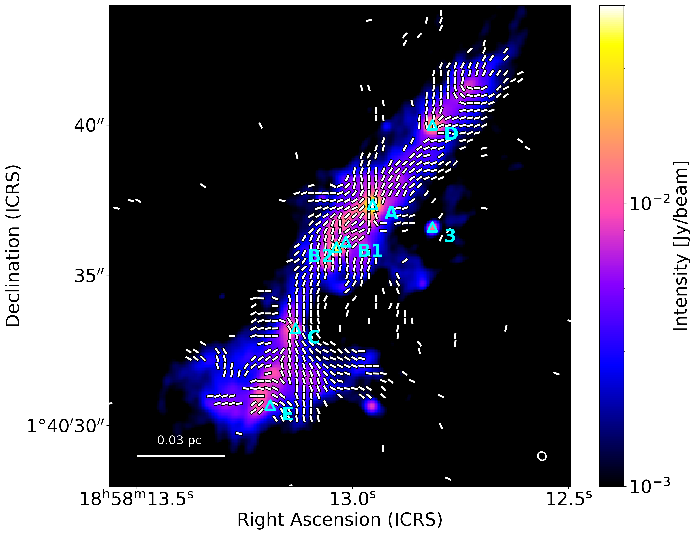
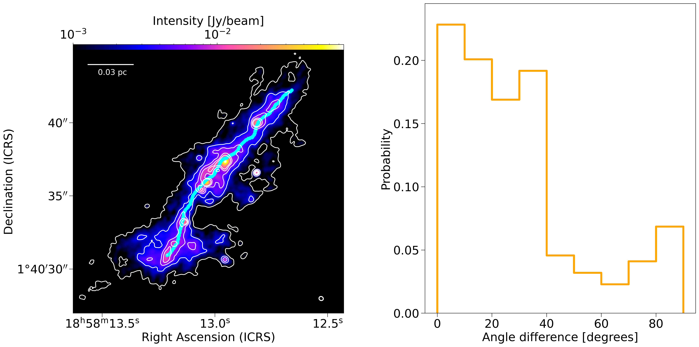

$\newcommand{\ensuremath}{}$
$\newcommand{\xspace}{}$
$\newcommand{\object}[1]{\texttt{#1}}$
$\newcommand{\farcs}{{.}''}$
$\newcommand{\farcm}{{.}'}$
$\newcommand{\arcsec}{''}$
$\newcommand{\arcmin}{'}$
$\newcommand{\ion}[2]{#1#2}$
$\newcommand{\textsc}[1]{\textrm{#1}}$
$\newcommand{\hl}[1]{\textrm{#1}}$
$\newcommand{\footnote}[1]{}$
$\newcommand{\vdag}{(v)^\dagger}$
$\newcommand$
$\newcommand$

# Magnetic Fields in Massive Star-forming Regions (MagMaR). VI. Magnetic Field Dragging in the Filamentary High-mass Star-forming Region G35.20--0.74N due to Gravity

<mark>Appeared on: 2025-10-30</mark> -  _submitted to AJ_

J. Hwang, et al. -- incl., <mark>H. Beuther</mark>

**Abstract:** We investigate the magnetic field orientation and strength in the massive star-forming region G35.20-0.74N (G35), using polarized dust emission data obtained with the Atacama Large Millimeter/submillimeter Array (ALMA) as part of the Magnetic fields in Massive star-forming Regions (MagMaR) survey. The G35 region shows a filamentary structure (a length of $\sim$ 0.1 pc) with six bright cores located along the filament's long axis. Magnetic field strengths across the G35 region range from 0.2 to 4.4 mG with a mean value of 0.8 $\pm$ 0.4 mG. The mass-to-flux ratio ( $\lambda$ ) varies from 0.1 to 6.0 the critical value. The highest values are found locally around cores, whereas the remains of the filament are subcritical.A H $^{13}$ CO $^+$ (3--2) velocity gradient of 29 km s $^{-1}$ pc $^{-1}$ is evident along the filament's long axis, aligned with the magnetic field direction. At larger scales ( $\sim$ 0.1 pc), the magnetic field lines appear roughly perpendicular to the filament's long axis, in contrast to the smaller-scale structure ( $\sim$ 0.003 pc) traced by ALMA.The magnetic field lines could be dragged along the filament as a result of the gas motion induced by the gravitational potential of the filament. Six cores in the filament have similar spacings between 0.02--0.04 pc. The initial filament fragmentation could have produced a core spacing of 0.06 pc, following filament fragmentation theory, and the current core spacing is the result of cores comoving with the gas along the filament. This core migration could occur in a few 10 $^4$ years, consistent with high-mass star formation time scales.

**Figure 3. -** The maps of polarization angle dispersion (Left), volume density (Middle), and non-thermal velocity dispersion of the non-thermal component of H$^{13}$CO$^+$(Right) in G35. Black contours show the flux density of G35 at 10, 20, 30, and 40 $\times$$\delta I$ levels. The region within 10 $\times$$\delta I$ level is comparable to the filament with the width of 0.015 estimated in Section \ref{sec:vol} along the black skeleton shown in Figure \ref{fig:fila}.
 (*fig:poldisp*)

**Figure 1. -** Map of the magnetic field orientation obtained from dust polarization observations using ALMA in G35. The background image is the intensity (Stokes $I$) at Band 6 frequency, $\sim250$ GHz. The white segments show the magnetic field orientatio,n which is the polarization angle rotated by 90 degrees, and is plotted roughly per independent beam. The triangles are the positions of cores found in previous ALMA dust continuum observations with a higher angular resolution  dthan ours \citep{Zhang2022} The core names are labeled based on previous studies \citep{Zhang2022, Sanchez2013}. The physical scale and beam size are shown in the bottom left and right corners, respectively.
 (*fig:magori*)

**Figure 2. -** (Left) The skeleton of the filament in G35. Background image is the same as in Figure \ref{fig:magori}. White contours show the flux density of G35 at 3, 10, 20, 30, and 40 $\times$$\delta I$ levels. (Right) Angle difference between the main skeleton and magnetic field orientations.
 (*fig:fila*)

