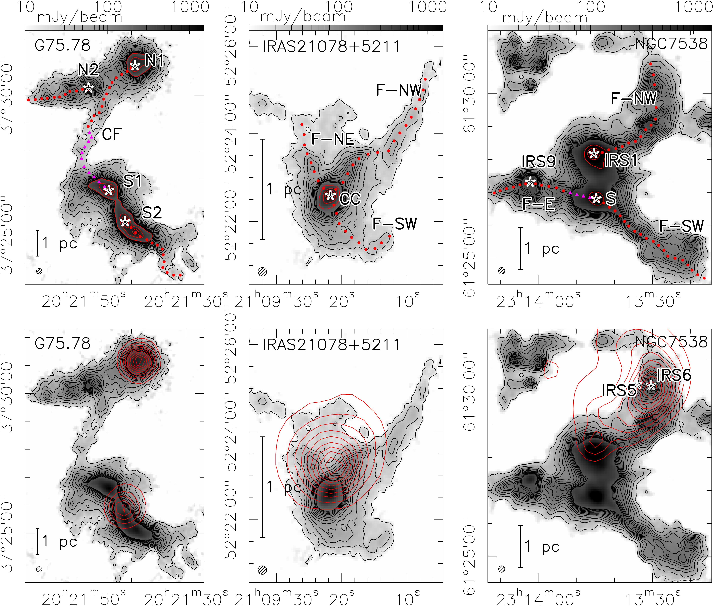
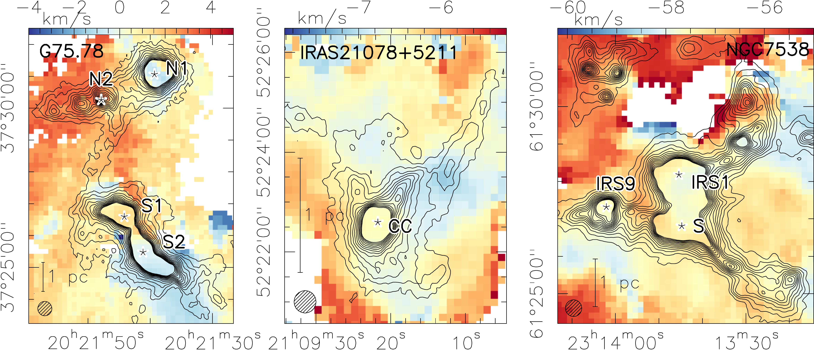
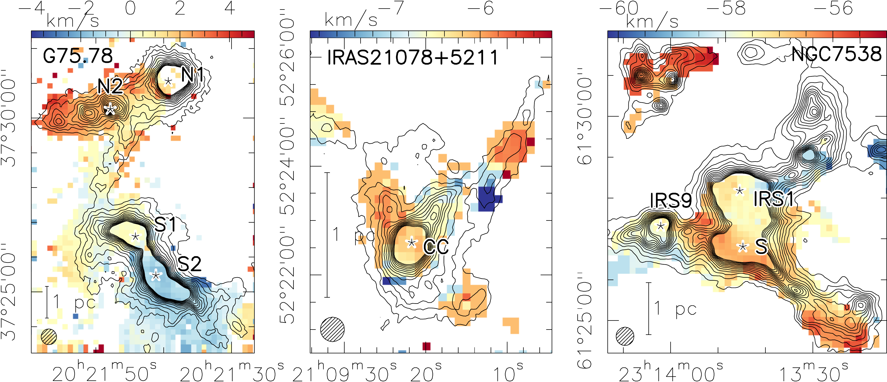

$\newcommand{\ensuremath}{}$
$\newcommand{\xspace}{}$
$\newcommand{\object}[1]{\texttt{#1}}$
$\newcommand{\farcs}{{.}''}$
$\newcommand{\farcm}{{.}'}$
$\newcommand{\arcsec}{''}$
$\newcommand{\arcmin}{'}$
$\newcommand{\ion}[2]{#1#2}$
$\newcommand{\textsc}[1]{\textrm{#1}}$
$\newcommand{\hl}[1]{\textrm{#1}}$
$\newcommand{\footnote}[1]{}$
$\newcommand$

# Filamentary accretion flows in high-mass star-forming clouds

<mark>Appeared on: 2025-10-30</mark> - 

J.-E. Schneider, et al. -- incl., <mark>H. Beuther</mark>, <mark>C. Gieser</mark>, <mark>S. Jiao</mark>, <mark>M. Wells</mark>

**Abstract:** Filamentary accretion-flows as gas-funneling mechanisms are a key aspect in high-mass star formation research. The kinematic properties along these structures are of particular interest. The scope of this paper is focused on the question if gas is transported to dense clumps inside high-mass star-forming regions through filamentary structures on a scale of several parsecs to the sub-parsec scale. We quantify the gas flows from a scale of up to several parsecs down to the sub-parsec scale along filamentary structures. In this work the accretion flow mechanisms based on gas kinematic data in the three high-mass star-forming regions G75.78, IRAS21078+5211 and NGC7538 are studied with data obtained from the IRAM 30 m telescope. The analysis is carried out using the surface density derived from 1.2 mm continuum emission and velocity differences estimated from HCO $^+$ ( $1-0$ ) and H $^{13}$ CO $^+$ ( $1-0$ ) molecular line data. The mass flow-behavior of the gas in the vicinity of high-mass star-forming clumps shows characteristic dynamical patterns, such as an increased mass flow rate towards the clumps. We assume the velocity differences to originate from filamentary-gas infall onto the high-mass star-forming clumps; the inclination of the filament-structures along the line of sight is however unknown. Nevertheless, using the velocity differences and mass surface densities, we can estimate mean flow rates along the filamentary structures with respect to the line of sight and towards clumps. We quantify the flow rates towards the clumps in a range from about $10^{-3} M_{\odot} $ yr $^{-1}$ to $10^{-5} M_{\odot}$ yr $^{-1}$ , inferred from clump-centered polar plots. Slight variations of the flow rates along the filamentary structures may be caused by overdensities and velocity gradients along the filaments. While the initial studies presented here already reveal interesting results such as an increasing mass flow rate towards clumps, the properties of filamentary gas flows from large to small spatial scales, as well as potential variations over the evolutionary sequence, are subject to future studies.

**Figure 30. -** Naming and measuring pattern for the three sourcesTop row: NIKA2 1.2 mm dust continuum maps (see  ([Beuther, Gieser and Soler 2024]()) ) of the star-forming regions showing the clump and filament designations. The red and magenta markers indicate the data points used for the flow rate estimation in Section \ref{sec:fila-flows}. Triangular magenta markers indicate a separate section along a structure. Black contours outline the 1.2 mm continuum, ranging from 3$\sigma$ to 39$\sigma$ in steps of 3$\sigma$(the RMS-values are presented in Table \ref{tab:dust_hii_rms}). The red contours in the upper panels mark the peak-positions of the continuum emission from 20\% to 100\% in steps of 20\%. Designations used in the following refer to clumps and filament-structures, filaments are marked by an "F" in the designation; "CF" in G75 stands for "central filament", "CC" in IRAS21078 refers to "central clump" while the clumps in NGC7538 are the known objects IRS9, IRS1 and S (e.g.  ([ and Beuther 2020]()) ). G75 S1 is the object G75.78+0.34. We present the clump-designations together with their coordinates in Table \ref{tab:clumps}. Bottom row: The same dust-maps with red contour lines outlining the \HII-regions at 1.4 GHz (21 cm) ( ([Condon, Cotton and Greisen 1998]()) ); the contours range from 10\% to 100\% of the peak emission in steps of 10\%(see Table \ref{tab:dust_hii_rms} for reference). The positions of the two main exciting sources of the \HII-region in NGC7538, NGC7538 IRS5 and NGC7538 IRS6, are marked in the lower right panel ( ([Puga, Marín-Franch and Najarro 2010]()) ). (*fig:dusttags*)

**Figure 31. -** 1st moment maps HCO$^+$($1-0$)First moment (intensity-weighted peak-velocity) maps for the HCO$^+$($1-0$)-line. The beam size is \SI{27}{$\arcsec$ond}(lower left corner). The sources are labeled in each panel. The scale bar indicates the length of 1 parsec in each panel. Contour lines show the 1.2 mm dust continuum ranging from 3$\sigma$ to 39$\sigma$ in 3$\sigma$-steps. (*fig:1stmoment_hco+*)

**Figure 32. -** 1st moment maps H13CO$^+$($1-0$)As for Fig. \ref{fig:1stmoment_hco+} but for H$^{13}$CO$^+$($1-0$)-transition. (*fig:1stmoment_h13co+*)

