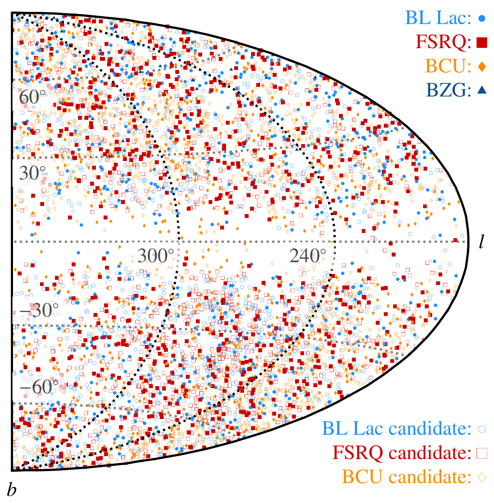
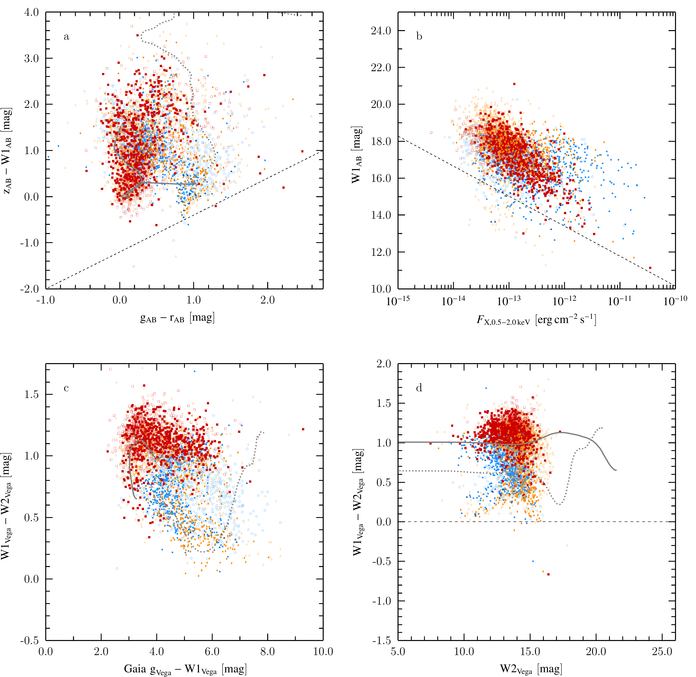

$\newcommand{\ensuremath}{}$
$\newcommand{\xspace}{}$
$\newcommand{\object}[1]{\texttt{#1}}$
$\newcommand{\farcs}{{.}''}$
$\newcommand{\farcm}{{.}'}$
$\newcommand{\arcsec}{''}$
$\newcommand{\arcmin}{'}$
$\newcommand{\ion}[2]{#1#2}$
$\newcommand{\textsc}[1]{\textrm{#1}}$
$\newcommand{\hl}[1]{\textrm{#1}}$
$\newcommand{\footnote}[1]{}$
$\newcommand{\makeLineNumber}$
$\newcommand{\arraystretch}{1.1}$
$\newcommand{\arraystretch}{1.1}$
$\newcommand{\arraystretch}{1.5}$
$\newcommand{\arraystretch}{1.2}$

# BlazEr1: The eROSITA Blazar Catalog: Blazars and Blazar Candidates in the First eROSITA Survey

<mark>Appeared on: 2025-10-30</mark> -  _39 pages, 28 figures, submitted to A&A. Pre-referee version, comments are appreciated_

S. Hämmerich, et al. -- incl., <mark>J. Wolf</mark>, <mark>S. Belladitta</mark>

**Abstract:**            Aims. eROSITA on board of the Spectrum Roentgen Gamma (SRG) spacecraft performed its first X-ray all-sky survey (eRASS1) between December 2019 and June 2020. It detected about 930000 sources, providing us with an unprecedented opportunity for a detailed blazar census. We present the properties of blazars and blazar candidates in eRASS1 and the compilation of the eROSITA blazar catalog. Methods. We compile a list of blazar and blazar candidates from the literature and match it with the eRASS1 catalog, creating the Blazars in eRASS1 (BlazEr1) catalog. For sources with more than 50 counts we obtain their X-ray spectral properties. We compile multiwavelength data from the radio to the gamma-ray regimes for all sources, including multiwavelength spectral indices and redshifts. The full catalog is available online. Results. We present the BlazEr1 catalog, containing 5865 sources, of which 2106 are associated with confirmed blazars. For 3668 sources, eROSITA provides the first X-ray data. The contamination from non-blazar sources of the entire sample is less than 11%. Most candidates exhibit properties typical for blazars. We present properties of the entire X-ray detected blazar population, including the distributions of X-ray luminosities and photon indices, multiwavelength properties, and the blazar log N-log S distribution. Our catalog provides follow up targets, such as potential MeV and TeV blazars. Conclusions. The BlazEr1 catalog provides a compilation of X-ray detected blazars and blazar candidates. The catalog serves as a starting point for exploiting further eROSITA surveys using the same methodology, enabling us to study the X-ray variability and a large number of spectral energy distributions of blazars in the future.         

**Figure 2. -** Positions of the BlazEr1 sources in Galactic coordinates. The
  different colors and symbols indicate the blazar types in the
  catalog. Candidates, especially _BCUC_s, dominate the sample.
  The overdensity along $l\sim 240◦$ coincides with the footprint
  of BROS. Confirmed blazars are displayed by filled symbols,
  candidates are shown in the same color without filling. All
  following figures will adapt the same color and symbol scheme.  (*fig:blazar_erass1_map_paper*)

**Figure 11. -** Probability distribution of photon indices for
	different types of _eROSITA_ observed blazars and blazar candidates.
	The distribution takes into account the uncertainties of
individual measurements of the photon index. (*fig:gamma_master_gaus*)

**Figure 24. -** Different photometric spaces combining optical, infrared and X-ray data, similar to
  \citet[][; Fig. 18]{salvato:2022} for point sources detected in eFEDS, using the
  color scheme introduced in
  Fig. \ref{fig:blazar_erass1_map_paper}. Solid gray lines
  show positions usually occupied by quasars, whereas the gray dotted
  lines corresponded to Seyfert 2 galaxies. The dashed black lines in
  the upper panels distinguish between Galactic and
  extragalactic sources. (*fig:mara_combiplotfin*)

