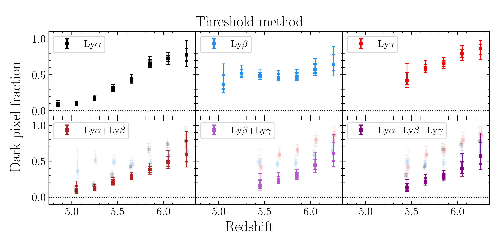
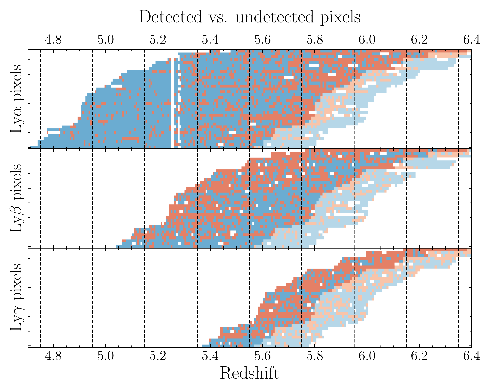
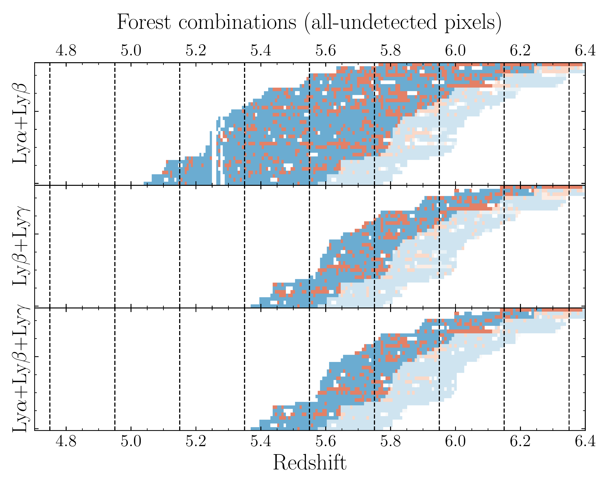
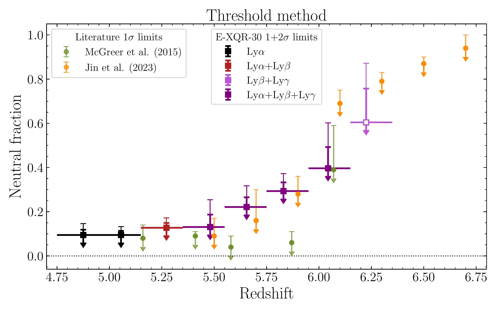
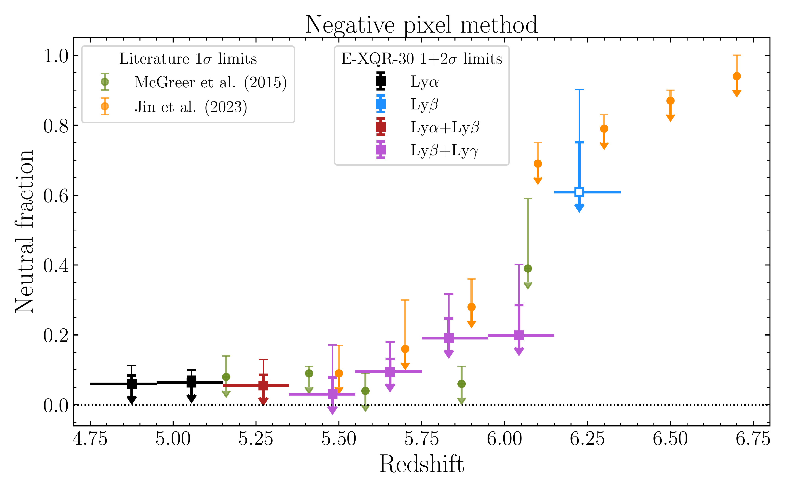

$\newcommand{\ensuremath}{}$
$\newcommand{\xspace}{}$
$\newcommand{\object}[1]{\texttt{#1}}$
$\newcommand{\farcs}{{.}''}$
$\newcommand{\farcm}{{.}'}$
$\newcommand{\arcsec}{''}$
$\newcommand{\arcmin}{'}$
$\newcommand{\ion}[2]{#1#2}$
$\newcommand{\textsc}[1]{\textrm{#1}}$
$\newcommand{\hl}[1]{\textrm{#1}}$
$\newcommand{\footnote}[1]{}$
$\newcommand{\xhi}{\langle x_{\rm HI} \rangle}$
$\newcommand{\noop}[1]$
$\newcommand{\thebibliography}{\DeclareRobustCommand{\VAN}[3]{##3}\VANthebibliography}$
$\newcommand\mn{@urlcharsother}$
$\newcommand\mn{@doi}$
$\newcommand\mn{@doi@}$
$\newcommand\mn{@eprint#1#2}$
$\newcommand\mn{@eprint@arXiv#1}$
$\newcommand\mn{@eprint@dblp#1}$
$\newcommand\mn{@eprint@#1:#2:#3:#4}$
$\newcommand{\@}{tempa}$
$\newcommand{\@}{tempa }$
$\newcommand{\@}{tempb }$
$\newcommand{\@}{tempc$
$  }$
$\newcommand{\@}{tempb }$

# Updated dark pixel fraction constraints on reionization's end from theLyman-series forestsof XQR-30

<mark>Appeared on: 2025-10-31</mark> -  _14+4 pages, 14+6 figures, accepted for publication in MNRAS_

F. B. Davies, et al. -- incl., <mark>E. Bañados</mark>

**Abstract:** The fraction of "dark pixels" in the Ly $\alpha$ and other Lyman-series forests at $z\sim5$ -- $6$ provides a powerful constraint on the end of the reionization process. Any spectral region showing transmission must be highly ionized, while dark regions could be ionized or neutral, thus the dark pixel fraction provides a (nearly) model independent upper limit to the volume-filling fraction of the neutral intergalactic medium, modulo choices in binning scale and dark pixel definition. Here we provide updated measurements of the 3.3 comoving Mpc dark pixel fraction at $z=4.85$ -- $6.25$ in the Ly $\alpha$ , Ly $\beta$ , and Ly $\gamma$ forests of $34$ deep $5.8 \lesssim z\lesssim6.6$ quasar spectra from the (enlarged) XQR-30 sample. Using the negative pixel method to measure the dark pixel fraction, we derive fiducial $1\sigma$ upper limits on the volume-average neutral hydrogen fraction of $\langle x_{\rm HI} \rangle \leq \{0.030+0.048,0.095+0.037,0.191+0.056,0.199+0.087\}$ at $\bar{z}=\{5.481,5.654,5.831,6.043\}$ from the optimally sensitive combination of the Ly $\beta$ and Ly $\gamma$ forests. We further demonstrate an alternative method that treats the forest flux as a mixture of dark and transparent regions, where the latter are modeled using a physically-motivated parametric form for the intrinsic opacity distribution. The resulting model-dependent upper limits on $\xhi$ are similar to those derived from our fiducial model-independent analysis. We confirm that the bulk of reionization must be finished at $z>6$ , while leaving room for an extended "soft landing" to the reionization history down to $z\sim5.4$ suggested by Ly $\alpha$ forest opacity fluctuations.

**Figure 8. -** Measurements of the dark pixel fraction in each Lyman-series forest and forest combination inferred from the threshold method applied to the E-XQR-30 data set. Uncertainties (thick: 1$\sigma$, thin: 2$\sigma$) are derived from bootstrap resampling of the quasar sightlines contributing to each bin, or from the confidence interval of the binomial fraction, whichever is larger. For the forest combinations (lower panels), we show the dark pixel fractions of the individual contributing forests in a light color with slight redshift offsets for clarity. (*fig:dark_thresh*)

**Figure 7. -** Distribution of detected (${\rm S/N}>2$, blue) and undetected (${\rm S/N}<2$, red) binned pixels in the $35$ E-XQR-30 quasar sightlines used in this work. White binned pixels within the low and high redshift boundaries of each quasar sightline have more than 50\% of their spectral pixels masked. The regions with faded color at the high redshift end of each sightline show pixels within the quasar proximity zone exclusion. Left: Binned pixels in the Ly$\alpha$(top), Ly$\beta$(middle), and Ly$\gamma$ forests. Right: Forest combinations Ly$\alpha+$Ly$\beta$(top), Ly$\beta+$Ly$\gamma$(middle), and Ly$\alpha+$Ly$\beta+$Ly$\gamma$(bottom), where blue pixels are detected in any or all forests while red pixels are undetected in all forests. (*fig:threshpix*)

**Figure 11. -** Upper limits ($1\sigma$, thick; $2\sigma$, thin) on the IGM neutral fraction $\xhi$ from the dark pixel fractions estimated using the threshold method (left) and negative pixel method (right). In each redshift bin we show the fiducial forest/combination that has the lowest $2\sigma$ upper limit (see text). We compare our constraints to the dark pixel fraction measurements ($1\sigma$ upper limits) from \citet{McGreer15}(green points) and \citet{Jin23}(orange points), which were estimated using the negative pixel method and threshold method, respectively. (*fig:xhi_fiducial*)

