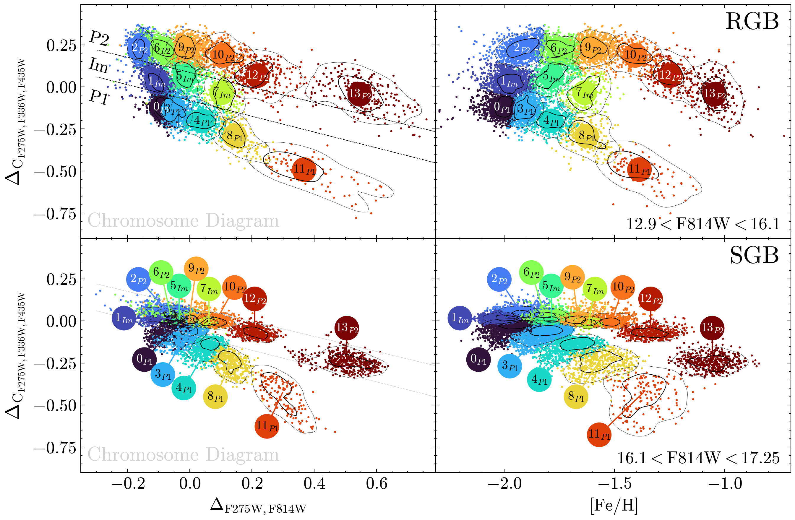
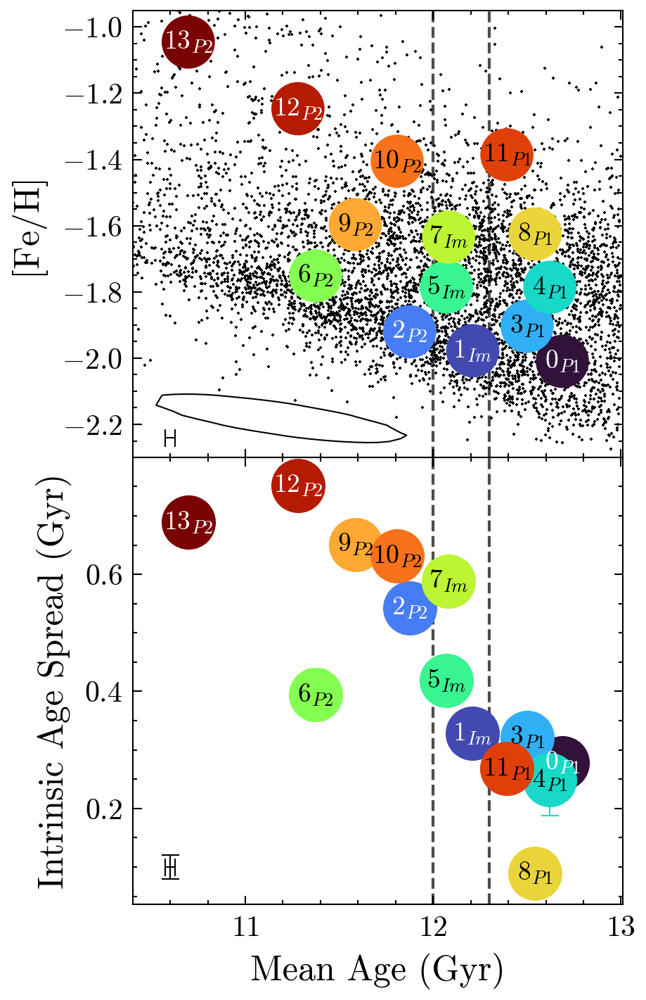
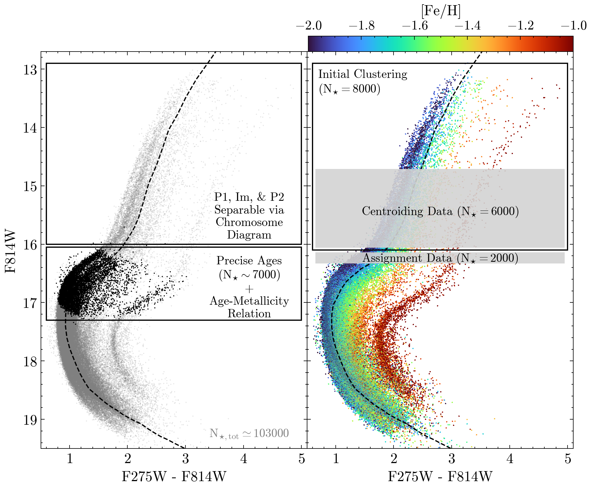

$\newcommand{\ensuremath}{}$
$\newcommand{\xspace}{}$
$\newcommand{\object}[1]{\texttt{#1}}$
$\newcommand{\farcs}{{.}''}$
$\newcommand{\farcm}{{.}'}$
$\newcommand{\arcsec}{''}$
$\newcommand{\arcmin}{'}$
$\newcommand{\ion}[2]{#1#2}$
$\newcommand{\textsc}[1]{\textrm{#1}}$
$\newcommand{\hl}[1]{\textrm{#1}}$
$\newcommand{\footnote}[1]{}$
$\newcommand$
$\newcommand$
$\newcommand$
$\newcommand$
$\newcommand$
$\newcommand$
$\newcommand$

# oMEGACat. VIII. A Subpopulation Census of $\omega$ Centauri

<mark>Appeared on: 2025-10-31</mark> - 

<mark>C. Clontz</mark>, et al. -- incl., <mark>N. Neumayer</mark>

**Abstract:** An understanding of the assembly history of the complex star cluster Omega Centauri has long been sought after, with many studies separating the stars on the color-magnitude diagram into multiple groupings across small magnitude ranges. Utilizing the oMEGACat combined astro-photometric and spectroscopic dataset we parse 14 subpopulations from the upper red-giant branch to below the main-sequence turnoff. We combine our results with previous works to estimate the age and age spread of each population. We find that the chemically enhanced (P2) populations are all $\sim$ 1 Gyr younger ( $\sim11.6$ Gyr old) and have significantly higher intrinsic age spreads (0.6 Gyr) than the primordial (P1) populations ( $\sim 12.6$ Gyr old, 0.3 Gyr spread), with the intermediate (Im) populations falling in between the two. Additionally, we connect for the first time the Chromosome Diagram to the two-stream age-metallicity relation, allowing us to link the P1 and P2 stars to the distinct star formation tracks, proposed to be in-situ and ex-situ contributions to the cluster's assembly. Our results are consistent with some suggested formation models and rule out others but no current model can explain all observed features of the subpopulations.

**Figure 5. -** **Subpopulation Parsing:**_(all panels)_ Each small marker point is a single star, colored by its subpopulation label. The large colored circle marks the associated cluster and within each is the annotation of the cluster number, in order of metallicity, as well as the ChD stream label, as a subscript. The 1- and 2-$\sigma$ density contours are shown in thick and thin black lines, respectively. _(upper left)_ The RGB chromosome map is constructed from the two delta-colors. The centroid of each subpopulation is given by the large colored markers. _(upper right)_ The pseudo-color vs. [Fe/H] space shows the distinction of the subpopulations in this space. _(lower panels)_ Same as upper panels except now for the SGB. Here, the large colored markers are offset to aid visibility and are connected to the centroid of each cluster via a solid line with the same color. (*fig:rgb_clustering*)

**Figure 1. -** **Subpopulation Age Relations**: ($_all panels_$) Each population is represented by a single medallion marker with the color corresponding to the cluster. Inside each the cluster number is annotated along with the relevant ChD stream indication subscript. The vertical black dashed lines show an approximate separation of the P1, Im and P2 populations. ($_upper panel_$) Black points mark all SGB stars with ages from [Clontz, Seth and Dotter (2024)](). Overplotted in the large colored circles are the mean (deconvolved) SGB age and median RGB metallicity for each subpopulation. The median age and [Fe/H] uncertainty for the SGB stars is given by the black contour while the median uncertainty on the mean age of each subpopulation is given by the black errorbars in the lower left. ($_lower panel_$) Each subpopulation mean age is plotted versus its intrinsic age spread. The median uncertainty on the mean age and intrinsic age spread is represented by a set of errorbars in the lower left corner. (*fig:amr_and_age_spread_two_panel*)

**Figure 3. -** **Color-Magnitude Diagrams**:_(both panels)_ The black dotted line traces the overdense region of this plot when considering a subset of stars centered around the median metallicity ([Fe/H]$\sim$-1.7). _(left panel)_ The full subset of high-quality member stars is plotted with light grey markers. All SGB stars with age determinations are overplotted in black. The upper black box delineates the region where the RGB ChD is generated while the lower black box delineates where the age-metallicity relation is calculated. _(right panel)_ The full subset of high-quality member stars is plotted with individual markers colored by their [Fe/H] value, following the colorbar at the top of this panel. The black box delineates where the initial RGB clustering is performed. The upper grey shaded region shows the extent of the first propagation step centroiding sample while the lower grey shaded region shows the extent of the first propagation step assignment data. The scaling data is constituted by the combination of the centroiding and assignment data. (*fig:cmd_with_regions*)

