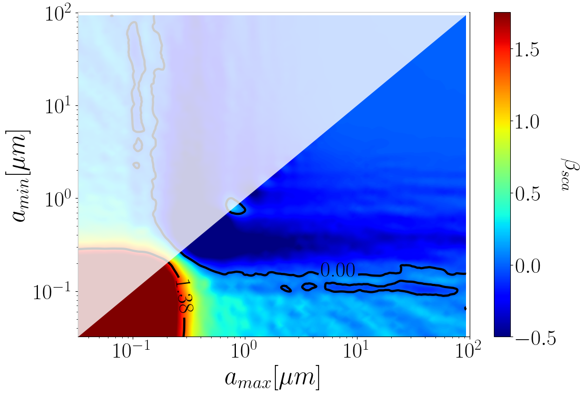
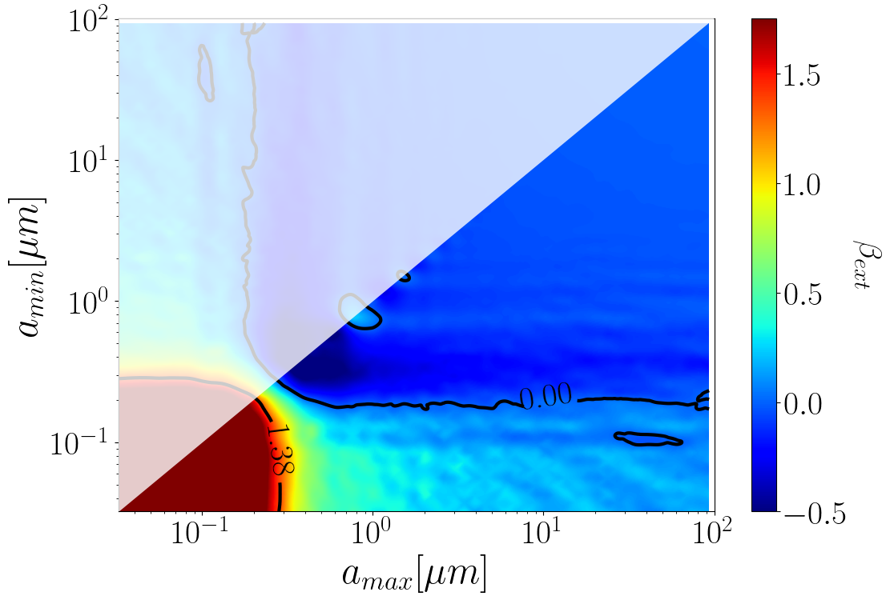
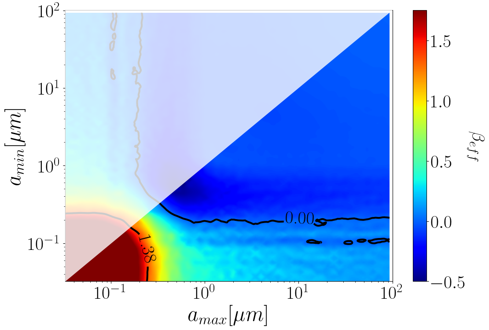

$\newcommand{\ensuremath}{}$
$\newcommand{\xspace}{}$
$\newcommand{\object}[1]{\texttt{#1}}$
$\newcommand{\farcs}{{.}''}$
$\newcommand{\farcm}{{.}'}$
$\newcommand{\arcsec}{''}$
$\newcommand{\arcmin}{'}$
$\newcommand{\ion}[2]{#1#2}$
$\newcommand{\textsc}[1]{\textrm{#1}}$
$\newcommand{\hl}[1]{\textrm{#1}}$
$\newcommand{\footnote}[1]{}$
$\newcommand{\Rvis}{R_{550}}$
$\newcommand{\tauvis}{\tau_{550}}$
$\newcommand{\AV}{A_{\rm V}}$
$\newcommand{\micron}{\mu m}$
$\newcommand$
$\newcommand$
$\newcommand$
$\newcommand{\LiI}{\ion{Li}{i}}$
$\newcommand{\CaI}{\ion{Ca}{i}}$

# The dance of dust: Investigating young stellar object dipper variability $\thanks{Based on observations collected at the European Southern Observatory under ESO programmes 0105.C-0513(A),097.C-0378(A), 0101.C-0866(A), and 0103.C-0887(B).}$

<mark>Appeared on: 2025-10-31</mark> -  _Accepted for publication in Astronomy & Astrophysics (A&A)_

E. A., et al.

**Abstract:** The dipper subclass of young stellar objects (YSOs) are characterised by frequent dips in their light curves. Irregular dippers do not show periodic signatures and have dips accounting for significant proportions of their photospheric flux. Given the short timescales on which these dips occur, their driving mechanisms are linked to the inner circumstellar disc dynamics. We present the first multi-epoch analysis of 16 irregular dippers observed with X-Shooter. Investigating the properties of their dips, and in particular the analysis of the dust characteristics, we aim to understand the root of their variability, and get a glimpse of the inner disc behaviour. We employed a novel approach to measure the properties of the dips, by combining class III templates with Gaia multi-epoch photometry to construct the intrinsic photosphere of the objects. We measured several dip properties including the depth of the dips, near-infrared (NIR) excesses, and their optical depths as a function of wavelength. We record 20 significant dips that range in their dip properties and show no relation to one another. In almost all cases, the low optical depths and small NIR excesses are observed. Comparison of their optical depths with grain opacity models show that the dips can be explained by the presence of dust substructures containing processed grains obscuring their photospheres and/or their discs. These grain distributions can have maximum sizes as large as 20 $\mu m$ and in many cases have almost grey-like extinction, while some require a strong scattering component. The findings highlight the extent of the irregularity of dippers, but also link it to the dust dynamics in the inner regions of the circumstellar discs. The dust substructures causing the variability require processed dust grains to be lifted above the disc into the line of sight. Possible lifting mechanisms including disc winds, unstable accretion columns, and disc warps are discussed.

**Figure 3. -** $\beta$ colour maps  from dust opacity models. Each figure represents a grid of dust size distributions varying  minimum and maximum grain sizes ($n(a)\propto a^{-q}$ with q=3.0). Coloured by the values of $\beta$ derived from the opacities for a) pure absorption ($\beta_{abs}$), b)scattering ($\beta_{sca}$, c) extinction ($\beta_{ext}$), and d) effective extinction ($\beta_{eff}$; see text). Contours are marked by black lines at $\beta$ =  0.0 and $\beta_{ISM} =1.38$). Pattern effects  are artefacts of the interpolation used.  (*fig: dustmaps*)

**Figure 12. -** $\tau_\lambda$ as a function of $\lambda$ for all the 20 dips analysed in Sect.\ref{sec: dust}. The name of the star and the epoch number are given on the secondary axis.
    The observed values are shown by black dots with error bars.  The red coloured lines show the results for the grain size distribution that best fit the data in the wavelength interval 400-900 nm for the extinction opacities, each normalised to the observed value at 550 nm. The values of $a_{min}, a_{max}, q$ are given on top of each panel; the corresponding  grain size distribution is displayed in the insert. The vertical grey dotted lines represent the boundaries of $\lambda = 400, 900$ nm. Three representative cases are also shown in the main paper. (*fig: master_tau*)

**Figure 4. -** Excess emission at 2.1 $\mu m$, $\epsilon_K$ shown as a function of $\Rvis$. The top panel plots the ratio between the observed flux and the intrinsic photospheric one ($\epsilon_K=\frac{F_{obs,K}}{F_{ph,K}}-1$). The bottom panel shows the ratio between the observed flux corrected for the extinction derived at optical wavelengths and the photospheric flux ($\epsilon_K=\frac{F_{obs,K}e^{\tau}}{F_{ph,K}}-1$). The grey area covers a $\pm$20\% region around $\epsilon_K$ = 0. Vertical error bars on $\epsilon_K$ are smaller than the size of the points. (*fig: nir_excess*)

