

$\newcommand{\ensuremath}{}$
$\newcommand{\xspace}{}$
$\newcommand{\object}[1]{\texttt{#1}}$
$\newcommand{\farcs}{{.}''}$
$\newcommand{\farcm}{{.}'}$
$\newcommand{\arcsec}{''}$
$\newcommand{\arcmin}{'}$
$\newcommand{\ion}[2]{#1#2}$
$\newcommand{\textsc}[1]{\textrm{#1}}$
$\newcommand{\hl}[1]{\textrm{#1}}$
$\newcommand{\footnote}[1]{}$
$\newcommand{\vdag}{(v)^\dagger}$
$\newcommand{\msun}{M_\odot}$
$\newcommand{\teff}{T_\mathrm{eff}}$
$\newcommand{\logg}{\log{\mathrm{g}}}$
$\newcommand{\kzz}{\log\kappa_\mathrm{zz}}$
$\newcommand{\fsed}{f_{sed}}$
$\newcommand{\rjup}{R_\mathrm{Jup}}$
$\newcommand{\meth}{CH_4}$
$\newcommand{\wat}{H_2O}$
$\newcommand{\chhhh}{CH_4}$
$\newcommand{\coo}{CO_2}$
$\newcommand{\phhh}{PH_3}$
$\newcommand{\nhhh}{NH_3}$
$\newcommand{\hho}{H_2O}$
$\newcommand{\hh}{H_2}$
$\newcommand{\chisquare}{\chi^2}$
$\newcommand{\ldl}{\lambda/\Delta\lambda}$
$\newcommand{\adamb}[1]{\par{\bfseries \color{purple}AB: #1 \par}}$
$\newcommand{\micron}{\mathrm{\mu}m}$
$\newcommand{\thefigure}{\arabic{figure}}$
$\newcommand{\thefigure}{\arabic{figure}}$
$\newcommand{\thefigure}{\arabic{figure}}$
$\newcommand{\thefigure}{\arabic{figure}}$

# Discovery of Seven Cold and Distant Brown Dwarfs with JWST RUBIES

<mark>Appeared on: 2025-11-04</mark> -  _41 pages, 7 figures (AAS manuscript format); submitted to AJ_

S. J. Morrissey, et al. -- incl., <mark>A. d. Graaff</mark>

**Abstract:** We report near-infrared spectral model fits to seven distant L- and T-type dwarfs observed with the JWST Near Infrared Spectrograph (NIRSpec) as part of the Red Unknowns: Bright Infrared Extragalactic Survey (RUBIES).Comparison of 0.9--2.5 ${\micron}$ near-infrared spectra of these sources to spectral standards indicates spectral types spanning L1 to T8, and spectrophotometric distances spanning 800--3,000 pc.Fits to three grids of spectral models yield atmosphere parameters and spectrophotometric distances largelyconsistent with our classifications, although fits to L dwarf spectra indicate missing components to the models.Three of our sources have vertical displacements from the Galactic plane exceeding 1 kpc, and have high probabilities of membership in the Galactic thick disk population.Of these, the L dwarfRUBIES-BD-3 (RUBIES-EGS-3081) is well-matched to subdwarf standards,while the early T dwarf RUBIES-BD-5 (RUBIES-UDS-170428) is best fit by metal-poor atmosphere models; both many be a thick disk or halo brown dwarfs.We critically examine the 1--5 ${\micron}$ spectra of the current sample of 1--2 kpc mid- and late-T dwarfs, finding that temperature, surface gravity, metallicity, and vertical mixing efficiency can all contribute to observed variations in near-infrared spectral structure and the strength of the 4.2 ${\micron}$ ${\coo}$ band.This work aims to guide ongoing JWST, Euclid, and other space-based spectral surveys that are expected to uncover thousands of low-temperature stars and brown dwarfs throughout the Milky Way.

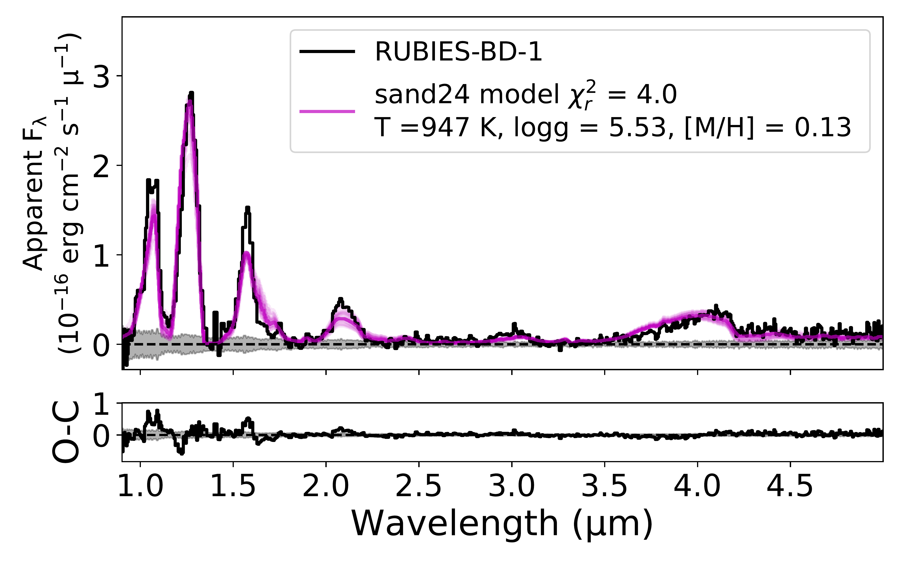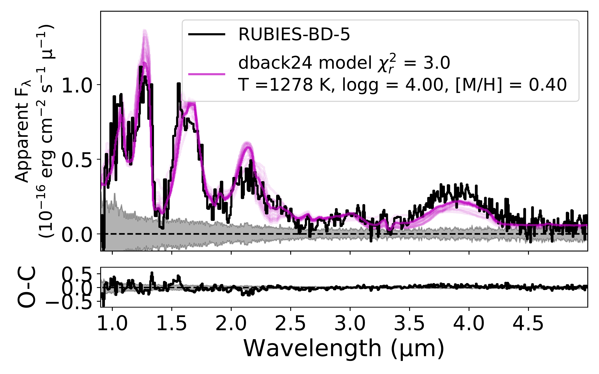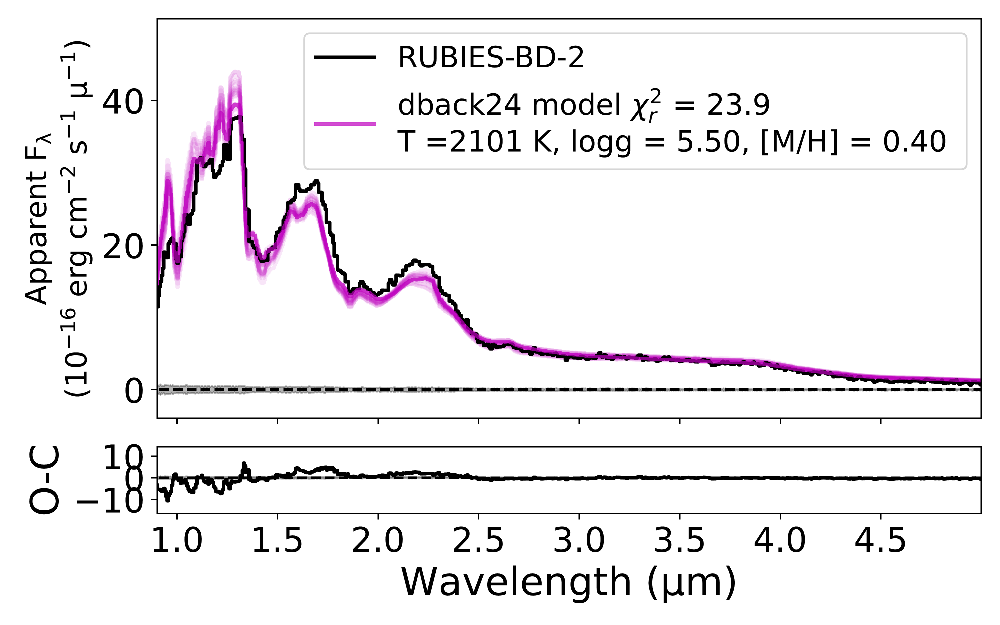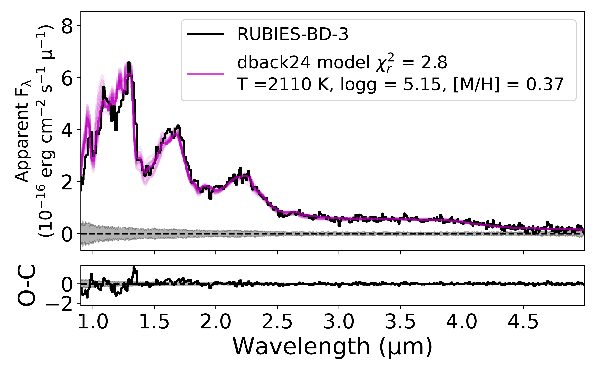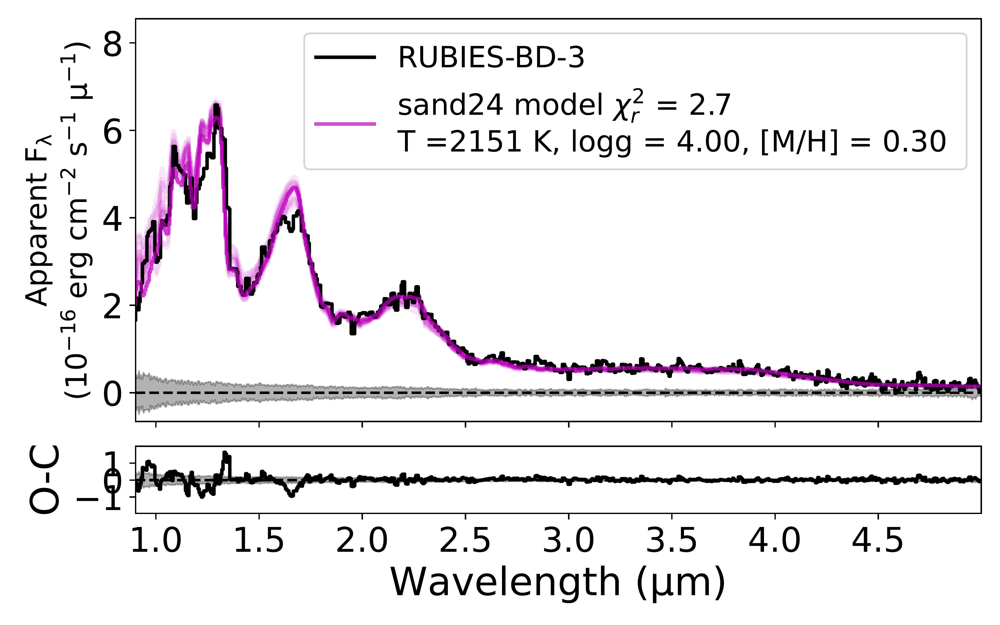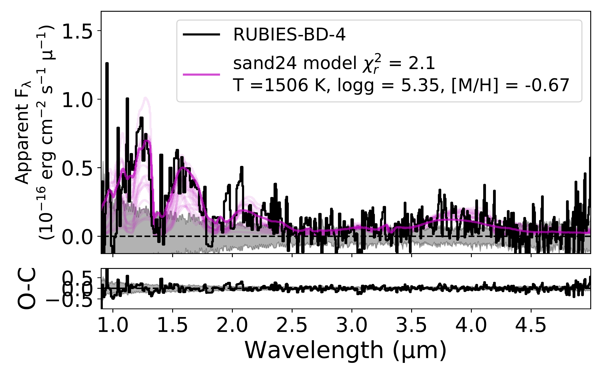

**Figure 6. -** Same as Figure \ref{fig:nir} for the full NIRSpec/Prism 0.9--5.1 {$\micron$} spectral range. (*fig:nirspec*)

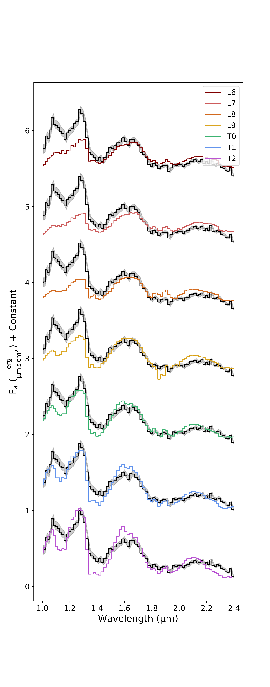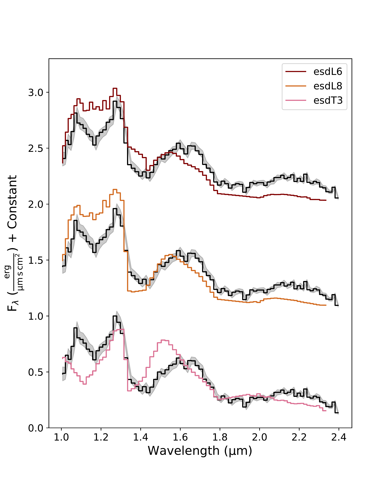

**Figure 3. -** Comparison of the 0.9--2.5 {$\micron$} NIRSpec/Prism spectrum of RUBIES-BD-3 (black line) to
    L6 to T2 dwarf standards (left panel);
    d/sdL6 to d/sdT2 mild subdwarf standards (center panel);
    sdL5, sdT0, sdT1, and sdT3 subdwarf standards (top right panel); and
    esdL6, esdL8, and esdT3 extreme subdwarf standards (bottom right panel).
    Standards are color-coded by spectral type.
    All spectra are normalized and offset by constants to facilitate comparison. (*fig:rubbd3_classification*)

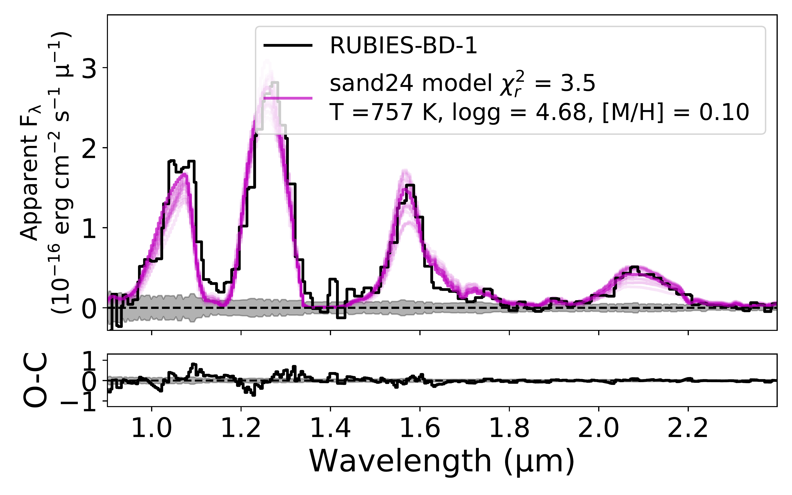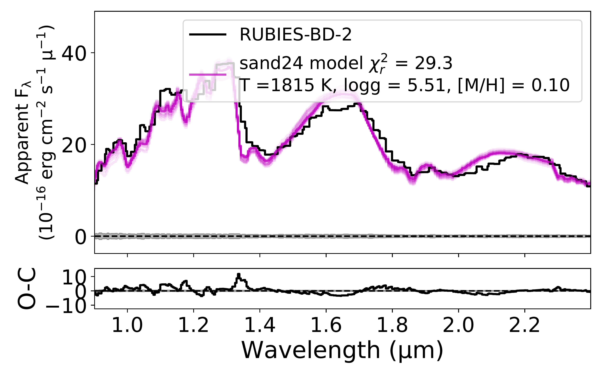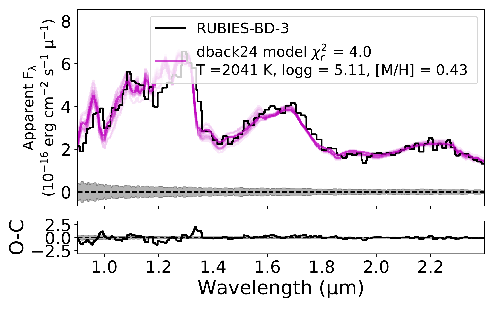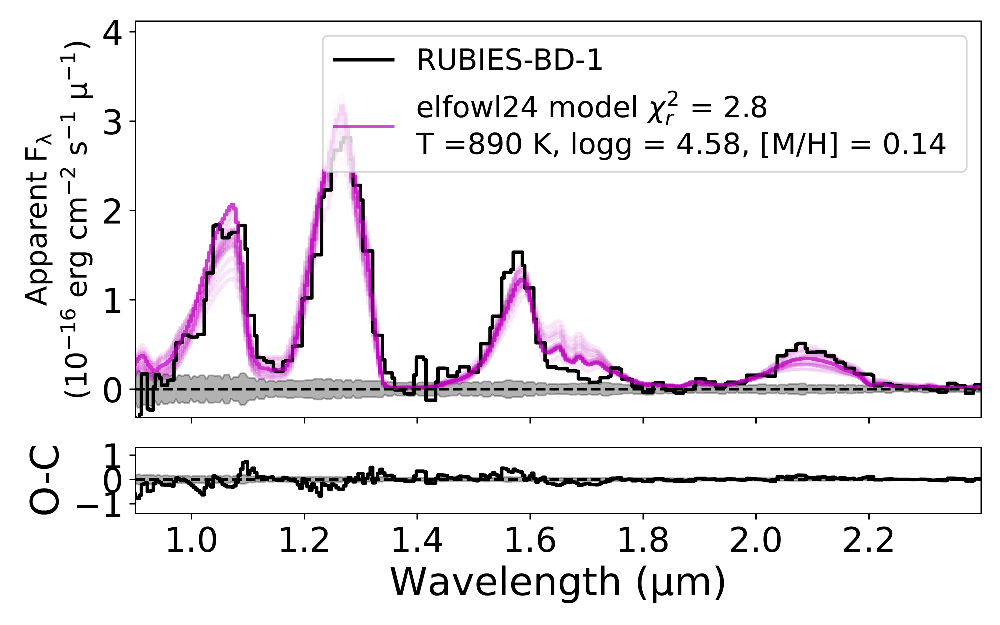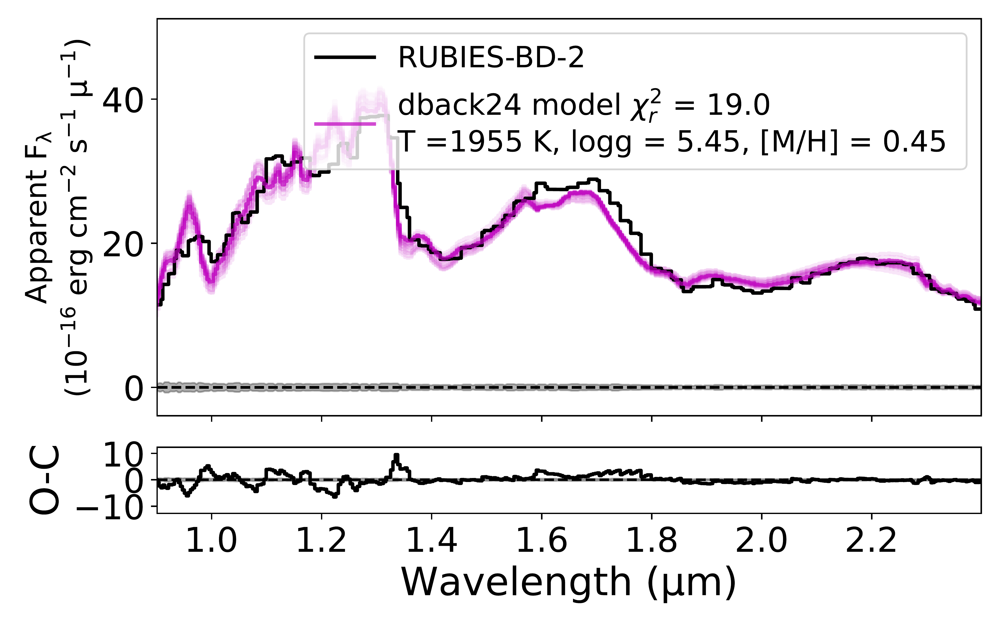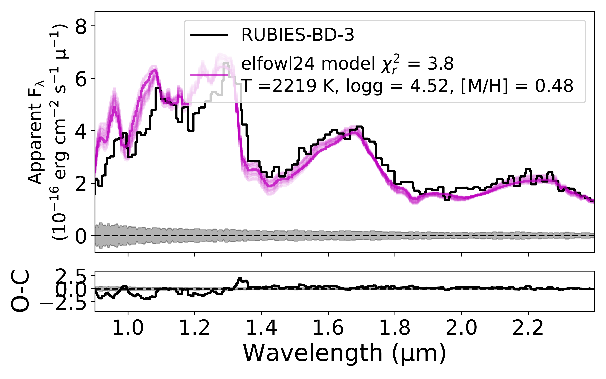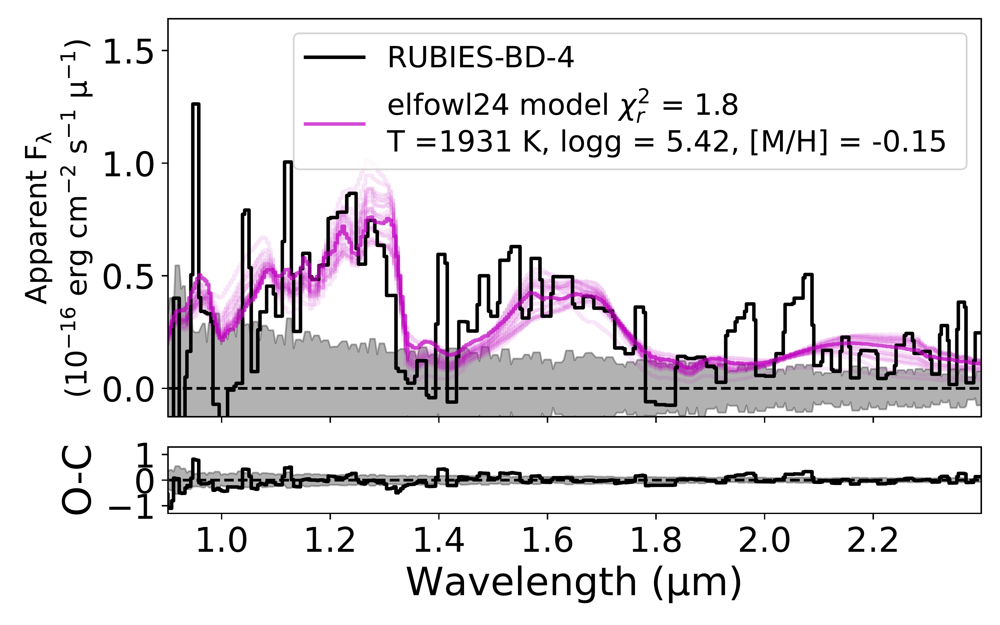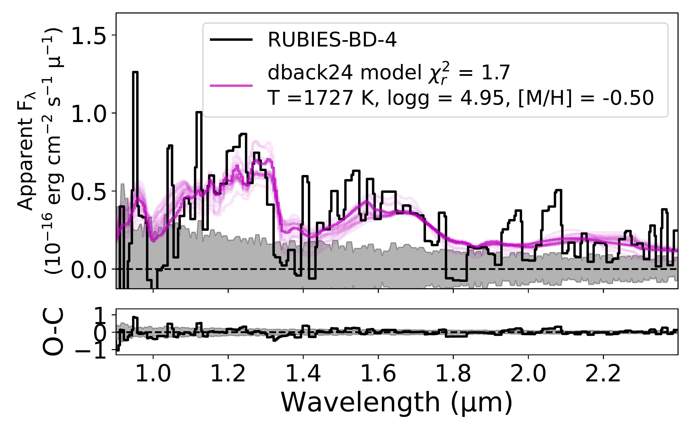

**Figure 4. -** MCMC fits to NIRSpec/Prism data constrained to the NIR (0.9-2.4 {$\micron$}) range.
    Each row corresponds to one of the RUBIES brown dwarf spectra scaled to apparent F444W magnitudes (black lines), while the columns separate fits to the Elf Owl (left), Diamondback (middle) and SAND (right) models. Both the best-fit models (solid magenta lines) and draws from the posterior distribution (semi-transparent magenta lines) are shown, and the $\pm$1$\sigma$ spectral uncertainties are indicated by the grey band.
    Below each spectral comparison, we compare the difference between the source and best-fit model fluxes (O-C as black lines) to the $\pm$1$\sigma$ spectral uncertainties (grey bands).
    Panels that are surrounded by boxes indicate the models that provide the best fits, including equivalent cases (see Table \ref{tab:summary}). (*fig:nir*)

