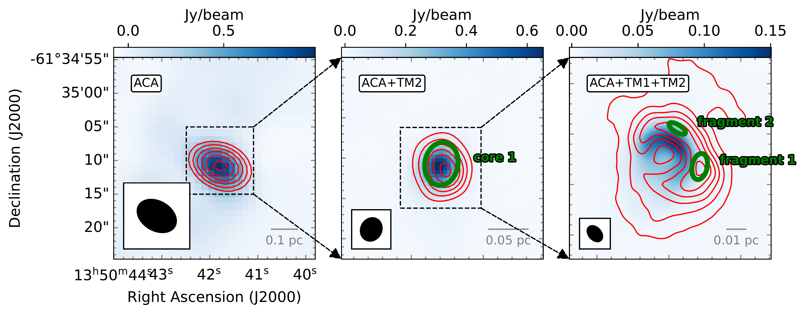
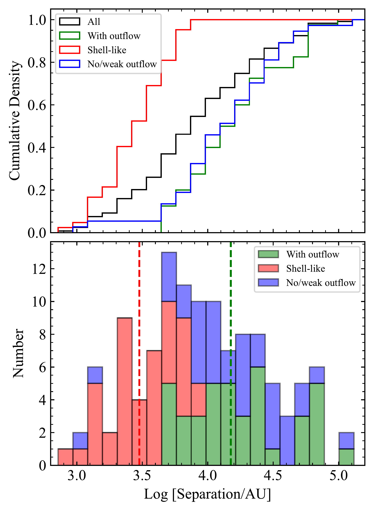
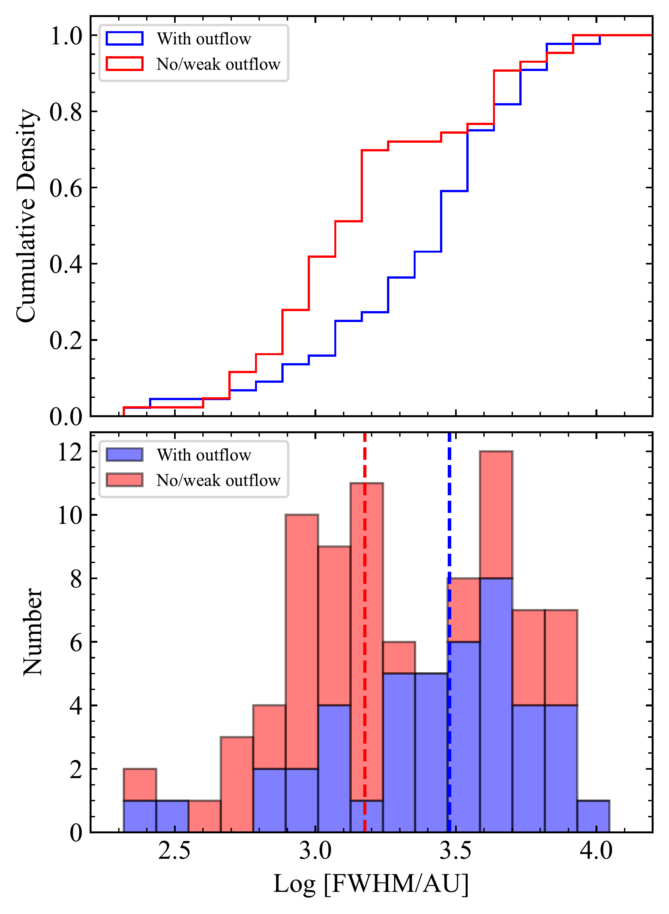

$\newcommand{\ensuremath}{}$
$\newcommand{\xspace}{}$
$\newcommand{\object}[1]{\texttt{#1}}$
$\newcommand{\farcs}{{.}''}$
$\newcommand{\farcm}{{.}'}$
$\newcommand{\arcsec}{''}$
$\newcommand{\arcmin}{'}$
$\newcommand{\ion}[2]{#1#2}$
$\newcommand{\textsc}[1]{\textrm{#1}}$
$\newcommand{\hl}[1]{\textrm{#1}}$
$\newcommand{\footnote}[1]{}$
$\newcommand{\radex}{\texttt{SpectralRadex}}$
$\newcommand{\astrodendro}{\texttt{astrodendro}}$
$\newcommand{\spectuner}{\texttt{spectuner}}$
$\newcommand{\HII}{HC/UC H {\sc ii}}$
$\newcommand{\CO}{^{12}CO (2--1)}$
$\newcommand{\kms}{km s\rm ^{-1}}$
$\newcommand{\Kkms}{K km s\rm ^{-1}}$
$\newcommand{◦ee}{^{\circ}}$
$\newcommand{\rms}{\sigma}$
$\newcommand{\vdag}{(v)^\dagger}$
$\newcommand$
$\newcommand$
$\newcommand$
$\newcommand$
$\newcommand{\arraystretch}{0.8}$
$\newcommand{\arraystretch}{0.8}$
$\newcommand{\arraystretch}{0.8}$
$\newcommand\ch{3cn}$
$\newcommand{\1}{2CO}$

# The ALMA-QUARKS survey: Hot Molecular Cores are a long-standing phenomenon in the evolution of massive protostars

<mark>Appeared on: 2025-11-04</mark> -  _resubmitted to ApJ after taking into account referee's comments_

D. Meng, et al. -- incl., <mark>F. Xu</mark>

**Abstract:** We present an analysis of the QUARKS survey sample, focusing on protoclusters where Hot Molecular Cores (HMCs, traced by $\ch$ 3cn (12--11)) and $\HII$ regions (traced by H30 $\alpha$ /H40 $\alpha$ ) coexist. \textcolor{black}{Using the high-resolution, high-sensitivity 1.3 mm data from the QUARKS survey, we identify 125 Hot Molecular Fragments (HMFs), which represent the substructures of HMCs at higher resolution.} \textcolor{black}{From} line integrated intensity maps of \textcolor{black}{\ch3cn ($12_3$--$11_3$)} and H30 $\alpha$ , we resolve the spatial distribution of HMFs and $\HII$ regions. By combining with observations of $\CO$ outflows and 1.3 mm continuum, we classify \textcolor{black}{HMFs into four types: HMFs associated with jet-like outflow, with wide-angle outflow, with non-detectable outflow, and shell-like HMFs near \HII regions} .This diversity possibly indicates that the hot core could be polymorphic and long-standing phenomenon in the evolution of massive protostars.The separation between \textcolor{black}{HMFs} and H30 $\alpha$ /H40 $\alpha$ emission suggests that sequential high-mass star formation within young protoclusters is not likely related to feedback mechanisms.

**Figure 2. -** Images of the hydrogen  recombination lines emssion and the outflow for four exemplar sources. The background shows the three-color image composed by the red-shifted $\CO$(red), H30$\alpha$ integrated line emission (green) and the blue-shifted $\CO$(blue). The gray contours and orange contours represent the 1.3 mm continuum and the \ch3cn ($12_3$--$11_3$) integrated line emission, respectively.
    H30$\alpha$ integrated velocity range is [Vlsr-40 $\kms$, Vlsr+40 $\kms$], where Vlsr is the central velocity (Table \ref{tab:hii} column (9)). For \ch3cn ($12_3$--$11_3$), the integrated velocity ranges are different for different fields.
    The contour levels were plotted from 3 $\rms$ to the peak intensity of the field, with 8 logarithmically spaced contours between these values.
    White markers mark the positions of different type of \textcolor{black}{HMFs}: triangle (jet-like outflow), pentagon (wide-angle outflow), star (no/weak outflow) and cross (shell-like shape).
    The synthesized beams are shown in the lower left corner, and the scale bar is indicated in the lower right corner of each image.
     (*fig:example*)

**Figure 3. -** Example of $\astrodendro$ results at different scales. The left, middle, and right panels show data from ACA  (quarks2) , ACA+TM2  ([Yang, Liu and Liu 2025]()) , and ACA+TM1+TM2  ([Liu, Liu and Zhu 2024]()) , respectively. The background shows the 1.3 mm continuum. The red contours represent the integrated intensity of \ch3cn (12–11), with contour levels ranging from 3 $\rms$ to 0.95 $\times$ the peak value, evenly spaced into five levels. The green ellipses outline the structures identified by $\astrodendro$ . The synthesized beams (left panel: $\sim$5$\arcsec$; middle panel: $\sim$ 1$\arcsec$; right panel: $\sim$ 0.3$\arcsec$) are shown in the lower left corner, and the scale bar is indicated in the lower right corner of each panel.
     (*fig:multiscale*)

**Figure 7. -** Left column: histogram (bottom) and cumulative density distribution (top) for the separation between different kinds of \textcolor{black}{HMFs} and the nearest $\HII$ regions.
    For the shell-like type, the nearest $\HII$ region is defined as the $\HII$ region enclosed by the \textcolor{black}{nearby}\ch3cn emission, whereas for the other types, the nearest $\HII$ region is taken to be the closest $\HII$ region within the entire image. (Figure \ref{fig:hotcores_outflows}).
    The red and green vertical dashed lines indicate the median value of externally (shell-like) and internally \textcolor{black}{candidate}(with and without outflow) heated \textcolor{black}{HMFs}, respectively.
    The separation is calculated using the distance from [Liu, Liu and Zhu (2024)]() and the intensity peak coordinates of Table \ref{tab:hotcores}, \ref{tab:hii}. Right column: histogram (bottom) and cumulative density distribution (top) for the FWHM ($=\sqrt{\mathrm{Maj\_FWHM}\times \mathrm{Min\_FWHM}}\times \mathrm{distance}$) of different kinds of \textcolor{black}{HMFs}.
    The red and blue vertical dashed lines indicate the corresponding median value.
     (*fig:hist*)

